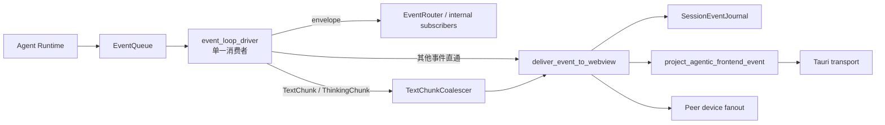
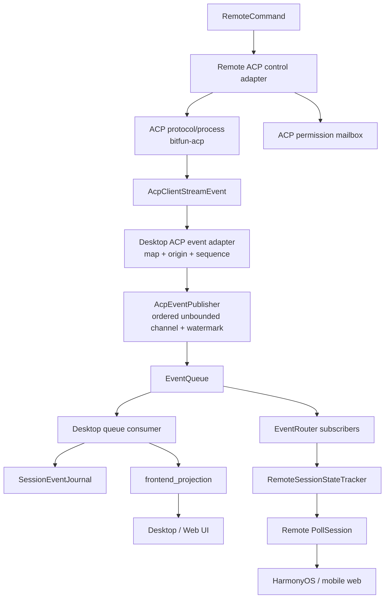

# ACP Client、Runtime 事件总线与移动端支持设计

Date: 2026-08-20

Status: Design proposal. This document describes the target implementation and rollout order; it does not mean that the
ACP client, remote control plane, or HarmonyOS UI already supports every capability below.

## 1. 结论

采用方案 B：**ACP 保留自己的协议执行、工具循环、权限语义和会话恢复；ACP 的桌面端观察事件进入现有
`EventQueue`，再由既有内部订阅和 Desktop delivery pipeline 处理。**

这次不采用方案 C。ACP client 方向是“外部 Agent 借用 BitFun 的会话壳”，不是 Runtime 调度的 native turn。
`is_externally_projected_session` 继续成立，Runtime 不取得 ACP turn 的调度、历史分支或最终生命周期所有权。

事件总线整合是移动端 ACP 的数据面基础，但它本身不是完整的移动端支持。完整交付还需要远程命令、权限信箱、
ACP 会话能力协商和 HarmonyOS UI 分阶段补齐。

## 2. 当前问题与已确认边界

### 2.1 当前出口

native Desktop 事件经过以下路径：



`event_loop_driver`（`lib.rs:2339`）是唯一消费者：同一批 envelope 先 `route` 给内部订阅者，再送进合批器；合批只针对
文本类事件，其他事件穿过 `push` 直接投递并顺带 flush 掉待发文本。

Desktop ACP 目前在 `src/apps/desktop/src/api/acp_client_api.rs` 中直接调用 `AppHandle::emit`。因此 ACP 事件绕过
了 `EventQueue`、`EventRouter`、`TextChunkCoalescer`、`SessionEventJournal`、RemoteSessionStateTracker 和 peer
fanout。ACP 与 native 使用了相同的若干前端事件名，但由两套手写 payload 维护。

### 2.2 ACP 不是 native Runtime turn

`src/crates/assembly/core/src/product_runtime.rs` 已明确把 ACP session 视为 externally projected session：

- Runtime 不启动或完成 ACP turn；
- Runtime 不为 ACP turn 建立 native history branch；
- ACP 现有历史不能被 `SessionManager` 以 native 模式加载，否则可能重写 session mode；
- 当前 ACP 历史仍通过兼容路径保存，不能因为接入事件总线就让 Runtime 成为第二个 transcript writer。

这个边界保留不变。B 只统一“事件观察和投递”，不统一“执行和所有权”。

### 2.3 总线订阅者的副作用

事件总线不是纯前端广播。当前 `CronEventSubscriber` 会把 `DialogTurnStarted/Completed/Failed/Cancelled` 当作调度
生命周期；RemoteSessionStateTracker 也根据同样的事件更新 active turn。若 ACP 生命周期事件直接伪装成 native 事件，
会误更新 Cron 等只应处理 Runtime turn 的订阅者。

因此 B 必须同时引入事件来源标记，或者等价的类型化隔离。推荐把
`AgenticEventOrigin::{NativeRuntime, ExternalAcp}` 放在 `AgenticEventEnvelope` 上，而不是给每个
`AgenticEvent` variant 增加重复字段。这样旧 event 构造点保持不变，queue/router/journal 仍能看到统一的 event，
subscriber 可以按 envelope origin 做隔离，而不是再建一套 ACP delivery bus。

### 2.4 当前 envelope 到不了消费者

上一节的方案有一个必须先解决的前提：**envelope 在到达消费者之前就已经被拆开了**。

- `EventQueue::enqueue(event, priority)`（`event_queue.rs:259`）在内部构造 envelope，调用方没有注入 origin 的入口；
- `EventRouter::route(envelope)`（`event_router.rs:37`）拿到的是完整 envelope，但 trait 只暴露
  `on_event(&self, event: &AgenticEvent)`（`event_router.rs:14`），origin 恰好在这一跳被丢弃；
- Desktop delivery 侧同理：`event_loop_driver` 的 `D: FnMut(AgenticEvent)`（`lib.rs:2339`）、
  `deliver_event_to_webview(transport, event, journal)` 和 `SessionEventJournal::record(&AgenticEvent)`
  （`session_event_journal.rs:244`）都只见裸 event。

所以「订阅者按 origin 隔离」不是加一个字段就能成立的，它需要一段明确的管道改造，见 5.3。低估这一点的直接后果是
实现时退回到「把 origin 塞进每个 `AgenticEvent` variant」——而那正是 2.3 否掉的做法。

### 2.5 存在两套 router 喂法

改动 5.3 的管道前必须知道：`EventRouter` 目前有两个互不相同的驱动方式，而 **Desktop 用的不是 core 那套**。

| 宿主 | 初始化 | router 由谁喂 | 顺序性质 |
|---|---|---|---|
| Desktop | `src/apps/desktop/src/lib.rs` 的**同名私有** `init_agentic_system`，自建 queue/router，六个订阅者在 Desktop 初始化路径注册（含 `AcpDurableProjectionWriter`） | `event_loop_driver` 的 `dequeue_configured_batch` → `event_router.route(envelope)` | **priority heap**，跨优先级会重排 |
| core | `agentic/system.rs:69` 的 `init_agentic_system_for_profile_with_runtime_ownership` | `event_queue.subscribe()` 的 broadcast 循环（`system.rs:142-158`） | `broadcast::Sender` **严格 FIFO**，不会重排；失败模式是 `RecvError::Lagged` 丢事件 |

两条路径都要接受 5.3 的改造。P1 只验证 Desktop 一条会留下 core 宿主的空洞。

## 3. 目标与非目标

### 3.1 目标

1. Desktop ACP 的共享事件进入既有 `EventQueue`，且每个事件只发布一次。
2. 由 `frontend_projection.rs` 维护 canonical frontend envelope；ACP API 删除同名的手写 `AppHandle::emit`。
3. ACP 获得 journal cursor、snapshot/backfill、文本合批、peer fanout 和 RemoteSessionStateTracker 更新。
4. 保留 ACP 的协议解码、stream tracker、工具循环、权限响应、模型/上下文/恢复策略。
5. 手机和其他 Remote client 能够识别 ACP session，不再把 ACP 当 native agentic session 静默执行。
6. 远程控制在能力协商后逐步支持 ACP 的发送、取消、权限响应、session options 和 ACP metadata。
7. 所有断线恢复通过既有 cursor/version、持久化 projection 和幂等命令完成。

### 3.2 非目标

- 不把 ACP client 接入 native scheduler、ConversationCoordinator 的 turn admission 或 SessionManager 生命周期。
- 不建立方案 C 所需的 runtime-side ACP turn registry。
- 不把 ACP permission ID/option 语义强行转换成 native tool permission ID。
- 不让 HarmonyOS 直接连接 ACP 进程；ACP 进程仍运行在 Desktop/CLI/目标 Runtime 所在机器。
- 不为兼容旧版本而把 unknown ACP command 静默降级为 native `agentic`。

## 4. 目标架构



`bitfun-acp` 继续只产生协议层的 `AcpClientStreamEvent`。事件到 `AgenticEvent` 的转换放在 Desktop ACP adapter，
因为它同时知道 BitFun session/turn identity、event queue 和 Desktop delivery profile；这避免 `bitfun-acp` 依赖
Desktop/Tauri 或向上依赖 Product Assembly。

## 5. 事件契约

### 5.1 事件来源

在 `src/crates/contracts/events` 增加来源枚举，并把它加入 `AgenticEventEnvelope`。建议字段名称为
`origin`，默认值为 `NativeRuntime`，以保持旧 event envelope 和旧 JSON 的兼容性。

需要携带来源的事件：

| 事件 | ACP 映射 | 备注 |
|---|---|---|
| `SessionCreated` | 创建 ACP flow session record 后发布 | 不带 turn；用于远程 session list 的刷新。 |
| `DialogTurnStarted` | `start_acp_dialog_turn` 开始时发布 | `turn_index` 使用 ACP projection 的稳定序号，不宣称 Runtime 已 admission。 |
| `ModelRoundStarted` | ACP round tracker 产生 round start | 使用 `ModelRoundIdentity::External { provider: "acp", client_id, .. }`，见 5.5；不填 native model config 字段。 |
| `TextChunk` | `AgentText` | 保留 session/turn/round identity。 |
| `ThinkingChunk` | `AgentThought` | 保留 thinking end 语义。 |
| `ToolEvent` | `ToolEvent(ToolEventData)` | 复用已有 shared tool event contract。 |
| `ModelRoundCompleted` | 下一 round 或 terminal event 到来前关闭当前 round | 由 Desktop adapter 维护工具计数。 |
| `DialogTurnCompleted` | ACP `Completed` | `total_rounds/total_tools/duration_ms` 由 adapter 计算；不要填 native execution facts。 |
| `DialogTurnCancelled` | ACP `Cancelled` | 取消语义仍由 ACP client 负责。 |
| `DialogTurnFailed` | stream/timeout/protocol error | `error_category` 只在能可靠映射时填写。 |

`frontend_projection.rs` 不展示 `origin`，它是内部 subscriber 的路由事实，不是 UI 文案字段。旧 payload 继续可被
旧客户端反序列化；新增 envelope 字段使用默认值（`AgenticEventEnvelope` 已经 `Serialize, Deserialize`，
`agentic.rs:591`，所以 `#[serde(default)]` 足以让旧快照按 `NativeRuntime` 读回）。若 journal/backfill 需要保留来源，
来源必须随 envelope 一起持久化，不能从 event payload 猜测。

注意 journal 并不给上表所有事件分配 cursor：`SessionEventJournal::record` 在 `event_turn_id(event).is_none()` 或事件
是 `ToolEventData::StreamChunk` 时直接返回 `None`（`session_event_journal.rs:254-264`）。因此 `SessionCreated` 和 tool
stream chunk 没有 cursor，不参与 backfill——这是既有 native 行为，ACP 保持一致即可，但验收文案不能宣称「所有 ACP 事件
都可按 cursor 补齐」。

### 5.2 ACP 专属 metadata 事件

四类当前由 ACP 手写 emit 的事件没有 native `AgenticEvent` 对等物：context usage、available commands、plan、
config options。它们不能被丢弃，也不应重新引入绕过总线的 `AppHandle::emit`。在 events contract 增加四个类型化
的 ACP metadata event，或一个带强类型 payload 的 `ExternalSessionMetadataUpdated`；推荐四个显式 variant，原因是
移动端能力和持久化策略不同：

- `AcpContextUsageUpdated { session_id, turn_id, client_id, used, size, cost }` with envelope origin
- `AcpAvailableCommandsUpdated { session_id, client_id, commands }` with envelope origin
- `AcpPlanUpdated { session_id, turn_id, client_id, entries }` with envelope origin
- `AcpSessionOptionsChanged { session_id, client_id }` with envelope origin

这些事件由 projection 映射到现有 `agentic://acp-*` 名称，并可被 RemoteSessionStateTracker 选择性 materialize。
它们不参与 native turn settlement，也不触发 Cron。

### 5.3 origin 的传递路径

按 2.4，origin 要真正可用需要改动三处，且必须作为 P1 的显式工作项，不能顺手做：

1. **入队**：`EventQueue` 增加接受 origin 的入队入口（新增参数或 `enqueue_*_with_origin` 变体），三个既有入队方法
   `enqueue` / `enqueue_with_legacy_dequeue_ack` / `enqueue_with_guaranteed_legacy_storage` 都要能表达来源，默认
   `NativeRuntime`，现有调用点不改。
2. **路由**：`EventRouter::route` 已经持有 envelope，只需把 trait 扩成默认转发，避免改动既有 impl 和它们的测试
   替身：

   ```rust
   #[async_trait]
   pub trait EventSubscriber: Send + Sync + 'static {
       async fn on_event(&self, event: &AgenticEvent) -> EventSubscriberResult;

       /// 默认转发到 on_event；只有需要按来源隔离的订阅者才覆写。
       async fn on_envelope(&self, envelope: &AgenticEventEnvelope) -> EventSubscriberResult {
           self.on_event(&envelope.event).await
       }
   }
   ```

   `route` / `route_batch` 改调 `on_envelope`。按 5.4 的表，`CronEventSubscriber` 和 `AcpDurableProjectionWriter` 覆写
   `on_envelope`：前者只收 `NativeRuntime`，后者只收 `ExternalAcp`。
3. **Desktop delivery**：`event_loop_driver` 的 deliver 闭包与 `deliver_event_to_webview` 目前只接 `AgenticEvent`。
   仅当 journal/backfill 确实要持久化来源时才把签名改成 envelope；如果不需要，就明确写下「live delivery 不感知
   origin」，不要留下模棱两可的中间状态。

`frontend_projection` 始终不接触 origin，这一条不受本节影响。

### 5.4 订阅者规则

全量 `EventSubscriber` 实现有 6 个，逐个定性如下：

| 订阅者 | 消费的事件 | ACP 接入后的要求 |
|---|---|---|
| `CronEventSubscriber`（`service/cron/subscriber.rs`） | `DialogTurnStarted/Completed/Failed/Cancelled` | **必须覆写 `on_envelope` 并只处理 `NativeRuntime`。** ACP lifecycle 会直接污染它。 |
| `AcpDurableProjectionWriter`（`src/apps/desktop/src/runtime/acp_projection_writer.rs`） | ACP session/turn/round/tool 投影 | **必须覆写 `on_envelope` 并只处理 `ExternalAcp`。** `on_event` 是空 no-op，避免误把 native turn 写成 ACP transcript。 |
| `CoreRemoteSessionStateTrackerSubscriber`（`service_agent_runtime.rs`） | 全量观察 | 两类来源都处理；remote tracker 的职责是观察而不是调度。 |
| `TokenUsageSubscriber`（`service/token_usage/subscriber.rs`） | token usage | 依赖「ACP 不发 `TokenUsageUpdated`」。 |
| `SessionContextUsageSubscriber`（`agentic/session/context_usage.rs`） | `TokenUsageUpdated`、`ContextCompressionCompleted` | 同上；ACP 的用量走 `AcpContextUsageUpdated`，不落到这里。 |
| `ThreadGoalTokenSubscriber`（`agentic/goal_mode/token_subscriber.rs`） | 仅 `TokenUsageUpdated` | 同上，且污染后果是 thread goal **计费**错误。 |

后三个订阅者不需要 origin guard，但它们的安全性**完全依赖于 7.2 那条「不合成 `TokenUsageUpdated`」**。这是隐式耦合：
一旦有人觉得「ACP 也该有 token 统计」顺手补上，三个订阅者会同时被外部 agent 的数据污染，而且没有任何 guard 会拦。
因此这条约束写进 13 的检查线，而不是只留在映射表的备注里。

测试必须覆盖：发布一组 `ExternalAcp` lifecycle 后，Cron job state 不变化；RemoteSessionStateTracker 正常推进。

### 5.5 已定：round 的 model identity 用类型化枚举

`ModelRoundStarted` 现在的两个模型字段是 **`String`，不是 `Option`，也没有 serde default**（`agentic.rs:285-288`）：

```rust
/// Resolved `AIModelConfig.id` used for this round.
model_config_id: String,
/// Provider model name sent on the request.
effective_model_name: String,
```

它们的语义是 native model usage 的一部分。ACP 的 round 从来不解析 BitFun 的 `AIModelConfig`，把 `client_id` 或 adapter
名填进 `model_config_id` 会让前端和后续统计误以为那是真实 config；填空串更糟——字段不是 `Option`，下游会当作"一个真实
但空白的 config"。把两个字段改成 `Option` 也不够：那样「native 但没解析出 config」和「外部 agent」在类型上无法区分，还
多出「两个都填」「两个都不填」这类非法状态。

**决定：把两个字段替换为一个枚举，让非法状态不可表示。**

```rust
/// Which model drove this round. Native rounds resolve a BitFun
/// `AIModelConfig`; externally projected rounds (ACP) never do. The two cases
/// are variants rather than optional fields: a round can be neither both nor
/// neither.
#[derive(Debug, Clone, Serialize, Deserialize, PartialEq)]
#[serde(tag = "kind", rename_all = "camelCase")]
pub enum ModelRoundIdentity {
    Native {
        /// Resolved `AIModelConfig.id` used for this round.
        model_config_id: String,
        /// Provider model name sent on the request.
        effective_model_name: String,
    },
    External {
        /// Owning provider, currently only `"acp"`.
        provider: String,
        /// Adapter identity within the provider, e.g. `"gemini"`.
        client_id: String,
        /// Model id reported by the external agent, when it reports one.
        #[serde(default, skip_serializing_if = "Option::is_none")]
        model_id: Option<String>,
        /// Display name reported by the external agent.
        #[serde(default, skip_serializing_if = "Option::is_none")]
        display_name: Option<String>,
    },
}
```

`ModelRoundStarted` 以 `identity: ModelRoundIdentity` 取代原来的两个字段。

**projection 保持 native 线上契约逐字节不变**（`frontend_projection.rs:121-140`）：

- `Native` 分支照旧输出 `modelConfigId` / `effectiveModelName`；
- `External` 分支输出 `externalModel: { provider, clientId, modelId?, displayName? }`，并**省略**那两个 native 键。

省略是安全的，前端**已经**按可选处理：`modelConfigId?: string`（`flow-chat.ts:206-207`）、
`modelConfigId: string | undefined`（`EventHandlerModule.ts:648`），且已有断言两者为 `undefined` 的测试
（`EventHandlerModule.test.ts:1145-1146`）。因此老客户端读到 ACP round 的表现，与读到一个本来就没带这两个键的旧事件一致。

**改动面（实测，不大）：**

| 位置 | 改动 |
|---|---|
| `round_executor.rs:352`、`coordinator.rs:4159` | 仅有的两个 native 构造点，改填 `ModelRoundIdentity::Native` |
| `frontend_projection.rs:121-140` | 拆成两个分支，native 输出不变 |
| `session_event_journal.rs:504-508`、`remote_connect.rs:3371` | 只匹配 `round_id` / `round_index` 且带 `..`，无需改动 |
| 前端 | 新增 `externalModel` 的可选消费；不改既有字段 |

其余 17 处 `ModelRoundStarted` 引用都是带 `..` 的模式匹配，不涉及这两个字段。journal 的 tail 是内存结构
（`push_tail`，`session_event_journal.rs:104-112`），不落盘，所以没有历史事件快照需要迁移；需要考虑线上兼容的只有 CLI
dispatch 把事件序列化进 job status 的那条路径，而 native 分支输出不变意味着那条路径也不受影响。

## 6. Phase 0：先堵住远程误路由

这是独立于 B 的高风险修复，应先合入或与 B 同批发布。

当前 `RemoteCommand::SendMessage` 的 `agent_type` 缺省会走 native `agentic`；HarmonyOS 的 session type 归一化也会把
未知类型默认为 `agentic`。对 ACP session 这会造成“发送成功但执行了错误 Agent”的静默错误。

实现要求：

1. 在远程 session metadata 增加可选 `session_kind`/`capabilities`，至少区分 `native` 和 `acp`。
2. `SessionInfo`、`InitialSync`、`ListSessions` 和 session detail 都返回该字段；旧客户端忽略新字段即可。
3. `submit_remote_dialog` 在发现 ACP session 时，若 ACP remote capability 未协商，返回明确的
   `unsupported_remote_capability`，不得回退到 native。
4. HarmonyOS `RemoteSessionManager` 和 `RemoteCommandFactory` 在发送前按 `session_kind` 选择 ACP 命令；旧桌面收到
   新 ACP command 时返回可识别的 unsupported response。
5. 旧客户端继续发送 native `send_message` 时，Desktop 对 ACP session 返回 fail-loud 错误，错误文本和结构化 code
   都表明“ACP session requires ACP control capability”。

不使用包版本相等判断能力；使用命令/响应 capability negotiation。新字段必须有 serde default，老 session record
缺字段时按“未知能力”处理，而不是按 native 处理。

## 7. Phase 1：B 的 Desktop 事件总线整合

### 7.1 注入方式

`AcpClientService` 不能直接持有 `AppHandle` 或 core queue。保持它的 callback API 和协议职责不变，在 Desktop
adapter 中增加 `AcpEventPublisher`：

1. `init_agentic_system` 已先创建 `EventQueue`；把 `Arc<EventQueue>` 通过 `AppState` 或专用 Desktop delivery
   context 注入 ACP API。
2. ACP stream callback 只做同步的 typed mapping，并把带 `ExternalAcp` origin 的 envelope 写入**单条
   unbounded、保持顺序的 channel**。有界水位只作用于 BestEffort：超过水位时丢掉 stream chunk，
   Guaranteed/Fence **永不丢、永不 `blocking_send`**。同步 `send` 不能进 Tokio runtime 的
   `blocking_send`——那会在 `#[tauri::command] async fn` 和 stream 终态回调里无条件 panic。拆两条通道会让
   终态越过未消费的 `TextChunk`，正好破坏 fence。
3. publisher worker 串行调用 queue 的 enqueue API；生命周期事件使用 guaranteed legacy storage 策略，stream
   chunks 使用普通 best-effort 策略，具体优先级沿用 `AgenticEvent::default_priority`。
4. 启动、每个 stream event、round close、terminal event 均走同一个 publisher，禁止一部分走 queue、一部分走
   `AppHandle::emit`。
5. queue 的 priority heap 先比 priority 再比 timestamp（`Ord for AgenticEventEnvelope`，`agentic.rs:613-617`），
   所以只有**跨优先级**才会重排。按 `default_priority`（`agentic.rs:696-731`）分开看：
   - `DialogTurnCompleted` 是 `Normal`，与 `TextChunk`/`ThinkingChunk`/`ModelRoundStarted` 同级，堆内平级按时间戳
     退化为 FIFO，**正常完成路径不需要额外 fence**；
   - `DialogTurnCancelled` / `DialogTurnFailed` 是 `Critical`，**会**越过已入堆的同 turn stream 事件，必须加 fence。

   fence 不要新建机制。native 已有现成范式：`enqueue_with_legacy_dequeue_ack` 的契约就是「await ack 后该事件已属于
   当前投递批次，之后更高优先级事件无法在 priority heap 中越过它」（`event_queue.rs:275-288`），而
   `coordinator.rs:7010-7020` 发布 `DialogTurnRecovered` 时正是靠**显式降级到 `Normal` + ack** 来与既有 normal 数据
   保序。ACP 的 cancel/fail 终态照抄这一组合即可。

   **但要写明 ack 的保证范围，它不是全局顺序保证。** `enqueue_internal` 先写 legacy queue、随即 broadcast，ack 要到
   dequeue 时才触发（`event_queue.rs:420-451`）。因此：
   - Desktop 的 router 和 WebView delivery **都**由 `dequeue_configured_batch` 驱动（2.5），ack fence 同时覆盖这两条，
     这是 P1 实际要保证的场景；
   - core 的 broadcast 驱动 router（`system.rs:142`）在 ack 之前就能观察到事件，但 broadcast 是严格 FIFO，本来就不会
     发生 priority 重排，**不需要 fence**；它真正的失败模式是 `RecvError::Lagged` 丢事件，那是容量问题，加排序语义解决
     不了；
   - 不要把这个 ack 描述成所有 `EventSubscriber` 的通用顺序保证。
6. CLI standalone ACP service 不注入 Desktop publisher，保留 CLI 自己的输出和现有生命周期。

publisher 必须保证同一 session/turn 内的入队顺序；不能对每个 event 独立 `tokio::spawn`，否则 terminal event 可能早于
text/tool event 到达 queue。入队顺序之外还必须由上面第 5 条的 fence 对 priority reordering 做约束。

publisher **不要自建文本合批**。`event_loop_driver` 的同一个消费者既 `route` 给订阅者、又把事件送进
`TextChunkCoalescer`（`lib.rs:2390-2400`），合批只作用于 `TextChunk`/`ThinkingChunk`，其他事件从 `push` 直接穿出并
顺带 flush 掉待发文本。也就是说 ACP 只要产出正确的 `TextChunk`，就自动获得与 native 相同的自适应合批。合批 key 含
`resolve_attempt_token(attempt_id, attempt_index)`（`event_coalescer.rs:123-133`）；ACP 没有 attempt 语义，两个字段
统一填 `None` 即可得到稳定 key，**不要为了"看起来完整"编造 attempt id**，那会让同一 round 的 chunk 分裂成多个 key
而失去合批。

### 7.2 ACP stream 映射

| `AcpClientStreamEvent` | `AgenticEvent` | 适配器状态 |
|---|---|---|
| `ModelRoundStarted` | `ModelRoundStarted` | `current_round_id`、round index、是否有 tool call；identity 填 `External`（5.5）。 |
| `AgentText(text)` | `TextChunk` | 必须已有 current round，否则记录 protocol error 并 fail turn。 |
| `AgentThought(text)` | `ThinkingChunk` | `is_end` 按 ACP stream stop/flush 规则生成。 |
| `ToolEvent(data)` | `ToolEvent` | `round_id` 来自 current round；ToolEventData 不复制。 |
| `ContextUsageUpdated` | `AcpContextUsageUpdated` | 不合成 `TokenUsageUpdated`。 |
| `AvailableCommandsUpdated` | `AcpAvailableCommandsUpdated` | 供 desktop/mobile capability view 使用。 |
| `PlanUpdated` | `AcpPlanUpdated` | 不映射为 native workflow state。 |
| `ConfigOptionsUpdated` | `AcpSessionOptionsChanged` | options 内容由 ACP options API 按需读取。 |
| `Completed` | close round + `DialogTurnCompleted` | 填 adapter 可证明的统计。 |
| `Cancelled` | close round + `DialogTurnCancelled` | 不调用 native scheduler cancel。 |

`create_acp_flow_session` 也发布 `SessionCreated`。`start_acp_dialog_turn` 的开头发布
`DialogTurnStarted`，而不是直接 emit 前端事件。若 ACP client 初始化、timeout 或 callback mapping 失败，必须发布
`DialogTurnFailed`，并保证一个 turn 最多一个 terminal lifecycle event。

### 7.3 前端 projection 与远程投影

`deliver_event_to_webview` 是唯一的 Desktop live delivery owner：

1. journal 先记录可投影事件并分配 cursor；
2. `project_agentic_frontend_event` 生成 canonical name/payload；
3. cursor 附加到 payload；
4. transport emit；
5. peer fanout。

ACP API 删除 `app_handle.emit("agentic://...")` 的重复路径。`renderHints.disableExploreGrouping` 如果仍是 ACP 专属
UI 语义，应作为 typed projection metadata 增加到 canonical contract，不能重新在 ACP API 拼 JSON。

顺带被改善的一项，但**不是无条件的**。`handle_remote_poll_command` 的无变化短路要求四项同时成立
（`remote_connect.rs:1472-1478`）：

```rust
since_version == current_version && since_version > 0
    && !model_catalog_delta.changed && !persistence_dirty
```

且 `needs_persistence = since_version == 0 || persistence_dirty`（`:1480`）。ACP session 的 tracker version 目前恒为 0，
因此**每次 poll 都全量重读持久化历史**。准确的收益表述是：**当 ACP tracker 已推进 version、且当前 projection 已被持久化
清理后，后续无变化 poll 才能命中短路；活动中的 dirty turn 仍会走持久化路径。** 验收按这个措辞写，不要宣称"接入后 poll
不再读盘"。

### 7.4 持久化边界

B 会让 journal cursor、remote tracker 和 live projection 工作，但不自动解决 ACP transcript 的 durable writer。
Phase 1 不得把 ACP 事件喂给 native `SessionManager` 以“顺便持久化”。应先保留当前兼容 persistence path，并增加一个
明确的 ACP projection writer：

- writer 消费已排序的 ACP event projection；
- 以 session/turn 幂等写入 user/assistant/tool transcript；
- 只更新 externally projected session 的持久记录，不加载成 native Runtime session；
- **进行中 turn 在结构性边界（`DialogTurnStarted` / `ModelRoundStarted` / `ToolEvent`）无条件
  checkpoint 为 `InProgress`；`TextChunk` / `ThinkingChunk` 按时间下限（默认 ≥2s）或累计字节阈值
  （默认 ≥4KiB）节流 checkpoint。`turn_index` 在 turn 开始时解析一次并缓存在 draft 上，禁止每个
  chunk 全量 `load_session_turns`。恢复语义要的是足够新，不是每个 token 都不丢——中断态本来就是
  `Cancelled` + `Interrupted`。Desktop 退出时把剩余 draft flush 成同样中断态；重启后 `SessionCreated`
  把盘上遗留的 `InProgress`（且当前进程没有对应 draft）恢复为中断态。禁止只把 draft 留在内存里、终态才落盘；
- 落盘成功后再丢 draft。**终态 / interrupted** persist 失败必须保留 draft 供重试，并标记
  `history_snapshot_required`；中途 checkpoint 瞬时失败只记日志、保留 draft，**不得**把整个 session
  打成历史不可读；
- terminal / interrupted 后发布/记录 `SessionHistoryChanged` 或现有 durable fence，使 tracker 知道何时可以清理 dirty state；
- writer 终态故障时 remote poll 返回明确的 `history_snapshot_required`，不能声称持久化成功。

如果当前 Web UI 仍是唯一可用 writer，Phase 1 的验收只能声明“live event + journal backfill”，不能声明“断开桌面后
完整 transcript 已 durable”。

## 8. Phase 2：远程 ACP 控制面与权限

### 8.1 命令族

不要把所有 ACP 行为塞进 native `SendMessage` 或 `ConfirmTool`。新增带 capability gate 的窄命令，名称建议保持
`acp_*`，由 `RemoteCommand` 统一承载：

| 命令 | 作用 | 失败语义 |
|---|---|---|
| `AcpSendMessage` | 向已存在 ACP session 发 prompt | session/client 未运行或能力未协商时结构化错误。 |
| `AcpCancelTurn` | 请求 ACP cancel | 幂等；已结束返回 terminal/stale，而不是 native no-running-task。 |
| `AcpGetOptions` | 读取 ACP config/model options | 返回 ACP typed options；不伪造 native model catalog。 |
| `AcpSetOption` | 设置 ACP config option | 复用 ACP client validation；重试使用 request id。 |
| `AcpGetCommands` | 获取 available commands | 返回最后已知 snapshot，并携带 version。 |
| `AcpGetPlan` | 获取当前 plan | 仅 ACP session 支持。 |
| `AcpPermissionRespond` | 回复 ACP permission | 使用 ACP `permission_id + option_id`，不接受 native tool id 代替。 |

命令响应必须带 `session_id`、capability/version 和可重试分类。Desktop 负责查找 ACP client/session，手机不接触 ACP
process 或 ACP protocol transport。

### 8.2 权限 mailbox

ACP 当前通过 `backend-event-acppermissionrequest` 和 `pending_permissions` 等待回复；这是 desktop local event，
手机无法直接消费。目标结构：

1. ACP permission request 先进入 Desktop-owned durable/in-memory mailbox，带 `permission_id`、session、tool call、
   options、created_at、expiry。
2. Desktop local UI 和 Remote Poll 都从同一 mailbox view 读取；不能为手机复制一套权限状态机。
   本地 Web UI 可通过 `list_acp_pending_permissions` 在刷新 / hydrate 后回读 pending，不能只依赖
   `backend-event-acppermissionrequest` 的瞬时 emit。
3. `AcpPermissionRespond` 使用 option ID 幂等提交；重复提交返回 already resolved/expired。
4. disconnect 不清除 pending request；超时由 ACP client 的既有 timeout 语义收敛为 cancelled。
5. native `ConfirmTool/RejectTool` 只处理 native permission，若 target 是 ACP session 返回 unsupported，而不是
   尝试转换 ID。

## 9. Phase 3：HarmonyOS 支持

HarmonyOS 只做 Remote surface，不执行 ACP。UI 依赖 server 返回的 session kind/capability，不根据字符串前缀猜测。

### 9.1 会话列表和路由

已有判定（P0，勿推倒重写）：

- `RemoteSessionKindPolicy.ets`：未知 kind → `unknown`（不是 native）；`hasAcpRemoteControl` /
  `canSendNative` / `resolveAgentType`。
- `RemoteCommandFactory.sendForSession`：ACP → `acp_send_message`（带 wire `request_id`）。
- `RemoteSessionManager.assertCanSend`：无 `acp_remote_control` 时 fail-loud
  （`remote.session.acpControlRequired`）。
- 单测：`TransportAndGeneralChatUnit.test.ets` 覆盖命令形状与「ACP 不归一成 native code」。

仍待补齐：

- ~~ACP session 在列表/detail 中的 UI 呈现（类型标签、可观察但不可发送）。~~（已做）
- 旧 host vs 参数错误：Rust `parse_remote_command` 已拆 unknown name /
  `invalid_acp_command_params`；手机 `classifyAcpCommandFailure` 按
  `resp`/`code`/`commandCmd` 分类（真旧 host = ACP 发送后无 code 的非结构化 error）。
  §9.3 真机验收前清单保持未勾。
- `RemoteSessionManager` 的 version/cursor 继续使用既有 `PollSession`；ACP metadata 使用各自版本字段，避免覆盖
  message snapshot version（§9.2 projection 一并验证）。
- ~~UI 重试发送时复用同一 `request_id`。~~（发送意图层 mint，气泡 retry 带回）

### 9.2 会话页

第一版只要求：

- 展示 ACP text/thinking/tool/plan/commands/options 的已知 projection；
- 展示 active turn、cancel、permission pending；
- 断线后按 cursor/version replay，必要时请求完整 history snapshot；
- 对不支持的 ACP 操作显示结构化错误。

模型选择、native permission mode、native mid-run queue 等控件不应在 ACP session 中出现，除非 ACP capability 明确
提供等价操作。

### 9.3 远程场景要求

| 场景 | 本设计要求 |
|---|---|
| Remote control | ACP 命令和权限 mailbox 可由手机操作；不能依赖 Desktop 窗口保持打开。 |
| Peer Device Mode | 若 ACP session 通过 peer host 观察，仍复用 canonical projection 和 device fanout；禁止另发 ACP 私有 UI event。 |
| Remote workspace | ACP cwd/远程连接身份由 Desktop ACP client owner 解析；手机传 workspace identity，不传控制器本地路径语义。 |
| Detached dispatch | 本设计不把 ACP client session 变成 detached job；若未来需要，另建 dispatch capability 和持久 job owner。 |

## 10. 兼容与升级

1. 新增 serde 字段全部提供默认值；旧 session metadata 缺 `session_kind` 时按 unknown 处理。
2. 新 ACP `RemoteCommand` 不依赖 `#[serde(other)]` 猜测成功；旧 host 返回结构化 unsupported 或可识别错误。
3. ACP client/service 的持久 session record 继续容忍旧字段，不能因新 projection 解析失败而删除记录。
4. 远程端发送前必须检查 host capability；没有 capability 时禁用入口或返回 fail-loud 错误。
5. 事件 envelope origin 缺失时按 `NativeRuntime` 反序列化，避免旧 native event snapshot 无法读取；新 ACP envelope
   永远显式写 `ExternalAcp`。
6. 新 projection writer 必须按 `(session_id, turn_id, event_id)` 或等价稳定键幂等，避免 Desktop 重启/Remote retry
   造成重复 transcript。

## 11. 分阶段实现清单

### P0：风险隔离

- [x] 为 remote session metadata 增加 `session_kind` 和 capability facts。
- [x] ACP session 收到 native `SendMessage` 时 fail-loud。
- [x] HarmonyOS 不再把未知 ACP 类型归一化成 `agentic`。
- [x] 增加旧 host/旧客户端的 unsupported contract tests。

### P1：事件数据面（方案 B）

- [x] 在 events contract 增加 `AgenticEventOrigin` 和 ACP metadata events。
- [x] **打通 origin 传递路径（见 5.3）：queue 入队入口、`EventSubscriber::on_envelope` 默认方法、`route`/`route_batch`
      改调。** 这一项独立于 ACP mapping，先做完再接 publisher，否则 origin 会在实现中被塞进 event variant。
- [x] 确认改造同时覆盖 Desktop 私有 `init_agentic_system`（`lib.rs:1960`）和 core `system.rs:69` 两条 router 喂法（2.5）。
- [x] 实现 5.5 的 `ModelRoundIdentity` 枚举：替换 `ModelRoundStarted` 字段、改两个 native 构造点、projection 拆分支、
      前端消费 `externalModel`。这一项与 origin 管道同属契约切片，应在接 ACP publisher 之前完成。
- [x] 更新 canonical frontend projection，保留现有 event names/payload compatibility。
- [x] 实现 Desktop `AcpEventPublisher`，单通道顺序、单写入 `EventQueue`；水位只丢 BestEffort；cancel/fail 终态用 `Normal` 优先级 + ack fence。
- [x] 将 ACP stream mapper 从手写 emits 中抽出，删除 ACP API 的重复 `AppHandle::emit`。
- [x] 更新 native-only subscribers 的 origin guard；tracker 同时支持 native/ACP。
- [x] 为 Desktop 注入 queue/publisher；CLI 不注入 Desktop delivery。

### P1b：durable projection

- [x] 明确 ACP transcript writer 的 owner 和持久字段版本。
- [x] 完成 terminal fence、结构性边界 + 节流 InProgress checkpoint / 退出 flush / 重启 recover、snapshot-required 语义。
- [x] 证明 externally projected session 不会被 SessionManager native load 改写。

### P2a：命令族与契约

- [x] 增加 ACP command family（含 `request_id`）和 capabilities response。
- [x] 为 send/cancel/options/commands/plan/permission 增加幂等 request id 和错误分类。
- [x] `AcpPermissionRespond` 签名钉死为 `permission_id + option_id`；P2a 仍可先 unsupported，mailbox 在 P2b 接上后按 option_id 提交。
- [x] native `ConfirmTool`/`RejectTool` 打到 ACP session / ACP permission id 时 fail-loud，不转换 ID。
- [x] 老 host / 新 host 双向 unsupported 与 parse 契约测试。

### P2b：权限 mailbox 与 surface 兼容

- [x] 把 ACP permission request 接入 Desktop-owned / shared Remote mailbox。
- [x] `AcpPermissionRespond` 按 permission_id + option_id 幂等提交；option_id 必须属于 pending.options；断线不清 pending。
- [x] Desktop 本地 UI 可通过 `list_acp_pending_permissions` 在刷新 / hydrate 后回读 mailbox（不只依赖 emit）。
- [x] mobile-web / HarmonyOS 对未知 `RemoteResponse` variant 安全：二者把 `resp` 当松散字符串定点比对，不穷举 union。证据：
  - `src/mobile-web/src/services/RemoteSessionManager.ts`（`resp: string`；仅 `=== 'error'` 判失败）
  - `src/apps/mobile/harmonyos/.../RemoteModels.ets`（`resp?: string`）与 `RelayHttpClient.ets`（仅 `=== 'error'`）
  - P2a 对 ACP session 的 native fail-loud 返回 `RemoteResponse::Error`，mobile-web 会显示。
- [x] IM bot：resume 列表按 `provider=acp` / `session_kind=acp` 过滤，避免 ACP 会话进入 native `SessionManager` 发送路径；远端 `send_message` 按 `resp === "error"` 分流，禁止吞掉 fail-loud 假成功。本地守卫 fail-closed；远端整页 ACP 时按**连续 skip 计数**自动翻页（上限 5 次 relay 往返），触顶后交回用户回复 0 继续。接线决策单测在 `command_router` 的 `acp_wiring_tests`；策略纯函数在 `acp_bot_policy.rs`。

### P2：远程控制与权限（总览）

- [x] P2a 命令族与契约（见上）。
- [x] P2b 权限 mailbox 与 surface 兼容（见上；清单项拆开勾选，不做半勾润色）。

### P3：HarmonyOS

盘点：§9.1 的 kind/capability 判定与 `acp_send_message` 路由已在树上（见 9.1「已有判定」）；P3 不重写该层，
先补契约缺口与 UI 呈现，再做 event projection。

- [x] ACP `acp_send_message` 命令体接通 wire `request_id`（字段存在；`_request_id` 仍仅客户端日志）。
- [x] 发送意图层 mint + 乐观消息持有 `request_id`；失败气泡重试复用同一键（对齐 P2a 幂等）。
- [x] ACP session list/detail 显示和「可观察不可发送」状态（composer 分层阻断 + `setActiveSession` 保留 kind/capabilities）。
- [x] 旧 host vs 参数错误的判定代码：Rust 拆 `invalid_acp_command_params` / unknown cmd（并有防漂移契约测
  从 serde 的 unknown-variant 错误反推 `Acp*` variant 全集）；手机侧 old_host 改由 `ping` 探针判定，
  结构化错误在两条 transport 上都不再被压平。
- [ ] 旧 Desktop 真机验收（§9.3 第一行）。判定代码已单测覆盖，但需要一个真正的 pre-ACP Desktop 构建才能收口。
- [x] ACP event projection、poll/backfill、active turn 和 terminal states（§9.2 核心）。
- [x] ACP plan/commands/options UI；无对应 metadata 时保持为空，不回退到 native 控件。
- [x] ACP permission UI、`permission_id + option_id` 响应路由与重连状态恢复的契约 / HarmonyOS 测试。
- [ ] ACP permission 真机端到端验收：当前 dsh 流程直接执行测试命令，没有产生 provider permission request。
- [x] 网络断开与 Desktop 重启真机验收。
- [ ] peer host 真机验收：当前没有可用 peer 环境。

P3 验证约束：`scripts/ohos-env.sh` 存在，LocalTest 可跑，但**必须走
`src/apps/mobile/harmonyos/scripts/run-local-tests.sh`**：hvigor 在 spec 失败时仍然 `BUILD SUCCESSFUL`
并退出 0（hypium 只打一行 `hvigor ERROR: Error in <spec>, ...`），直接跑裸命令会把红的套件读成绿的。
判定逻辑仍尽量下沉到 Rust；`.ets` 侧策略集中在 `RemoteSessionKindPolicy.ets` 一类纯策略文件，并配
`TransportAndGeneralChatUnit.test.ets` 风格单测，避免正确性只能靠 DevEco 手测兜底。

### P3 当前验收记录（2026-08-24）

- 物理 HarmonyOS 设备、1080 × 2444、compact + dark：ACP 会话识别、控制面板、session option、发送、流式回复、
  工具状态和 terminal 刷新通过。
- 单写入边界：一次手机发送只新增一个 durable turn。Web UI 对 ACP turn 不再调用 native transcript persistence；
  `AcpDurableProjectionWriter` 是唯一 writer。已存在的重复历史不自动删除，避免用破坏性清理代替兼容处理。
- 取消：手机发送 `acp_cancel_turn` 后，持久 turn 为 `cancelled`，运行中的 `sleep 30` 被中止；重复
  `ModelRoundStarted` 按 round id 幂等合并，不再留下 running 工具残影。
- 断线 / 重启：Desktop 停止时手机显示目标不可用和恢复连接状态；Desktop 重启后自动恢复同一 ACP 会话、历史和输入能力。
  零 cursor 且控制端已有缓存时，host 会发送权威 `message_snapshot`；老客户端继续消费 additive `new_messages`。
  手机重连时同时重置 ACP metadata 的进程内版本游标并重新 hydrate，避免新 host 从版本 1 计数时被旧游标挡住。
- 仍待真机：pre-ACP Desktop、provider permission request、wide + light、peer host。Remote workspace ACP 未在本轮设备验收中执行；
  Detached Dispatch 仍按 §10 明确不在本设计范围内。

## 12. 验收与测试

### 12.1 Rust contract tests

- `AcpClientStreamEvent -> AgenticEvent` 对每个 variant 的字段、origin、round identity 映射。
- ACP stream 顺序：start -> round -> chunks/tools -> round complete -> terminal；terminal 不重复。
- origin 传递：`ExternalAcp` envelope 经 `route` 后，覆写了 `on_envelope` 的订阅者读到 `ExternalAcp`，未覆写的订阅者
  仍按 `on_event` 正常工作；不带 origin 的历史 envelope 反序列化为 `NativeRuntime`。
- Critical 终态 fence：同 turn 已入堆若干 `Normal` text/tool 后发布 `DialogTurnCancelled`/`DialogTurnFailed`，投递顺序
  中 terminal 仍在这些事件之后。
- publisher 的 bounded channel 在高频 text 下保持顺序，queue 满时 control event 不丢。
- ACP `TextChunk` 经 `TextChunkCoalescer` 正常合批（同一 round 的 chunk 落在同一 key，不因 attempt 字段为空而分裂）。
- `frontend_projection` 对 ACP 与 native 生成同名 canonical event；origin 不泄漏到 UI payload。
- `SessionEventJournal` 为**符合 journal 条件的** ACP text/tool/lifecycle event 分配 cursor 并能 backfill；同时显式
  验证 `SessionCreated` 与 `ToolEventData::StreamChunk` **不**分配 cursor（与 5.1 一致）。
- RemoteSessionStateTracker 版本、active turn、tool、terminal 状态由 ACP event 正确推进。
- Cron subscriber 对 ExternalAcp event 无状态变化。
- ACP event 不合成错误的 native token usage、model selection 或 scheduler ownership。

### 12.2 Remote contract tests

- 老 host 收到新 ACP command 返回 unsupported；新 host 收到旧 native command 对 ACP session fail-loud。
- session metadata 缺新字段的旧记录可读取，且不误判为 native。
- ACP permission response 重试、过期、重复提交和 Desktop 重启后的 mailbox 行为。
- poll 从任意 `since_version` 恢复，不重复消息；snapshot-required 能触发完整刷新。
- ACP session 的 tracker version 在 turn 后大于 0；在 projection 已持久化清理、model catalog 未变的前提下，重复 poll
  命中无变化短路。活动中 `persistence_dirty` 为真时仍走持久化路径，属预期行为，不作为回归。

### 12.3 HarmonyOS tests

- `acp_send_message` 命令体含非空 `request_id`；发送意图层 mint 后写入乐观消息；气泡重试复用同一 id；工厂不写入 `_request_id`。
- ACP 无 `acp_remote_control` 时 `isObservableNotSendable`；composer `allowsSend=false`；列表/详情展示 kind。
- 分类：`invalid_acp_command_params` → param；`acp_command_error`+unsupported → control_required；
  新 host 未知 acp 名 → unsupported_command。**没有任何 wire shape 映射到 old_host**：旧 host 连
  envelope 都解析不出来，`remote_connect/mod.rs` 只 debug log 后落到 pairing 分支（无 `else`），
  对端收到的是沉默。old_host 由 `classifyAcpTransportSilence(hostAlive, cmd)` 判定——`acp_*` 超时后补一次
  `ping`（payload-free，早于 ACP 存在，任何版本都答），ping 通=host 活着却吞了 ACP 命令=版本过旧；
  ping 也不通=链路断，按网络错误报，不得报成版本问题。
- 结构化错误必须活着穿过 transport：`RelayHttpClient` 的 catch 不得把 `RemoteCommandError` 压平成裸
  `Error`，`CloudAccountClient.deviceRpc` 对 `error` 与 `acp_command_error` 都要抛结构化错误
  （否则 peer device 上 ACP 控制失败会被当成发送成功）。
- ACP session 不显示 native composer/model/permission controls（剩余：projection 后收紧 model/permission）。
- unsupported capability 有明确状态，不发送隐式 native command。
- text/tool/plan/permission 在断线重连后不重复、不丢 terminal。
- Desktop 关闭再启动后，session list、history snapshot、active turn 状态可恢复。

### 12.4 本地验证命令

实现 Rust 代码后按最近模块指南执行：

```bash
pnpm run fmt:rs
cargo check -p bitfun-desktop
cargo test -p bitfun-services-integrations --test remote_connect_contracts --features remote-connect
cargo test -p bitfun-services-integrations --lib remote_connect::bot::acp_bot_policy --features remote-connect
cargo test -p bitfun-core --features remote-connect --lib service::remote_connect::bot::command_router::acp_wiring_tests
cargo test -p bitfun-desktop --lib runtime::acp_request_idempotency
cargo test -p bitfun-desktop --lib runtime::acp_projection_writer
cargo test -p bitfun-desktop --lib api::event_coalescer
cargo test -p bitfun-acp --lib
git diff --check
```

`bitfun-events` 目前没有独立 `[[test]]` target（契约用例在 `frontend_projection` 等 lib 单元测试里）；不要把它当作一条空转的绿命令。P1 origin / `ModelRoundIdentity` 变更已由 desktop / acp / remote contracts 覆盖。

HarmonyOS 改动还应执行 `src/apps/mobile/harmonyos/AGENTS.md` 指定的 focused test。文档本身至少执行
`git diff --check`；不要用 workspace-wide `product-full` 或 `all-features` 代替 owner-level verification。

## 13. 不可违反的设计检查线

- 看到 ACP `AppHandle::emit` 新增：说明没有走统一 delivery pipeline。
- 看到 `AcpClientService` 直接依赖 Tauri/Core global：说明协议层越界。
- 看到 ACP session 被 native scheduler/SessionManager admission：说明误做了 C。
- 看到 `origin` 被加进 `AgenticEvent` 的某个 variant 而不是 envelope：说明 5.3 的管道改造被绕过了。
- 看到 ACP 往 `model_config_id` 填 adapter 名或空串，或看到这两个字段被改成 `Option` 而不是 5.5 的枚举：说明非法状态
  又变得可表示了。
- 看到把 `enqueue_with_legacy_dequeue_ack` 的 ack 描述成所有订阅者的通用顺序保证：说明混淆了 dequeue 与 broadcast 两条
  喂法（2.5）。
- 看到 ACP 发布 `TokenUsageUpdated`：说明 `TokenUsageSubscriber`、`SessionContextUsageSubscriber` 和
  `ThreadGoalTokenSubscriber` 同时被污染，thread goal 计费会算上外部 agent 的用量。
- 看到 remote ACP 失败回退到 `agentic`：说明升级兼容被破坏。
- 看到手机直接获得 ACP process handle、ACP permission ID 以外的 native tool ID：说明权限边界被破坏。
- 看到为 mobile 新写一套 tracker、transcript store 或 retry state machine：说明没有复用现有 remote owner。

## 14. 参考代码与文档

- `src/apps/desktop/src/lib.rs`：native queue consumer、coalescer、journal、frontend delivery 和 peer fanout。
- `src/apps/desktop/src/api/acp_client_api.rs`：当前 ACP 手写 emit 路径，P1 的主要拆除点。
- `src/crates/interfaces/acp/src/client/manager.rs`：ACP client lifecycle、stream callback、permission mailbox。
- `src/crates/interfaces/acp/src/client/stream.rs`：ACP protocol 到 `AcpClientStreamEvent` 的解码和 round tracker。
- `src/crates/contracts/events/src/agentic.rs`：shared `AgenticEvent` contract。
- `src/crates/contracts/events/src/frontend_projection.rs`：canonical frontend projection。
- `src/crates/execution/agent-runtime/src/event_queue.rs`：queue enqueue、broadcast、legacy delivery semantics；
  `enqueue_with_legacy_dequeue_ack` 的 ordering fence 契约。
- `src/crates/execution/agent-runtime/src/event_router.rs`：`EventSubscriber` trait 与 envelope 拆解点。
- `src/crates/execution/agent-runtime/src/session_event_journal.rs`：cursor 分配条件与 backfill 覆盖范围。
- `src/apps/desktop/src/api/event_coalescer.rs`：文本合批 key 与 flush 规则。
- `src/crates/assembly/core/src/service/cron/subscriber.rs`：覆写 `on_envelope`，只处理 `NativeRuntime`。
- `src/apps/desktop/src/runtime/acp_projection_writer.rs`：覆写 `on_envelope`，只处理 `ExternalAcp`；`on_event` 为空 no-op。
- `src/crates/assembly/core/src/service_agent_runtime.rs`：RemoteSessionStateTracker subscriber。
- `src/crates/services/services-integrations/src/remote_connect.rs`：RemoteCommand、tracker、poll 和 interaction routing。
- `src/crates/assembly/core/src/product_runtime.rs`：externally projected session boundary。
- `src/apps/mobile/harmonyos/docs/mobile-detached-dispatch-design.md`：HarmonyOS remote capability negotiation 和 fail-loud 约束示例。
- `docs/architecture/product-architecture.md`：产品 assembly、adapter、runtime 和 delivery 边界。
