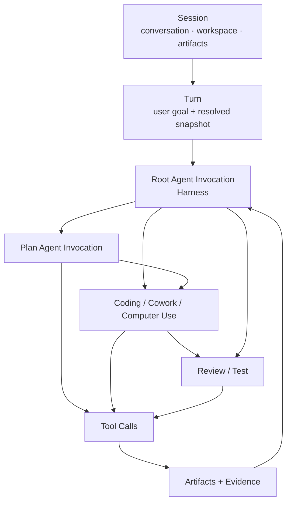
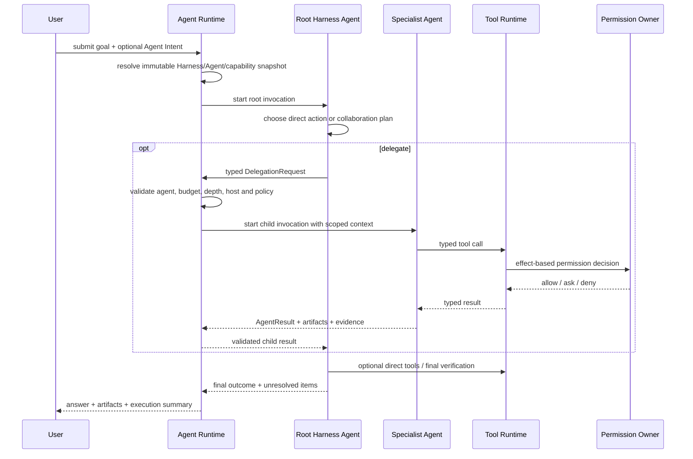
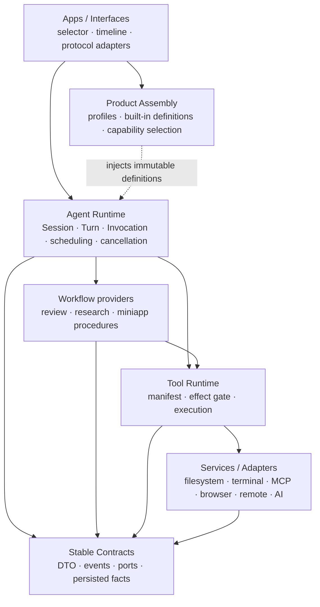

# Agent Harness 与多 Agent 协作产品架构

> 状态：目标设计提案，尚不表示当前产品已经具备本文能力。
>
> 范围：统一 Code / Cowork 会话，定义用户可感知的三种 Agent Harness，重构 Plan、Review、Cowork、Computer Use 等 Agent 的角色与协作方式，并给出运行时边界、兼容迁移和远程场景约束。
>
> 上位约束：[`product-architecture.md`](product-architecture.md)、[`agent-runtime-services-design.md`](agent-runtime-services-design.md)、[`agent-runtime-deployment-design.md`](agent-runtime-deployment-design.md) 和 [`rust-build-dependency-boundaries.md`](rust-build-dependency-boundaries.md)。若本提案通过评审，实施时再把稳定结论回填上位文档；在此之前，以现有上位文档和代码为准。

## 0. 结论先行

BitFun 不应继续让用户先判断任务属于 Code 还是 Cowork，也不应继续把 Plan、Debug、Team、DeepResearch 等不同层级的概念都塞进 Session Mode。

目标产品模型是：

1. **Session 只是持续工作的容器**：保存对话、工作区、产物、权限事实和执行历史，不再拥有 Code / Cowork 类型。
2. **Agent Harness 是根 Agent 的工作方式**：用户选择“极简 / 均衡 / 极致”，决定默认的规划深度、协作强度、验证要求、信息披露和资源倾向。
3. **专业 Agent 承担角色**：Plan、Review、Cowork、Computer Use、Research、Coding、Testing 等都是可由 Harness 调用的 Agent，而不是新的会话类型。
4. **Workflow 与 Agent 分离**：Agent 负责判断与决策；Workflow 负责可重复的多步骤程序；Skill 提供知识和指令；Tool 执行具体动作。
5. **用户始终面对一个根 Harness**：专业 Agent 的活动显示在同一 Turn 下的任务树中；它们不成为默认平级聊天窗口，也不各自拥有第二份 Session 权威状态。
6. **均衡是默认值**：它必须覆盖大多数日常任务。极简与极致是明确的成本/质量取舍，不是“能力被阉割”和“无限资源”的别名。
7. **三种 Harness 不改变安全上限**：它们可以改变主动规划、候选工具暴露、Agent 调用和验证策略，但不能放宽权限、沙箱、执行域、组织策略、取消树和资源硬上限。
8. **现有 `bitfun-harness` 不能直接充当新顶层 Harness**：它当前描述 Deep Review、Deep Research、MiniApp 等工作流路由。该概念必须迁移为 Workflow Provider，不能因为 crate 同名就复用错误的 owner。

推荐的稳定英文 ID：

| 用户名称 | 稳定 ID | 一句话承诺 |
|---|---|---|
| 极简 | `minimal` | 少调度、快行动，以最低必要成本完成任务并说明未验证项 |
| 均衡 | `balanced` | 自适应规划、按需协作、针对性验证，作为默认选择 |
| 极致 | `ultimate` | 对复杂任务进行有界分解、专业协作和独立复核，追求质量上限 |

“极致”内部不使用 `unlimited`、`max` 等 ID，避免暗示无上限并发、预算或权限。

## 1. 第一性原理

### 1.1 用户真正委托的是什么

用户提交的不是“代码消息”或“办公消息”，而是一个希望被完成的目标。完成质量取决于：

```text
结果质量 = 目标理解 × 上下文质量 × 决策质量 × 执行能力 × 验证强度
成本     = 延迟 + 模型与工具消耗 + 用户介入 + 失败返工
```

Code / Cowork 是对任务领域的提前猜测。真实任务经常跨域：

- 调研一个技术方案，修改代码，生成报告并制作演示文稿；
- 阅读用户反馈，复现问题，操作浏览器，修复实现并回归验证；
- 整理资料，编写脚本，批量处理文件，再通过桌面应用交付结果。

如果 Session 在创建时就被固定成 Code 或 Cowork，用户必须在系统理解任务之前替系统做路由，而且跨域任务会迫使产品暴露更多会话类型。正确的稳定轴不是“做什么领域”，而是“系统默认投入多少规划、协作和验证”。

### 1.2 Harness 为什么既是 Agent，又不能只等于一个 prompt

Harness 是一个具有根身份的 Agent：它读取用户目标、决定下一步、调用工具、委派专业 Agent、汇总结果并对最终答复负责。因此它与其他 Agent 共用同一执行原语。

但 Harness 还承担产品级职责：

- 是一个 Turn 的唯一根协调者；
- 选择协作和验证策略；
- 持有子 Agent 取消树与结果汇总责任；
- 在预算、权限和可用能力约束内降级；
- 向用户解释“正在由谁做什么”以及哪些内容尚未验证。

因此目标模型应是：**Harness 是 `role = harness` 的 Agent；三种用户选择是 Harness Profile；一次实际运行是 Root Agent Invocation。** 不能把这三件事压成一个字符串 `agent_type`。

### 1.3 最小、稳定的对象词汇

| 对象 | 唯一含义 | 不等于 |
|---|---|---|
| Session | 持久化工作容器和用户对话 | Code/Cowork 类型、Agent 实例、Runtime 进程 |
| Turn | 一次被接受的用户输入及其完整执行 | 一次模型请求、一个子 Agent Session |
| Harness Profile | 根 Agent 的默认工作策略 | 权限等级、模型名称、Delivery Profile |
| Harness Agent | 一个 Turn 的根 Agent | 独立 Runtime、Workflow Provider |
| Specialist Agent | 有明确输入、能力与输出契约的专业角色 | 平级产品入口、随意共享状态的虚拟人格 |
| Agent Invocation | 某个版本 Agent 定义的一次运行 | Agent 定义本身、顶层 Session |
| Workflow | 可重复、可恢复的多步骤执行程序 | Agent 身份、用户会话类型 |
| Skill | 注入 Agent 的知识、指令或资源 | 执行权限、具体服务句柄 |
| Tool | 产生读取、写入、网络、进程或 UI 副作用的动作入口 | Agent、Workflow |
| Surface | Chat、Mini App、Computer Use Live、Review Report 等呈现 | 状态 owner、Agent Runtime |

## 2. 当前体系的根问题

当前不是简单的“双入口”问题，而是四套概念发生了交叉：

| 当前事实 | 造成的问题 | 目标变化 |
|---|---|---|
| Web UI 同时存在 `SessionMode = code/cowork` 和 `ViewMode = coder/cowork` | 产品入口、布局与运行模式互相推导 | 删除领域型 Session Mode；Surface 只根据当前内容和能力选择布局 |
| 新建 Code 直接写入 `agentic`，新建 Cowork 直接写入 `Cowork` | 用户入口直接绑定 Runtime Agent ID | 新建 Session 只选择 Harness Profile；专业 Agent 由 Turn 内路由 |
| Session、SessionMetadata、Runtime Port、App Server 和 CLI 都持有 `agent_type` / `mode_id` | 一个字符串同时承担默认模式、当前执行者、缓存兼容与旧协议投影 | 拆成 Harness Binding、Resolved Turn Snapshot、Agent Invocation Identity 和 legacy projection |
| `agentic/Cowork/Plan/debug/Multitask/Claw/DeepResearch/Team` 都属于 Mode Agent | 领域、阶段、强度、执行表面混成一个枚举空间 | 三种 Harness 是强度；Plan/Cowork/Research 等是专业 Agent；Computer Use 是专业 Agent + Live Surface |
| `ComputerUse/Explore/Review*` 属于 Subagent，部分 Agent 又是 Hidden | “是否可调用”“是否可展示”“能否作为根”没有独立维度 | Agent Role、Invocation Policy、Visibility Policy 分开建模 |
| `bitfun-harness` 当前注册 DeepReview/DeepResearch/MiniApp workflow descriptor，且具体执行仍在 legacy path | “Harness”已被用来表示工作流，不是根 Agent | 将现有概念迁移为 Workflow Provider；新 Agent Harness 复用统一 Agent 执行原语 |
| `docs/sdlc-harness` 又把 Harness 作为内部工程治理术语 | 同一产品出现三种 Harness 含义 | 用户术语固定为 Agent Harness；工程治理术语改称 Quality Guard / Engineering Governance，迁移期必须带限定词 |

根因是：**Session、Agent、Workflow、Surface 和执行强度没有被建模为正交维度。** 继续新增 Mode 只会扩大组合爆炸。

## 3. 目标产品设计

### 3.1 一个新建入口

主导航只保留一个 `+ 新建会话`：

1. 使用当前工作区；没有项目工作区时使用 Assistant Workspace 或要求用户选择可用执行位置。
2. 使用用户最近选择的 Harness；首次使用默认为 `balanced`。
3. 创建后直接聚焦输入框，不弹出领域选择对话框。
4. 用户可以在发送前或 Session 空闲时切换 Harness；切换只影响下一 Turn，不重写历史。

Session 列表不再按 Code / Cowork 分组。可选的弱提示只展示当前 Harness、执行位置和活动状态，不把 Harness 名称拼进自动标题。

### 3.2 三种 Harness 的默认行为

| 维度 | 极简 `minimal` | 均衡 `balanced` | 极致 `ultimate` |
|---|---|---|---|
| 适合 | 明确、低风险、短路径任务 | 绝大多数日常工作 | 复杂、高风险、长程或交付质量优先任务 |
| 首个动作 | 尽快开始必要读取或执行 | 先形成轻量内部路径，再开始最有信息增益的动作 | 先明确目标、依赖、风险和可并行工作包 |
| 规划 | 只保留执行所需的最小计划 | 按任务复杂度生成和维护计划 | 显式阶段计划、依赖关系、完成标准和恢复点 |
| 专业 Agent | 不主动委派，除非目标能力只能由专业 Agent 完成或用户明确指定 | 有明确收益时按需委派，优先小规模、有边界的并行 | 主动构建有界协作 DAG，复杂变更至少包含独立验证视角 |
| 工具呈现 | 常用工具直接可见，重型工具延迟发现 | 常用执行与协作工具直接可见，其他工具按需加载 | 编排、等待、Review、证据与恢复能力直接可发现；专业工具仍由对应 Agent 获得 |
| 用户提问 | 只在无法安全推进或关键目标缺失时询问 | 在重大取舍、破坏性动作和验收歧义时询问 | 在架构、风险、成本或交付边界会显著改变结果时尽早询问 |
| 验证 | 变更后执行最低必要验证；明确列出未验证项 | 执行 owner-scoped 的针对性验证 | 针对性验证 + 重要结果的独立 Review/复核；不机械运行全仓套件 |
| 失败恢复 | 一次清晰重试或显式停止 | 在预算内换路径、缩小范围或调用专业 Agent | 使用检查点、替代 Agent、分支复核和阶段性部分交付 |
| 展示密度 | 只显示关键动作和结果 | 展示计划摘要、重要委派与验证 | 展示阶段、Agent 任务树、关键证据、风险和剩余不确定性 |
| 成本倾向 | 最低必要 | 成功率与成本平衡 | 质量优先，但始终受硬预算和策略上限约束 |

这些是策略倾向，不是写死的工具调用次数或并发数。具体并发、token、时间、重试和子 Agent 深度由 Runtime 的分层预算、模型能力、执行 Host、用户/组织策略和当前负载共同收紧。不能在 Agent loop 中用字符串或固定次数硬编码“极简只能调用一次”“极致必须调用 N 个 Agent”。

### 3.3 用户如何调用 Agent

产品提供三条路径，最终都由根 Harness 受控执行：

1. **自动路由**：用户直接描述目标，Harness 根据当前 Agent Catalog、任务和能力事实决定是否委派。
2. **显式点名**：用户通过 `@Plan`、`@Review`、`@Cowork`、`@ComputerUse` 或 Agent Picker 表达期望角色；这是一条强意图，不绕过权限、可用性或 Harness 的结果责任。
3. **Surface 触发**：用户点击“深度审查”“控制电脑”“制作演示”等动作；Surface 提交类型化 Agent Intent，而不是创建特殊 Session。

用户默认只向根 Harness 发消息。用户可以查看、取消或要求 Harness 重新派发某个专业 Agent，但不直接取得子 Session controller。这样可以保留一个清晰的对话主线、取消树和最终责任人。

### 3.4 第一批专业 Agent

| Agent | 核心职责 | 默认效果策略 | 标准输出 |
|---|---|---|---|
| Plan | 澄清目标、调查约束、给出可执行计划 | 只读；只能写受管 Plan artifact | 计划、依赖、风险、验收条件 |
| Review | 独立检查变更、报告问题与证据 | 只读；不能直接修复 | 分级 findings、证据、覆盖与未覆盖项 |
| Cowork | 研究、写作、文档、资料整理和跨办公步骤协作 | 按任务授权写入 workspace；高风险副作用单独确认 | 文档/表格/演示等产物与摘要 |
| Computer Use | 观察屏幕、操作浏览器或桌面应用并验证 UI 状态 | 仅在实际 Computer Use Host；每类高风险 UI 动作受权限约束 | 操作结果、截图/状态证据、无法完成原因 |
| Coding | 阅读、修改、测试真实代码仓库 | workspace-scoped 写入；Git/发布动作独立授权 | 代码变更、测试结果、剩余风险 |
| Explore | 快速查找代码、文件、资料和依赖关系 | 只读 | 事实、位置、关系和置信度 |
| Research | 多来源检索、比较和综合 | 网络与引用策略受控；默认不修改项目 | 带来源结论、冲突与不确定性 |
| Test | 选择并执行最小覆盖验证、归因失败 | 只允许测试所需副作用；不得自动修复产品代码 | 通过/失败/基线、命令与证据 |

Debug、DeepResearch、DeepReview、Team 等当前 Mode 不再作为同级长期产品概念：

- Debug 的稳定能力进入 Diagnose/Explore/Coding/Test 的组合；
- DeepResearch 由 Research Agent + Research Workflow + Artifact 组成；
- DeepReview 由 Review Agent + Review Workflow + Review Report Surface 组成；
- Team 的价值进入 `ultimate` 的协作策略，不保留“模拟一组角色”的独立 Session Mode；
- Claw 的桌面执行能力进入 Computer Use Agent，Assistant Workspace 只保留为工作区/Surface 事实；
- Multitask 的价值进入 Harness 的并行规划与 Runtime 调度，不保留用户模式。

### 3.5 产品界面

#### 新建与 Composer

- 主导航：一个“新建会话”。
- Composer：Harness 选择器与 Model、Permission 位于同一控制层级。
- Harness 菜单：先展示三种结果承诺，再在二级详情解释时间、成本、协作和验证差异。
- Agent Picker：展示可直接点名的专业 Agent；不可用项显示执行位置或能力缺口，不能点击后静默回退。

#### Timeline

每个用户 Turn 下显示：

```text
用户目标
└─ 均衡 Harness
   ├─ Plan · 已完成
   ├─ Coding · 正在修改 3 个文件
   ├─ Review · 等待 Coding 产物
   └─ Test · 待运行
```

默认折叠中间细节，只保留 Agent 名称、任务、状态、产物和可执行动作。不得展示模型隐藏思维链；“为什么委派”只能是简短的产品级决策摘要。

#### 专用 Surface

- Computer Use 启动 Live Surface，展示当前控制对象、最近观察、暂停/接管和权限状态；关闭 Surface 不取消 Agent，取消 Agent 也不能伪装成关闭窗口成功。
- Review 使用结构化报告 Surface；它是同一 Turn 的产物，不创建第二个顶层会话。
- Mini App 是任务界面和状态绑定，不是 Agent 类型。Harness 或专业 Agent 可以创建/使用 Mini App。

#### Agents 管理页

Agents 页面分成：

1. Agent Harness：三种内置 Profile、默认选择和高级详情；V1 不开放任意自定义根 Harness。
2. Specialist Agents：内置、用户、项目和外部来源 Agent；展示来源、版本、模型策略、效果策略、可用执行域和启用状态。
3. Workflows / Skills / Tools 继续由各自 owner 的设置页管理，不混进 Agent 列表。

## 4. 统一领域模型

### 4.1 Agent Definition

Harness 和专业 Agent 使用同一 Agent Definition 原语，但通过 role 和策略区分：

```rust
struct AgentDefinition {
    id: AgentId,
    version: AgentVersion,
    role: AgentRole, // Harness | Specialist
    purpose: String,
    prompt_modules: Vec<PromptModuleRef>,
    capability_requirements: Vec<CapabilityRequirement>,
    tool_exposure: ToolExposurePolicy,
    effect_policy: EffectPolicy,
    model_policy: AgentModelPolicy,
    delegation_policy: DelegationPolicy,
    input_contract: AgentInputContract,
    output_contract: AgentOutputContract,
    visibility: AgentVisibilityPolicy,
    source: AgentSourceIdentity,
}
```

关键约束：

- `capability_requirements` 表达能力，不把一串工具名当作权限。
- `tool_exposure` 只决定哪些已允许工具直接展示、延迟展示或隐藏。
- `effect_policy` 由 Runtime/Tool owner 强制执行；Plan/Review 的只读不能只写在 prompt 中。
- `source + id + version` 共同形成不可变身份；来源更新不会改变在途 Invocation。
- Harness Agent 可以委派；专业 Agent 默认不能继续委派，确有价值时由显式 policy 开启并继续受深度、预算和递归保护。

### 4.2 Harness Profile

Harness Profile 是少量内置、稳定、用户可选择的产品策略：

```rust
struct HarnessProfile {
    id: HarnessProfileId,
    root_agent_id: AgentId,
    prompt_policy: PromptPolicyRef,
    collaboration_policy: CollaborationPolicy,
    verification_policy: VerificationPolicy,
    recovery_policy: RecoveryPolicy,
    disclosure_policy: DisclosurePolicy,
    budget_class: BudgetClass,
    default_tool_exposure: ToolExposurePolicy,
}
```

Profile 不包含：

- API key、凭据或模型供应商秘密；
- OS 路径和具体 service handle；
- 最终权限决定；
- Runtime 进程数量；
- 动态 Agent 健康和安装状态；
- GUI/TUI 布局或组件 schema。

### 4.3 Session、Turn 与 Invocation



一个 Turn 在被 Runtime 接受时生成不可变 `ResolvedTurnHarnessSnapshot`，至少记录：

- Harness Profile ID 和版本；
- 根 Agent 的 source/id/version；
- 可调用专业 Agent 的 source/id/version 快照；
- 模型选择与 reasoning preset 事实；
- 产品能力计划、执行 Host 和工具 manifest fingerprint；
- 权限策略版本、预算 class 和用户显式 Agent Intent；
- 当前 workspace / remote execution identity。

Session 保存“下一 Turn 的默认 Harness Profile”，历史 Turn 保存当时的 resolved snapshot。切换 Harness 不能改变历史解释或使迟到结果进入新策略。

### 4.4 Agent Invocation

```rust
struct AgentInvocation {
    invocation_id: AgentInvocationId,
    session_id: SessionId,
    turn_id: TurnId,
    parent_invocation_id: Option<AgentInvocationId>,
    definition: ResolvedAgentDefinitionRef,
    delegated_goal: String,
    input_refs: Vec<ContextOrArtifactRef>,
    execution_target: SessionExecutionTarget,
    granted_capabilities: Vec<GrantedCapability>,
    budget: InvocationBudget,
    status: AgentInvocationStatus,
}
```

子 Agent Session 可以继续作为内部持久化实现，但产品投影必须称为 Invocation/Agent task，并挂在父 Turn 下。不能因为内部使用 Session 存储就把它提升为第二个顶层会话入口。

## 5. Harness 执行与 Agent 协作

### 5.1 一次 Turn 的稳定流程



Runtime 而不是 prompt 负责：

- Session/Turn/Invocation 身份；
- Agent definition 版本解析；
- 子树取消、deadline、预算和并发上限；
- 权限与执行域校验；
- 事件因果与持久化；
- 迟到结果拒绝；
- `outcome_unknown`、部分完成和恢复状态。

Harness prompt 负责：

- 理解任务；
- 选择直接执行还是委派；
- 形成对用户有意义的计划；
- 解释取舍；
- 汇总专业 Agent 的结构化结果；
- 决定在当前策略允许范围内是否进一步验证或降级交付。

### 5.2 协作不是自由聊天网

V1 使用单根、有向、可取消的协作 DAG：

- 每个 Invocation 有唯一 parent；依赖关系可以引用此前 Agent 产物。
- Agent 之间不共享可变 transcript，不互相持有 Session manager。
- 并行 Agent 通过不可变 Context/Artifact refs 接收输入，通过 `AgentResult` 返回结果。
- 后续 Agent 可以消费前序 Agent 的产物，但不能修改前序结果；修订生成新 artifact revision。
- 根 Harness 是最终汇总者；专业 Agent 不能直接向顶层 Session 插入“最终答复”。
- 需要 Agent A 与 Agent B 协同时，由 Harness 编排 `A output -> B input` 或并行后汇总，不建立无界 peer-to-peer mailbox。

这仍然是多 Agent 协作：协作发生在任务、证据和产物的可追踪传递上，而不是让一组模型自由对话。

### 5.3 委派请求与结果契约

`DelegationRequest` 至少表达：

- 目标 Agent 的稳定 identity 或 capability query；
- 清晰、有限的 delegated goal；
- 允许读取的 context/artifact refs；
- 期望输出 contract；
- 是否允许写入以及写入范围；
- execution target；
- deadline、预算请求和是否为必需结果；
- 用户显式指定、Harness 自动选择或 Workflow 触发的来源。

`AgentResult` 至少表达：

- `completed / partial / failed / cancelled / outcome_unknown`；
- 面向父 Agent 的结构化 summary；
- artifacts、evidence 和 changed-resource refs；
- 已验证、未验证与无法验证项；
- 可重试性和建议恢复动作；
- 实际使用的 Agent/model/tool/host identity 摘要。

模型生成的自由文本不能直接提交为权限、审计、工具成功或验证通过事实。

### 5.4 上下文分发

根 Harness 可以看到 Session 的用户主线；专业 Agent 默认只收到完成任务所需的最小切片：

1. 系统不变量与 Agent 自身 prompt modules；
2. delegated goal 和 output contract；
3. workspace instructions / AGENTS 等适用规则；
4. 经过选择的历史摘要、文件、图像、artifact refs；
5. execution target、permission constraints 和 budget；
6. 允许调用的 Agent/Skill/Tool snapshot。

禁止默认复制整段 Session transcript 给每个 Agent。上下文包必须带 generation/fingerprint；父 Session 后续变化不能无条件污染在途 Agent。

### 5.5 模型策略

- Harness Profile 不绑定具体模型供应商或模型 ID。
- 根 Harness 默认使用 Session 当前模型选择。
- 专业 Agent 根据 Agent model policy 选择 `inherit / primary / fast / fixed / auto`，并由现有 model owner 解析。
- `ultimate` 可以偏向更强推理或独立模型复核，但不能绕过用户/组织可用模型和成本上限。
- 外部 Agent 的模型请求继续通过 ecosystem-neutral binding 解析；缺失绑定时返回明确不可用，不按同名本地 Agent 回退。

## 6. 工具、权限、预算与降级

### 6.1 能力收紧链

一次 Agent 工具调用的最终能力是以下集合逐层收紧后的交集：

```text
Product capability upper bound
  ∩ Delivery Profile compiled/assembled capabilities
  ∩ current Host availability
  ∩ Harness Profile defaults
  ∩ Agent capability/effect policy
  ∩ delegated task grant
  ∩ user/organization permission decision
  ∩ runtime resource budget
```

任何下层都不能放宽上层。`ultimate` 只影响协作和质量投入，不等于 Full Access；`minimal` 也不能为了快而跳过安全检查。

### 6.2 Prompt、工具暴露与安全必须分开

- System prompt 告诉 Agent 应如何工作。
- Tool exposure 决定当前模型直接看到、延迟发现或完全不可见的已注册工具。
- Capability grant 决定 Agent 在本 Invocation 中可以请求什么。
- Permission owner 根据动作效果、目标、数据、来源和执行位置作最终决定。
- OS/容器/远程 Host 承担真实资源和副作用边界。

删除工具名不等于安全，展示工具名也不等于授权。内置、MCP、Plugin 和 Computer Use 工具继续进入同一类型化权限、取消和审计路径。

### 6.3 只读 Agent

Plan、Review、Explore 等只读角色必须由 Runtime/Tool policy 强制：

- 禁止写文件、修改 Git、发送消息、控制桌面或启动带副作用进程；
- 只允许写入其 owner 管理的特定 artifact（例如 Plan/Review Report）；
- Plugin/MCP 工具必须声明 effect，未知或声明不完整的工具不能进入只读 Agent；
- 发现必须写入才能验证时，Agent 返回 `action_required`，由 Harness 决定是否交给可写 Agent。

### 6.4 降级

| 条件 | 正确行为 | 禁止行为 |
|---|---|---|
| 专业 Agent 不可用 | Harness 说明缺失能力，选择明确的较弱路径或请求用户决定 | 按同名字符串静默使用本地 Agent |
| Remote Host 不支持 Computer Use | 禁用入口并说明需要在哪台设备执行 | 回退控制端本机桌面 |
| 子 Agent 超时 | 标记 failed/partial，保留已完成证据，由 Harness 决定继续或停止 | 无限自动重试 |
| 写操作响应丢失 | 返回 `outcome_unknown` 并要求核对事实 | 自动重放写入 |
| 事件流失效 | 重新同步权威状态或 fail closed | 继续显示“正在运行”并假装事件完整 |
| 极致预算不足 | 显示降级为哪些步骤、仍执行哪些必要保护 | 静默变成均衡或跳过独立 Review |

## 7. 状态、事件与可观察性

### 7.1 Invocation 状态

| 状态 | 含义 | 可执行动作 |
|---|---|---|
| `queued` | 已被 Runtime 接受，等待预算或依赖 | 取消、查看依赖 |
| `running` | Agent/Tool 正在推进 | 取消、查看公开摘要 |
| `waiting_for_user` | 需要用户决定或补充输入 | 回答、取消 |
| `waiting_for_permission` | 权限 owner 等待响应 | 允许/拒绝、取消 |
| `blocked_by_dependency` | 等待另一个 Invocation 或 artifact | 查看依赖、取消 |
| `completed` | output contract 已满足 | 查看结果/产物 |
| `partial` | 有可用结果，但存在明确未完成项 | 接受、继续、重试缺口 |
| `failed` | 已确认失败且没有满足 output contract | 重试、替换 Agent、缩小范围 |
| `cancelled` | 取消已被 owner 确认 | 重新发起 |
| `outcome_unknown` | 副作用结果无法确认 | 同步/核对事实；不得自动重放 |

父 Invocation 只有在所有 required children 进入已知终态后才能提交完整完成。Optional child 失败可以让父结果降级为 partial，但不能被改写成“全部通过”。

### 7.2 事件

在现有事件 owner 中增量投影以下事实，具体 wire 只在真实 consumer 出现时版本化：

- `harness_profile_resolved`
- `agent_invocation_queued`
- `agent_invocation_started`
- `agent_invocation_waiting`
- `agent_artifact_published`
- `agent_invocation_completed`
- `agent_invocation_failed`
- `agent_invocation_cancelled`
- `harness_degraded`

事件必须带 `session_id / turn_id / invocation_id / parent_invocation_id / sequence / execution_target / definition_version`。事件 payload 不携带隐藏思维链、凭据、完整 prompt 或未脱敏工具输入。

## 8. 代码与模块归属

### 8.1 目标依赖方向



箭头表示调用/依赖，虚线表示组装。实际 crate 仍遵循 apps/interfaces → assembly → adapters/services/execution → contracts；图中的 Runtime、Workflow 和 Tool 都是 execution 层逻辑职责。Workflow Provider 只能消费 Runtime 授予的窄执行上下文和稳定 port，不能反向持有具体 `AgentRuntime`，因此不能形成物理 crate 环。

### 8.2 各层职责

| 位置 | 新增/演化职责 | 不应拥有 |
|---|---|---|
| `contracts/core-types` / `runtime-ports` / `events` | 跨 owner 的 Harness ID、Invocation DTO、状态、事件与可选持久化事实 | prompt、调度、UI、具体工具 |
| `execution/agent-runtime` | Harness binding 决策、resolved snapshot、根/子 Invocation 生命周期、委派、取消、预算、结果汇总 | 具体文件/Git/终端/MCP/Computer Use 实现 |
| `execution/harness`（当前） | 迁移期保留旧 Workflow descriptor 兼容 facade | 新根 Harness Session owner |
| `assembly/agent-content` | 三种 Harness 和内置专业 Agent 的不可变 prompt bytes 与稳定 key | 选择、渲染、动态来源或 Registry 生命周期 |
| `assembly/product-capabilities` | 为 Delivery Profile 选择可用 Harness/Agent/Workflow capability 上限 | 动态健康、权限、Session 状态或具体执行 |
| `assembly/core` | 兼容旧 `agent_type/mode_id`，装配当前具体 Agent/Workflow provider，逐切片迁移旧执行 | 新的长期平行业务 owner |
| `services` | Session/Artifact IO、文件、终端、Git、MCP、Browser、Computer Use、Remote 等具体能力 | Harness 策略和 Agent 路由 |
| `adapters` | 模型、外部 Agent 来源、transport 与生态语义转换 | BitFun 内部 Agent 状态和产品 profile 选择 |
| Desktop/Web/TUI/Mobile | 一个新建入口、Harness 选择、Agent 任务树和类型化降级 | Agent loop、权限判断、子 Session 权威状态 |

### 8.3 现有 `bitfun-harness` 的处理

当前 `HarnessWorkflow::{DeepReview, DeepResearch, MiniApp, ...}` 和 `HarnessProvider` 实际是 Workflow Provider。目标迁移按以下顺序进行：

1. 先在概念和新代码中使用 `WorkflowDefinition / WorkflowProvider / WorkflowRegistry`，停止给新功能增加第二种 “Harness workflow”。
2. 保留现有 `bitfun-harness` 包和 public path 作为兼容 facade；不要先为改名创建空 crate 或批量迁移。
3. 在第一个真实工作流执行切片证明行为等价后，把 descriptor 和 registry 名称迁移到 Workflow 术语。
4. 新 Agent Harness 直接使用统一 Agent Definition/Registry 和 Agent Runtime Invocation，不通过旧 `HarnessProvider::execute` 绕行。
5. 只有物理拆分能带来真实依赖闭包或独立验证收益时，再评审 package/crate 重命名。

最终应避免同时存在“Agent Harness Registry”和“Workflow Harness Registry”。Agent Registry 持有 Harness/Specialist definitions；Workflow Registry 持有可重复程序。

### 8.4 Agent Registry 演化

现有 `Mode / SubAgent / Hidden` 分类演化为正交属性：

```text
role:        Harness | Specialist
invocation:  RootOnly | Delegatable | DirectIntent | WorkflowOnly
visibility:  Public | Restricted | Hidden
source:      Builtin | User | Project | External
effects:     ReadOnly | WorkspaceWrite | DesktopControl | ...
```

迁移期可从旧 category 派生这些属性，但新逻辑不能继续用 category 判断全部行为。`RuntimeAgentRegistry` 应返回不可变定义摘要与版本 identity，而不只返回字符串 ID。

## 9. API、持久化与升级兼容

### 9.1 新契约保持加法

新请求采用可选字段，旧字段保留兼容期：

```rust
struct CreateSessionRequest {
    session_name: String,
    harness_profile_id: Option<String>,
    legacy_agent_type: Option<String>, // deprecated compatibility input
    // existing workspace/model fields...
}

struct SessionExecutionProfile {
    harness_profile_id: String,
    schema_version: u32,
    selected_by: HarnessSelectionSource,
}
```

规则：

- 新客户端创建新 Session 必须提交 `harness_profile_id`；在旧 Host 上使用前先协商 capability。
- 新 Host 继续接受旧 `agent_type`，进入 Legacy Mode Bridge，不删除或重写历史。
- 新 Session 继续双写一个 legacy `agent_type = agentic` 投影，供旧 reader 基本打开；该字段不再是新 Runtime 的权威 Harness 事实。
- 如果老版本写入导致可选新字段丢失，新版本可以从 legacy projection 恢复 `balanced` 兼容路径，并明确标记 compatibility-derived；不能猜成 `ultimate`。
- Persisted shape 的新增字段必须有默认值和 legacy round-trip 测试；字段丢失不能触发 Session 删除、重置或静默切换执行 Host。

### 9.2 最小产品操作

只有存在真实 Web/TUI/Remote consumer 时才逐项加入 owner 接口：

- list available Harness Profiles；
- create Session with Harness Profile；
- update current Session Harness（仅 idle，结果可能为 `outcome_unknown`）；
- list Agent Definitions / availability；
- submit Turn with optional explicit Agent Intent；
- query Agent Invocation tree；
- cancel exact Agent Invocation subtree。

不新增一个“全量 Harness API”。各操作分别定义权限、deadline、断线、背压、结果不确定性和 Embedded/Shared 等价测试。

### 9.3 旧 Session 迁移

升级后不要求用户修复 Session：

1. 旧 Session 继续由 `LegacyModeBridge` 打开和执行，历史与 `agent_type` 原样保留。
2. 产品不再允许创建新的 Code/Cowork legacy Session。
3. 用户第一次打开旧 Session 时可看到一次非阻塞说明，并选择“转换为 Agent Harness”。
4. 转换只新增 Harness binding 和迁移记录，不改写 transcript、turn agent identity 或 artifact。
5. 语义可安全推导时提供建议；语义变化明显时必须确认。

| 旧 mode | 建议 Harness | 建议专业 Agent/策略 | 自动转换 |
|---|---|---|---|
| `agentic` | 均衡 | 无强制专业 Agent | 可在用户确认后转换 |
| `Cowork` | 均衡 | Cowork 作为首选领域 Agent，不永久锁定 | 可在用户确认后转换 |
| `Plan` | 均衡 | Plan-only intent；转换后用户可结束规划并继续执行 | 否，需解释语义变化 |
| `debug` | 均衡 | Diagnose/Explore/Test 组合 | 否 |
| `Multitask` | 极致 | 有界并行协作 | 否 |
| `Team` | 极致 | 真实 Agent DAG，不保留虚拟角色话术 | 否 |
| `DeepResearch` | 极致 | Research Agent + Research Workflow | 否 |
| `Claw` | 均衡 | Computer Use Agent；保留 Assistant Workspace 事实 | 否 |
| 自定义 Mode | 均衡 | 转为 Specialist；必要时先经 legacy root adapter 保持行为 | 否 |

在兼容窗口结束前，只能删除旧写入口和 UI 分支，不能停止读取旧字段。删除 `LegacyModeBridge` 需要已支持版本范围、迁移遥测和旧 payload round-trip 证据。

### 9.4 跨版本能力协商

建议能力 ID：

- `agent_harness_profiles_v1`
- `agent_intent_v1`
- `agent_invocation_projection_v1`
- `agent_invocation_cancel_v1`

新 Client 连接旧 Host 时：

- `balanced` 可以在用户知情的兼容提示下投影为 legacy `agentic`；
- `minimal` / `ultimate` 不得静默降级，必须返回明确 unsupported 并给出可选兼容动作；
- Agent tree 不可用时显示“Host 仅支持单 Agent 事件”，不能合成假的子任务状态。

## 10. 四类远程场景

| 场景 | Harness/Agent 归属 | 必须满足 | 明确禁止 |
|---|---|---|---|
| Remote workspace | Runtime 和产生文件/进程副作用的 Agent 在目标 execution host | Agent catalog、tool availability、路径、权限、artifact 和取消都绑定目标；POSIX 路径保持目标语义 | 控制端本机 fallback、复用本机路径或凭据 |
| Remote control | Desktop/CLI Host 拥有 Runtime，Mobile/IM 是 controller | RemoteCommand 支持 Harness 选择、Agent 状态、permission mailbox、question 和取消，或返回 typed unsupported | 只在 Desktop UI 可回答的阻塞步骤 |
| Peer Device Mode | Peer Host 拥有 Session/Turn/Invocation 权威状态 | Harness 与 Agent 操作默认代理到 Peer；控制端只投影视图 | 控制端本地执行同名 Agent 或 Tool |
| Detached Dispatch | Target Host 拥有 durable job、Session、Invocation DAG、事件和产物 | Harness 计划和 Agent 协作可在 controller 断开后继续；阻塞交互进入 mailbox；协议协商所需 capability | 依赖 live submitter、把 controller 当 Runtime/filesystem proxy |

Computer Use 还必须声明实际屏幕所在设备。用户在手机远程控制 Desktop 时，Computer Use Agent 操作 Desktop；Remote workspace 的 SSH Host 不因有文件/终端能力就自动具备桌面能力。

## 11. 实施切片与退出条件

### Phase 0：术语和可观测基线

- 冻结本文对象词汇；新功能停止增加 Session Mode。
- 记录 Code/Cowork 创建、Mode 切换、专业 Agent 使用、任务成本、完成率和未验证项基线。
- 将新 Agent Harness 与现有 Workflow Harness、SDLC Harness 明确区分。

退出条件：能够说明现有每个 mode 的真实用户旅程、调用链、持久化字段和远程入口。

### Phase 1：加法契约与 Legacy Bridge

- 增加 Harness Profile、Agent Role、Resolved Snapshot 和 Invocation 状态的纯事实。
- 保持旧 `agent_type/mode_id` 读取、写入和协议行为。
- Agent Registry 开始返回 role/version/effect policy；不先迁移具体执行 owner。
- 为旧 payload、降级和双写建立 contract tests。

退出条件：新旧 Session 可以往返读取；旧 Client 不崩溃；新字段丢失可恢复为明确兼容状态。

### Phase 2：统一根 Harness Runtime

- 在同一 Agent Runtime 中接入 `balanced` 根 Agent；不创建第二套 scheduler/session/event owner。
- 使用现有 Task/Subagent 路径实现第一条 typed Delegation 和 AgentResult。
- 先迁移 Plan + Coding + Review 的本地垂直切片，强制只读和取消边界。
- 再加入 `minimal` 和 `ultimate` 策略；资源数值由运行时预算配置决定。

退出条件：三种 Harness 在同一任务集上产生可解释差异；取消、失败、部分完成、迟到结果和权限行为一致。

### Phase 3：统一产品入口

- Web/Desktop 只保留一个新建按钮和 Harness selector。
- Session 列表取消 Code/Cowork 分类；Timeline 投影 Invocation tree。
- Plan、Review、Cowork、Computer Use 逐个成为专业 Agent；专用 Surface 消费同一状态。
- Agents 管理页完成 role/source/version/availability 展示。

退出条件：新 Session 不再写 Code/Cowork 类型；旧 Session 可继续或显式转换；无 UI 组件直接决定 Runtime Agent ID。

### Phase 4：跨入口和远程

- TUI、App Server、Remote Connect、Mobile、Peer 和 Dispatch 按真实旅程逐项接入。
- 为每个操作加入 capability negotiation、typed unsupported、断线与 mailbox 行为。
- Embedded/Shared 复用同一 owner fixture；不把 private v17 自动扩成公开协议。

退出条件：四种远程场景均有实际验证或明确 gated entry；报告分别说明本地、Remote workspace、Remote control、Peer 和 Dispatch 覆盖。

### Phase 5：移除旧写路径

- 删除新建 Code/Cowork、旧 Mode selector 和前端 `SessionMode/ViewMode` 推导。
- 删除已无 consumer 的 legacy mode execution path；保留支持窗口内的旧字段 reader 和 projection。
- 将现有 workflow harness 术语迁移为 Workflow Provider，并更新相邻 AGENTS/架构文档。

退出条件：搜索不到产品创建路径写入 Code/Cowork；旧 Session fixture 仍能加载；边界检查没有新增平行 Registry 或上层依赖回流。

## 12. 评测与产品成功标准

三种 Harness 必须用同一任务集比较，而不是分别挑选有利案例。

### 12.1 核心指标

| 指标 | 目的 |
|---|---|
| 任务完成率 / 验收通过率 | 判断更多编排是否真正提高结果 |
| 首个有效动作时间 | 防止 Harness 先长篇计划再工作 |
| 端到端完成时间 | 衡量并行与额外 Review 的真实收益 |
| token、模型调用、工具调用和 Agent 调用成本 | 判断协作开销 |
| 用户阻塞提问数与等待时间 | 判断是否把决策负担推回用户 |
| 不必要委派率 | 判断可直接完成的任务是否被过度拆分 |
| 验证证据覆盖率与未验证项准确率 | 判断“完成”是否可信 |
| Review 有效发现率与逃逸缺陷 | 判断独立复核价值 |
| 取消确认时间、`outcome_unknown` 恢复率 | 判断运行可靠性 |
| Remote/Peer/Dispatch unsupported 与本机误回退率 | 判断跨执行域安全性 |

### 12.2 三种 Profile 的成立条件

- 极简：明显降低短任务的延迟和成本，同时不突破安全边界、不虚报验证。
- 均衡：在广泛任务上取得最好的成功率/成本折中，适合作为默认。
- 极致：在复杂/高风险任务上显著提高验收通过率、独立发现率或恢复能力；如果只是消耗更多 token，不成立。

### 12.3 必测任务族

- 简单问答、单文件小改和明确格式转换；
- 跨文件实现、调试、测试和 Git 交付；
- 调研 + 文档/表格/演示产物；
- Browser / Computer Use 闭环；
- 高风险配置、删除、网络外发和发布；
- 子 Agent 失败、超时、事件流失效和取消；
- Remote workspace、Remote control、Peer 和 Detached Dispatch；
- 老 Session、老 Client/新 Host、新 Client/老 Host 的兼容组合。

## 13. 明确拒绝的方案

| 方案 | 拒绝原因 |
|---|---|
| 把 Code/Cowork 改名为极简/均衡/极致，继续复用 `agent_type` | 只换标签，不拆分 Session、Harness、Agent 和 Workflow |
| 为每个 Agent 创建顶层 Session | 用户主线、取消、权限、成本和最终责任碎片化 |
| 让专业 Agent 自由互聊 | 容易循环、重复上下文、状态冲突和不可审计成本 |
| 把所有 Agent prompt 拼进根 prompt | 破坏 KV cache，扩大上下文，并让角色约束互相污染 |
| 用工具列表表达安全 | 工具可以同名、动态出现或产生未知效果；安全必须按能力和副作用判断 |
| 极致固定启动很多 Agent | 任务不需要时只是放大成本；并发应由收益与预算决定 |
| 直接复用当前 `bitfun-harness` 作为根 Agent | 当前 owner 是 workflow descriptor，且具体执行仍在 legacy path |
| 一次性发布全量 Harness/Agent API | 无真实 consumer 的 wire 会提前固化错误语义，且难以定义断线、权限和结果不确定性 |
| 先做本地能力，再静默回退远程 | 会在错误机器执行文件、进程或桌面副作用 |

## 14. 最终不变量

1. 一个 Session 可以跨编码、研究、办公和桌面操作，不再因领域创建不同类型。
2. 每个 Turn 只有一个根 Harness Invocation；专业 Agent 通过受控 DAG 协作。
3. Harness 与专业 Agent 使用同一 Agent 执行原语，但 role、authority 和 product presentation 不同。
4. 三种 Harness 改变默认工作策略，不改变安全、执行域和资源硬上限。
5. Agent、Workflow、Skill、Tool 和 Surface 保持正交；Mini App 和 Review Report 不成为 Agent 类型。
6. Session/Turn/Invocation、权限、事件、工具结果和审计各自只有一个权威 owner。
7. Agent 定义按 source/id/version 解析；在途 Invocation 使用不可变快照，迟到结果不能污染新版本。
8. 专业 Agent 不能直接提交顶层最终答复或绕过 Tool/Permission owner 写状态。
9. 新能力先在真实垂直切片中证明，再进入稳定接口、Remote wire 或公开 SDK。
10. 旧 Session 始终可读；无法转换时明确保留 legacy behavior，不删除、重置或静默换语义。
