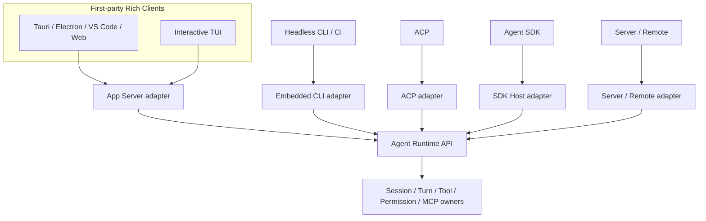
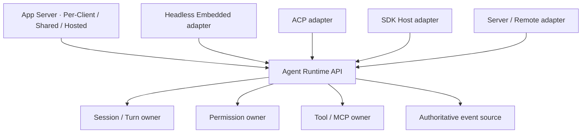
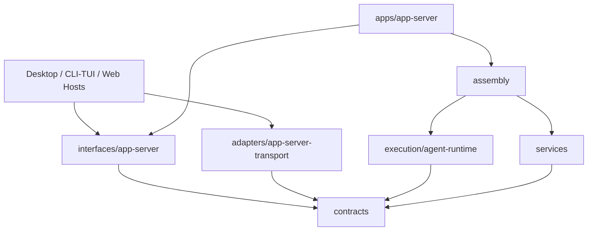
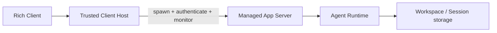
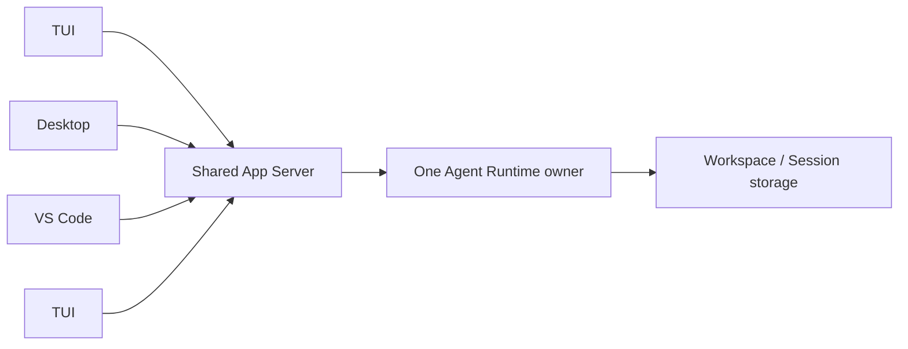
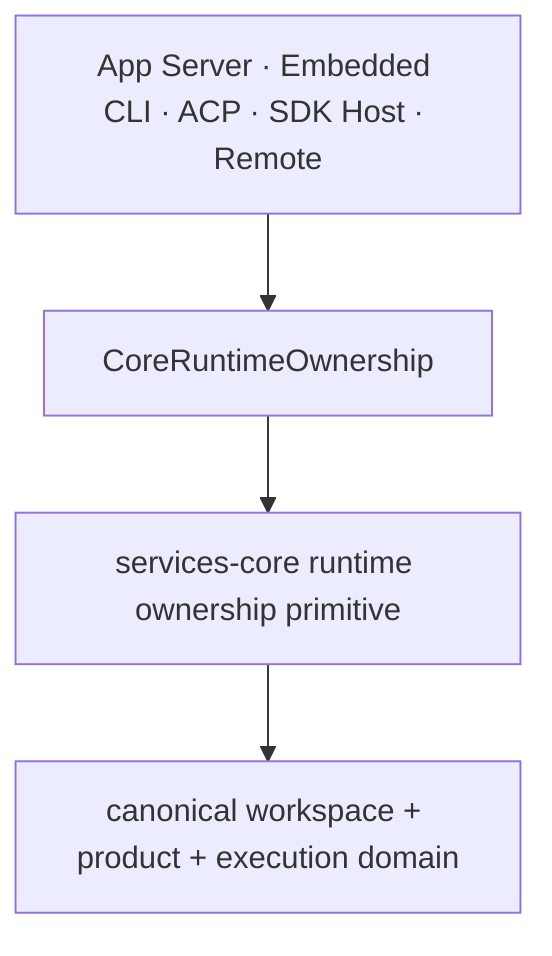

# Agent Runtime 部署与多实例边界

本文定义 Desktop、交互式 TUI、VS Code、Web、Headless CLI、ACP、Agent SDK 与 Remote
并存时，BitFun Agent Runtime 的最终部署、所有权、并发和隔离边界。

Agent Runtime 的模块职责见 [`agent-runtime-services-design.md`](agent-runtime-services-design.md)，
Rich Client 协议见 [`app-server-architecture-design.md`](app-server-architecture-design.md)，公开 SDK 见
[`agent-sdk-product-architecture.md`](agent-sdk-product-architecture.md)，第三方 JS/TS 进程见
[`extensions/plugin-runtime-design.md`](extensions/plugin-runtime-design.md)。

> **目标优先**：本文定义最终架构。当前 `agent-runtime-ipc`、Tauri command 和既有 Server
> WebSocket 只作为迁移来源，不构成长期边界。迁移完成后不得保留第二套 Shared TUI
> server/wire。

## 1. 最终决策

BitFun 只有一套 Agent Runtime 行为。`Embedded`、`Per-Client Managed`、`Shared` 和 `Hosted`
只描述同一 Runtime 的物理部署与安全形态，不是四套业务实现。

最终决策：

1. Tauri、Electron、VS Code、Web 和交互式 TUI 是同一个 Rich Client 协议家族，统一经过
   App Server。
2. App Server 支持本机 **Per-Client Managed**、本机 **Shared** 和服务端 **Hosted**。本机两种模式
   使用同一个 binary；三种形态共享 schema、handler、Runtime API 和行为 conformance suite。
3. `bitfun --shared` 只选择 Shared App Server instance，不选择另一套 TUI server 或 wire。
4. Headless CLI/CI 默认 Embedded，保留确定性启动、退出和故障隔离；它不为界面统一承担
   子进程和序列化成本。
5. ACP、SDK Host 和 Server/Remote 保留独立协议与安全边界，但都映射同一 Runtime API 和
   行为 owner。
6. Client、窗口、workspace、Session 或 plugin 数量都不是默认 Runtime/Plugin Host 进程键。
7. App Server instance 以产品身份、数据命名空间、安全域、release channel、协议兼容范围和
   execution domain 隔离；前端类型不是实例键，也不能在连接后改写实例级产品组装事实。

## 2. 名词与部署模式

| 名词 | 唯一含义 | 不等于 |
|---|---|---|
| Agent Runtime | Session、Turn、Tool/MCP、Permission、Hook、Event 和持久化行为 owner | 进程名、Server 或 SDK |
| Embedded | Runtime 与调用入口位于同一 Rust 进程 | 简化版 Runtime 或公开 wire |
| App Server | Rich Client 的版本化协议 adapter 和可部署 Runtime Host | 领域 owner、公共 SDK 或 Remote API |
| Per-Client Managed | 一个受信 Client Host 管理一个 App Server instance | 进程内 mock 或按窗口复制业务状态 |
| Shared | 多个第一方 Rich Client 连接一个 App Server instance 和 Runtime owner | 第二套 Shared server、公开网络 API 或云同步 |
| Hosted | 服务端安全域中的 App Server、Runtime 与租户数据 | 暴露本机方法超集、回连用户本机 instance 或 Remote control wire |
| SDK Host | 将公开 Agent SDK 合同映射到 Runtime API 的独立 adapter/process | App Server、CLI 或 Shared Runtime |
| Plugin Host | 运行第三方 Node/Bun 插件代码的受监督进程 | Agent Runtime、App Server 或安全沙箱 |

`Host` 表示进程承载关系，不要求普通用户理解或手工管理内部二进制。

## 3. 逻辑和开发视图

### 3.1 单一行为核心

所有部署复用 Runtime API、权威事实和 owner。任何新能力必须先进入既有 owner，再由需要
它的 adapter 映射。禁止在 App Server Shared handler、CLI adapter、SDK Host 或 Remote
route 中复制业务校验和最终状态。

### 3.2 代码依赖

- `interfaces/app-server` 拥有 Rich Client schema、typed client facade、版本和 capability
  negotiation，不拥有 transport 或产品策略；
- `adapters/app-server-transport` 拥有 in-memory、stdio、Named Pipe、UDS 和 WebSocket
  适配，不依赖 Runtime 实现或 `bitfun-core`；
- `apps/app-server` 是独立进程和产品组装根，创建唯一 Runtime owner；
- Desktop、Electron Main、VS Code Extension Host 和 CLI/TUI Host 负责启动或发现 App
  Server，不直接构造 Runtime；
- Headless CLI/CI 使用独立 Embedded composition，但调用相同 Runtime API；
- `agent-runtime-ipc` 的 TUI-only operation/server 不是目标模块。可复用的 endpoint、framing、
  discovery 原语应下沉到 App Server transport，旧 crate 在迁移后删除或改为无协议语义的
  内部 transport 实现。

## 4. 物理部署

### 4.1 部署矩阵

| 入口 | 默认部署 | 可选部署 | 协议 |
|---|---|---|---|
| Tauri / Electron Desktop | Per-Client Managed App Server | Shared App Server | App Server JSON-RPC |
| VS Code Extension | Per-Client Managed App Server | Shared App Server | App Server JSON-RPC |
| Interactive TUI | Per-Client Managed App Server | `--shared` 连接 Shared App Server | App Server JSON-RPC |
| Browser Web UI | authenticated Server-hosted App Server | 受控 Shared | App Server JSON-RPC over WebSocket/HTTPS |
| Headless CLI / CI | Embedded Runtime | 显式控制 Shared Session 时使用 App Server client | Rust Runtime API / App Server client |
| ACP | Embedded ACP composition | 后续按 ACP 产品要求部署 | ACP wire |
| Public Agent SDK | Managed SDK Host | 预启动兼容 SDK Host | SDK Host wire |
| Remote | target-side Runtime Host | 受认证 Remote composition | Server/Remote wire |

Headless CLI 只有在用户明确要求恢复、观察或控制 Shared App Server 中的 Session 时才作为
App Server client；普通一次性执行仍 Embedded。

Browser Web UI 使用服务端 Hosted App Server，不经公网连接用户本机 Managed/Shared instance。Hosted
deployment 复用 App Server schema、handler 和 Runtime API，但使用独立的网络认证、方法 allowlist、租户
隔离、数据与 execution domain；它不是把本机信任模型换成 WebSocket 后直接暴露。

### 4.2 Per-Client Managed

Per-Client Managed 提供客户端与后端进程隔离，但不暗示 App Server 进程按窗口、workspace
或 Session 复制。一个产品 Host 可以服务多个窗口；进程数量由产品生命周期、故障域和实测
容量决定。

### 4.3 Shared

Shared 与 Per-Client Managed 的区别只有：

- Shared 有稳定 instance identity、discovery 和多个认证连接；
- Shared 的 drain 同时考虑 Client、Controller、Observer、活动 Turn、后台任务和 Remote 引用；
- Shared 必须实施连接/请求/事件 budget、公平调度和慢客户端隔离；
- Shared 支持跨 TUI/GUI/IDE 的同一 Session 观察和受控写入。

Shared 不允许增加专用 method、DTO、事件或 handler。若某能力只适合 Shared，应通过
capability negotiation 表达可用性，而不是分叉协议。

### 4.4 产品组装与实例隔离

Per-Client Managed 与 Shared 由 `apps/app-server`，Hosted 由服务端组装根以唯一 App Server Delivery
Profile 创建 Runtime。实例启动时固定产品组装结果、数据命名空间、组织/用户安全域、release channel、
Runtime Configuration 和 capability 上限；Client 握手只能声明前端与 Host capability，不能重选后端
profile、产品策略、持久化根或内置扩展。

因此多个 Tauri、Electron、VS Code 或 TUI Client 可以共享一个兼容实例，而不同产品身份、数据
隔离域、安全策略、release channel 或 execution domain 必须使用不同实例。进程键来自这些状态与
安全事实，不来自 Client 类型、窗口、workspace、Session 或 plugin 数量。

## 5. Runtime ownership 与 Session 单写

### 5.1 Workspace ownership

`CoreRuntimeOwnership` 仍是本机 Runtime deployment 的权威 gate：

规则：

- Per-Client Managed、Shared、Hosted 和 Embedded 都必须取得正确 ownership，不能因协议不同绕过；
- ownership key 由 canonical workspace、product identity 和 execution domain 决定，不按 Client
  名称、窗口、Session 或 endpoint 决定；
- Remote workspace 的 ownership 位于目标 execution host，本机不得静默取得替代 lease；
- list/view 等只读操作可以不取得 mutation ownership，但仍需执行身份和访问控制；
- Shared 与其他可写 Runtime deployment 的互斥由 Core owner 决定，不由 App Server route
  或 discovery 文件冒充。

### 5.2 Session 单写

持久化 Session 的保护粒度是“实际 Session 存储位置 + Session ID”。任何部署中同一 Session
同时只能有一个权威 writer；Observer 可以读取投影，但不能提交 Turn、Permission 或 metadata。

| 操作 | Controller | Observer |
|---|---|---|
| transcript/event view | 是 | 是 |
| submit/cancel Turn | 是 | 否 |
| respond Permission/UserInput | 是 | 否 |
| rename/mode/model update | 是 | 否 |
| transfer control | 发起或接受 | 接受后成为 Controller |

Controller lease 属于 Runtime-aware App Server session attachment，不属于 transport socket。连接
断开、重连或 transport 切换时，只有 Runtime 确认活动副作用已结算后才能释放控制权。

## 6. 连接、并发与可靠性

### 6.1 初始化和认证

- 第一帧完成协议范围、instance identity、client identity、认证和 Host capability 协商；
- 本机 endpoint 使用 Windows Named Pipe 或 Unix Domain Socket，默认拒绝跨用户/远程连接；
- Web 使用独立网络认证、租户/workspace 授权、Origin/CORS 和 method allowlist；
- bearer token、凭据和 ownership key 不进入 URL、日志、renderer、事件或 transcript；
- 未认证连接也计入 connection budget，防止资源耗尽。

### 6.2 有界并发

App Server 必须为以下资源设定可配置且有上限的 budget：

- 总连接和每身份连接数；
- 每连接并发 request 和 reverse request；
- command、response 和 event queue；
- request/response/event frame 大小；
- 每 Session 活动 Turn、pending Permission/UserInput；
- 全局模型调用、Tool/MCP 调用和后台任务。

达到上限时返回类型化 `overloaded`、暂停接收或使慢连接失效，不能创建无界 task、channel
或序列化缓冲。公平调度至少隔离不同 Client 和 Session，不能让一个慢 Observer 阻塞 Runtime
或其他 Controller。

### 6.3 取消和不确定结果

- 请求 deadline 和 Client cancel 映射到 Runtime 既有取消树；
- Client 断开不删除 Session，也不默认终止无关后台任务；
- Controller 断开时请求取消其活动 Turn，只有得到权威结算后才释放 lease；
- 请求发送前失败表示未执行；发送后响应丢失的副作用返回 `outcome_unknown`；
- `outcome_unknown` 不自动重试，Client 重新读取权威状态或使用幂等 operation ID；
- 无法确认取消结果时隔离 Session writer，直到 Runtime 恢复或退出。

### 6.4 事件恢复

- Runtime 提供唯一权威事件源，adapter 只做过滤、投影和脱敏；
- event queue 有界，`Lagged`/`Closed` 是显式失效；
- 首个稳定 Shared 版本必须提供 snapshot + cursor/resume，或明确以 snapshot 后新流恢复；
- 不能把丢失事件伪装成透明成功；Permission/UserInput pending 集合必须可从 Runtime 权威状态重建；
- event identity 在 Per-Client/Shared/Hosted 和 TUI/GUI/IDE/Web 间保持一致。

### 6.5 Runtime-aware drain

App Server 退出不能只按 TCP/socket 连接数决定。Drain 至少考虑：

- 已认证 Client 与重连 grace period；
- Controller/Observer attachments；
- 活动 Turn、Tool/MCP、Permission/UserInput；
- Cron、长期任务和其他后台引用；
- Remote 控制或恢复引用；
- 持久化 flush、Plugin Host 与工具进程回收。

Per-Client Managed 可以在 Host 退出后进入短暂 drain；Shared 使用独立 idle policy。两者最终
调用同一个 Runtime shutdown coordinator。

## 7. Host capability 与 Remote

App Server 通过初始化协商 Host capability。窗口、文件选择、剪贴板、终端、截图和 Computer
Use 等平台操作以 reverse request 发送到当前操作绑定的可信 Host，不按“任意已连接 Client”
广播。

- capability route 绑定 client identity、operation、deadline 和 execution domain；
- Observer 不能通过 Host capability 绕过 Controller 或 Permission owner；
- capability 缺失返回类型化 `unsupported`；
- Remote workspace 的文件、终端、凭据、进程和 Runtime 在目标 host 执行；
- 本机 App Server transport 不自动成为 Remote transport，Remote 复用业务 DTO 但保留认证、
  网络恢复和租户隔离合同。

## 8. 迁移与删除

当前实现只提供迁移证据，不决定最终模块边界：

1. 将 Shared TUI 已验证的 controller lease、认证、framing 上限、断连取消、事件失效、
   `outcome_unknown` 和 cleanup fixture 提升为 App Server conformance tests；
2. App Server 首先完成 Session/Turn/Permission/UserInput 纵向切片，并让 Desktop 和交互式
   TUI 使用同一 typed client；
3. 默认 TUI 连接 Per-Client Managed App Server，`--shared` 连接 Shared App Server；
4. 把真正通用的 Named Pipe/UDS、discovery 和有界 framing 原语迁入
   `app-server-transport`；
5. 删除 `agent-runtime-ipc` 的 TUI-specific operation、handler、server 和协议测试；
6. 删除旧 Tauri 业务 command、私有 WebSocket 信封和重复事件映射前，使用共同 fixture
   证明行为等价并保留有界回滚期；
7. Headless CLI/CI、ACP 和 SDK Host 不在本迁移中绕行 App Server。

迁移结束的删除条件是：仓库内不存在第二套第一方 Rich Client Session/Turn/Permission
wire、第二个 Shared server 入口或按 TUI/GUI 分叉的 App Server handler。

## 9. 验收门槛

最终部署架构至少通过：

1. Tauri、Electron/VS Code 样例和交互式 TUI 使用同一 schema、typed client 和 handler；
2. Per-Client Managed 与 Shared 使用同一行为 fixture，只有 lifecycle/discovery fixture 不同；
3. TUI `--shared` 不引用独立 Shared TUI operation/server；
4. Controller/Observer、control transfer、断连取消和 Session 单写有并发测试；
5. request/event budget、慢 Client 隔离、公平调度和 overload 有压力测试；
6. `outcome_unknown`、幂等 operation、snapshot/cursor 恢复有故障注入测试；
7. Runtime-aware drain 覆盖活动 Turn、后台任务、Remote 引用和进程树回收；
8. 本机认证、Web 认证、Host capability route 和 Remote execution domain 有安全测试；
9. Headless CLI/CI 的 Embedded 启动、退出和性能不因 App Server 迁移退化；
10. 旧 Shared TUI wire、旧 Tauri 业务桥和重复 WebSocket schema 有明确删除证据。

## 10. 不变量

- 只有一套 Agent Runtime 行为 owner；
- 所有第一方 Rich Client，包括交互式 TUI，只使用 App Server wire；
- Per-Client Managed、Shared 与 Hosted 不分叉 schema、handler 或业务语义；Hosted 只增加网络安全、租户和运维约束；
- 不存在长期 Shared TUI server、Shared GUI server 或按前端分叉的 Runtime API；
- Headless CLI/CI 默认 Embedded；ACP、SDK Host 和 Remote 保留独立协议边界；
- App Server、SDK Host、Plugin Host 和 Remote Host 是不同进程职责；
- workspace ownership、Session 单写、权限、取消和审计始终由既有 owner 决定；
- Client、窗口、workspace、Session 或 plugin 数量不自动等量增加 Runtime/Plugin Host；
- Remote workspace 不静默回落本机；
- 未有真实 consumer、失败语义和验证的 method/capability 不进入稳定协议。
