# Agent Runtime 部署与多实例边界

本文定义 Desktop、TUI、Headless CLI、Agent SDK 与本机控制端并存时，BitFun Agent Runtime 的部署、所有权和隔离边界。

Agent Runtime 的模块职责见 [`agent-runtime-services-design.md`](agent-runtime-services-design.md)，公开 SDK 见
[`agent-sdk-product-architecture.md`](agent-sdk-product-architecture.md)，第三方 JS/TS 进程见
[`extensions/plugin-runtime-design.md`](extensions/plugin-runtime-design.md)。Rich Client 的 App Server 协议、Embedded/Shared Host
和 transport 提案见 [`app-server-architecture.md`](app-server-architecture.md)。该提案通过架构评审前，当前部署和调用路径以本文及
已接线代码为准。

## 1. 决策与当前状态

BitFun 只有一套 Agent Runtime 行为。`Embedded` 和 `Shared` 只描述同一套 Runtime 的物理部署方式，不是两套实现。

### 1.1 Current request paths

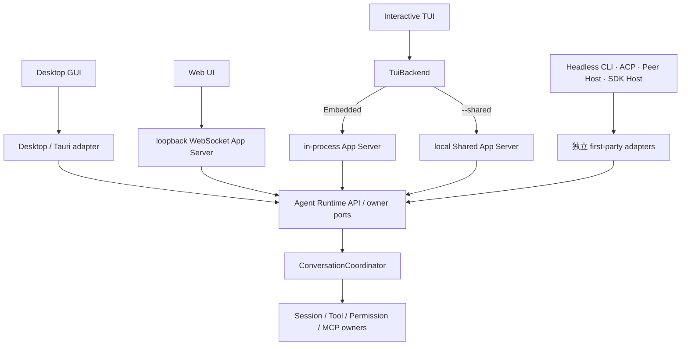

Server bootstrap 是 composition root，不是客户端请求的第二条 Runtime 旁路：

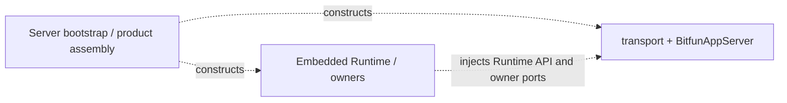

两张图中的实线表示当前业务请求，虚线只表示启动期构造与依赖注入。

### 1.2 Proposed Rich Client target

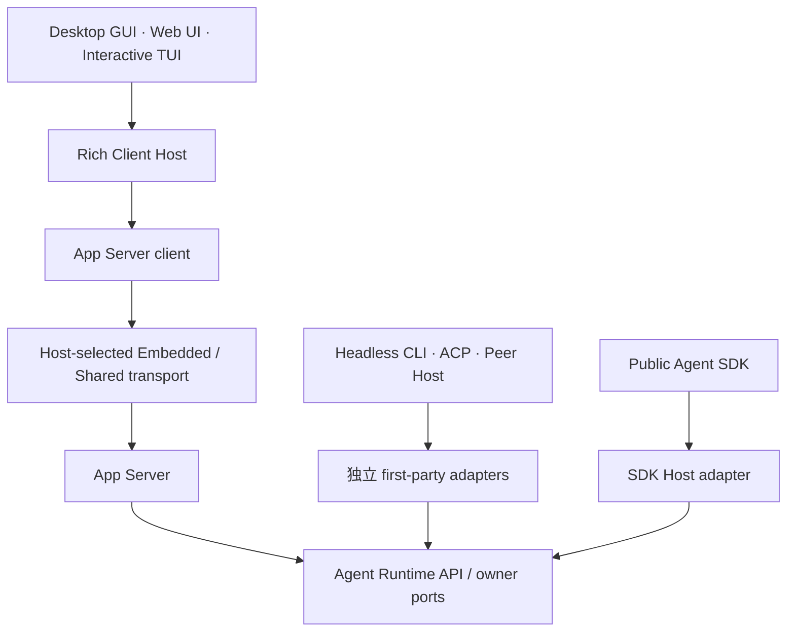

该图对 Shared TUI 已是当前调用链；Desktop 迁移仍是待评审目标。Shared App Server 的跨连接恢复、取消、未知结果、慢客户端治理、性能和安全合同仍需继续收敛。

### 1.3 Current implementation facts

| 范围 | 当前状态 |
|---|---|
| Embedded Desktop GUI | 继续使用 Desktop 事件投影和 Tauri adapter；按实际打开的本机 workspace 延迟取得并持有 Embedded ownership，不增加后台进程；目标迁入同进程私有 App Server |
| Embedded interactive TUI | 已组装同进程私有 App Server，通过 in-memory transport、`AppServerClient` 和 `AppServerTuiBackend` 完成当前核心聊天、Session 与 Phase 3/4 管理面路径 |
| Embedded Headless CLI/Peer Host | 保留各自独立 Runtime adapter、展示和断流策略；不因交互式 TUI 迁移而强制使用 App Server |
| ACP/SDK Host | 使用同一个 Runtime 事件入口的 session-scoped 订阅；各自协议和进程生命周期保持独立 |
| Runtime ownership | Desktop、CLI、ACP、SDK Host 和现有 Server agent bootstrap 共用 Core owner；Embedded 取得共享锁，Shared TUI 取得独占锁，同一 workspace 上两种 deployment 互斥 |
| Session 写入 | BitFun Runtime 的持久化 Session 由 `SessionManager` 管理；同一存储位置中的同一 Session 同时只允许一个本机进程写入，list/view 等只读操作不受影响 |
| 当前 HTTP Server | 已组装 Embedded Runtime 和 `BitfunAppServer`，每个 `/ws` 连接通过 WebSocket transport 运行一条 App Server connection；当前固定 loopback、单用户且缺少连接级身份与作用域绑定，不构成远程或多用户 Server API |
| Shared App Server | `bitfun --shared` / `bitfun chat --shared` 按 workspace 启动或连接一个本机 Host 和 Runtime owner；loopback TCP 使用随机 token、canonical identity、实例锁、128 KiB request / 8 MiB response-event 上限、最多 64 连接和 30 秒空闲退出 |
| Shared TUI | 复用正式 `AppServerClient`、`AppServerTuiBackend` 和完整本机 `AppManagementService`；连接显式订阅 Session，多个客户端可同时订阅、观察、steer 或按精确 Turn ID cancel 同一 Session，独立 Turn 由唯一 Runtime owner 串行准入 |
| Shared GUI/Headless/ACP/SDK Host/Remote | 未交付，也不会由 `--shared` 隐式启用；跨连接持久 replay、透明 resume、通用未知结果恢复和完整慢客户端治理同样尚未交付 |

因此当前交付的是 Embedded TUI App Server 和显式启用的 Shared TUI App Server deployment，不是通用本机 Server。
具体 `EventQueue` 仍由 Core 产品装配；Shared Host 把正式 App Server 的强类型操作和事件映射到同一个 Runtime owner，没有公开或远程协议承诺。

Shared TUI 采用无 controller lease 的多客户端模型：多个连接可订阅并操作同一 Session，`steer` / `cancel` 携带精确 Turn ID；独立 Turn 仍由唯一 Runtime owner 的 Session scheduler 串行准入。客户端并发发送请求不会产生两个 Session writer，也不会允许两个独立 Turn 同时改写同一 Session 历史。

## 2. 最少名词

| 名词 | 唯一含义 | 不等于 |
|---|---|---|
| Agent Runtime | 负责 Session、Turn、Tool、MCP、Permission、Hook、事件和持久化行为的既有模块 | 进程名、Server 或 SDK |
| Embedded deployment | Runtime 与调用入口位于同一 Rust 进程 | 简化版 Runtime |
| Shared deployment | 同一 Runtime 由一个本机进程承载，多个第一方 Client 通过受控本机 App Server transport 使用 | 新 Runtime、公开 Server 或 Agent SDK |
| Embedded App Server | 与 Rich Client Host 同进程的私有 App Server 实例和 in-memory transport | Runtime 直连、后台进程或网络 Server |
| Shared App Server | 独立本机 Host 承载、由多个已认证 Rich Client 通过受控 transport 使用的 App Server | 公网 API 或每个 Client 一个 Runtime |
| Agent SDK Host | 将公开 SDK 合同映射到 Runtime API 的私有进程/adapter | CLI、Shared deployment 或 Plugin Host |
| Plugin Host | 运行 Node/Bun 和第三方插件代码的受监督子进程 | Agent Runtime 或 Rust IPC client |

`Host` 只表示“一个进程承载某些模块”的内部关系，不新增普通用户必须理解或管理的产品入口。

## 3. Logical View · Level 1

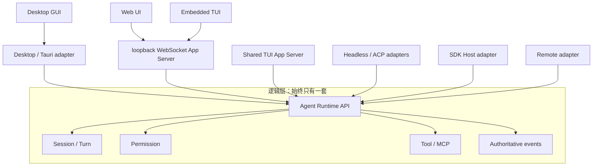

当前复用的是 Runtime API、权威事实和 owner；Web、Embedded TUI 与 Shared TUI 额外复用 App Server wire，Desktop
仍使用自己的 adapter。第 1.2 节目标只有通过评审并完成迁移后才扩大到 Desktop。各入口不复用 renderer、CLI 参数、SDK
wire、远程认证或平台窗口生命周期。任何新能力必须先进入既有 Runtime owner，再由 App Server 或需要它的独立 adapter 映射，禁止
在 Embedded、Shared 或其他入口复制业务实现。

### 3.1 Embedded 事件交付

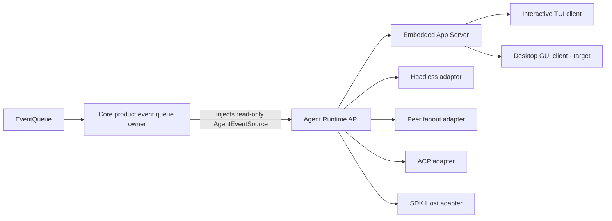

- Core product assembly 创建事件 source，并维持旧消费队列的排空 task；第一方产品入口不再获得第二个订阅 API。
- App Server server 从注入的 `AgentEventSource` 转发 Rich Client 权威事件；Rich Client 不得从 `AgentRuntime` 或 Core `EventQueue` 旁路订阅。
- Headless CLI、Peer Host、ACP 和 SDK Host 从各自独立 Runtime adapter 订阅，不能直接持有 Core-specific event source。
- `bitfun-core` 的旧 event-source/builder API 仅保留为 deprecated 源码兼容 facade；它们委托给同一个 Core owner，不形成第二套运行时或第一方调用路径。
- 各 adapter 继续拥有自己的失败投影：TUI 标记当前视图不可信，Headless CLI 返回非成功终态，Peer Host 中断其拥有的 turns，ACP 取消 turn 并返回协议错误，SDK Host 终结 Query 并提供 `RestartHost` recovery。
- 当前 App Server 为每条 connection/stream 发送单调 sequence 和 connection-local cursor；`app/syncEvents` 返回当前连接的 cursor
  与 pending Permission snapshot，`session/sync` 恢复 Session state、transcript、workspace binding 和 pending Permission。它没有跨连接
  持久化 replay/resume：重连后的旧 cursor 不能继续消费，client 必须重新 initialize 并执行权威 sync。
- Shared TUI 复用同一 App Server cursor 与 `session/sync` 合同，但 cursor 仍是 connection-local；重连后的旧 cursor 不能透明续用，client 必须重新 initialize、subscribe 并执行权威 sync。任何路径都不能把流失效伪装成透明恢复。
- Embedded Rich Client 使用 private in-memory transport，不增加后台进程；只有显式 `--shared` 启动或复用本机 Shared Host。

## 4. Process View · Level 1

### 4.1 Runtime ownership

ownership 分成“产品决策”和“文件锁原语”两层；入口不再各自拼 key、目录或锁模式：

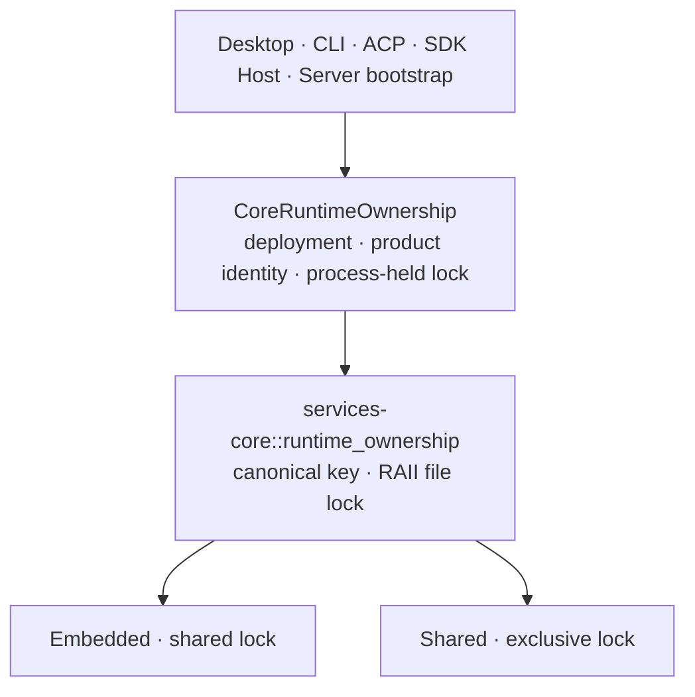

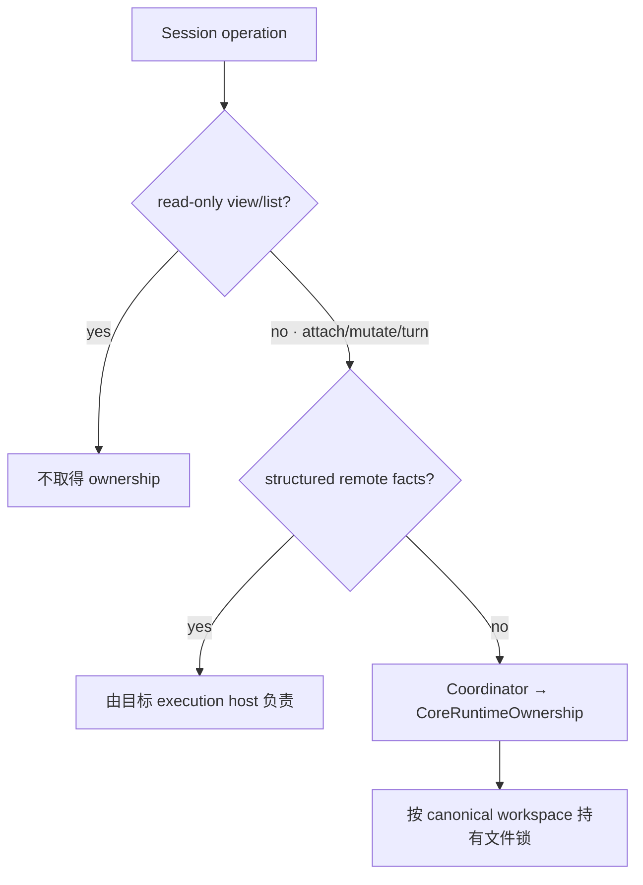

| 场景 | 行为 | 原因 |
|---|---|---|
| 多个 Embedded 进程访问同一 workspace | 共享锁允许并存 | 保持单实例、CI 和隔离测试的既有成本模型 |
| Shared 与任一 Embedded 访问同一 workspace | 后启动者返回稳定错误码和启动建议 | 防止同一 workspace 同时存在两种 Runtime deployment |
| Desktop 打开多个 workspace | 首次 attach/write 时逐个取得并持有文件锁 | 不把窗口数、Session 数等同于 Runtime 进程数 |
| 只读 list/view | 不加锁 | ownership 只管理 Runtime deployment，不扩大成读取权限 |
| 已解析且带有效 `connection_id` 的 remote workspace | 本机不加锁 | 与 Session storage 的远端判据一致；`host` 提示本身不能绕过本地锁 |
| 当前 loopback HTTP Server | 通过 server bootstrap 创建 Embedded Core owner | 只覆盖 Server Host 实际打开的本机 workspace；不因存在 WebSocket route 扩大为远程或多用户 ownership |

`CoreRuntimeOwnership` 只选择 deployment、产品 identity 并在进程存活期间持有锁；`services-core` 只负责 canonical key 和跨进程锁。二者都不选择 workspace、不启动 Runtime，也不替代 Session 单写、数据库事务、文件冲突控制或安全沙箱。

### 4.2 Session 单写

workspace 可以被多个 Embedded 进程同时打开，但持久化 Session 不能被多个进程同时写入。保护粒度是“实际 Session 存储位置 + Session ID”，不是窗口、TUI 实例或 workspace。

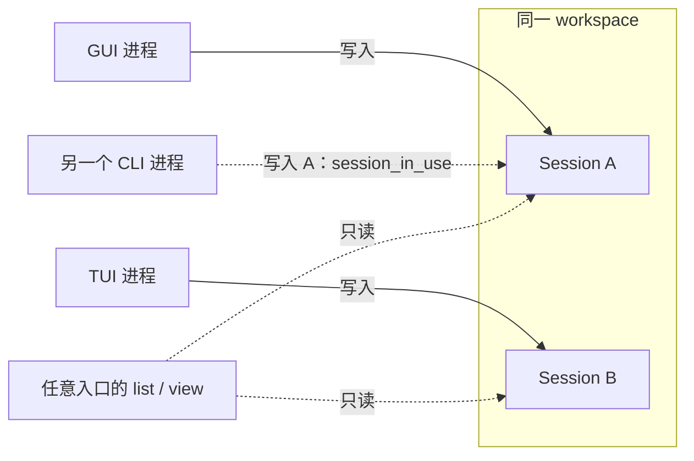

BitFun Runtime Session 只有 `SessionManager` 决定何时开始和结束写入；底层持久化方法复用同一文件锁，不再实现第二套判断。各产品入口只投影同一个 `session_in_use` 事实，不重新判断锁状态：

| 入口 | 冲突呈现 | 恢复方式 |
|---|---|---|
| Agent SDK / BitFun ACP | 结构化 `session_in_use`；SDK Host 映射为可重试的 `action_required` | 调用方在原实例关闭 Session 后重试 |
| Embedded / Shared TUI | 明确提示 Session 已在另一实例打开；切换失败时保留当前 Session | 用户关闭另一实例后再次选择；不自动等待或切换 |
| Desktop / Peer GUI | 历史视图保持只读可见；首次写入显示持久提示和显式“重试”操作 | 用户关闭另一实例后点击重试；不自动提交消息 |
| Headless `json` | 失败结果带 `error_code=session_in_use`，详细说明进入结果和 stderr | 调用方依据稳定码决定是否重试 |
| Headless `stream-json` | 复用已有 `SystemError`，`error=session_in_use`、`recoverable=true` | 调用方结束本次非零退出后重新执行 |

Desktop 作为 ACP client 管理的外部 agent Session 不经过该 Runtime owner，不在本节的 Session 单写范围内。`recoverable` 只表示关闭现有 writer 后可以重新调用，不表示自动等待、自动抢占或恢复当前调用。

| 场景 | 行为 |
|---|---|
| 同一进程重复 restore 同一 Session | 返回已加载的 Session，不重复取得或释放写入权 |
| 另一个进程打开同一存储位置中的同一 Session | 立即返回 `session_in_use`；不等待、不自动抢占 |
| 多个进程打开同一 workspace 中的不同 Session | 允许，各 Session 独立写入 |
| 多个进程更新同一 Session 列表索引 | 按存储位置串行更新共享索引，不影响不同 Session 文件并行写入 |
| `.`、`..`、符号链接或 Windows 路径大小写指向同一存储位置 | 视为同一个 Session 存储位置 |
| 相同 Session ID 位于不同存储位置 | 文件锁相互独立；同一 `SessionManager` 仍按 Session ID 保持唯一绑定，不能同时加载 |
| Session 存储路径无法解析或错误地指向文件系统根目录 | 在发布内存状态前返回错误，不创建可写 Session |
| create/restore 在发布到内存前失败、取消或超时 | 临时文件锁随操作释放；后续进程可以重试 |
| save、cleanup 或 unload 失败 | 已加载 Session 继续持有写入权，避免另一个进程接手不完整状态 |
| unload 或 delete 成功 | 释放写入权 |
| 进程崩溃或被强制结束 | 操作系统释放文件锁；残留锁文件本身不代表 Session 仍在使用 |
| Remote workspace | 在实际 Session 存储所在机器执行同一检查；控制端不得用本机路径替代 |

该机制不增加后台进程、轮询、连接或常驻线程，也不改变 Shared TUI 的连接控制规则。临时 Session 不写入磁盘，因此不参与此检查。

### 4.3 Shared App Server 本机 transport

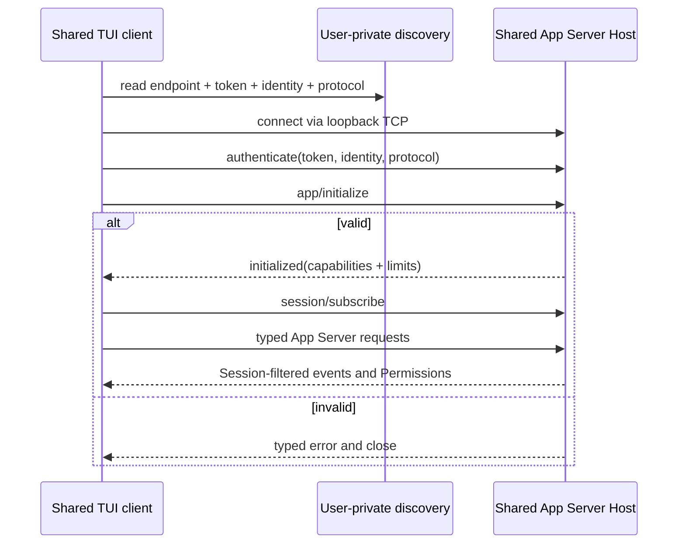

Shared TUI 使用与 Embedded TUI 相同的 App Server method、DTO、错误和事件合同。区别只在 Host 和 transport：

- canonical workspace 与产品 identity 生成实例 key；instance lock 而不是 PID 或 discovery 文件决定唯一 Host owner；
- discovery 位于当前用户私有目录，通过同目录临时文件原子替换，并携带 loopback endpoint、随机 bearer token、owner id 和协议版本；
- 认证预算为 2 秒，失败、错误身份和不兼容版本均 fail closed；
- request 上限为 128 KiB，response/event 上限为 8 MiB；未知字段、无效 JSON 和超限 frame 在 transport 边界拒绝；
- Host 最多接受 64 条连接；每条连接运行独立 App Server connection，并显式 subscribe/unsubscribe Session；
- 事件和 Permission 按连接的 Session subscription 过滤，多个连接可以同时订阅、观察和操作同一 Session；
- 不使用 controller lease。独立 Turn 由唯一 Runtime owner 的 Session scheduler 串行准入，steer/cancel 必须携带精确 Turn ID；
- Host 通过 `AppManagementService::load_for_local_host` 装配本机管理能力，不在 TUI controller 中复制 Model、Skill、Subagent、MCP、Hook、Account 或 Worktree owner；
- Windows Host 在初始化前进入 kill-on-close Job；Unix 通过受管进程组执行应用内优雅回收。这是生命周期机制，不是安全沙箱；
- 最后一条连接离开 30 秒后退出，新连接会取消空闲退出；cleanup 只删除当前 owner 发布的 discovery。

当前 connection-local cursor、`app/syncEvents` 和 `session/sync` 可以在同一连接内恢复权威状态，但尚未提供跨连接持久 replay 或透明 resume。断连后的副作用请求也没有通用 `outcome_unknown` 查询/恢复合同，慢客户端治理仍不完整；客户端不得盲目重试无法确认结果的操作。这是一条本机同用户边界，不是 Remote、Peer、SDK、浏览器或公网兼容承诺。

### 4.4 Serialization、并发与性能

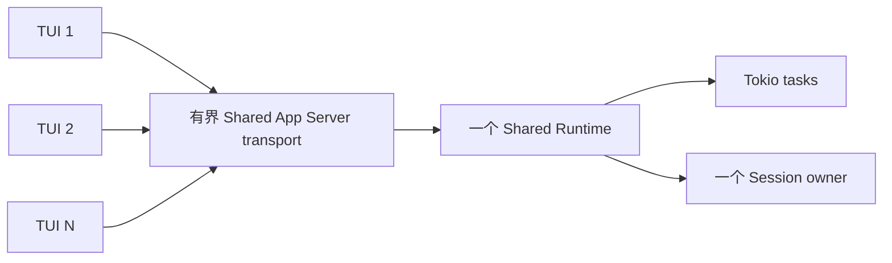

多个 Shared TUI 复用一个 Runtime 进程。每个连接使用独立异步任务，但连接、命令队列和事件队列都有上限；达到连接上限时暂停接收新连接，慢客户端不能建立无界任务或队列。默认不增加 Runtime 进程池，因为复制 Session 状态、模型连接和缓存会扩大一致性成本。只有经测量证明某类无状态 CPU 工作可独立分片时，才评审额外 worker 进程。

| 路径 | 数据边界 | 性能约束 |
|---|---|---|
| Embedded Rich Client | `AppServerClient` 通过 private in-memory transport 调用同进程 App Server | 不初始化跨进程 IPC 或后台进程；保持与 Shared 相同的 JSON-RPC、DTO、错误和事件语义，编解码成本通过测量优化而不增加直连旁路 |
| Embedded non-Rich Client | Headless、ACP、Peer 和 SDK Host 的独立 adapter 以 Rust 类型调用 Runtime API | 不因 Rich Client 合同承担 App Server wire；保持各自协议和生命周期 |
| Shared request | Client 将一行认证或 App Server JSON-RPC request 编码一次 | 请求保持 128 KiB 上限；认证完成后只接收正式 App Server method |
| Shared response/event | Host 将 App Server response 或 notification 编码一次后写出 | 响应/事件保持 8 MiB 上限；超限关闭该连接，不能无界分配 |
| Shared receive | 每个方向只有一个严格 line-codec decode 边界 | 未知认证字段、不兼容版本和无效 JSON fail closed；动态 JSON 只进入 App Server protocol decoder，不传入 Runtime owner |
| 多 TUI | 一个 Runtime、最多 64 个连接；每条连接有独立 App Server task 和有界 event stream | 多连接可订阅同一 Session；Runtime owner 串行准入独立 Turn，慢 client 不能制造无界连接或 frame，但完整背压治理仍待补齐 |

协议只承载当前交互所需的小型控制请求、受 3 MiB 文本上限保护的 workspace diff 快照和既有事件。大 transcript 继续受 frame 上限约束；本阶段不为假设场景增加通用分页、二进制 side channel、压缩或批处理协议。

## 5. Development and Physical Views · Level 1

### 5.1 Development View

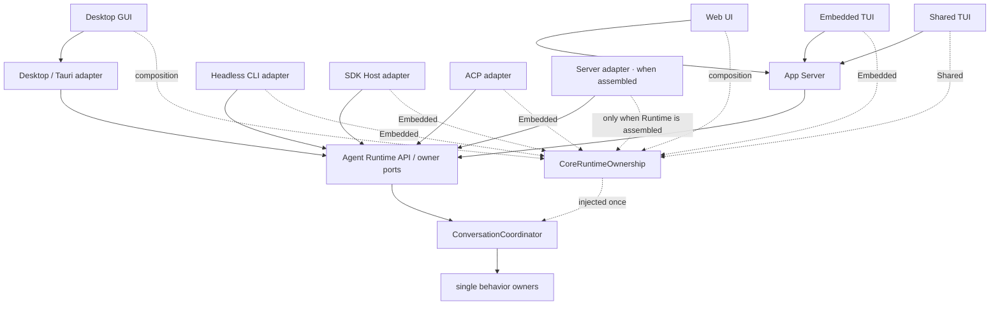

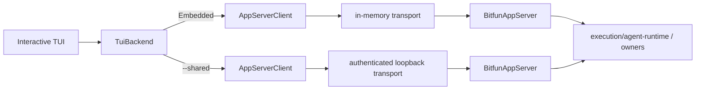

CLI Host 负责命令解析、TUI 状态、错误文案、App Server 组装和 transport 生命周期。Embedded 与 Shared 都通过 `AppServerTuiBackend`；Agent Runtime 与 owner 负责 Session 校验、持久化和权威结果。TUI 业务代码不根据部署形态复制业务分支。

- CLI 不依赖 SDK Host，GUI/TUI 也不依赖公开 SDK package。
- 交互式 TUI 的启动页和会话页复用 app-local `TuiBackend`；Embedded 与 Shared backend 都使用正式 `AppServerClient`。TUI 不直接依赖 Rust Runtime SDK、Core/Service owner 或 Host transport 实现。
- Headless CLI 和 Peer Host 使用同一 Runtime 订阅入口，但分别保留确定性退出与 Peer fanout 语义；共享订阅入口不等于共享 renderer 或产品生命周期。
- TUI 不是 Server；Embedded Host 在同进程组装私有 App Server，是否连接 Shared deployment 是部署选择，不改变 TUI 的 renderer/键位职责或 App Server 行为合同。
- Agent SDK Host 只服务外部 SDK 合同，不成为第一方 rich-client 的通用底座。
- Headless CLI 默认继续 Embedded；CI 或测试可保持独立进程和独立 workspace，不承担后台实例成本。
- Tauri 仍负责窗口和桌面能力，并逐步收窄为 App Server Host adapter；未来它可以管理 Shared process 的启动/重连，但不拥有 Agent Runtime 业务生命周期。

### 5.2 Physical View

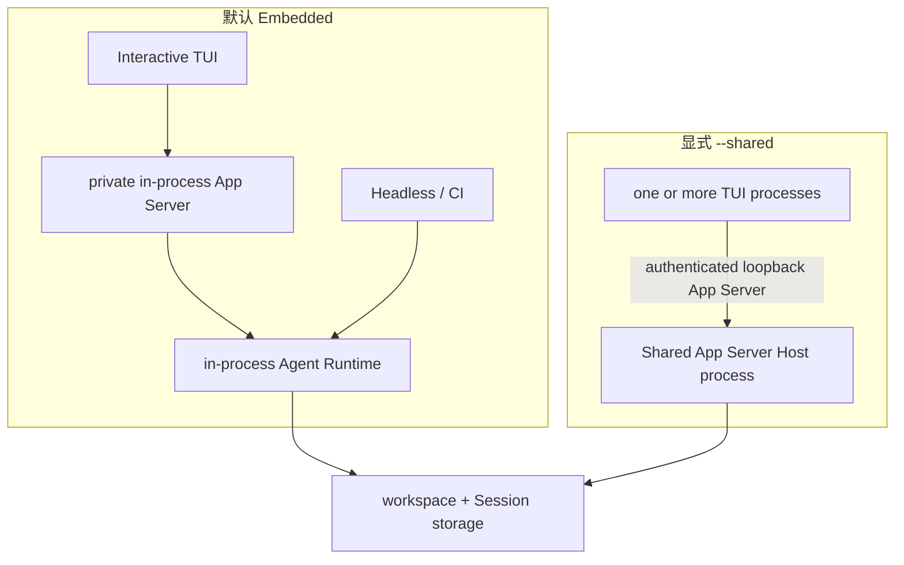

默认交互式 TUI、Headless CLI 和 CI 保持 Embedded；交互式 TUI 通过 private in-process App Server，Headless/CI 保留独立 adapter。
只有显式 `--shared` 的交互式 TUI 进入 Shared；同一 workspace 的两种部署互斥。多开 TUI 增加 Client 进程和有界连接，
不按 Client 数量复制 Runtime、Session owner 或 Plugin Host。

### 5.3 Scenario (+1) · Rename current Session

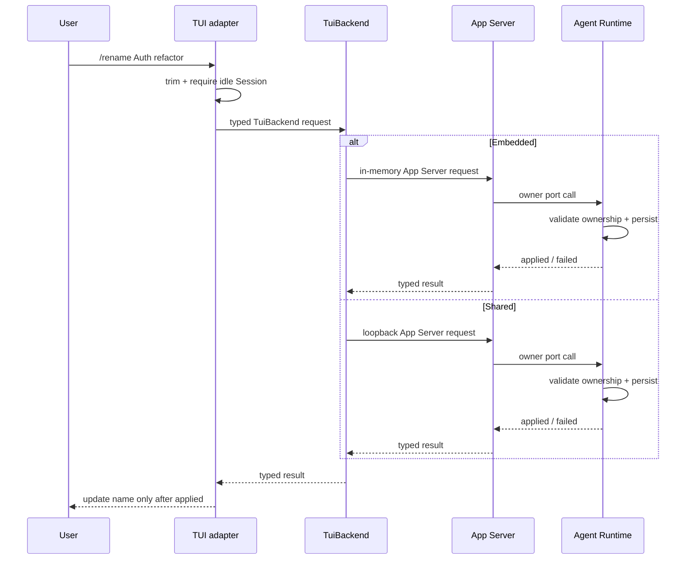

Embedded 和 Shared 最终调用同一 `AgentRuntime::rename_session`。Shared transport 断连后尚无通用未知结果查询，因此客户端不得盲目重试；用户重新同步 Session、检查当前名称后再决定是否再次提交。

### 5.4 Scenario (+1) · Delete an idle Session

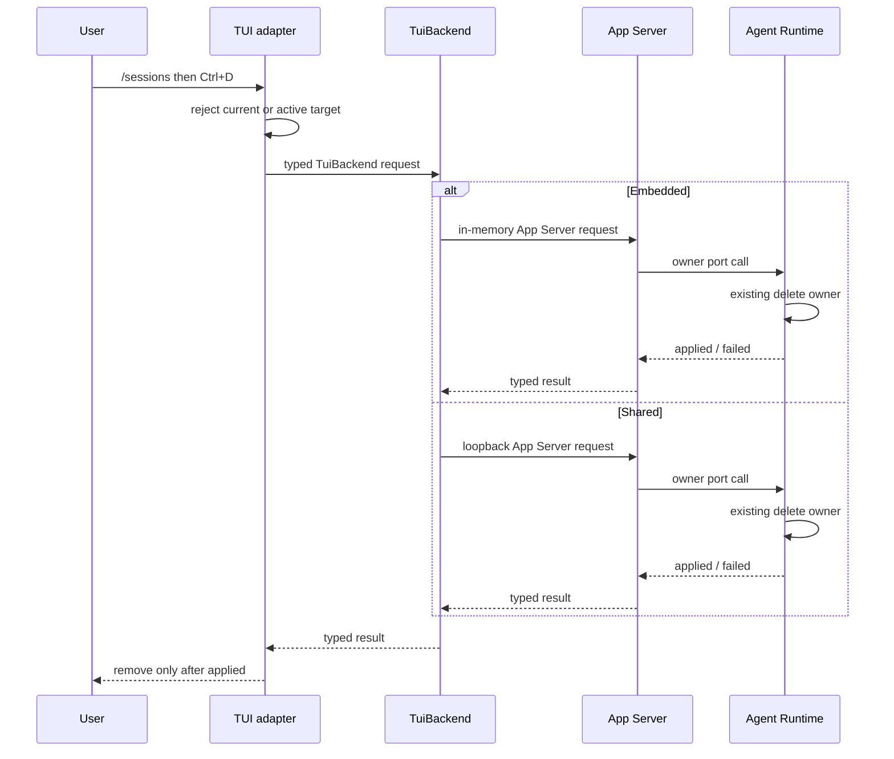

Embedded 和 Shared 最终调用同一个 Agent Runtime。Shared App Server Host 通过同一 typed handler 调用 Runtime owner；`session_in_use` 和 `not_found` 保持结构化错误。TUI 复用现有单个 Session 异步任务槽位，不阻塞事件循环，也不自动重试结果不确定的删除。

## 6. 隔离和生命周期原则

实例身份与 ownership key 分工不同：

| 事实 | 用途 |
|---|---|
| canonical workspace + product | 防止 Embedded 与 Shared 同时拥有同一工作区 Runtime |
| canonical workspace + product identity | 定位兼容的本机 Shared instance，并与 Runtime ownership 使用同一 identity 事实源 |
| stable local endpoint + bearer token + owner id | endpoint 定位同一 instance；随机 token 认证本轮 server；owner id 防止旧实例误删新 discovery |
| 实际 Session 存储位置 + Session ID | 限制持久化 Session 的跨进程并发写入；不由 App Server 协议定义 |

当前 Shared TUI 没有 controller lease。多个 Client 可以订阅、观察和操作同一 Session；一个 Client 关闭不会删除 Session，也不会转移或释放独占控制权，因为独立 Turn 的单写由 Runtime owner 按 Session 串行准入。最后一个 Client 关闭后，Host 进入 30 秒空闲期；期间重连可继续使用，超时后正常关闭。若未来增加后台任务或 Remote 引用，必须先扩展 Runtime-aware drain，不能把这些引用塞进当前简单连接计数。

对普通单实例用户，未显式启用 Shared deployment 时不增加后台进程、连接、发现扫描或常驻内存。

## 7. 能力扩展原则

未来每增加一类 Shared 能力，都必须同时满足：

1. 已有明确第一方 consumer 和用户旅程；
2. 行为由现有 Runtime owner 提供，App Server 只映射 typed request/result/event；
3. 定义权限、取消、deadline、断线、背压和副作用结果不确定性；
4. Embedded 与 Shared 使用同一行为 fixture；
5. 新能力不被顺带发布为 Agent SDK、Remote 或浏览器 API。

Session/Turn、事件恢复、Permission/UserInput、配置管理和 Remote 应分别通过上述门槛，不能一次性加入一个“全量 Shared API”。

当前 Shared App Server transport 是本机第一方产品边界：

| 约束 | 当前决定 |
|---|---|
| 当前 consumer | 仅第一方交互式 TUI；不自动包含 GUI、Headless CLI、Remote、Peer、ACP 或 SDK Host |
| 稳定测试合同 | loopback endpoint、token + identity 认证、initialize-first、128 KiB request / 8 MiB response-event 上限、连接上限、owner-checked cleanup、连接级 Session subscription、Runtime Turn 串行准入和 30 秒空闲退出 |
| 当前业务范围 | 正式 App Server handler 暴露的 TUI Session、Turn、Permission、Workspace 和本机 management 用例；Host 只能发布真实装配的 capability |
| 协议地位 | workspace 内第一方本机 transport，不是 Agent SDK、Remote、Peer 或浏览器兼容承诺 |

架构守卫要求 TUI controller 只依赖 `TuiBackend`，Shared Host 通过正式 App Server protocol/client/server crate 接线；controller 不得依赖 Host transport、Runtime 实现或服务 owner。

## 8. 与竞品的取舍

| 产品 | 已验证做法 | BitFun 采用 | 不照搬 |
|---|---|---|---|
| [OpenCode Server/SDK](https://opencode.ai/docs/server/) | Server-first；类型化 SDK 直接消费 Server API | 一个 Runtime owner 可以服务多个第一方 Client | 不要求 Rich Client 使用 HTTP/OpenAPI，也不把全量 route 固化为私有 Shared wire |
| [Codex App Server](https://developers.openai.com/codex/app-server/) | App Server 为 rich client 和 remote TUI 提供 JSON-RPC；自动化继续使用 SDK；WebSocket transport 仍是实验性接口 | Rich Client 使用 App Server，自动化/公开 SDK 保持独立，并为 Shared 入口保留有界本机 transport | 不复制其完整 schema，也不把实验性远程 transport 当作已交付公网 API |
| [Claude Agent SDK](https://code.claude.com/docs/en/agent-sdk/typescript) | Agent loop 由长期运行的 CLI 子进程承载，并提供 `startup()` 预热以减少首次请求成本 | 长期 Shared 交互可以复用已启动进程，空闲后回收 | Embedded Rich Client 不增加子进程，多 TUI 也不映射为多个 Runtime |

三种产品说明了不同部署的有效边界：稳定 Rich Client 合同可以同时承载进程内和多客户端 transport，长期子进程适合 Shared
交互或语言 SDK，独立强类型 adapter 适合 Headless/ACP 等非 Rich Client。BitFun 采用混合部署，不把 App Server 强制成所有入口的
公共底座；当前也没有为了追赶功能表一次性增加 Session/Tool/Permission 超集。

## 9. 不变量

- 只有一套 Agent Runtime 业务实现；部署差异不能产生第二套 Session、Tool、Permission 或 MCP owner。
- 当前入口使用第 1.1 节列出的 adapter；若第 1.2 节目标通过评审并迁移完成，Desktop GUI、Web UI 和交互式 TUI 才统一使用 App Server。
- Client、窗口、Session 或 workspace 数量不会自动等量增加 Runtime 或 Plugin Host 进程。
- 当前 Shared App Server transport 只服务第一方 TUI，不成为公开 SDK、Remote、Peer、HTTP 或浏览器协议。
- Shared TUI 的 Model、Skill、Subagent、MCP、External Source、Hook、Account、Settings Sync 和 Worktree 管理由 Shared Host 显式装配的本机 App Server `AppManagementService` 承接。Host 端 owner 负责真实状态，TUI controller 不执行本机 fallback；Remote workspace 仍需独立的目标执行域 Host contract。
- 默认 GUI/TUI/Headless CLI、ACP 与 SDK Host 保持 Embedded；只有交互式 TUI 的显式 `--shared` 选择 Shared。互斥按 `workspace + product` 生效，不再按入口名称缩窄。
- Account/session cloud sync 仍使用既有 Core compatibility 边界，不属于 Shared Runtime 支持。
- Remote workspace 的文件、凭据、进程和 Runtime 位于目标执行域，禁止静默回落本机。
- 未经真实 consumer 验证的接口不进入 wire；当前 wire 只包含表中列出的 Shared TUI 操作。
