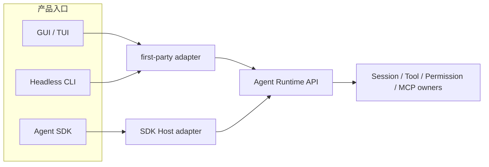
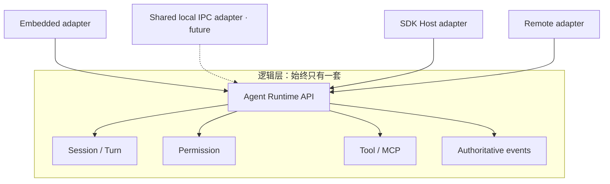
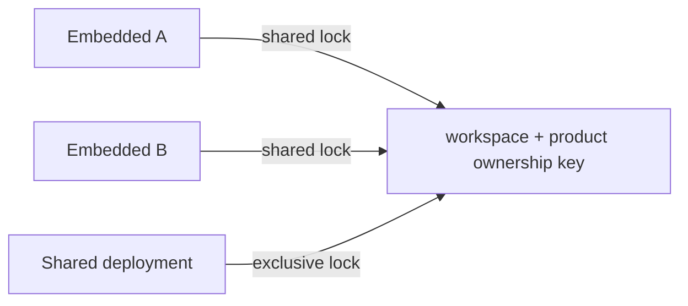
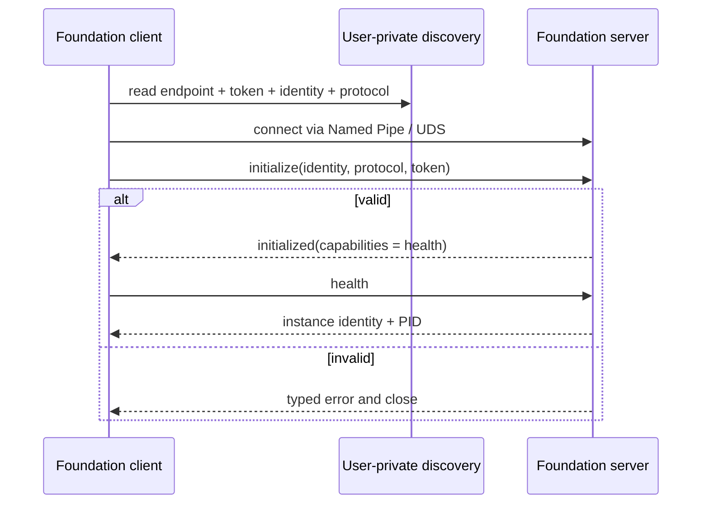
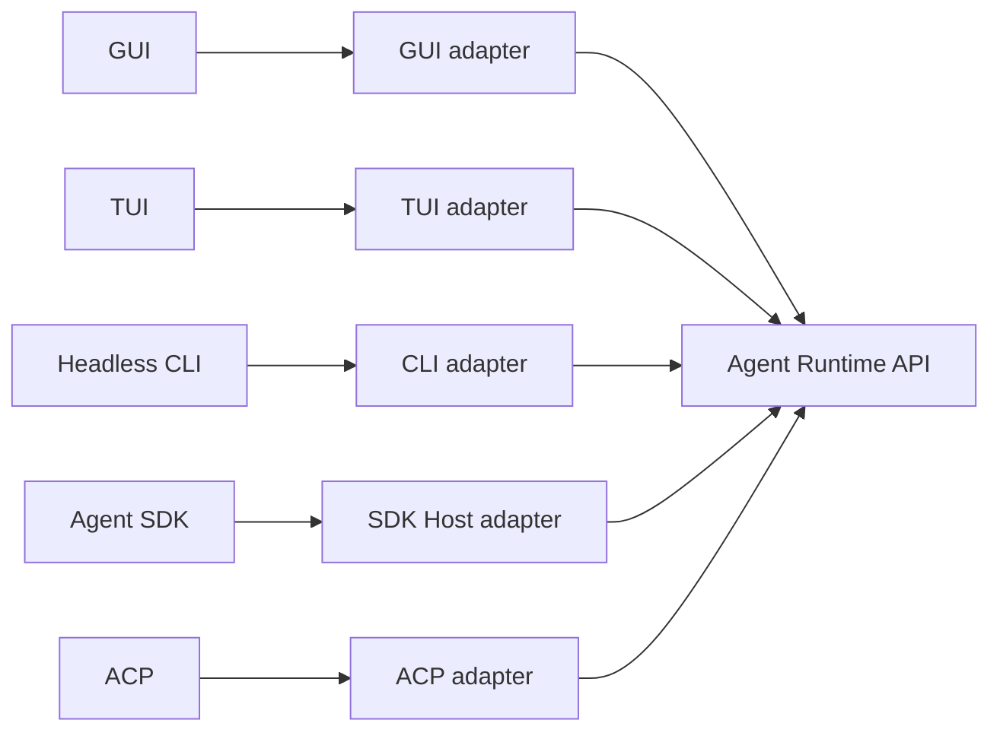

# Agent Runtime 部署与多实例边界

本文定义 Desktop、TUI、Headless CLI、Agent SDK 与本机控制端并存时，BitFun Agent Runtime 的部署、所有权和隔离边界。

Agent Runtime 的模块职责见 [`agent-runtime-services-design.md`](agent-runtime-services-design.md)，公开 SDK 见
[`agent-sdk-product-architecture.md`](agent-sdk-product-architecture.md)，第三方 JS/TS 进程见
[`extensions/plugin-runtime-design.md`](extensions/plugin-runtime-design.md)。

## 1. 决策与当前状态

BitFun 只有一套 Agent Runtime 行为。`Embedded` 和 `Shared` 只描述同一套 Runtime 的物理部署方式，不是两套实现。

当前代码状态必须和目标设计分开阅读：

| 范围 | 当前状态 |
|---|---|
| Embedded GUI/Headless CLI/ACP/SDK Host | 保持现状；本设计没有改变其依赖或生命周期 |
| Embedded interactive TUI | CLI crate 私有的 `CliAgentRuntimeClient` 统一暴露 Session、Turn、Permission 和事件访问；前三者使用 Rust Runtime SDK（当前 preview），事件继续复用既有 CLI event source；仍在当前 CLI 进程内运行 |
| Runtime ownership | 已有可选的 Embedded 共享锁 / Shared 独占锁原语；尚未接入产品入口 |
| Shared local IPC | 已有未发布、仅 crate 内可见的 discovery、实例锁、严格握手、Health 和 cleanup 基础；尚无生产 consumer |
| Shared Session/Turn/Tool/Permission | 尚未设计为稳定 wire，也没有产品 consumer |
| Shared GUI/TUI/Remote | 尚未交付，没有 `--shared` 或隐藏 Host 命令 |

因此当前新增的是基础设施，不是用户可用的 Shared Runtime 产品。TUI 的私有 client 只收敛第一方调用边界，不代表事件已经迁入 Rust Runtime SDK（当前 preview），也不代表已经存在 Shared consumer。

## 2. 最少名词

| 名词 | 唯一含义 | 不等于 |
|---|---|---|
| Agent Runtime | 负责 Session、Turn、Tool、MCP、Permission、Hook、事件和持久化行为的既有模块 | 进程名、Server 或 SDK |
| Embedded deployment | Runtime 与调用入口位于同一 Rust 进程 | 简化版 Runtime |
| Shared deployment | 同一 Runtime 未来由一个本机进程承载，多个第一方 Client 通过私有 IPC 使用 | 新 Runtime、公开 Server 或 Agent SDK |
| Agent SDK Host | 将公开 SDK 合同映射到 Runtime API 的私有进程/adapter | CLI、Shared deployment 或 Plugin Host |
| Plugin Host | 运行 Node/Bun 和第三方插件代码的受监督子进程 | Agent Runtime 或 Rust IPC client |

`Host` 只表示“一个进程承载某些模块”的内部关系，不新增普通用户必须理解或管理的产品入口。

## 3. 逻辑复用与物理部署

复用的是 Runtime API、权威事实和 owner；不复用 renderer、CLI 参数、SDK wire、远程认证或平台窗口生命周期。任何新能力必须先进入既有 Runtime owner，再由需要它的 adapter 映射，禁止在 Shared 路径复制业务实现。

## 4. 当前基础架构

### 4.1 Runtime ownership

`services-core::runtime_ownership` 提供进程级 RAII 文件锁：

- 多个 Embedded 进程可继续并存。
- Shared 与任何 Embedded owner 互斥，避免同一工作区出现两个 Runtime owner。
- 当前没有入口调用该原语，所以现有产品行为不变。
- 该锁不选择 workspace、不启动 Runtime、不缓存实例，也不替代 Session 写入权或文件冲突控制。

### 4.2 私有本机 IPC

当前协议刻意只有 Health。它验证以下地基，而不提前冻结业务 wire：

- workspace、产品、release channel、用户和协议版本共同生成实例身份；
- instance lock 而不是 PID/discovery 文件决定唯一 server owner；
- Windows 使用拒绝远程连接的 Named Pipe；Unix 使用短且由 instance identity 决定的稳定 Domain Socket 名称，权限为 `0600`；
- discovery 所在目录必须由未来 composition 选择为当前用户私有目录；
- discovery 通过同目录临时文件原子替换；Unix endpoint 保留原生路径字节，路径过长时在 bind 前返回明确错误；
- 第一帧必须完成 token、instance identity 和 protocol version 校验；
- JSON frame 使用 4-byte 长度前缀，并在分配前执行 64 KiB 硬上限；
- 未认证连接也计入有界 connection budget，单个客户端不能无限制造 server task；
- 未知字段、未知 operation、错误身份和不兼容版本 fail closed；
- 无连接后按调用方配置的 idle timeout 退出，并只删除自己发布的 discovery；Unix 下继任 owner 会在持有实例锁后清理同一 identity 的陈旧 socket。

这是一条本机同用户边界，不是沙箱、远程协议或公开兼容承诺。

## 5. 产品入口保持同级

- CLI 不依赖 SDK Host，GUI/TUI 也不依赖公开 SDK package。
- 交互式 TUI 的启动页和会话页复用一个 CLI 私有 Runtime client；Session、Turn 和 Permission 使用 Rust Runtime SDK（当前 preview），事件继续使用既有 CLI event source。该 client 只是第一方 adapter，不是公开 SDK 或第二套 Runtime。
- TUI 不是 Server；未来是否连接 Shared deployment 是部署选择，不改变 TUI 的 renderer/键位职责。
- Agent SDK Host 只服务外部 SDK 合同，不成为第一方 rich-client 的通用底座。
- Headless CLI 默认继续 Embedded；CI 或测试可保持独立进程和独立 workspace，不承担后台实例成本。
- Tauri 仍负责窗口和桌面能力；未来它可以管理 Shared process 的启动/重连，但不拥有 Agent Runtime 业务生命周期。

## 6. 隔离和生命周期原则

实例身份与 ownership key 分工不同：

| 事实 | 用途 |
|---|---|
| canonical workspace + product | 防止 Embedded 与 Shared 同时拥有同一工作区 Runtime |
| workspace + product + release channel + user + protocol | 定位兼容的本机 Shared instance |
| stable local endpoint + bearer token + owner id | endpoint 定位同一 instance；随机 token 认证本轮 server；owner id 防止旧实例误删新 discovery |
| Session identity | 未来 Runtime 内的持久化和写入隔离；不由 IPC foundation 定义 |

一个 Client 关闭不应推导 Session 或 Runtime 必须退出；真正的 Shared lifecycle 需要综合 Client、活动 Query、后台任务和 Remote 引用。当前 Health-only server 没有这些业务引用，因此只实现“无连接后 idle 退出”。后续接入 Runtime 时必须替换为 Runtime-aware drain，不能直接复用 Health server 的简单空闲条件。

对普通单实例用户，未显式启用 Shared deployment 时不增加后台进程、连接、发现扫描或常驻内存。

## 7. 能力扩展原则

未来每增加一类 Shared 能力，都必须同时满足：

1. 已有明确第一方 consumer 和用户旅程；
2. 行为由现有 Runtime owner 提供，IPC 只映射 typed request/result/event；
3. 定义权限、取消、deadline、断线、背压和副作用结果不确定性；
4. Embedded 与 Shared 使用同一行为 fixture；
5. 新能力不被顺带发布为 Agent SDK、Remote 或浏览器 API。

Session/Turn、事件恢复、Permission/UserInput、Controller、配置管理和 Remote 应分别通过上述门槛，不能一次性加入一个“全量 Shared API”。

当前 IPC crate 只是一条可删除的预集成边界：

| 约束 | 当前决定 |
|---|---|
| 首个候选 consumer | 仅限另行评审的第一方交互式 TUI attach adapter；不自动包含 GUI、Headless CLI、Remote 或 SDK Host |
| 稳定测试合同 | 本机 endpoint、initialize-first、64 KiB frame、Health、连接上限、owner-checked cleanup |
| 接入门槛 | 必须复用既有 Runtime owners，并用同一 fixture 证明 Embedded/Shared 行为等价 |
| 删除条件 | 若首个 consumer 选择其他 transport，或 Shared 在产品接入前取消，则直接删除该 crate，不保留“未来可能使用”的 API |

在首个 consumer 通过评审前，crate 保持 `publish = false`，所有 Rust API 保持 crate 内可见；架构守卫禁止增加 Runtime、SDK Host、services、CLI/TUI、远程网络依赖及 Health 之外的 operation。

## 8. 与竞品的取舍

| 产品 | 已验证做法 | BitFun 采用 | 不照搬 |
|---|---|---|---|
| OpenCode | Core/Server 支持 TUI/Web/Desktop/SDK 多客户端 | 一个 Runtime owner 可服务多个第一方 Client | 不把全量 HTTP/OpenAPI route 提前固化为 Shared 或公开 SDK |
| Codex | App Server 面向 rich client；SDK 面向自动化 | rich-client 私有协议与公开 SDK 分层 | 不让 CLI 默认依赖 Server，也不把 App Server schema 原样复制 |
| Claude Code | 默认单进程；Remote/SDK 路径显式启用 | 默认单实例无额外常驻成本，Shared 必须显式且有真实收益 | 不提前引入云中继、移动端或全机器 daemon 心智 |

当前先落 identity、ownership、local transport 和 handshake，与这些产品共同采用的“先稳定宿主边界，再开放能力”一致；没有为了追赶功能表一次性增加 Session/Tool/Permission 超集。

## 9. 不变量

- 只有一套 Agent Runtime 业务实现；部署差异不能产生第二套 Session、Tool、Permission 或 MCP owner。
- Client、窗口、Session 或 workspace 数量不会自动等量增加 Runtime 或 Plugin Host 进程。
- 私有 IPC 不成为公开 SDK、Remote、Peer、HTTP 或浏览器协议。
- 默认 GUI/TUI/Headless CLI 在 Shared 产品能力正式交付前保持现有 Embedded 行为。
- Account/session cloud sync 仍使用既有 Core compatibility 边界，不属于 Shared Runtime 支持。
- Remote workspace 的文件、凭据、进程和 Runtime 位于目标执行域，禁止静默回落本机。
- 未经真实 consumer 验证的接口不进入 wire；当前唯一 operation 是 Health。
