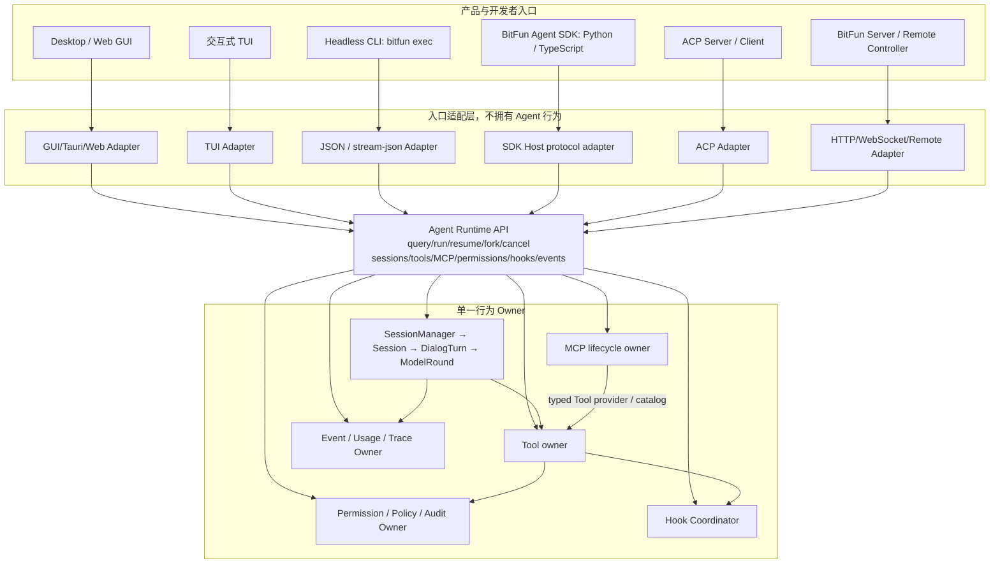
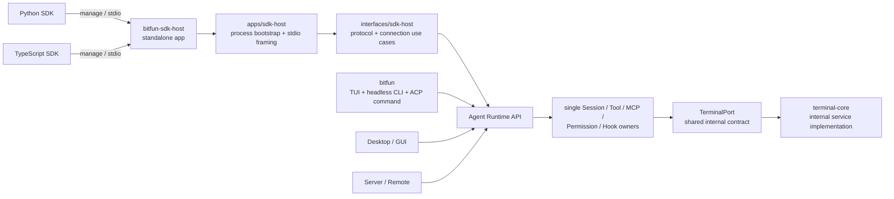
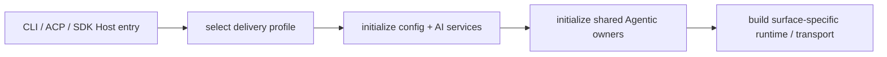
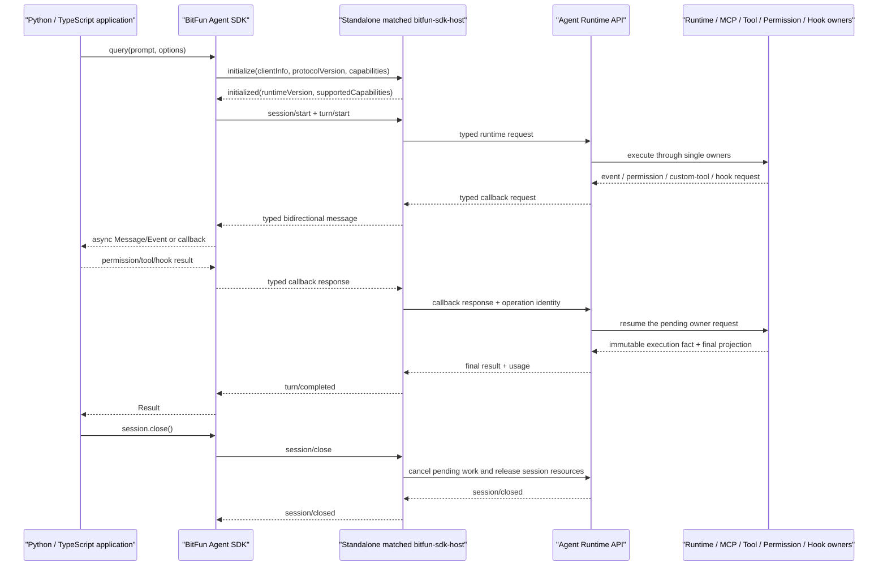
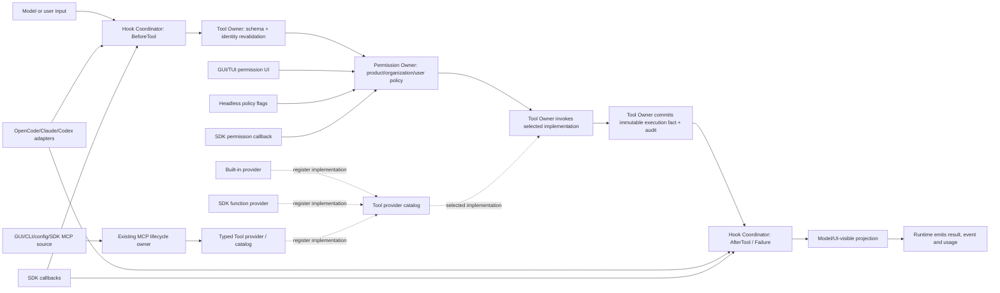
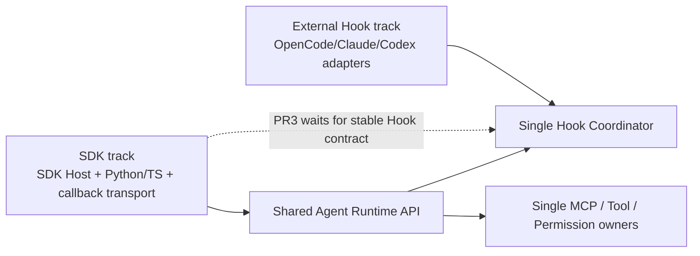
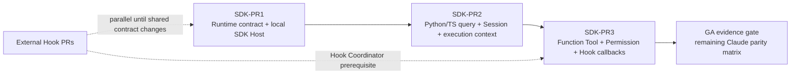

# BitFun Agent SDK 产品与宿主架构设计

本文定义 BitFun Agent SDK 的公开产品心智、内部 SDK Host 边界、与 GUI/TUI/Headless CLI/ACP/Server
的关系，以及达到公开发布前必须满足的能力等价门槛。智能体内核和 Rust crate 归属继续由
[`agent-runtime-services-design.md`](agent-runtime-services-design.md) 定义；产品级接口切面由
[`product-architecture.md`](product-architecture.md) 定义；CLI/TUI 体验由
[`cli-product-line-design.md`](cli-product-line-design.md) 定义；能力导入/导出和外部宿主适配由
[`capability-runtime-integration-design.md`](extensions/capability-runtime-integration-design.md) 定义。

本文记录目标架构与公开兼容门槛，不表示 TypeScript/Python SDK 或下文全部能力已经交付。当前代码中的
`agent-runtime::sdk` 是低层 Rust Runtime SDK（当前 preview），服务现有产品入口和 Rust 嵌入；
`interfaces/sdk-host` 是本地协议与连接用例 adapter，`apps/sdk-host` 是独立的原生 Host 进程及 stdio transport。
当前代码只形成第一切片的实现候选，尚未通过跨内部调用、Headless CLI 与 SDK Host 的同一 Query golden fixture，
因此还不能称为已交付的 SDK Host preview。它们都不是本文定义的
公开 BitFun Agent SDK，也不能据此宣称已达到 Claude Agent SDK 等价能力。

## 1. 最终决策

BitFun 采用以下组合，而不完整复制任一产品：

1. **公开心智采用 Claude Agent SDK 模型**：以 `query()`、异步消息流、Session、Tool、MCP、
   Permission、Hook、Subagent、Skill、Result 和 Usage/Trace 为主要概念。用户不需要学习
   BitFun 内部端口、Product Assembly、ACP 或传输协议。
2. **宿主边界采用 Codex App Server 的工程方法**：SDK 随版本携带或定位匹配的本地原生
   SDK Host，通过版本化、双向、可生成 schema 的协议管理 Session/Turn/Event、审批、回调、
   取消、背压和进程生命周期。
3. **复用 OpenCode 的 client/managed-server 选择，但不复制其低层公开心智**：默认由 SDK
   管理本地 SDK Host；高级调用方可以连接预启动的受信本地 SDK Host。公开 API 仍是 Agent SDK，而不是
   全量 Server 路由的薄封装。
4. **所有 BitFun 产品入口只使用一套 Agent Runtime API 和一组行为 owner**：GUI、TUI、
   Headless CLI、公开 SDK、ACP 和 Server 是同级 adapter。GUI/TUI/CLI 不经过公开 SDK 包，
   公开 SDK 也不创建第二套 Agent Loop、Tool、MCP、Permission 或 Hook 实现。
5. **ACP 保持互操作协议，不成为完整 SDK 的私有传输**：ACP 能表达的能力继续走标准 ACP；
   自定义 Tool 回调、完整 Hook、结构化用量、SDK 生命周期等超出 ACP 稳定边界的能力走 SDK Host
   协议，不向 ACP 填充大量 BitFun 私有扩展。

一句话定义：

> BitFun Agent SDK 是同一 BitFun Agent Runtime 的公开语言门面；它不是新的 Runtime，也不是
> Headless CLI、ACP 或 Server 的别名。

### 1.1 四个阅读视图

| 视图 | 回答的问题 | 位置 |
|---|---|---|
| 产品视图 | GUI、TUI、CLI、SDK、ACP、Server 各自做什么 | 第 4 节 |
| 运行视图 | `query()`、Session、Tool/MCP、Permission、Hook 如何经过同一 Runtime | 第 5、7 节 |
| 开发视图 | SDK 与外部 Hook 工作如何并行而不复制 owner | 第 11 节 |
| 交付视图 | 三个 PR 的顺序、产物和退出条件 | 第 12 节 |

## 2. 与 Claude Code、Codex 和 OpenCode 的对比

本表按 2026-07-23 的官方公开实现与文档核对。滚动版本的新能力不自动进入 BitFun 稳定承诺；
正式发布前必须冻结对比版本和 fixture。

| 维度 | Claude Agent SDK | Codex SDK / App Server | OpenCode SDK / Server | BitFun 选择 |
|---|---|---|---|---|
| 公开入口 | TypeScript 以 `query()` / `Query` 异步流和 `resume` 为主；Python 另有 `ClaudeSDKClient` | `Thread.run()` / stream；SDK 包装匹配 CLI 或 App Server | type-safe Server client | `query()` 为首选；`BitFunAgentClient` / Session 是映射（translated）或增强（additive）的高级入口，不冒充 Claude 跨语言公共接口 |
| Runtime 位置 | SDK 包含匹配的原生 Claude Code binary | SDK 携带/调用匹配 Codex runtime；rich client 使用 App Server | 可由 SDK 启动 Server，也可连接已有 Server | SDK 管理匹配原生 SDK Host；首版只允许受信本地 SDK Host |
| 公开心智 | Agent、Session、Message、Tool、Hook、MCP、Permission | Thread、Turn、Item、Approval、Event | Project/Session/Route/API | 采用用户已熟悉的 Agent/Session/Turn/Message/Event；不公开内部协议名 |
| Agent Loop | SDK 直接获得 Claude Code 同一工具和 loop | Runtime/App Server 持有 loop，SDK 是精选门面 | Server 持有 loop，SDK 接近 API client | 唯一 BitFun Runtime 持有 loop；SDK 只映射用例和回调 |
| 双向交互 | 自定义 Tool、权限、Hook、用户输入 callback | App Server request/response 支持审批和输入 | Server API/Event，客户端控制资源 | SDK Host 必须双向；不能只解析单向 JSONL 输出 |
| Session | resume/fork、外部会话存储 | thread start/resume/fork、turn/item、持久化 | session CRUD、prompt/abort、event | Session/Turn 作为稳定公共事实；存储 owner 仍唯一 |
| 协议纪律 | SDK API 主导，底层 binary 对用户透明 | 初始化握手、能力协商、schema 生成、稳定/实验分层、背压 | OpenAPI 生成类型，Server URL 是显式概念 | 采用 Codex 式版本/能力/schema/背压纪律，默认隐藏 transport |
| Headless CLI | `claude -p` 与 SDK 能力相通，CLI 更适合一次性/CI | `codex exec` 与 SDK 都调用同一 runtime | Server/CLI/TUI 均围绕同一服务 | `bitfun exec` 保持独立入口，与 SDK 做能力和事件等价 |
| 扩展暴露 | Skills、Plugins、Agents、MCP、Hooks | Skills、Plugins、MCP、Hooks 等由 Runtime/App Server 投影 | Plugin、Tool、MCP、Agent 等 Server API | SDK 只暴露已由 BitFun owner 提交的能力，不输出生态原始对象 |

### 2.1 关键步骤采用什么成熟模式

| 关键步骤 | 参考实现 | BitFun 采用 | 明确不采用 |
|---|---|---|---|
| 第一次调用 | Claude `query()` async iterator | `query()` 作为默认入口 | 先学习低层 route/client |
| 多轮控制 | Claude Session；Codex Thread/Turn | Session + Turn + typed event | 把一次模型请求当完整 Turn |
| Host 启动 | Claude SDK 携带 binary；OpenCode managed/client-only | 默认管理匹配本地 SDK Host | 要求用户预装 BitFun CLI |
| 协议握手 | Codex `initialize` + capabilities | 版本、能力、稳定/实验协商 | 未握手即调用或静默降级 |
| Tool 与 MCP | Claude 内置 Tool/MCP；Codex approval flow | 复用 BitFun 既有 Tool 与 MCP owner | SDK 私有 Tool/MCP registry |
| Permission 与 Hook | Claude typed callback；Codex server request | 双向 callback，最终策略仍归 BitFun owner | callback 扩大 Host 策略上限 |
| Headless | Claude `-p`；Codex `exec` | CLI 与 SDK 同能力事实、不同接口 | SDK 解析 `stream-json` 作为正式传输 |

### 2.2 不直接照搬的部分

- 不照搬 Claude SDK 的具体类名、字段名或 Hook ABI；等价的是能力类别、生命周期和使用心智，
  公开类型仍保持 BitFun 品牌与语义。
- 不复制 Codex TypeScript/Python SDK 可能存在的不同底层 transport；BitFun 的正式语言 SDK 必须
  由同一 SDK Host schema 生成或验证，避免语言间行为漂移。
- 不把 OpenCode 全量 Server 路由直接发布为 Agent SDK；低层资源 API 会让常见 Agent 用例承担
  额外协议心智，并容易把 Host 内部管理接口固化成长期公共 API。
- 不把外部产品的插件/Hook 兼容覆盖率当成 BitFun Agent SDK 的能力覆盖率。导入外部能力、向外部
  宿主导出能力、使用 SDK 构建应用是三条独立轨道。

## 3. 公开名词与内部实现名

### 3.1 用户需要理解的公开名词

| 名词 | 含义 | 不等于 |
|---|---|---|
| Agent | 一组模型、指令、工具、权限上限和可选子智能体定义 | 具体模型 Provider 或产品页面 |
| Session | 可持久化、可恢复/分支的连续工作上下文 | SDK 进程或一次 HTTP 连接 |
| Turn | Session 中由一次输入触发、直到完成/失败/取消的一次执行；采用 Codex 的输入到终态语义 | 单次模型请求；一个 Turn 可包含多个 Model Round。Claude `max_turns` 的计数单位不得直接映射为 BitFun Turn 数 |
| Message / Event | 输入、输出、增量、工具调用、权限请求和生命周期通知 | 内部事件总线 payload 或 Tauri event |
| Result | Turn 的最终状态、输出、结构化结果、用量与错误摘要 | stdout 文本本身 |
| Tool | Agent 可调用的内置能力、SDK 函数工具或 MCP 工具 | 绕过权限和审计的任意函数 |
| Permission | Tool 或外部副作用执行前的 allow/deny/ask 决策 | SDK 调用方可以扩大宿主上限的开关 |
| Hook | 在明确生命周期点执行的检查、变换或观察回调 | 通用事件总线或第二套工作流引擎 |
| Subagent | 由当前 Agent 委派、具有独立指令/工具范围的受控执行 | 独立产品 Runtime 或任意后台线程 |
| MCP Server | 通过 MCP 提供工具/资源的外部服务 | BitFun 内部 Tool owner 的替代品 |
| Skill | 文件系统或包中的可复用专业说明与资源 | 可绕过 Tool/Permission 的可执行代码 |
| Usage / Trace | 用量、成本、缓存、时延、因果链和诊断事实 | 默认采集 prompt、Tool 参数或凭据 |

公开文档不要求用户理解以下内部名词：SDK Host/SDK Host protocol、`AgentSubmissionPort`、
`RuntimeServices`、`ProductRuntimeParts`、`DeliveryProfile`、`RuntimeHookRegistry`、Source Adapter、
Host Adapter、Tauri adapter、ACP request 或 Capability Resolution Generation。默认 managed SDK Host 模式下，
SDK 负责定位、启动、握手和关闭匹配 SDK Host；这些内部名词可以出现在贡献者架构文档和高级故障诊断中，
不能成为使用公开 SDK 的前置知识。

### 3.2 只保留三个层次

| 层次 | 含义 | 当前状态 |
|---|---|---|
| Agent Runtime | 唯一 Agent loop，以及 Session、Tool、MCP、Permission、Hook、Event 的唯一归属边界 | Runtime/Session/Tool/Permission/Event 有生产基础；统一 Hook Coordinator 尚未交付 |
| Rust Runtime SDK | 当前 `agent-runtime::sdk`；供内部入口和 Rust 嵌入复用 | 当前为 preview，不等于公开产品 |
| BitFun Agent SDK | 面向 Python/TypeScript 的 `query()`、Session、typed callback 产品 | 尚未交付 |

SDK Host 只是 BitFun Agent SDK 到 Agent Runtime 的内部跨进程适配器，不是第四套 Runtime，也不是用户默认需要配置的产品。
当前本地 stdio Host 只支持 `initialize`、Session create/close、Query start/cancel、Event/Result、typed error 和
`shutdown`；structured output、usage、自定义 Tool、Permission/Hook callback、SDK MCP 配置和预启动 Host 均通过
capability 明确报告为不可用。当前没有 Permission callback；遇到 `ask` 时 Host 会拒绝请求、取消对应 Turn，并以
`action_required` 结束 Query，不会无限等待或自动放行。Host 由独立的 `bitfun-sdk-host` 二进制承载；
`bitfun` 不包含隐藏 Host 子命令，也不依赖 SDK Host 协议 crate。

以下事实不能由当前 Rust Runtime SDK 推导：

- 已有可安装的 TypeScript/Python BitFun Agent SDK。
- 已有语言内自定义 Tool、Permission 或 Hook callback。
- GUI/TUI/CLI 应改为依赖公开 SDK 包。
- `AGENT_RUNTIME_SDK_API_VERSION = 1` 是跨语言 wire protocol 版本。
- 注册了 Tool 名称或 Hook registry 就等于公开 SDK 可执行这些能力。

## 4. 一个 Agent Runtime，多种产品形态



该图回答三个容易混淆的问题：

1. **GUI/TUI/Headless CLI 同样需要 Query、MCP、Permission 和 Hook**。它们通过共享 Agent
   Runtime API 使用这些能力，不通过公开 Python/TypeScript SDK 包。
2. **没有两套实现**。公开 SDK 的 Tool/MCP/Permission/Hook 只是 adapter 和 callback bridge；
   最终注册、顺序、权限、执行、审计和状态提交仍由同一个 owner 完成。
3. **共享应用层不等于共享 UI 或协议**。GUI/TUI 保留各自 renderer、交互和平台生命周期；CLI、
   SDK、ACP、HTTP/WebSocket 保留各自 wire projection。

### 4.1 进程与依赖视图



| 依赖事实 | 约束 |
|---|---|
| `bitfun` CLI | 不依赖 `bitfun-sdk-host` app 或协议；只依赖共享 Runtime/Capability owner |
| `bitfun-sdk-host` app | 独立 composition root；只选择 `DeliveryProfile::Sdk` 与 `AgentSubmissionSource::SdkHost`。当前与 Headless CLI 共享 Runtime owner 和 assembly-plan 能力上限，但 Host 的实际 wire 能力是明确的严格子集；它不依赖 `bitfun-cli` crate，也不冒充 CLI |
| `interfaces/sdk-host` | 只拥有 JSON-RPC DTO、初始化/能力协商和连接级 Query/Session 生命周期；不拥有 stdin/stdout、进程入口或 Runtime 业务状态 |
| `TerminalPort` | Runtime 内部的抽象端口，供内置 Bash/命令类 Tool 复用；不是 Python/TypeScript SDK 方法，也不是 SDK Host wire |
| `terminal-core` | `product-full` Host 内部的具体终端/PTY 服务；SDK Host app 可像 GUI/TUI/CLI 一样通过共享 Runtime owner 使用它，但 `interfaces/sdk-host`、公开 SDK 类型和 JSON-RPC DTO 禁止依赖或暴露它 |
| Python/TypeScript SDK | 后续随包携带或定位匹配的 `bitfun-sdk-host`；用户不需要安装 CLI |
| HTTP/WebSocket Server | 独立远程产品；不作为本地 SDK callback Host，也不被 CLI 隐式启动 |

各 composition root 必须在配置归一化读取全局 Tool owner 前选择自己的 delivery profile；选择是进程级且不可替换，
后续 Agentic 初始化只验证同一选择。CLI、ACP 和 SDK Host 复用这一 Core 初始化契约，但不互相依赖 app 或协议：



独立 Host 进程在接受协议输入前安装进程级 TLS crypto provider，并在受控的 16 MiB worker stack 上启动
Tokio Runtime；这些是 Host composition root 的运行条件，不进入 SDK Host 协议，也不由 CLI 代为提供。

### 4.2 各形态能做什么

| 形态 | 主要用途 | 必须共享的 Agent 能力 | 形态特有职责 |
|---|---|---|---|
| GUI | 日常交互、审批、可视化、设置和恢复 | 完整会话、工具/MCP、权限、Hook 结果、用量和事件 | React/Tauri/Web 渲染、窗口和平台生命周期 |
| TUI | 终端内持续交互和操作 | 与 GUI 相同的业务事实和控制动作 | Ratatui/终端输入、键位、终端恢复 |
| Headless CLI | shell、CI、一次性或脚本化调用 | Query、Session resume、Tool/Permission 策略、结构化输出、取消 | flags、stdin/stdout/stderr、退出码、JSON/JSONL |
| Agent SDK | 自定义应用、服务、自动化和语言内回调 | Headless CLI 全部能力，加自定义 Tool、Permission/Hook callback 和 typed objects | Python/TypeScript API、callback 执行、Host 进程管理 |
| ACP | 编辑器与 Agent 的标准互操作 | ACP 标准可表达的 Session、Turn、Tool、Permission、Event 子集 | ACP 生命周期、RPC 和降级映射 |
| Server/Remote | 远程控制、多设备和服务化接入 | 由 Host capability 协商允许的共享用例 | 认证、网络、执行域、断线恢复、远程策略 |

## 5. SDK Host 与公开 SDK

### 5.1 目标拓扑



### 5.2 SDK Host 协议职责

SDK Host 协议只负责跨进程/跨语言边界，不拥有业务状态。目标方法族至少覆盖：

- `initialize` / capability negotiation / graceful shutdown。
- Session create/resume/fork/list/close、Turn start/cancel/steer 和结构化输入。`close` 只释放已加载资源，
  不等于持久化 `delete` 或 `archive`。
- 有序 Event stream、终态、usage/cost/cache 和 trace correlation。
- Permission request/response、用户问题和其他阻塞式交互。
- SDK function Tool register/invoke/result/unregister。
- SDK Hook register/invoke/result/unregister。
- MCP server 配置进入既有 MCP lifecycle owner；SDK Host 只投影连接状态和 Tool catalog，不持有第二个连接池。
- Agent/Subagent/Skill/Plugin source 的类型化配置与能力状态。
- typed errors、deadline、cancellation、bounded queue、backpressure 和 late-result fence。

目标方法族按 capability 逐步开放。当前 PR1 实现候选的实际 wire 边界如下，不能从目标拓扑推导尚未交付的 callback：

| 范围 | PR1 实现候选行为 | 明确未开放 |
|---|---|---|
| Query | `query/start` 通过共享 Dialog Scheduler 提交；每个 Session 同时只允许一个 SDK Query；若 Scheduler 返回 queued，Host 接受并绑定其精确 `turnId`，event、cancel 与 settlement 均只跟踪该 Turn | steer、resume/fork、structured output |
| Event | 只投影封闭的 `assistant_text_delta { text }`；内部事件和未知 payload 不上 wire | Tool、usage、trace 和原始事件总线 payload |
| Result | `query/result` 在 Turn settlement 后发布；失败携带稳定 code、retryable、correlation 和 recovery | 任意 JSON 错误或通过 message 驱动控制流 |
| Permission | capability 为 `false`；提交时关闭用户输入 Tool；出现属于当前精确 Turn 的 `ask` 时，在有界 deadline 内 reject + cancel + `action_required` | Permission callback 与隐式 auto-approve |
| Session | `session/create` 和不带 `sessionId` 的 `query/start` 只创建 connection-scoped transient Session；前者返回 `lifetime=connection`，后者返回 `sessionLifetime=connection`；`query/start.sessionId` 只能引用同一连接已创建的 Session，未知或已持久化的 ID 返回 `capability_unavailable`；`session/close` 由一个总 deadline 约束 scheduler maintenance 与资源清理；断连/close 后不可 resume/list/fork；该 Session 及其 Subagent 不暴露会读取或操纵独立 Session、持久定时任务或全局运行资源的 `SessionControl`、`SessionMessage`、`SessionHistory`、`Cron`、`ControlHub` | durable create、list、resume/fork、跨 Session 消息、持久调度和全局控制 |
| Transport | 独立 `bitfun-sdk-host` 进程使用本地换行分隔 JSON-RPC；有请求/Query/Session 上限、写超时和总 shutdown deadline；Host 用 exact ID 跟踪 transient create，在 graceful budget 后执行 abort → join → 专用 transient discard，永不通过普通 durable delete 补偿；deadline 耗尽时结束当前连接并记录结构化本地告警，当前协议不向已断开的调用方承诺清理完成结果 | managed SDK supervisor 的 Host 进程树 kill/reap、TCP、预启动 Host、远程复用 |

`query/start` 若提供 `sessionId`，不得同时提供只在创建 Session 时有效的 `sessionName`、`agent`、`cwd` 或
`model`；Host 返回 `invalid_request`，不会静默忽略。当前只有 `shutdown` 支持 JSON-RPC notification；会创建、返回或关闭
Session/Query 资源的生命周期方法必须带 request ID，无 ID 时不执行且不响应。有效 JSON 但不符合 request 或 notification
envelope 的输入返回标准 `-32600`，只有 JSON 语法或行 framing 失败返回 `-32700`。

这里的 transient 只表示 Session 状态、turn、transcript 和 cache 不持久化；它不是权限或文件副作用沙箱。Task 创建的 Subagent 继承该边界，并在
父 Session discard 时由现有 Session owner 按父子关系级联释放。discard 同时回收该 Session 仍持有的 Snapshot、Cron
job、Terminal binding 和后台终端进程；任一已存在资源无法确认关闭时 fail closed。文件编辑、已完成命令、MCP 或外部
服务等 Tool 已产生的真实副作用不会随 Session discard 自动回滚。PR2 不得静默改变 PR1 方法的 lifetime；durable
create/resume 必须以新的 capability/协议版本开放，并先具备原子 commit、崩溃恢复、请求指纹和跨进程 fencing。

同一 `ToolRuntimeRestrictions` 必须同时约束首轮 Skill/Agent 列表、Subagent 的工具摘要、模型 tool manifest、
`GetToolSpec` 与最终执行 admission。Agent 模板提到可选工具时必须要求先以当前 tool list 为准；不能让 prompt
继续指示模型调用已从 manifest 移除的能力，也不能为 SDK Host 单独维护一套 prompt 或工具过滤规则。

注册、查询和调用使用不同身份：

| Lease scope | 典型内容 | 释放条件 |
|---|---|---|
| Connection | 调用方显式注册的 client-wide Tool/Hook | SDK dispose 或连接丢失 |
| Session | 调用方显式注册的 Session 级能力与资源引用 | `session.close` |
| Query | `query({ hooks, tools })` 注册的 callback 与 Query 持有资源 | 正常耗尽、`Query.close()`、异常退出或调用方取消 |
| Turn | 用户问题、单次 Permission interaction 和 Turn 临时等待 | 唯一 Turn 终态或所属 Query/Session 关闭 |

每次 invoke 另带 operation/generation identity，不能把单次调用 ID 当成注册生命周期。Query 结束只撤销其
Query lease 和 pending invocation，不影响持久化 Session、同连接其他 Query 或 connection lease；`session.close`
继续撤销该 Session 下的 Query/Turn lease。所有受影响的 pending callback 以类型化错误结束，随后到达的 late
result 被拒绝，不能把 callback future 或 handler 状态留给 owner 无限等待。

MCP 配置必须声明首轮就绪语义，而不是把“已配置”当“已可用”：

| 策略 | Turn 准入 | 状态与目录 |
|---|---|---|
| 首轮必需 | admission 在独立 deadline 内等待；失败或超时则本 Turn fail closed | 只有 ready server 的工具进入绑定的 catalog generation |
| 后台连接 | Session 可先启动，初始化/状态事件明确报告 `pending` | ready/reconnect 产生目录 generation 事件，只影响之后 admission 的 Turn |

每个 Turn 在 admission 时绑定一个 Tool catalog generation；MCP 在 Turn 执行中变为 ready 不改变该 Turn 的工具集合。
重连、失败和 Session close 都通过既有 MCP lifecycle owner 发布状态并回收 Session 持有的引用。Python、TypeScript
和 Headless CLI 必须对同一配置采用同一 readiness policy；最终公开字段名在双语言 fixture 中冻结。

协议 schema 由单一合同源生成或验证 TypeScript/Python 类型。每个 SDK 版本必须绑定兼容的 SDK Host
版本范围；默认安装包携带匹配原生 SDK Host，避免依赖用户机器上未知版本的 `bitfun`。

首版 client-only 不开放任意 TCP URL。managed SDK Host 优先使用父子 stdio 或继承句柄；连接预启动的本地
SDK Host 时，Windows named pipe / Unix domain socket 必须同时使用每次启动的随机 secret、端点 ACL/owner 校验，
并在平台支持时校验 peer credentials。secret 不进入命令行、日志或普通错误；Host 与 client 在业务 payload 前
完成双向认证，再做版本/capability 握手。远程连接必须复用 Server/Remote 的认证、执行域、凭据和策略边界，
不能把 prompt、Tool 参数或 Permission/Hook callback 暴露给只通过版本握手的未知 SDK Host。能力不支持时
返回类型化 `capability_unavailable`，不得静默降级成本地执行或另一权限模式。

预启动本地 SDK Host 的负向验收必须覆盖：

| 场景 | 预期结果 |
|---|---|
| 错误、过期或重放 secret | 业务 payload 前拒绝，且不回显 secret |
| 端点被抢占，或 ACL/owner 校验失败 | fail closed，不连接同名未知 Host |
| 可用平台上的 peer credential 不匹配 | 拒绝连接并记录低敏诊断 |
| 多连接并发 | lease、callback、Session 和诊断彼此隔离 |
| 日志、进程参数和普通错误 | 不出现 secret、prompt、Tool 参数或凭据 |

### 5.3 为什么不直接复用 ACP 或 `stream-json`

| 候选 | 优点 | 阻断问题 | 结论 |
|---|---|---|---|
| 当前 Rust Runtime SDK 直接作为语言 SDK 发布 | 代码已有、内部调用丰富 | Rust-only、暴露端口装配、没有语言 callback/进程协议，用户心智与 Claude SDK 不等价 | 保留为低层 Rust preview |
| SDK 调用 `bitfun exec --stream-json` | 实现快、适合单向结果流 | 难以可靠承载长期 Session、并发 Turn、权限、函数 Tool、Hook、用户输入和 capability negotiation | 仅作为 Headless CLI，不作为正式 SDK transport |
| SDK 全部走 ACP | 可复用标准协议和现有 ACP adapter | 稳定 ACP 子集不能完整表达 BitFun/Claude 等价 SDK；私有扩展过多会破坏互操作心智 | ACP 作为同级 adapter |
| SDK 直接映射 HTTP Server | 远程天然可用 | 本地 callback、凭据、进程所有权和离线体验更复杂；容易把内部 route 固化为公开 API | 远程 transport 后续按真实用例增加 |
| 版本化双向 SDK Host | 支持本地函数回调、完整生命周期、schema、背压和匹配 runtime | 需要新增协议与包装发行，但不新增业务 owner | **目标方案** |

## 6. 公开 SDK 心智与能力等价门槛

### 6.1 建议的语言无关形态

`query()` 是大多数用户的首选入口，并返回同时可异步迭代和显式控制的 Query handle；需要管理多个并发 Session
时再使用 client。两者必须共享同一消息、错误和 Session 语义。

```typescript
const activeQuery = query({
  prompt: "Find and fix the failing test",
  options: {
    allowedTools: ["Read", "Edit", "Bash"],
    mcpServers: { /* ... */ },
    hooks: { /* typed lifecycle callbacks */ },
  },
});
try {
  for await (const message of activeQuery) {
    // Message / Event / Result
  }
} finally {
  await activeQuery.close();
}

// BitFun additive advanced API; not a Claude TypeScript SDK alias.
await using client = await BitFunAgentClient.start();
const session = await client.sessions.create({ cwd, agent: "agentic" });
const turn = await session.startTurn({ prompt });
for await (const event of turn.events()) {
  // approve/deny, answer questions, observe tools, cancel or steer
}
```

上述名称是设计级形态，不冻结最终 package 名、方法签名或字段。正式 API 只能在 TypeScript 和 Python
两个真实消费者、同一 SDK Host fixture 和升级测试通过后冻结。

Query 生命周期必须区分：

| 动作 | 语义 |
|---|---|
| 正常耗尽 | 已观察唯一 Turn 终态；结束输入和 Query 资源，保留可恢复的持久化 Session |
| `interrupt()` | 请求取消当前 Turn；Query/Session 可继续用于后续输入，返回类型化取消结果 |
| `close()` / async dispose | 停止输入，取消未完成 Turn 与 Query 级 callback，回收 Query 持有的 MCP、子进程和 Subagent；不删除/归档 Session |
| 提前 `break`、异常或调用方取消 | 不能视为成功；语言包必须在 `finally`/异步析构中调用 `close()`，或明确把 handle 所有权交给其他任务 |

managed SDK Host 仅在最后一个 Query/client 引用释放后退出；预启动的受信本地 SDK Host 只释放当前连接资源。

### 6.2 Claude Agent SDK 等价的定义

“等价”指公开心智和核心能力类别等价，不指 package、类名、字段名、Hook ABI 或私有实现一比一。
公开候选版本必须冻结一个 Claude Agent SDK 稳定版本，并逐项标记：

| 状态 | 含义 |
|---|---|
| 原生（native） | BitFun 现有 owner 直接提供同类公开语义 |
| 映射（translated） | 达到同一用户目标，但命名或生命周期由 BitFun 语义映射；差异必须可查询 |
| 增强（additive） | BitFun 独有能力，只能作为附加项，不能替代 Claude 稳定核心能力 |

冻结版本中的稳定核心能力不得在 BitFun 正式发布（GA）中以 `unsupported` 静默缺失。冻结之后新增的竞品能力进入
下一版本评审，不形成滚动追赶。

| 能力类别 | BitFun 目标 | 当前基础 | 正式发布门槛 |
|---|---|---|---|
| Query 与异步流 | 单次/连续输入、typed message/event/result、interrupt/close | Headless `stream-json` 与内部事件已有不同投影 | Python/TS 同一 fixture、顺序/终态/错误/提前退出清理等价 |
| Session | create/resume/fork/close/persist/ephemeral | Rust Runtime SDK 已有多项 Session 用例 | `close` 与 delete/archive 分离；跨进程重启、fork、并发写入和资源回收明确 |
| Turn 控制 | start/cancel/steer、用户问题与 background result | 内部取消和交互端口已有基础 | 取消树、late result、阻塞输入和终态唯一性有端到端（E2E）验证 |
| 执行上限 | model-round/iteration、预算和 deadline 的计数与终态稳定 | 已有部分用量、取消和 deadline 事实 | 与 Claude `max_turns`/budget 错误做显式映射，不把它误解为 BitFun Turn 数 |
| 认证与执行上下文 | model/provider、cwd/workspace roots、sandbox、env、配置来源与凭据 owner | 产品入口已有分散实现 | Python/TS 同 fixture；凭据不进入 wire、日志或 callback，配置优先级和远程执行域明确 |
| 内置 Tool | 文件、搜索、终端等经现有 Tool owner 执行 | 产品 Runtime 已具备 | SDK 与 GUI/TUI/CLI 使用同一 catalog/权限/审计 |
| 自定义函数 Tool | Python/TS callback 作为受控 Tool provider | 尚无公开 callback bridge | schema、deadline、取消、大小、异常和进程丢失语义完备 |
| MCP | SDK 配置本地/远程 MCP，状态和 Tool 进入同一 owner | 产品与 ACP 有既有 MCP 路径 | 不创建 SDK 专用 MCP client/registry；首轮 required/background readiness、catalog generation、身份/OAuth、重连和 Session close 可解释 |
| Permission | allow/deny/ask、`canUseTool` 式 callback、批量与审计 | 内部 Permission owner 和请求流已有 | callback 不能突破组织/产品/Host 上限；超时 fail closed |
| Hook | 生命周期 callback，确定性顺序、变换/阻止/观察 | 内部 Hook 基础与外部生态适配在演进 | 复用唯一 Hook Coordinator；SDK 不创建 HookBus |
| Subagent | 定义、委派、父子事件/权限/用量 | Runtime 已有 Subagent 能力 | 父子取消、权限收紧、预算和事件关联一致 |
| Skills/Plugins/配置来源 | 显式选择可信来源并报告实际加载状态 | Skills/外部来源控制面已有基础 | 默认/裸模式明确；来源、版本、失败和风险可查询 |
| System prompt / Agent 定义 | 默认、追加和替换语义明确 | 内部 Agent/Prompt registry 已有 | 不暴露内部模板；来源与最终摘要可审计 |
| Structured output | JSON Schema 校验、失败与重试事实 | Headless/Runtime 能力需统一核对 | 与 SDK Result 和 CLI JSON 使用同一结果合同 |
| Checkpoint / rewind | 文件/会话恢复范围可解释 | 有局部 snapshot/checkpoint 基础 | 不把本地 workspace snapshot 冒充完整 rewind；副作用边界有 fixture |
| Usage / cost / trace | token、cost、cache、duration、correlation、OpenTelemetry（OTel） | 内部 usage/event/trace 分散存在 | 低基数指标、敏感数据默认不采集、跨语言字段一致 |
| 进程与错误 | 启动、版本、退出、崩溃、背压、重试、清理 | 进程治理已有公共 owner | Host/回调/MCP 后代回收与 typed error 全平台验证 |

BitFun 的 Goal、Deep Review、Harness、Remote execution 和 Mini App 可以作为 additive 能力出现；它们
不能替代上表中的基础能力，也不能迫使首次使用 SDK 的用户学习一套新的 Agent 基本概念。

## 7. Tool、MCP、Permission 与 Hook 的单一执行链



约束：

- SDK callback、GUI/TUI 决策和 CLI flag 只是候选输入；Permission Owner 保留最终决定权。
- MCP 配置可以来自产品设置、项目文件、CLI 或 SDK，但连接、认证、健康和回收只进入既有 MCP
  lifecycle owner；只有类型化 Tool provider/catalog 进入 Tool owner，不保留 SDK 专用连接池或 registry。
- SDK Hook 与外部生态 Hook 共享 Hook Coordinator 的事件点、顺序、deadline、冲突、隔离和审计；
  adapter 只解释来源语义。
- Before Hook 修改参数后必须重新做 schema 与权限校验。After Hook 只能改变模型/UI 可见投影，不能覆盖
  原始结果、成功/失败、真实副作用或审计事实；After 失败只产生投影诊断，不能重放 Tool。
- Safe Mode、Host capability 或 Remote execution-domain 不允许时，所有入口统一 fail closed；SDK 不回退本机。

## 8. Headless CLI 与 SDK 的关系

两者能力心智应对应，但交付方式不同：

| 需求 | Headless CLI | Agent SDK |
|---|---|---|
| 一次性 shell/CI 调用 | 最优，`bitfun exec` | 可用，但需要语言运行时 |
| stdin/stdout 管道 | 原生 | 由应用自行接入 |
| text/json/JSONL | 稳定输出与退出码 | typed object / async iterator |
| 多轮 Session | ID/flag 恢复，适合脚本 | Session object 与长连接更自然 |
| 权限 | flag/配置/非交互 fail-closed | typed callback + 同一策略上限 |
| 自定义函数 Tool | 不以内嵌 shell callback 作为稳定 ABI | Python/TS function callback |
| Hook | 配置来源 + 可选事件输出 | typed callback |
| 并发多个 Session | 由调用方启动多个进程，成本较高 | 一个 Host connection 上受控并发 |
| 生命周期 | 进程退出即完成，后台资源清理 | SDK/Host 显式 close/dispose，进程丢失可诊断 |

能力等价不要求两者 flags 与方法一一对应。应维护一组共同 fixture，证明相同 Runtime 配置、输入、
权限决策和 Tool 结果在两种入口产生相同最终业务事实；表现层字段和传输事件可以不同。

## 9. 错误、日志、打点与审计

公开 SDK 和 SDK Host 共享一套稳定错误信封，至少包含：

- `code`、`stage`、`retryable`、`message`。
- operation/session/turn/tool/hook identity 中当前层可见的最小集合。
- `correlation_id`、`causation_id`、deadline/attempt。
- 可选且闭合的 recovery action；调用方不得解析 message 控制流程。

错误类别至少区分 validation、authentication、permission denied、action required、provider quota、provider billing、
capability unavailable、version mismatch、host unavailable、overloaded、timeout、cancelled、cleanup required、
callback failed、invalid callback output、MCP unavailable、process lost 和 internal error。未确认 Turn settlement 或隐藏
Session 清理失败属于 `cleanup_required`，不得建议在同一 Host 上自动重试。

四类观测数据保持分离：

| 类型 | 用途 | 约束 |
|---|---|---|
| Error | 当前操作失败与恢复 | 稳定 code，不解析文案 |
| Diagnostic | Session/Tool/MCP/Hook/Host 的持续降级状态 | 生命周期明确，恢复后撤销 |
| Log | 本地开发和运维排障 | 英文结构化；默认不记录 prompt、参数、结果、环境变量和凭据 |
| Metric/Trace | 成功率、时延、队列、成本和因果链 | 低基数标签；身份、路径和内容不进 metric label |
| Audit | 权限、Hook 变换、Tool 副作用和管理动作 | 不可被 SDK callback/插件覆盖 |

## 10. 版本、成熟度与发布门槛

公开版本同时包含三层版本：

1. **SDK API version**：Python/TypeScript 的公开方法和类型。
2. **SDK Host protocol version**：wire schema、方法、事件、错误和 capability。
3. **Runtime capability version**：Hook 点、Tool/MCP/Permission 语义和 product capability。

当前 Host 握手返回 `stability=not_delivered`；其 `protocolVersion` 只是实现候选内部的 wire 修订号，不构成公开 v1
兼容承诺。进入 preview 前必须从 Rust DTO 生成或机器验证唯一协议 schema，并以 drift check 保证 Python、TypeScript
和 Host 不各自手写一套合同；达到共同 golden fixture 与 schema 门槛后，才把成熟度切换为 `preview`。

SDK 包默认锁定匹配 SDK Host runtime。连接预启动的受信本地 SDK Host 时先完成双向认证，再完成初始化与
capability negotiation。稳定 API
不得依赖 experimental capability；实验字段必须显式 opt-in，并允许旧 SDK 忽略未知通知。协议必须定义
有界队列、过载错误、重试建议和关闭语义。

正式发布（GA）需要同时满足：

- TypeScript 和 Python 两个真实仓库外消费者，而不是只通过单元测试或 `bitfun-core` adapter。
- Claude Agent SDK 冻结稳定版本的能力矩阵无静默缺口。
- Headless CLI 与 SDK 的共同 fixture 通过。
- managed SDK Host 的安装、启动、升级、版本不匹配、崩溃和完整进程树回收通过 Windows/macOS/Linux 验证。
- 预启动本地 SDK Host 通过错误/过期/重放 secret、端点抢占、ACL/owner、peer credential、多连接隔离和敏感数据不泄漏测试。
- 自定义 Tool、Permission、Hook 和用户输入的双向 callback 端到端验证通过。
- MCP、Session resume/fork、取消、structured output、usage/trace 和敏感数据策略有真实样例。
- API 参考、迁移说明、错误码、能力状态和最小示例完整。

## 11. 与 OpenCode Hook/扩展工作的并行边界



SDK 工作可以与 OpenCode/Claude/Codex Hook 适配并行，但只能在以下边界内：

- SDK track 负责 SDK Host、语言包、query/session/event、SDK callback transport 和公开文档。
- Hook track 负责公共 Hook 语义点、顺序、策略、隔离、诊断以及各生态 Source/Handler adapter。
- 两条 track 都只能消费同一个 Hook Coordinator；SDK track 不先实现私有 HookBus，Hook track 不定义
  Python/TypeScript wire callback。
- SDK Hook callback 的最终接入必须基于已合并的公共 Hook owner。两条分支同时修改 owner 合同或
  `agent-runtime` 权威状态时停止并行，先串行冻结合同。
- 文档、schema fixture、独立 `apps/sdk-host`、`interfaces/sdk-host` 和 SDK package 可以并行；Cargo workspace、公共合同和
  owner 文件的机械冲突不应通过复制类型解决。

## 12. 后续实现切片

以下三个 PR 按顺序合并，交付可验证 preview，不直接宣称 GA。它们可与外部 Hook adapter 工作在上述边界内并行。



### SDK-PR1：Agent Runtime 合同与本地 SDK Host 基线

当前状态：独立本地 Host 进程与协议基线已有实现候选，但尚未满足本节退出条件；公开 Python/TypeScript 包也尚未交付。

- 把当前 Rust Runtime SDK 收敛为共享 Agent Runtime 用例，不扩大为 service locator。
- 建立 versioned initialize、Session/Turn、query/event/result、cancel、session close、typed error、capability 和 shutdown 协议；
  Host 新建 Session 明确为 connection-scoped transient container，不冒充公开 SDK 的 durable Session。
- 提供同进程 contract fixture 和独立本地 stdio Host process smoke；`bitfun` CLI 不承载 Host 子命令，
  ACP/CLI/GUI/TUI 行为不迁移到第二 owner。Host 使用独立 SDK profile/source；它与 CLI 共享 Runtime owner 和
  assembly-plan 能力上限，但实际 Host capability matrix 保持严格子集，不形成 app 或协议依赖。
- 仅投影现有稳定能力，并建立通用 request lease；不先发布自定义 Tool/Hook callback。

完整退出条件：同一 Session/Turn fixture 能经内部调用、Headless CLI 和 SDK Host protocol 得到等价业务事实；
过载、取消、进程丢失和版本不匹配 fail closed。`session.close` 能取消并回收待处理 owner interaction、MCP 引用、
子进程和 Subagent；Host-owned transient Session 及其 transient Subagent 后代由现有 Session owner 级联 discard；
PR1 不接管、删除或归档任何已有 durable Session。
当前独立 process smoke 已覆盖 Host 的启动、协议握手、stdout 纯净与关闭；Headless CLI 有独立执行测试。
跨 Headless CLI、SDK Host 和内部直调用的同一 Session/Turn golden fixture，以及 Tool/Permission 等价结果，
仍是该退出条件的未完成证据，不能用各自 smoke 名称替代。

### SDK-PR2：Python/TypeScript query 与 Session 产品闭环

- 发布预览语言包，默认携带/定位匹配 SDK Host。
- 支持带 `interrupt/close` 的 `query()`、async stream、resume/fork/close、structured output 和 usage；
  `BitFunAgentClient` / Session 作为映射或增强入口，不宣称是 Claude TypeScript SDK 的同名接口。
- 冻结认证、model/provider、cwd/workspace roots、sandbox、env、配置来源优先级和凭据 owner；接入既有 MCP lifecycle owner，
  并冻结首轮 required/background readiness、状态事件、catalog generation 与重连语义。
- 完成预启动本地 SDK Host 的认证负向测试：错误/过期/重放 secret、端点抢占、ACL/owner、peer credential、
  多连接隔离和敏感数据不泄漏；任何失败都发生在业务 payload 之前。
- 提供 bare/default source 选择，避免 CI 隐式加载用户 Hook/Skill/MCP。
- durable create/resume 必须先完成可判定的持久化 commit、同 ID 幂等恢复、binding/request fingerprint 校验、
  partial cleanup 和 managed Host kill/reap fencing，不能复用 PR1 transient 语义冒充持久会话。
- 用相同示例和 golden fixture 验证 Python/TypeScript/Headless CLI。

退出条件：两个仓库外 pilot 可完成安装、执行、取消、恢复、升级和错误恢复；managed 与预启动本地 SDK Host
均通过各自安全验收；用户不需要配置 ACP 或手工安装 BitFun CLI。

### SDK-PR3：函数 Tool、Permission 与 Hook callback 闭环

- 在同一 callback transport 上增加函数 Tool、permission callback、用户问题和公共 Hook callback。
- 复用合并后的 Tool/Permission/Hook owner；连接租约、deadline、取消、进程丢失和 late result 共用一套语义。
- 等待公共 Hook Coordinator 合同稳定后接入，不实现 SDK 私有 HookBus。
- 验证 connection/session/query/turn lease 隔离、Query 正常耗尽与关闭清理、pending callback 清理与 late result 拒绝。

退出条件：无 SDK 专用 Tool/Permission/Hook 状态或调度器；Subagent、Skills/Plugins、checkpoint/rewind、
OpenTelemetry 等剩余差距继续留在第 6 节 GA 证据矩阵，不能为了宣称等价塞入本 PR。

## 13. 明确非目标

- 不提供 Claude Agent SDK 的 import-compatible 或 source-compatible 替换包。
- 不把 `bitfun-core/product-full`、内部 manager、RuntimeServices、Host ABI、Tauri command 或任意
  `serde_json::Value` service locator 暴露给公开 SDK。
- 不要求 GUI/TUI/CLI 通过 Python/TypeScript SDK 访问 Runtime。
- 不用 ACP 私有扩展承载所有 BitFun 能力。
- 不把远程 Server、云托管 Agent、插件市场或跨宿主会话迁移塞入首个 SDK PR。
- 不因设计文档完整就宣称 SDK 已可用；状态必须分别标记 `not_delivered / preview / stable`。

## 14. 参考基线

- [Claude Agent SDK overview](https://code.claude.com/docs/en/agent-sdk/overview)
- [Claude Code programmatic/headless mode](https://code.claude.com/docs/en/headless)
- [Codex TypeScript SDK](https://github.com/openai/codex/blob/main/sdk/typescript/README.md)
- [Codex Python SDK](https://github.com/openai/codex/tree/main/sdk/python)
- [Codex App Server](https://github.com/openai/codex/blob/main/codex-rs/app-server/README.md)
- [OpenCode SDK](https://opencode.ai/docs/sdk/)
- [OpenCode Server](https://opencode.ai/docs/server/)
