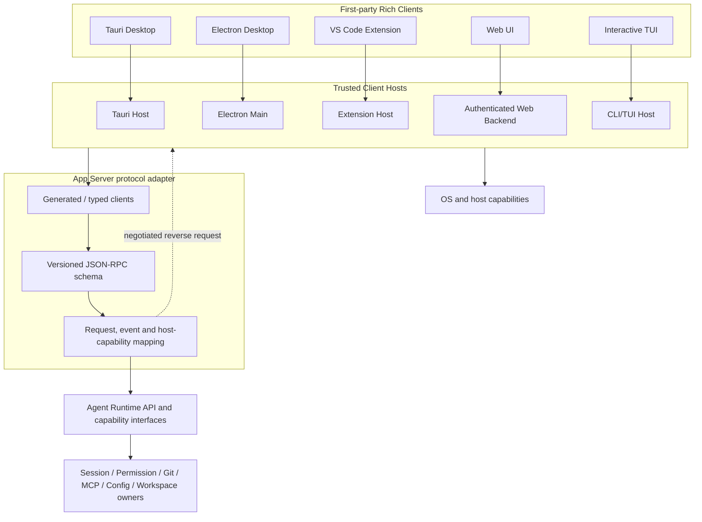
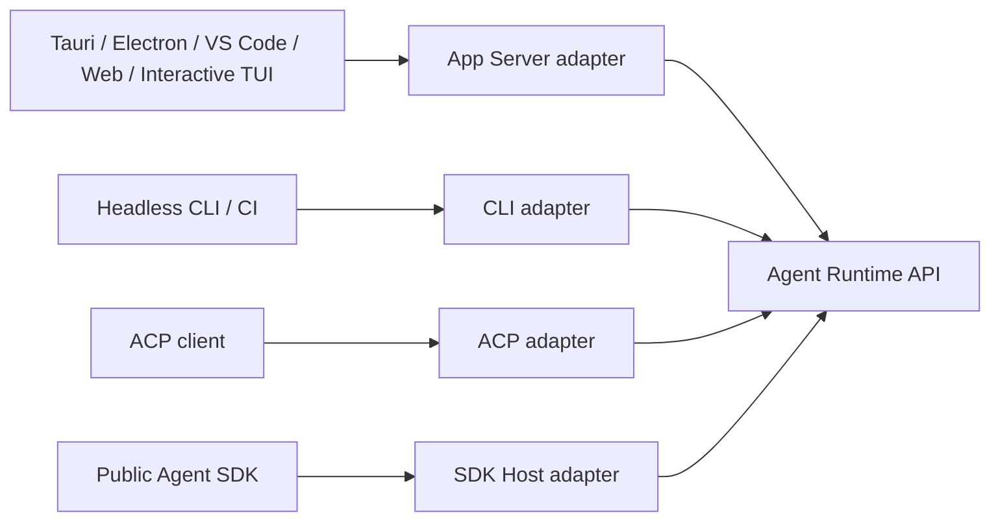
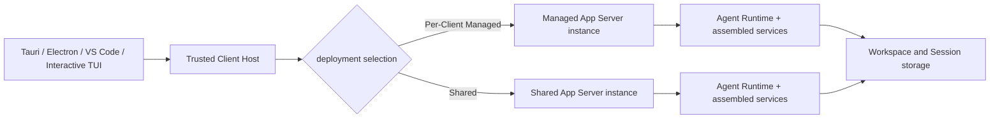
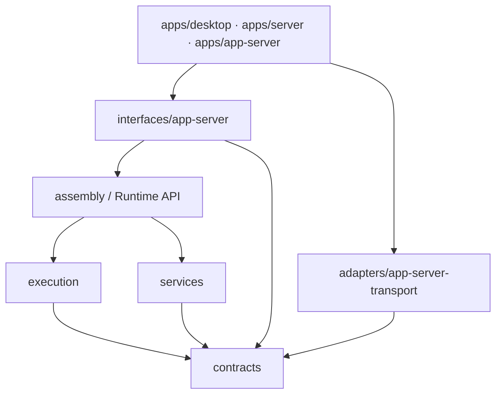

# BitFun App Server 架构设计

本文定义 BitFun 面向第一方 Rich Client 的统一后端协议边界。它服务于 Desktop GUI、
Electron、VS Code Extension、Web UI、交互式 TUI 和未来其他交互式客户端，使前端框架可以替换、前后端
可以独立演进，同时保持产品逻辑、状态所有权和平台能力边界不变。

本文是 [`product-architecture.md`](product-architecture.md) 的专题展开；Agent Runtime 的
Embedded/Per-Client Managed/Shared/Hosted 所有权和进程约束以
[`agent-runtime-deployment-design.md`](agent-runtime-deployment-design.md) 为准；公开 Agent SDK
与 SDK Host 的独立产品合同以
[`agent-sdk-product-architecture.md`](agent-sdk-product-architecture.md) 为准。发生冲突时以上位
文档为准。

> **规范范围**：本文只以最终架构作为设计约束。Tauri command、既有 Server WebSocket 和
> Shared TUI IPC 仅在第 8 节作为迁移证据出现，不参与目标模块、协议或进程边界决策。

## 1. 决策摘要

BitFun 采用 **Rich Client App Server + 混合部署**：

1. Tauri Desktop、Electron、VS Code Extension、Web UI、交互式 TUI 和未来第一方 Rich Client 共享一份
   版本化 App Server 协议和生成的 typed client。
2. App Server 是协议组合与交付边界，不是 Session、Permission、Git、MCP、Config、
   Workspace 等领域行为的 owner。权威 DTO、策略和状态继续位于 Runtime API、
   `contracts/*` 与对应能力归属模块。
3. 本机 Rich Client 使用同一个 App Server 实现，并按产品场景选择 **Per-Client Managed** 或 **Shared** 部署；
   两种部署只改变实例发现、连接和生命周期，不改变 schema、handler、错误、事件或业务语义。
4. Headless CLI/CI 默认保留 Embedded Runtime；公开 SDK 保留独立 SDK Host 合同；ACP
   保留 ACP 协议 adapter；它们不为了界面协议统一而依赖 App Server。
5. Tauri、Electron、VS Code 等 Host 保留窗口、菜单、剪贴板、文件选择、终端、截图和
   Computer Use 等平台职责。App Server 只能通过协商后的 Host capability 请求这些能力。
6. Shared Agent Runtime 是 App Server 的一种目标部署模式，不是第二套 server。Controller、Observer、取消、
   背压、重放、公平调度和 Runtime-aware drain 属于统一 App Server 合同的多客户端部分。
7. 每个 App Server instance 固定一个产品身份、数据命名空间、release channel、后端 Delivery Profile 和
   capability plan。Client 只能协商自身展示能力与 Host capability，不能通过握手改变 Server 的产品策略或能力上限。
8. Browser Web UI 使用服务端 **Hosted** App Server。Hosted 共享 schema、handler、Runtime API 和行为 fixture，
   但使用独立服务端组装根、网络认证、租户隔离、方法 allowlist、数据与 execution domain。

一句话定义：

> BitFun App Server 是第一方 Rich Client（包括交互式 TUI）面向同一 Agent Runtime 和产品能力的版本化
> JSON-RPC 协议 adapter；它不是新的 Runtime、公共 Agent SDK、通用 Remote API，也不是
> 所有产品入口必须经过的内部总线。

## 2. 背景与目标

### 2.1 要解决的问题

当前 Desktop 前端通过大量 Tauri commands 和事件消费后端能力。即使 command 后面的
产品逻辑已经平台无关，前端仍了解 Tauri invoke、事件命名和宿主 DTO。直接替换为
Electron 或新增 VS Code Extension 时，需要重新建立一套 Electron IPC 或 Extension Host
消息层，并容易复制服务调度、错误映射和事件投影。

Rich Client App Server 解决以下问题：

- 前端不依赖 Tauri、Rust 内部类型或 `bitfun-core` 句柄；
- Tauri、Electron、VS Code 和 Web 复用相同的产品操作与事件协议；
- Rust schema 生成 TypeScript client/type，减少手写 DTO 漂移；
- 后端可独立启动、测试、诊断和演进；
- 同一业务行为只由既有 owner 实现一次，各 Host 只保留平台适配。

### 2.2 设计目标

1. **可替换前端**：替换 Tauri 为 Electron 或增加 VS Code Extension 时，不复制 Runtime、
   Session、Permission、Git、MCP、Config 或 Workspace 行为。
2. **真正的进程分离**：目标生产拓扑允许 Rich Client 与 Runtime 独立崩溃、重启和升级。
3. **一份 Rich Client wire**：Rich Client 共享 JSON-RPC method、错误、事件和版本协商。
4. **领域所有权不迁移**：App Server 映射既有 Runtime API 和能力接口，不创建第二套行为。
5. **宿主能力显式化**：不同前端通过 capability negotiation 表达平台能力，不假设功能齐全。
6. **远程默认关闭**：本机协议不因存在 WebSocket transport 自动成为远程或公网 API。

### 2.3 非目标

- 不把所有 Tauri command 原样转换为 JSON-RPC method；
- 不让 Headless CLI、CI、ACP 或 SDK Host 强制绕行 App Server；交互式 TUI 不属于该例外；
- 不用 App Server schema 取代 `contracts/*` 或领域 owner；
- 不把公开 SDK API 设计成 App Server 全量路由镜像；
- 不另建 Shared TUI wire、Shared GUI wire 或按客户端类型分叉的 App Server schema；
- 不以 App Server 的本机共享部署宣称已经支持 Remote 或公网协议；
- 不把 Tauri/Electron/VS Code 的 renderer、主题、快捷键或窗口状态放入协议；
- 不让浏览器 renderer、Electron renderer 或 VS Code Webview 持有本机启动令牌和系统凭据。

## 3. 逻辑架构

### 3.1 总体视图



Rich Client 共享的是协议和 typed client。Tauri Host、Electron Main、VS Code Extension
Host、Web Backend 与 CLI/TUI Host 仍是不同的可信边界，负责启动、认证、连接和平台能力。Renderer 或
Webview 不直接管理 App Server 进程，也不直接持有本机 bearer token。

### 3.2 所有权边界

| 边界 | 拥有 | 不拥有 |
|---|---|---|
| 领域 owner / Runtime API | 业务 DTO、校验、状态、权限、取消、审计和持久化语义 | JSON-RPC method、连接、窗口或 WebSocket |
| App Server schema | method 名、wire 投影、错误信封、通知、协议版本和 capability negotiation | 领域状态、产品策略、具体 OS 服务和公开 SDK API |
| App Server handler | 调用上下文校验、DTO 映射、deadline/cancel 转换、事件过滤和反向请求协调 | 重复业务校验、第二份权威状态和平台句柄 |
| Client Host | App Server 生命周期、认证材料、renderer 隔离和平台 capability | Agent Session/Permission 权威状态 |
| Rich Client UI | 渲染、交互状态和产品工作流 | Runtime 句柄、凭据、进程生命周期和协议 owner |

`schema.rs` 可以是 **Rich Client JSON-RPC schema** 的单一来源，但不是全部后端领域契约
的单一来源。Schema 应引用、包装或生成自稳定领域 DTO；只有 wire 特有字段，例如
`request_id`、`operation_id`、协议版本和客户端 capability，才由 App Server 定义。

### 3.3 与其他入口的关系



- Rich Client（包括交互式 TUI）经 App Server 共享 wire；
- Headless CLI/CI 继续进程内强类型调用，以保留启动成本、确定性退出和故障隔离；
- ACP 和 SDK Host 映射各自独立、版本化的外部合同；它们可以共享领域 DTO 和行为 fixture，
  但不依赖 App Server handler 或 Rich Client wire。

## 4. 协议设计

### 4.1 JSON-RPC 与版本

协议使用正规 JSON-RPC 2.0。方法采用 `domain/verb` 命名，例如
`session/create`、`turn/submit` 和 `git/getStatus`。协议分为三层版本事实：

1. **App Server protocol range**：method、wire DTO、错误、事件和 capability；
2. **Runtime capability version**：Session、Tool、Permission 等业务语义；
3. **Client release version**：Tauri/Electron/VS Code/Web 自身版本。

初始化必须在任何业务请求前完成：

```json
{
  "jsonrpc": "2.0",
  "id": 1,
  "method": "initialize",
  "params": {
    "client": { "kind": "vscode", "version": "1.2.0" },
    "protocol": { "min": 1, "max": 1 },
    "capabilities": {
      "filePicker": true,
      "clipboard": true,
      "terminal": true,
      "desktopCapture": false
    }
  }
}
```

Server 返回选定版本、Runtime capability、Host requirement、消息大小和并发上限。未知
字段、未知 method 和不兼容版本按稳定规则 fail closed；stable 与 experimental method
必须显式分层，不能仅靠文档约定。

### 4.2 消息方向

| 方向 | 类型 | 示例 |
|---|---|---|
| Client -> Server | Request | Session、Turn、Git、Config 查询或操作 |
| Server -> Client | Response | 类型化结果或稳定错误信封 |
| Server -> Client | Notification | Agent 事件、状态失效、诊断和 capability 变化 |
| Server -> Client | Reverse request | 文件选择、用户输入、宿主确认等已协商能力 |
| Client -> Server | Reverse response | Host capability 的结果、拒绝或取消 |

Permission owner 保留最终决定权。GUI 点击、SDK callback 或 Host reverse response 都只是
输入，不能直接改写权限状态或扩大产品/组织策略。

### 4.3 错误和副作用

稳定错误至少包含：

- `code`、`stage`、`retryable`、`message`；
- `operation_id` 和可选 `session_id` / `turn_id`；
- `action_required` 或类型化 `unsupported` 原因；
- 对已发送但结果未知的副作用返回 `outcome_unknown`。

创建、删除、重命名、配置写入、Git 写操作和 Turn 提交不得在响应丢失后自动重试。
客户端必须通过幂等 operation ID 或重新读取权威状态后再决定下一步。

### 4.4 事件、取消与背压

- 请求有 deadline，取消沿 Runtime 既有取消树传播；断开连接不自动等于删除 Session；
- request、response、notification 和 reverse request 队列必须有界；
- `Lagged` 或 `Closed` 是显式状态失效，不能伪装成透明恢复；
- 在事件 cursor/replay 交付前，重连只能重新查询权威快照，不能声称无缝续流；
- 事件按连接身份、Session attachment 和方法 capability 过滤；
- 多客户端共享前必须定义 Controller、Observer、审批竞争和 controller transfer。

现有 Shared TUI IPC 的 controller lease、断连取消、有界 framing 和 `outcome_unknown`
语义必须迁入统一 App Server 合同。迁移完成后删除旧 wire/server，不保留两套长期协议。

## 5. Transport 与部署

### 5.1 Transport 选择

Transport 由可信 Host 选择，schema 不感知具体实现：

| 场景 | Transport | 约束 |
|---|---|---|
| 测试和迁移 | in-memory pair | 使用相同 handler；不作为进程分离证明 |
| Tauri / Electron 本机生产 | Windows Named Pipe / Unix Domain Socket | 用户私有 endpoint、认证握手、有界 framing |
| VS Code Extension Host | stdio 或 Named Pipe/UDS | Webview 不直接连接 Host |
| 交互式 TUI | Named Pipe/UDS | 默认连接受管实例；`--shared` 连接共享实例，wire 不变 |
| Browser Web UI | authenticated WebSocket/HTTPS to Hosted App Server | 独立网络认证、授权、Origin/CORS、租户与方法 allowlist |
| 远程 Rich Client | 暂不默认支持 | 必须经过 Server/Remote 安全设计评审 |

Transport adapter 位于 adapters 层；App Server interface 只依赖抽象连接和类型化消息。
不得因为实现了 WebSocket helper 就自动暴露完整本机 schema。

### 5.2 目标本机拓扑



`Per-Client Managed` 和 `Shared` 使用同一个 App Server binary、schema、handler 和 conformance suite：

| 模式 | 实例关系 | 适用场景 |
|---|---|---|
| Per-Client Managed | 一个受信 Host 管理一个 App Server 实例 | 单窗口 GUI、隔离工作、普通本机启动 |
| Shared | 多个第一方 Rich Client 连接一个 App Server 实例 | `bitfun --shared`、跨 TUI/GUI/IDE 协作、同一 Session 控制与观察 |

部署选择只决定 discovery、实例身份、连接数量和 drain 条件。不得按模式复制 method、handler、
领域 DTO 或 Runtime owner。Shared 模式必须完成 Controller/Observer、事件恢复、公平调度、审批竞争和
Runtime-aware drain；Per-Client 模式也使用相同协议，只可因单连接事实简化运行时状态。

Browser Web UI 连接服务端部署的 Hosted App Server，不通过公网回连用户本机 Managed/Shared instance。
Hosted 与本机部署复用 schema、handler 和行为 fixture，但它拥有独立的网络认证、租户隔离、方法 allowlist、
数据与 execution domain；本机超集不能因 wire 相同而自动发布到网络。

### 5.3 生命周期与身份

- Host 使用产品身份、数据命名空间、release channel、当前用户和协议范围定位兼容 binary 与 instance；
- 业务 payload 前必须完成双向版本校验和本机认证；token 不进入日志、URL 或 renderer；
- Host 负责选择 Per-Client/Shared、启动或发现实例、健康检查、崩溃提示和有界重启，Runtime 负责 Session/Turn 生命周期；
- Hosted 由服务端 orchestrator 创建并绑定 tenant、数据与 execution domain；浏览器身份不能选择或覆盖这些实例事实；
- App Server 退出必须执行 Runtime-aware drain，不能只按连接计数推导；
- workspace ownership 和 Session 单写继续使用现有 Core owner，不进入普通 wire；
- Remote workspace 的文件、进程、凭据和 Runtime 必须位于目标 execution domain，禁止
  静默回落本机。

### 5.4 产品组装与共享兼容性

App Server process 是后端产品组装根。它启动时消费唯一的 App Server Delivery Profile、已验证的产品组装结果和
Runtime Configuration，之后这些实例级事实不可由任一 Client 改写。Desktop、TUI、VS Code 和 Web 的宿主形态只影响
前端布局、renderer 生命周期和可提供的 Host capability，不形成不同的后端 Runtime 语义。

Shared discovery key 至少包含产品身份、数据命名空间、用户/组织安全域、release channel、协议兼容范围和 execution
domain。只有这些事实兼容的 Client 才能连接同一 Shared instance。不同品牌、数据隔离域、组织策略或不兼容 release
channel 必须使用不同实例；禁止先连接再通过 Client 参数切换 Server identity、插件策略、权限上限或持久化根。

连接握手可以协商 Client 类型、release version、语言、展示 capability、Host capability，以及 Server 已组装能力的
只读可用性和类型化降级原因。它不能协商产品身份、数据根、组织安全策略、内置扩展集合或 Server capability 上限；
这些都是实例创建事实。

## 6. 平台能力边界

现有 Desktop commands 需要按所有权分类，而不是机械迁移：

| 类型 | 处理方式 |
|---|---|
| Session、Turn、Permission、Git、MCP、Config、Workspace 等产品能力 | 通过 App Server 映射既有 Runtime/能力接口 |
| 窗口、托盘、菜单、更新、原生对话框 | 留在 Tauri/Electron/VS Code Host |
| 文件选择、剪贴板、终端、截图、Computer Use | 经协商后的 Host capability/reverse request |
| 只适用于特定 Host 的能力 | 返回类型化 `unsupported`，UI 据此隐藏或禁用 |

Host capability 必须声明输入、结果、权限、deadline、取消和失效语义。App Server 不得
直接持有 `tauri::AppHandle`、Electron 对象、VS Code API 对象或原始 OS 窗口句柄。

## 7. 模块与依赖

目标代码组织：

```text
src/crates/interfaces/app-server
  Rich Client schema、handler facade、typed Rust client、版本与 capability negotiation

src/crates/adapters/app-server-transport
  in-memory、stdio、Named Pipe、UDS、WebSocket transport adapter

src/apps/app-server
  独立进程入口、产品组装、生命周期、日志与诊断

src/apps/desktop
  Tauri Host、App Server process manager、Desktop capabilities

src/apps/server
  Hosted App Server 组装、WebSocket/HTTP 暴露、网络认证、租户/远程策略和 capability allowlist

src/crates/contracts/*
  领域 DTO、事件事实、稳定错误与 Runtime ports
```

依赖方向：



约束：

- App Server interface 不依赖 `src/apps/*`；
- transport adapter 不依赖 `bitfun-core`、Tauri、SDK Host 或 Runtime 实现；
- App Server handler 通过组装后的 Runtime API 和能力接口调用 owner，不直接构造 OS service；
- `interfaces/sdk-host` 继续保持独立，不依赖 App Server 或 `bitfun-core`；
- ACP adapter 不经 App Server 做 ACP -> JSON-RPC -> Runtime 的双重协议转换；
- Web 生成类型只暴露该 Host allowlist 中真实可用的 method，不把本机超集自动发布到网络。

## 8. 非规范迁移说明

### 8.1 迁移来源

| 范围 | 当前状态 |
|---|---|
| Desktop | Tauri command/event adapter 直接消费 Core/Runtime 能力 |
| Server Host | Health、Info、WebSocket controller/observer 外壳；不启动 Agent Runtime |
| Server WebSocket | 既有 `type=request/response/event` 私有信封，不是正规 JSON-RPC 2.0 |
| App Server crate/process | 尚未创建 |
| Shared TUI | 当前私有 IPC 是迁移来源；目标改为 App Server Shared deployment 并删除独立 wire/server |
| ACP / SDK Host | 各自协议 adapter 与生命周期保持独立 |

### 8.2 迁移阶段

#### 阶段 A：合同归属与首个纵向切片

1. 选择 Session create/list/restore、Turn submit/cancel、事件和 Permission 作为首个完整旅程；
2. 将共享业务 DTO 和错误放入现有 contracts/Runtime owner，而不是 App Server 私有 DTO；
3. 建立 schema codegen、drift check、stable/experimental 和 capability negotiation；
4. 使用 in-memory pair 完成 handler/typed client 行为 fixture；
5. 保留既有 Tauri 路径作为兼容回退，证明结果和副作用等价。

#### 阶段 B：Desktop dogfood

1. Desktop 的目标纵向切片改用 AppServerClient；
2. 窗口和平台 command 保留在 Tauri Host；
3. Permission/UserInput 与文件选择建立 reverse request；
4. 测量启动、首 token、事件吞吐、内存和取消延迟；
5. 达到行为与性能门槛后逐域迁移，不按 command 数量批量搬运。

#### 阶段 C：独立进程

1. 增加 `apps/app-server` 与本机 transport；
2. 实现认证、版本匹配、进程监控、drain 和崩溃恢复；
3. Desktop 从 in-process 切换为 managed process；
4. 删除对应旧 Tauri 业务桥前，保留端到端兼容测试和回滚开关。

#### 阶段 D：交互式 TUI 收敛

1. CLI/TUI Host 使用与 Desktop 相同的 AppServerClient 和本机 transport；
2. 默认交互式 TUI 连接 Per-Client Managed 实例，`--shared` 连接 Shared 实例；
3. 将当前 Shared TUI 的 controller lease、取消、背压、`outcome_unknown` 和 idle cleanup 合同迁入 App Server；
4. 使用同一 fixture 验证旧 Shared TUI 与 App Server Shared 模式行为等价；
5. 删除 `agent-runtime-ipc` 的独立 operation、framing、server 和 discovery 实现，或将真正通用的本机原语下沉为
   App Server transport 内部实现，不保留第二套协议入口。

#### 阶段 E：新增 Rich Client

1. Electron Main 或 VS Code Extension Host 管理匹配 App Server；
2. Renderer/Webview 复用生成的 client API，但只经可信 Host 访问；
3. 每个新 Host 提交 capability、权限、生命周期、安装升级和远程 workspace 验证；
4. Web 接入另行完成网络认证与方法 allowlist，不能复用本机信任假设。

#### 阶段 F：跨形态 Shared Rich Client

在 TUI Shared 模式验证统一协议后，允许 Tauri、Electron、VS Code 与 TUI 连接同一 Shared App Server。
跨形态共享必须完成 Controller/Observer、事件恢复、公平调度、Runtime-aware drain、Host capability 路由和
客户端身份审计；这些能力进入同一个 App Server schema，不创建跨形态专用 wire。

## 9. 验收门槛

每个迁移切片至少证明：

1. Runtime/领域 owner 未迁移，旧入口和 App Server 路径共享行为 fixture；
2. schema 生成可重复，Rust/TypeScript drift check 通过；
3. 请求、响应、事件和 reverse request 都有大小、队列、deadline 和取消上限；
4. 副作用具有 operation ID、明确失败与 `outcome_unknown` 语义；
5. Host capability 缺失返回类型化 `unsupported`，不静默调用本机替代能力；
6. 本机认证材料不进入 renderer、URL、日志、Session transcript 或普通事件；
7. Hosted 覆盖网络认证、tenant/data 隔离、方法 allowlist、跨租户拒绝和服务端 Runtime-aware drain；
8. Remote workspace 行为在目标 execution domain 验证；
9. Desktop 与交互式 TUI 至少覆盖启动、Session 恢复、Turn、Permission/UserInput、取消、重连和退出；
10. 性能基线覆盖冷启动、首 token、流式事件吞吐、CPU、内存和大 transcript；
11. 删除旧 adapter 前有兼容期限、回滚方式和生产 consumer 证据。

## 10. 不变量

- 只有一套 Agent Runtime 行为 owner；
- App Server 不拥有 Session、Tool、MCP、Permission、Hook、Event、Git 或 Workspace 状态；
- Rich Client 只有一套 App Server wire；Per-Client Managed、Shared 与 Hosted 不得分叉协议或业务 handler；
- SDK Host wire 和 ACP wire 与 App Server 合同独立；Headless CLI/CI 是直接 Embedded 调用而不是另一套 Rich Client wire；
- Headless CLI/CI 不因 GUI 解耦增加后台进程或序列化成本；
- 平台能力留在真实 Host，凭据和执行发生在正确 execution domain；
- 未经过认证、授权和远程策略评审的本机 method 不暴露到 WebSocket/HTTP；
- 多客户端共享必须在统一 App Server 合同中交付 Controller、背压、恢复和生命周期语义；
- 未有真实 consumer 的 method、transport 或 capability 不进入稳定协议。
