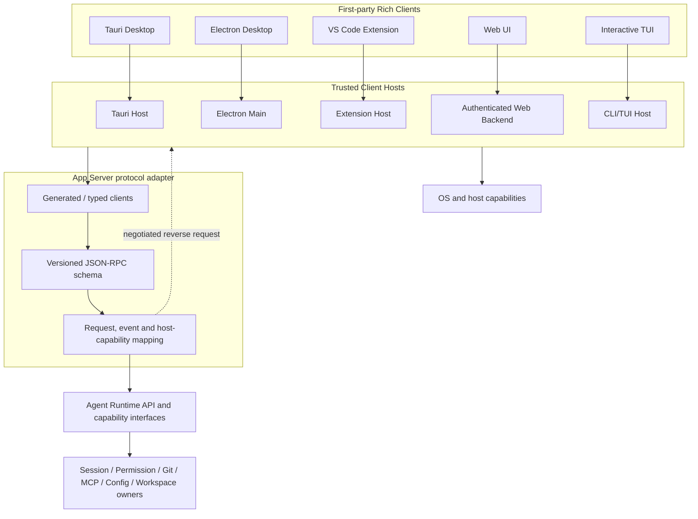
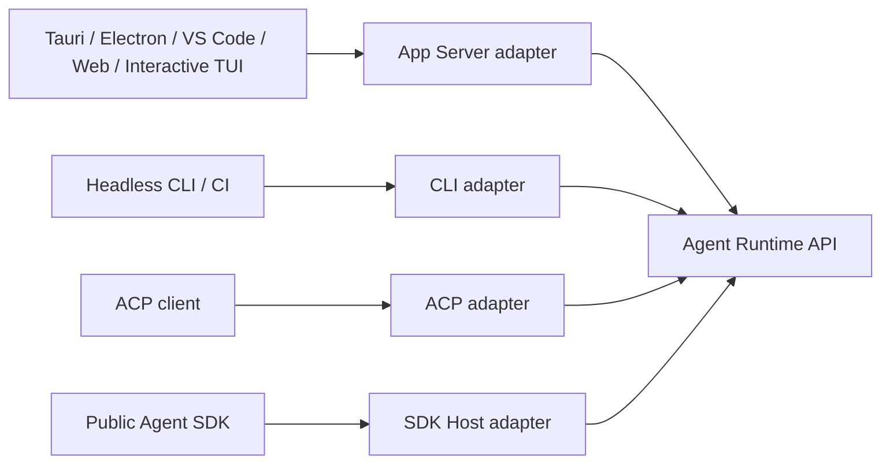
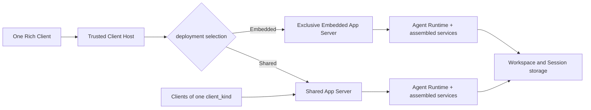
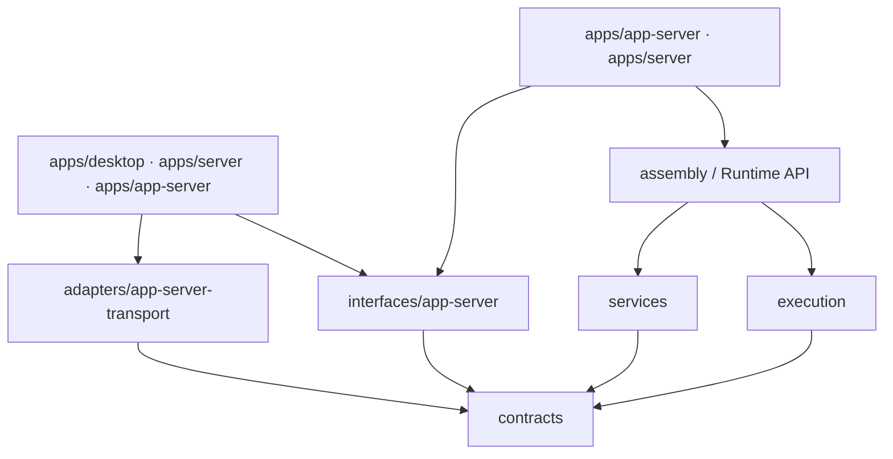

# BitFun App Server 架构设计

本文定义 BitFun 面向第一方 Rich Client 的统一后端协议边界。它服务于 Desktop GUI、
Electron、VS Code Extension、Web UI、交互式 TUI 和未来其他交互式客户端，使前端框架可以替换、前后端
可以独立演进，同时保持产品逻辑、状态所有权和平台能力边界不变。

本文是 [`product-architecture.md`](product-architecture.md) 的专题展开；Agent Runtime 的
Direct Runtime、Embedded App Server 与 Shared App Server 所有权和进程约束以
[`agent-runtime-deployment-design.md`](agent-runtime-deployment-design.md) 为准；公开 Agent SDK
与 SDK Host 的独立产品合同以
[`agent-sdk-product-architecture.md`](agent-sdk-product-architecture.md) 为准。发生冲突时以上位
文档为准。

> **规范范围**：第 3-7、9-10 节描述尚未实现的目标架构，不是当前仓库状态。当前生产路径和
> 迁移退出条件集中在第 8 节；在对应纵向切片完成验收前，Tauri command、legacy in-process TUI 和
> `agent-runtime-ipc` Shared TUI 仍是有效生产边界。

## 1. 决策摘要

BitFun 采用 **Rich Client App Server + 两种部署形态**：

1. Tauri Desktop、Electron、VS Code Extension、Web UI、交互式 TUI 和未来第一方 Rich Client 共享一份
   版本化 App Server 协议和生成的 typed client。
2. App Server 是协议组合与交付边界，不是 Session、Permission、Git、MCP、Config、
   Workspace 等领域行为的 owner。权威 DTO、策略和状态继续位于 Runtime API、
   `contracts/*` 与对应能力归属模块。
3. App Server 只定义 **Embedded** 与 **Shared** 两种部署形态。Embedded 是一个 Client 独占一个
   App Server；Shared 是同一种 `client_kind` 的多个 Client 连接一个 App Server。两种形态不改变
   schema、handler、错误、事件或业务语义。
4. Headless CLI/CI 默认保留 Direct Runtime；公开 SDK 保留独立 SDK Host 合同；ACP
   保留 ACP 协议 adapter；它们不为了界面协议统一而依赖 App Server。
5. Tauri、Electron、VS Code 等 Host 保留窗口、菜单、剪贴板、文件选择、终端界面、截图和
   Computer Use 等界面宿主职责。PTY、Shell、命令执行与进程生命周期属于目标 workspace 的
   Runtime Services，不是 Host reverse request。
6. Shared Agent Runtime 是 App Server 的一种目标部署模式，不是第二套 server。Controller、Observer、取消、
   背压、重放、公平调度和 Runtime-aware drain 属于统一 App Server 合同的多客户端部分。
7. App Server 使用唯一的独立后端 profile `AppServer`。运行位置、网络暴露、tenant、数据与 execution
   domain 通过组装输入和安全策略收窄能力，不形成第三种部署形态；当前代码尚未提供该 profile，不能用
   Desktop、CLI、Server 或 Web profile 代替。
8. 每个 App Server instance 固定一个产品身份、`client_kind`、数据命名空间、release channel、安全域与后端 profile。
   Client 只能协商自身展示能力与 Host capability，不能通过握手改变 Server 的产品策略或能力上限。
9. Browser Web UI 的 Web Backend 按场景承载 Embedded 或 Web-only Shared App Server。服务端运行必须增加
   网络认证、租户隔离、方法 allowlist、数据与 execution domain 约束，但不得因此命名为 Hosted 第三形态。

一句话定义：

> BitFun App Server 是第一方 Rich Client（包括交互式 TUI）面向同一 Agent Runtime 和产品能力的版本化
> JSON-RPC 协议 adapter；它不是新的 Runtime、公共 Agent SDK、通用 Remote API，也不是
> 所有产品入口必须经过的内部总线。

## 2. 背景与目标

### 2.1 要解决的问题

当前 Desktop 前端通过大量 Tauri commands 和事件消费后端能力。即使 command 后面的
产品逻辑已经平台无关，前端仍了解 Tauri invoke、事件命名和宿主 DTO。直接替换为
Electron 或新增 VS Code Extension 时，需要重新建立一套 Electron IPC 或 Extension Host
消息层，并容易复制服务调度、错误映射和事件投影。

Rich Client App Server 解决以下问题：

- 前端不依赖 Tauri、Rust 内部类型或 `bitfun-core` 句柄；
- Tauri、Electron、VS Code 和 Web 复用相同的产品操作与事件协议；
- Rust schema 生成 TypeScript client/type，减少手写 DTO 漂移；
- 后端可独立启动、测试、诊断和演进；
- 同一业务行为只由既有 owner 实现一次，各 Host 只保留平台适配。

### 2.2 设计目标

1. **可替换前端**：替换 Tauri 为 Electron 或增加 VS Code Extension 时，不复制 Runtime、
   Session、Permission、Git、MCP、Config 或 Workspace 行为。
2. **明确的实例关系**：Embedded 保持一对一生命周期，Shared 提供同类 Client 的多连接与独立恢复。
3. **一份 Rich Client wire**：Rich Client 共享 JSON-RPC method、错误、事件和版本协商。
4. **领域所有权不迁移**：App Server 映射既有 Runtime API 和能力接口，不创建第二套行为。
5. **宿主能力显式化**：不同前端通过 capability negotiation 表达平台能力，不假设功能齐全。
6. **远程默认关闭**：本机协议不因存在 WebSocket transport 自动成为远程或公网 API。

### 2.3 非目标

- 不把所有 Tauri command 原样转换为 JSON-RPC method；
- 不让 Headless CLI、CI、ACP 或 SDK Host 强制绕行 App Server；交互式 TUI 不属于该例外；
- 不用 App Server schema 取代 `contracts/*` 或领域 owner；
- 不把公开 SDK API 设计成 App Server 全量路由镜像；
- 不另建 Shared TUI wire、Shared GUI wire 或按客户端类型分叉的 App Server schema；Shared 实例仍按
  `client_kind` 隔离，不能用统一 schema 推导跨类型混连；
- 不保留 `Per-Client Managed` 或 `Hosted App Server` 作为第三种部署形态；
- 不以 App Server 的本机共享部署宣称已经支持 Remote 或公网协议；
- 不把 Tauri/Electron/VS Code 的 renderer、主题、快捷键或窗口状态放入协议；
- 不让浏览器 renderer、Electron renderer 或 VS Code Webview 持有本机启动令牌和系统凭据。

## 3. 逻辑架构

### 3.1 总体视图



Rich Client 共享的是协议和 typed client。Tauri Host、Electron Main、VS Code Extension
Host、Web Backend 与 CLI/TUI Host 仍是不同的可信边界，负责启动、认证、连接和平台能力。Renderer 或
Webview 不直接管理 App Server 实例，也不直接持有认证材料。

### 3.2 所有权边界

| 边界 | 拥有 | 不拥有 |
|---|---|---|
| 领域 owner / Runtime API | 业务 DTO、校验、状态、权限、取消、审计和持久化语义 | JSON-RPC method、连接、窗口或 WebSocket |
| App Server schema | method 名、wire 投影、错误信封、通知、协议版本和 capability negotiation | 领域状态、产品策略、具体 OS 服务和公开 SDK API |
| App Server handler | 调用上下文校验、DTO 映射、deadline/cancel 转换、事件过滤和反向请求协调 | 重复业务校验、第二份权威状态和平台句柄 |
| Client Host | App Server 生命周期、认证材料、renderer 隔离和平台 capability | Agent Session/Permission 权威状态 |
| Rich Client UI | 渲染、交互状态和产品工作流 | Runtime 句柄、凭据、进程生命周期和协议 owner |

`schema.rs` 可以是 **Rich Client JSON-RPC schema** 的单一来源，但不是全部后端领域契约
的单一来源。Schema 应引用、包装或生成自稳定领域 DTO；只有 wire 特有字段，例如
`request_id`、`operation_id`、协议版本和客户端 capability，才由 App Server 定义。

### 3.3 与其他入口的关系



- Rich Client（包括交互式 TUI）经 App Server 共享 wire；
- Headless CLI/CI 继续进程内强类型调用，以保留启动成本、确定性退出和故障隔离；
- ACP 和 SDK Host 映射各自独立、版本化的外部合同；它们可以共享领域 DTO 和行为 fixture，
  但不依赖 App Server handler 或 Rich Client wire。

## 4. 协议设计

### 4.1 JSON-RPC 与版本

协议使用正规 JSON-RPC 2.0。方法采用 `domain/verb` 命名，例如
`session/create`、`turn/submit` 和 `git/getStatus`。协议分为三层版本事实：

1. **App Server protocol range**：method、wire DTO、错误、事件和 capability；
2. **Runtime capability version**：Session、Tool、Permission 等业务语义；
3. **Client release version**：Tauri/Electron/VS Code/Web 自身版本。

初始化必须在任何业务请求前完成：

```json
{
  "jsonrpc": "2.0",
  "id": 1,
  "method": "initialize",
  "params": {
    "instanceIdentity": "opaque-instance-id",
    "deployment": "shared",
    "authentication": { "scheme": "localBearer", "credential": "<redacted>" },
    "client": {
      "id": "opaque-client-id",
      "kind": "vscode",
      "version": "1.2.0"
    },
    "protocol": { "min": 1, "max": 1 },
    "capabilities": {
      "filePicker": true,
      "clipboard": true,
      "terminalPresentation": true,
      "desktopCapture": false
    }
  }
}
```

Server 返回选定版本、固定的 deployment/client kind、Runtime capability、Host requirement、消息大小和并发上限。未知
字段、未知 method 和不兼容版本按稳定规则 fail closed；stable 与 experimental method
必须显式分层，不能仅靠文档约定。

本机认证合同：

- Embedded 凭据由唯一可信 Host 在创建实例时直接注入，不发布 discovery record，也不接受第二个
  client identity；Shared token、instance identity 与固定 `client_kind` 由私有 discovery record 提供。凭据只对一个 instance、用户安全域、
  protocol range 和有限有效期有效，不进入 renderer、命令行、URL、日志或普通事件；
- Server 依次校验 frame/JSON 结构、initialize-first、instance identity、凭据、client identity、
  deployment、`client_kind` 和 protocol range，最后才分配业务队列、attachment 或 Runtime context；
  Embedded 对第二个 Client fail closed，Shared 对不同 `client_kind` fail closed；失败不能泄露哪一项实例事实匹配；
- Host 重启、显式登出、权限或安全域变化时轮换并撤销旧凭据。Shared discovery 只有 owner 可以替换或清理，
  旧 instance 必须拒绝新凭据，新的 instance 必须拒绝旧凭据；
- 未认证连接也计入很小的连接与握手 budget。连续失败按 endpoint/OS peer 限速并在上限后关闭，
  但日志只记录脱敏原因码；错误 token、错误 instance、过期/撤销 token 和重复失败是协议必测项；
- 经网络暴露的 Embedded 或 Shared App Server 由 Web Backend 校验用户、tenant、workspace 和 method
  scope，再向 App Server 注入不可由浏览器覆盖的认证上下文；网络认证是正交安全层，不新增部署形态。

### 4.2 消息方向

| 方向 | 类型 | 示例 |
|---|---|---|
| Client -> Server | Request | Session、Turn、Git、Config 查询或操作 |
| Server -> Client | Response | 类型化结果或稳定错误信封 |
| Server -> Client | Notification | Agent 事件、状态失效、诊断和 capability 变化 |
| Server -> Client | Reverse request | 文件选择、用户输入、宿主确认、终端界面展示等已协商能力 |
| Client -> Server | Reverse response | Host capability 的结果、拒绝或取消 |

Permission owner 保留最终决定权。GUI 点击、SDK callback 或 Host reverse response 都只是
输入，不能直接改写权限状态或扩大产品/组织策略。

### 4.3 错误和副作用

稳定错误至少包含：

- `code`、`stage`、`retryable`、`message`；
- `operation_id` 和可选 `session_id` / `turn_id`；
- `action_required` 或类型化 `unsupported` 原因；
- 对已发送但结果未知的副作用返回 `outcome_unknown`。

创建、删除、重命名、配置写入、Git 写操作和 Turn 提交不得在响应丢失后自动重试。
客户端必须通过幂等 operation ID 或重新读取权威状态后再决定下一步。

### 4.4 事件、取消与背压

- 请求有 deadline，取消沿 Runtime 既有取消树传播；断开连接不自动等于删除 Session；
- request、response、notification 和 reverse request 队列必须有界；
- `Lagged` 或 `Closed` 是显式状态失效，不能伪装成透明恢复；
- 在事件 cursor/replay 交付前，重连只能重新查询权威快照，不能声称无缝续流；
- 事件按连接身份、Session attachment 和方法 capability 过滤；
- 多客户端共享前必须定义 Controller、Observer、审批竞争和 controller transfer。

现有 Shared TUI IPC 的 controller lease、断连取消、有界 framing 和 `outcome_unknown`
语义必须迁入统一 App Server 合同。迁移完成后删除旧 wire/server，不保留两套长期协议。

## 5. Transport 与部署

### 5.1 Transport 选择

Transport 由可信 Host 选择，schema 不感知具体实现：

| 场景 | Transport | 约束 |
|---|---|---|
| 测试和迁移 | in-memory pair | 使用相同 handler；不作为进程分离证明 |
| Embedded App Server | in-process channel、私有 stdio 或私有 Pipe/UDS | 一个 Client 独占一个 Server；无 discovery，拒绝第二连接 |
| 本机 Shared App Server | Windows Named Pipe / Unix Domain Socket | 私有 endpoint、认证握手、有界 framing、固定 `client_kind` |
| 服务端 Embedded/Shared | authenticated WebSocket/HTTPS | 独立网络认证、授权、Origin/CORS、租户与方法 allowlist |
| 远程 Rich Client | 暂不默认支持 | 必须经过 Server/Remote 安全设计评审 |

Transport adapter 位于 adapters 层；App Server interface 只依赖抽象连接和类型化消息。
不得因为实现了 WebSocket helper 就自动暴露完整本机 schema。

### 5.2 两种目标拓扑



`Embedded` 和 `Shared` 使用同一个 App Server schema、handler 和 conformance suite：

| 模式 | 实例关系 | 适用场景 |
|---|---|---|
| Embedded | 一个 Client 独占一个 App Server 实例 | 默认单 Client 工作流、由 Client Host 私有创建和管理 |
| Shared | 同一种 `client_kind` 的多个 Client 连接一个 App Server 实例 | 多个 TUI、Tauri Desktop、Electron Desktop、VS Code 或 Web 同类 Client 的协作与连续运行 |

部署选择只决定承载方式、discovery、连接数量和 drain 条件。不得按模式复制 method、handler、
领域 DTO 或 Runtime owner。Shared 模式必须完成 Controller/Observer、事件恢复、公平调度、审批竞争和
Runtime-aware drain；Embedded 使用同一逻辑协议合同，只可因单连接事实简化运行时状态。

不同 `client_kind` 不得连接同一 Shared instance。例如 TUI、Desktop、VS Code 和 Web 必须分别发现或创建
自己的 Shared instance；跨形态接力通过持久化 Session、显式 handoff 或其他领域合同完成，不通过混连同一 Server。
Browser Web UI 也只在 Embedded/Web-only Shared 两种形态中选择，本机超集不能因 wire 相同而自动发布到网络。

### 5.3 生命周期与身份

- Host 使用产品身份、数据命名空间、release channel、当前用户和协议范围定位兼容 binary 与 instance；
- 业务 payload 前必须完成双向版本校验和本机认证；token 不进入日志、URL 或 renderer；
- Host 负责选择 Embedded/Shared、创建或发现实例、健康检查、崩溃提示和有界重启，Runtime 负责 Session/Turn 生命周期；
- Embedded 的身份和生命周期绑定唯一 Client Host，可同进程或私有子进程承载；Shared 使用独立 idle policy；
- 服务端 orchestrator 可以创建 Embedded 或 Shared 实例并绑定 tenant、数据与 execution domain；浏览器身份不能选择或覆盖这些实例事实；
- App Server 退出必须执行 Runtime-aware drain，不能只按连接计数推导；
- workspace ownership 和 Session 单写继续使用现有 Core owner，不进入普通 wire；
- Remote workspace 的文件、进程、凭据和 Runtime 必须位于目标 execution domain，禁止
  静默回落本机。

### 5.4 产品组装与共享兼容性

App Server 是后端产品组装根。目标产品能力系统增加唯一的 `AppServer` profile，不得由现有 `Desktop`、
`Cli`、`Server` 或 `Web` profile 拼接冒充。具体运行环境再通过受信组装输入选择本机或 tenant-scoped provider；
服务端环境默认不包含用户机器的 filesystem、process、credential、Computer Use 或本机 plugin runtime。
这些 capability 与安全差异不改变 Embedded/Shared 两种实例关系。

实例启动时消费唯一后端 profile、已验证的产品组装结果和 Runtime Configuration，之后这些实例级事实不可由
任一 Client 改写。Desktop、TUI、VS Code 和 Web 的宿主形态只影响前端布局、renderer 生命周期和可提供的
Host capability，不形成不同的领域语义。

`client_kind` 标识具体宿主形态，而不是宽泛界面类别。至少区分 `tauri-desktop`、`electron-desktop`、
`vscode`、`tui` 和 `web`；只有值完全相同的 Client 才能连接同一 Shared instance。新增 Client 形态必须
分配新值并独立验证，不得仅因复用 Desktop 布局或 App Server schema 就沿用其他形态的值。

Shared discovery key 至少包含产品身份、`client_kind`、数据命名空间、用户/组织安全域、release channel、协议兼容范围和 execution
domain。只有这些事实兼容且 `client_kind` 完全相同的 Client 才能连接同一 Shared instance。不同客户端形态、品牌、数据隔离域、组织策略或不兼容 release
channel 必须使用不同实例；禁止先连接再通过 Client 参数切换 Server identity、插件策略、权限上限或持久化根。

连接握手可以协商 Client 类型、release version、语言、展示 capability、Host capability，以及 Server 已组装能力的
只读可用性和类型化降级原因。它不能协商产品身份、数据根、组织安全策略、内置扩展集合或 Server capability 上限；
这些都是实例创建事实。

method/capability 的可用性由三个独立集合共同收窄，不能只靠 UI 隐藏或单层 capability negotiation：

1. **Backend assembly**：该 `AppServer` profile 与运行环境实际装配的 Runtime 和 service capabilities；
2. **Host capabilities**：仅当 operation 需要 reverse request 时，当前认证 Client 可提供的文件选择、
   剪贴板、窗口、终端展示等反向能力；
3. **Connection method allowlist**：当前身份、tenant/workspace scope 和协议版本允许调用的方法。

这三个集合不是完整授权公式。每次 operation 仍必须由 Server 解析且 Client 不可覆盖的 identity、tenant、
workspace/resource ownership 和 operation scope 建立授权上下文，再交给 Runtime Permission owner、组织/用户
策略与 operation-specific policy 作最终裁决并记录审计。已装配且在 method allowlist 中，只表示请求可以进入
该裁决流程，不表示请求已经获准；不需要 reverse request 的普通 Runtime method 也不受 Host capability
可用性虚假限制。

本机与服务端运行环境至少各有 allow/deny fixture；服务端必须证明未装配或拒绝本机文件、进程、凭据、原生插件
和 Computer Use 能力，本机也不能因 Host 声明某能力就绕过 backend plan 或 connection allowlist。

## 6. 平台能力边界

现有 Desktop commands 需要按所有权分类，而不是机械迁移：

| 类型 | 处理方式 |
|---|---|
| Session、Turn、Permission、Git、MCP、Config、Workspace 等产品能力 | 通过 App Server 映射既有 Runtime/能力接口 |
| 窗口、托盘、菜单、更新、原生对话框 | 留在 Tauri/Electron/VS Code Host |
| 文件选择、剪贴板、终端窗口打开/聚焦/展示、截图、Computer Use 界面操作 | 经协商后的 Host capability/reverse request |
| PTY、Shell、命令执行、子进程、取消和回收 | 由 workspace execution domain 中的 Runtime Services 执行；不发送回 Client Host |
| 只适用于特定 Host 的能力 | 返回类型化 `unsupported`，UI 据此隐藏或禁用 |

Host capability 必须声明输入、结果、权限、deadline、取消和失效语义。App Server 不得
直接持有 `tauri::AppHandle`、Electron 对象、VS Code API 对象或原始 OS 窗口句柄。
命令请求必须携带由 Server 解析且 Client 不可覆盖的 workspace/execution-domain identity，并沿该域的
权限、审计、取消和资源预算执行。远程 workspace 缺少目标 terminal provider 时返回 `unsupported`，禁止
回落到运行 GUI/TUI 的控制端机器。

## 7. 模块与依赖

目标代码组织：

```text
src/crates/interfaces/app-server
  Rich Client schema、typed Rust client、抽象 handler contract、版本与 capability negotiation

src/crates/adapters/app-server-transport
  in-memory、stdio、Named Pipe、UDS、WebSocket transport adapter

src/apps/app-server
  Shared App Server 独立进程入口、产品组装、生命周期、日志与诊断

src/apps/desktop
  Tauri Host、Embedded App Server 私有承载、同类 Shared discovery、Desktop capabilities

src/apps/server
  服务端 Embedded/Web-only Shared App Server 承载、WebSocket/HTTP 暴露、网络认证、租户/远程策略和 capability allowlist

src/crates/contracts/*
  领域 DTO、事件事实、稳定错误与 Runtime ports
```

依赖方向：



约束：

- App Server interface 不依赖 `src/apps/*`；
- App Server interface 只通过 `contracts` 中的稳定 DTO/ports 描述 handler contract，不依赖具体
  Assembly、Runtime 或 service 实现；
- transport adapter 不依赖 `bitfun-core`、Tauri、SDK Host 或 Runtime 实现；
- Embedded Client Host、`apps/app-server` Shared 入口与服务端 `apps/server` 组装根把 Assembly/Runtime API provider
  注入 handler contract；
  具体 handler wiring 不进入客户端共享的 interface crate，也不直接构造 OS service；
- `interfaces/sdk-host` 继续保持独立，不依赖 App Server 或 `bitfun-core`；
- ACP adapter 不经 App Server 做 ACP -> JSON-RPC -> Runtime 的双重协议转换；
- Web 生成类型只暴露该 Host allowlist 中真实可用的 method，不把本机超集自动发布到网络。

## 8. 非规范迁移说明

### 8.1 迁移来源

| 范围 | 当前状态 |
|---|---|
| Desktop | Tauri command/event adapter 直接消费 Core/Runtime 能力 |
| Server Host | Health、Info 与 SSH-backed detached dispatch controller/observer 外壳；不启动 Agent Runtime |
| Server WebSocket | 当前仅绑定 loopback，无连接认证；只有请求携带 `Origin` 时才校验 allowlist，缺失 `Origin` 会放行。既有 `type=request/response/event` 私有信封暴露 install、submit、cancel、answer、append 等可变 dispatch，不是正规 JSON-RPC 2.0 |
| App Server crate/process | 尚未创建 |
| Shared TUI | 当前私有 IPC 是迁移来源；目标改为 App Server Shared deployment 并删除独立 wire/server |
| Headless CLI / CI | Direct Runtime；当前明确拒绝非交互 `--shared`，本迁移不改变该合同 |
| Runtime ownership | 当前 Shared owner 绑定单一 workspace；目标多 workspace registry 尚未实现 |
| Product capabilities | 当前没有 App Server backend profile；Desktop/CLI/Server/Web profile 不能代替 |
| ACP / SDK Host | 各自协议 adapter 与生命周期保持独立 |

迁移映射与退出条件：

| 当前模块/合同 | 目标位置 | 退出或调整条件 |
|---|---|---|
| Tauri business command/event | App Server method/event 或保留为 Host-only command | 对应纵向切片行为等价、Remote/network policy 明确、Desktop dogfood 与有界回滚通过 |
| `agent-runtime-ipc` operation/handler/server | App Server schema/handler | TUI 改用 typed client，controller/cancel/backpressure/`outcome_unknown` fixture 全部通过 |
| Named Pipe/UDS、discovery、framing | `app-server-transport` 内部原语 | 证明协议中立；保留认证、frame、queue、deadline 和 cleanup 限制或记录经测量的变更 |
| 单 workspace Shared ownership | App Server Runtime context registry + per-workspace `CoreRuntimeOwnership` | 第二 workspace、并发 attach、Remote、冲突、断连回收和重启恢复测试通过 |
| Desktop/CLI capability profile | 唯一 `AppServer` backend profile + 环境安全策略 | 本机/服务端 allow/deny、tenant/data/execution-domain 隔离通过，禁止用旧 profile 临时代替 |
| 既有 Server WebSocket envelope | allowlisted App Server network exposure，或保留独立 Server/Remote wire | 网络认证、Origin/CORS、tenant/workspace scope 和方法 allowlist 通过；不得直接发布本机超集 |

当前 Server WebSocket 的安全边界是 loopback bind，而不是连接认证或只读 Observer。它会使用 Server Host
已加载的 SSH connection 执行可变 detached dispatch；在 OS peer/身份认证、workspace/target scope、方法
allowlist 和拒绝测试完成前，不得放宽 loopback bind，也不得把该 envelope 复用为网络 App Server
或远程入口。

在最后一个旧 consumer 退出前，`agent-runtime-ipc` 继续遵守其局部 `AGENTS.md` 中的完整当前生产
合同。迁移不得以“旧协议最终会删除”为由提前放宽认证、大小、连接、operation、idle 或 cleanup 限制。

### 8.2 迁移阶段

#### 阶段 A：合同归属与首个纵向切片

1. 选择 Session create/list/restore、Turn submit/cancel、事件和 Permission 作为首个完整旅程；
2. 将共享业务 DTO 和错误放入现有 contracts/Runtime owner，而不是 App Server 私有 DTO；
3. 建立 schema codegen、drift check、stable/experimental 和 capability negotiation；
4. 使用 in-memory pair 完成 handler/typed client 行为 fixture；
5. 保留既有 Tauri 路径作为兼容回退，证明结果和副作用等价。

#### 阶段 B：Desktop dogfood

1. Desktop 的目标纵向切片改用 AppServerClient；
2. 窗口和平台 command 保留在 Tauri Host；
3. Permission/UserInput 与文件选择建立 reverse request；
4. 测量启动、首 token、事件吞吐、内存和取消延迟；
5. 达到行为与性能门槛后逐域迁移，不按 command 数量批量搬运。

#### 阶段 C：Embedded 承载

1. 增加可嵌入的 App Server 组装入口与私有 transport；
2. 实现版本匹配、唯一 Client 身份、drain 和崩溃恢复；
3. Desktop 使用一个 Client 对一个 Embedded App Server；
4. 删除对应旧 Tauri 业务桥前，保留端到端兼容测试和回滚开关。

#### 阶段 D：交互式 TUI 收敛

1. CLI/TUI Host 使用与 Desktop 相同的 AppServerClient 和本机 transport；
2. 默认交互式 TUI 使用独占 Embedded 实例，`--shared` 连接 TUI-only Shared 实例；
3. 将当前 Shared TUI 的 controller lease、取消、背压、`outcome_unknown` 和 idle cleanup 合同迁入 App Server；
4. 使用同一 fixture 验证旧 Shared TUI 与 App Server Shared 模式行为等价；
5. 删除 `agent-runtime-ipc` 的独立 operation、framing、server 和 discovery 实现，或将真正通用的本机原语下沉为
   App Server transport 内部实现，不保留第二套协议入口。

#### 阶段 E：新增 Rich Client

1. Electron Main 或 VS Code Extension Host 创建匹配 Embedded App Server，或发现完全相同 `client_kind` 的 Shared instance；
2. Renderer/Webview 复用生成的 client API，但只经可信 Host 访问；
3. 每个新 Host 提交 capability、权限、生命周期、安装升级和远程 workspace 验证；
4. Web 接入另行完成网络认证与方法 allowlist，不能复用本机信任假设；每种新 Client 只能连接自身
   `client_kind` 的 Shared instance。

#### 阶段 F：同形态 Shared Rich Client

分别为 TUI、Desktop、VS Code 和 Web 验证 Shared 模式。同一 Shared App Server 只接受一个固定
`client_kind`；不同形态即使协议兼容也必须使用不同实例。每种 Shared 形态都必须完成 Controller/Observer、
事件恢复、公平调度、Runtime-aware drain、Host capability 路由和客户端身份审计。

## 9. 验收门槛

每个迁移切片至少证明：

1. Runtime/领域 owner 未迁移，旧入口和 App Server 路径共享行为 fixture；
2. schema 生成可重复，Rust/TypeScript drift check 通过；
3. 请求、响应、事件和 reverse request 都有大小、队列、deadline 和取消上限；
4. 副作用具有 operation ID、明确失败与 `outcome_unknown` 语义；
5. Host capability 缺失返回类型化 `unsupported`，不静默调用本机替代能力；
6. 本机认证材料不进入 renderer、URL、日志、Session transcript 或普通事件；
7. 服务端 Embedded/Shared 覆盖网络认证、tenant/data 隔离、方法 allowlist、跨租户拒绝和 Runtime-aware drain；
8. Remote workspace 行为在目标 execution domain 验证；
9. Desktop 与交互式 TUI 至少覆盖启动、Session 恢复、Turn、Permission/UserInput、取消、重连和退出；
10. 性能基线覆盖冷启动、首 token、流式事件吞吐、CPU、内存和大 transcript；
11. 删除旧 adapter 前有兼容期限、回滚方式和生产 consumer 证据。

## 10. 不变量

- 只有一套 Agent Runtime 行为 owner；
- App Server 不拥有 Session、Tool、MCP、Permission、Hook、Event、Git 或 Workspace 状态；
- Rich Client 只有一套 App Server wire；App Server 只存在 Embedded 与 Shared 两种部署形态，不得分叉协议或业务 handler；
- Embedded 恰好一个 Client 对一个 Server；Shared 多个 Client 对一个 Server，但一个实例只接受一种 `client_kind`；
- SDK Host wire 和 ACP wire 与 App Server 合同独立；Headless CLI/CI 是 Direct Runtime 调用而不是 App Server Embedded；
- Headless CLI/CI 不因 GUI 解耦增加后台进程或序列化成本；
- 平台能力留在真实 Host，凭据和执行发生在正确 execution domain；
- 未经过认证、授权和远程策略评审的本机 method 不暴露到 WebSocket/HTTP；
- 多客户端共享必须在统一 App Server 合同中交付 Controller、背压、恢复和生命周期语义；
- 未有真实 consumer 的 method、transport 或 capability 不进入稳定协议。
