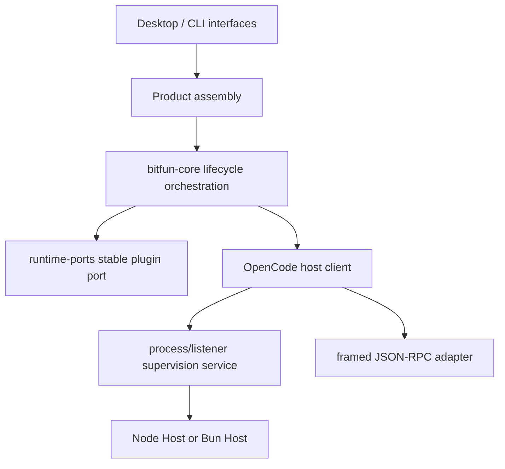
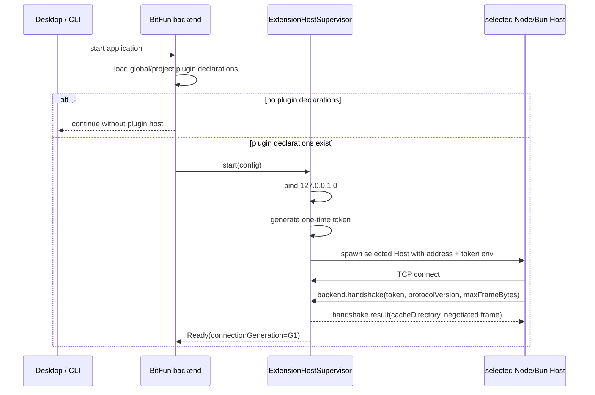
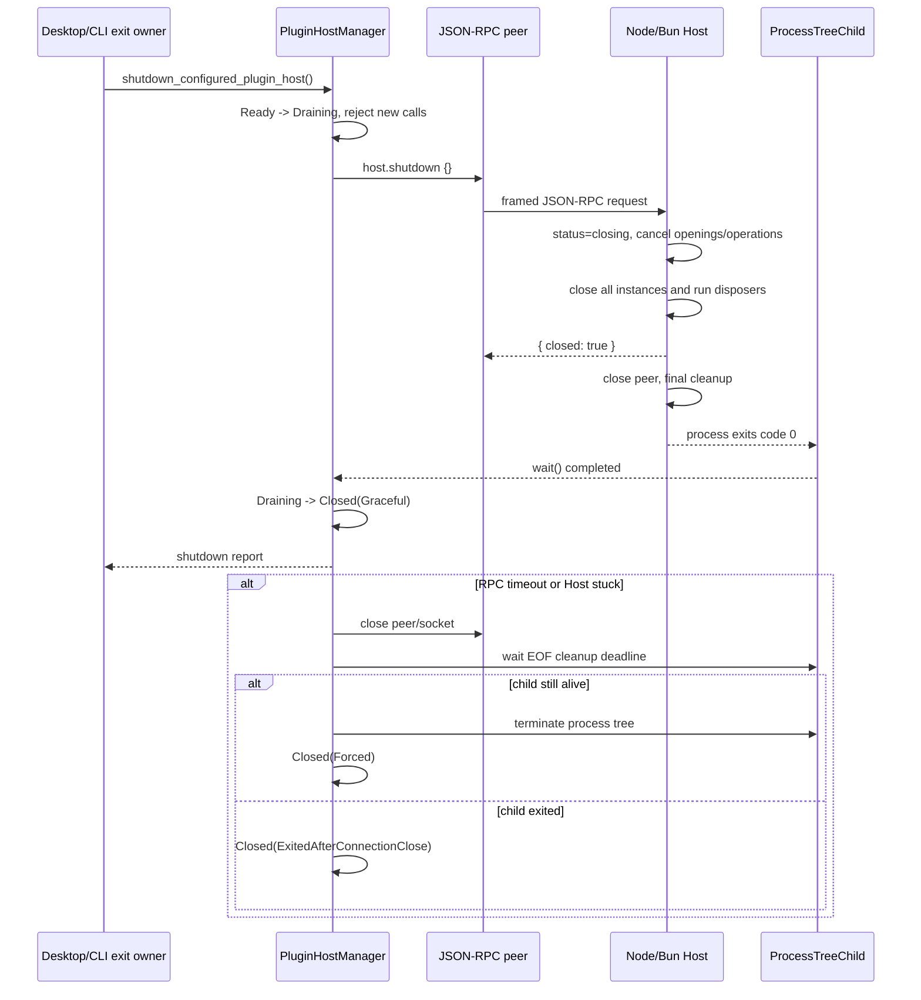
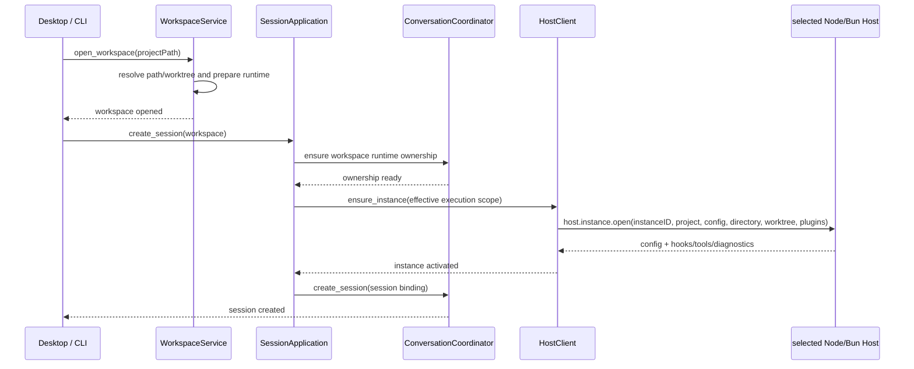

# BitFun 集成 OpenCode Extension Host 设计方案

## 1. 文档目的

本文设计 BitFun 后端直接启动并监督可选择的 Node/Bun `opencode-ext-host` runtime，覆盖进程启动、IPC/RPC、插件激活和 workspace/session 生命周期集成方案。

需求目标：

1. BitFun 启动时，如果存在插件配置，则 Rust supervisor 按照 Host 级 `pluginRuntime` 开关直接拉起一个 Node 或 Bun `opencode-ext-host` runtime；默认值为 `node`。
2. 一个 BitFun 后端进程对应一个插件 Host runtime，数量保持 1:1；不按 workspace/session 或单个插件增加 runtime。
3. 后端与 ext-host 建立经过认证的本地 IPC 连接。
4. 在连接之上实现双向 RPC，并完成一个可验证的 demo 调用。
5. 打开新的 workspace/session 时，通过后端 RPC 调用插件进程，激活配置中的插件。

本文同时记录当前落地状态和后续目标；未标记为已落地的插件 hook/tool/provider 能力仍属于后续阶段。

本次代码落地范围：Rust 通过受管进程树直接启动选定 Host，不额外引入 Node launcher；已实现 plugin 非空门控、Node/Bun Host 选择、listener、一次性 token、首帧 `backend.handshake`、进程级单例，以及双向 JSON-RPC peer。peer 使用 `backend:<generation>:<sequence>` 请求 ID、pending map、独立 reader/writer、有界 outbound queue、反向 handler 并发限制、deadline 和断连时 pending 失败语义。Desktop 在 managed/existing worktree 解析完成后、持久化新 session 之前调用 typed `host.instance.open`；进程级 registry 按 canonical execution directory 与插件配置 fingerprint 复用逻辑 instance，同 workspace 的后续 session 不重复激活。当前本机 `app.json` 使用 `pluginRuntime=bun`，插件声明为 `.bitfun/plugins/demo.echo/demo.mjs`。`pluginRuntime=node` 启动 `node extension-host-node.js`，`pluginRuntime=bun` 启动 `bun extension-host.js`。开发模式自动解析仓库内 `src/apps/extension-host/dist`，发布包从可执行文件旁的 `resources/ext-host` 加载；也可分别使用 `BITFUN_OPENCODE_NODE_HOST_ENTRY`、`BITFUN_OPENCODE_BUN_HOST_ENTRY`、`BITFUN_NODE_COMMAND` 和 `BITFUN_BUN_COMMAND` 覆盖。下一阶段需要将 Host 返回的 hooks/tools/providers 注册进 BitFun 的稳定 runtime port，并补 workspace 显式关闭时的 instance release。

## 2. 现有代码与参考实现

### 2.1 BitFun 现有边界

BitFun 当前是 Rust workspace 加 React 前端，核心运行时保持平台无关，由 app/adapter/service 负责平台接入。

与本需求直接相关的现有代码：

| 代码 | 当前职责 | 本方案中的使用方式 |
| --- | --- | --- |
| `src/crates/execution/plugin-runtime-client` | Rust 侧 `PluginRuntimeClient` 默认实现，负责 dispatch 校验、超时、缓存、诊断和 quarantine | 继续作为可靠性与产品端口边界；不直接持有子进程 |
| `src/crates/execution/plugin-runtime-client/src/adapter.rs` | `PluginRuntimeAdapter`，提供 `read_plugins` 和 `dispatch` | 新增 ext-host adapter 实现该边界，或增加一个专用 host client 组合层 |
| `src/crates/contracts/runtime-ports` | 稳定 runtime/plugin DTO 与 port | 仅放跨 owner 稳定的最小 DTO/trait，不放 Node/Bun、TCP、OpenCode 原始对象 |
| `src/crates/assembly/core/src/plugin_host.rs` | 根据全局配置组装进程级 Host 生命周期 | 保持产品选择与生命周期组装，不实现协议业务方法 |
| `src/crates/adapters/opencode-plugin-host` | 受管子进程、loopback listener、认证 handshake | 复用同一 adapter 启动 Node 或 Bun 入口 |
| `src/crates/adapters/agent-runtime-ipc` | Shared TUI 专用的 Windows Named Pipe/Unix Domain Socket IPC | 明确不复用、不扩展；它不是 ext-host 协议 |
| `src/crates/assembly/core/src/runtime_ownership.rs` | 一个 BitFun 进程对多个 workspace 的运行时 ownership | ext-host 进程跟随后端进程，不跟随 workspace 数量 |
| `src/apps/desktop/src/runtime/session_application.rs` | Desktop session scope、runtime ownership、session 生命周期 | 在 workspace runtime ready 后接入 host instance 激活 |
| `src/apps/desktop/src/runtime/mod.rs` | Desktop runtime 组装与 coordinator 生命周期约束 | 注入一个进程级 host supervisor/client |
| `src/apps/cli` | CLI/TUI 产品入口与 product-full runtime assembly | 仅 interactive CLI 按产品能力显式接入同一套 supervisor |

BitFun 的实际模型是：一个后端进程持有一个 `ConversationCoordinator`，该 coordinator 管理多个 workspace、session 和 turn。打开 workspace 不会重新创建整个 Agent Runtime。因此 ext-host 也应是后端进程级资源，而 workspace 只对应 host 中的逻辑 instance。

### 2.2 现有 `agent-runtime-ipc` 不适用

`src/crates/adapters/agent-runtime-ipc/AGENTS.md` 明确该 crate：

- 只服务 first-party Shared TUI adapter；
- 只允许 Windows Named Pipes 或 Unix Domain Sockets；
- 不是公共 SDK、远程协议或 Runtime owner；
- 不允许增加 TCP、HTTP、WebSocket。

`opencode-ext-host` 的既定协议则要求 Rust 先建立 loopback TCP listener，再由选定的 runtime 子进程连接。因此本需求使用独立的 OpenCode extension-host adapter/supervisor，不把两种协议合并到 `agent-runtime-ipc`。Rust 直接连接真正的 ext-host runtime，避免增加 launcher 或 RPC 代理层。

### 2.3 `opencode-ext-host` 现有协议事实

参考目录：

`src/apps/extension-host`

关键事实：

- Rust 是 backend，负责 listener、应用状态、HTTP 行为、生命周期、监督和超时；host 本身不负责这些产品级状态。
- 当前参考 host 是独立的 Bun 进程，目标兼容 `@opencode-ai/plugin@1.17.18` 和 `@opencode-ai/sdk@1.17.18`，构建入口为 `dist/extension-host.js`；它作为 Bun Host 保留。
- 当前源码不是纯 Node runtime，使用了 `Bun.connect`、`Bun.serve`、`Bun.spawn`、`Bun.file`、`Bun.env` 等 Bun API。
- Node Host 不是简单把 Bun entrypoint 的启动命令替换成 `node`；需要使用 Node API 实现同一 host 行为。Bun Host 继续使用当前 Bun 实现。
- Rust 先绑定 `127.0.0.1`，再按 `pluginRuntime` 直接启动 Node Host 或 Bun Host。
- 两种 runtime 都使用 `OPENCODE_EXTENSION_HOST_RPC_ADDRESS` 连接 Rust。
- 两种 runtime 都使用 `OPENCODE_EXTENSION_HOST_RPC_TOKEN` 在首个 `backend.handshake` 请求中认证。
- 控制通道是带四字节大端长度前缀的 JSON-RPC 2.0。
- 请求可以双向流动；Rust 必须在等待响应时继续处理 Bun 发来的请求。
- 默认协商帧大小为 16 MiB，最大不能超过 64 MiB。
- stdout/stderr 不是协议通道，只能作为普通进程输出和诊断来源。
- Node Host 和 Bun Host 必须实现相同的 `host.instance.open` 行为：创建目录作用域的逻辑实例，在插件 entrypoint 和 `config` 生命周期 hook 执行后返回 config、diagnostics、hooks、tools、auth、providers、workspace registrations 和 gateway URL。
- host 已经支持 plugin tool、auth/OAuth、provider model、experimental workspace adapter、generic hook/event，以及每实例 loopback gateway 和 pull stream；这些能力均通过 `PROTOCOL.md` 定义的 JSON-RPC 方法暴露。
- `host.hook.call` 只调用 operational hook；`config`、`tool`、`auth`、`provider`、`event` 和 `dispose` 是生命周期或 registration 能力，不能全部当成 operational hook 名称调用。
- npm 插件安装到 Rust 在 handshake 返回的 cache directory，禁用 lifecycle scripts；本地插件原地加载，依赖必须能在本地解析。host 不读取或合并 `opencode.json`，插件声明由 Rust/BitFun 侧传入。
- host 支持多个 instance；同一进程内插件解析/导入可并发，成功 entrypoint 按声明顺序执行，config hook 按顺序执行，独立 instance 和独立调用可以重叠。
- `host.instance.close` 会取消 active tool/fetch、释放 stream/auth handle、关闭 gateway 并执行 disposer；TCP 连接断开会对全部 instance 做清理。
- TCP 连接断开会清理所有逻辑 instance；Rust 负责决定是否重启，host 不提供持久化恢复。

上述协议事实来自 Bun Host 参考实现；Node Host 必须以相同协议和语义作为兼容目标。参考材料包括：

- `src/apps/extension-host/README.md`
- `src/apps/extension-host/PROTOCOL.md`
- `src/apps/extension-host/src/main.ts`
- `src/apps/extension-host/src/rpc.ts`
- `src/apps/extension-host/src/host.ts`
- `src/apps/extension-host/src/service.ts`

## 3. 目标架构

### 3.1 总体拓扑


核心规则：

```text
1 BitFun backend process : 1 ExtensionHostSupervisor : 1 selected ext-host runtime

N workspace : N logical host.instance.open instances
N workspace : 1 ext-host runtime
M sessions per workspace : 1 logical host instance
```

不能按 workspace、session 或 plugin 再创建 ext-host runtime。workspace/session/plugin 是逻辑身份和策略域，不是物理进程身份。

### 3.2 分层归属



职责边界：

| 层 | 负责 | 不负责 |
| --- | --- | --- |
| Interface/app | 启动入口、产品 profile 选择、`pluginRuntime` 选择和用户可见错误映射 | 直接操作 TCP、子进程或 Node/Bun API |
| Assembly | 注入 supervisor/client，选择 Desktop/CLI 是否启用 | 解析协议、spawn 子进程、实现 plugin hook |
| Core | 在 workspace/session 生命周期中调用窄 host port | 持有 OpenCode 原始类型、实现 TCP/进程监督 |
| Runtime contracts | 稳定的 plugin activation/read/dispatch 事实和错误 | 依赖 services/adapters/assembly；暴露 host 内部对象 |
| Host adapter | 将 BitFun typed request 映射为 `host.*` RPC，并将结果投影回来 | 决定产品权限、持久化 session、UI 状态 |
| Process service | listener、runtime spawn、token、shutdown、stdout/stderr、进程树清理 | plugin 语义和产品能力选择 |
| Node/Bun ext-host runtime | 在统一协议下加载并执行 JS/TS plugin；Node Host 与 Bun Host 对外语义一致 | 持久化 BitFun 状态、决定 Rust 的重试策略、混用两种 runtime |

## 4. 启动与关闭流程

### 4.1 启动条件

启动时先加载插件声明和 Host 级运行时选择。如果解析结果为空，则不创建 listener、不启动 Node/Bun Host、不创建 host client connection。

如果存在至少一个有效插件声明，则创建一个后端进程级 supervisor，并执行：

1. 创建 plugin cache directory。
2. 绑定 loopback TCP listener，建议绑定 `127.0.0.1:0`，由系统分配端口。
3. 生成本次 child 专用的高熵随机 token。
4. 读取 Host 级 `pluginRuntime`，缺省为 `node`，只允许 `node` 或 `bun`。
5. Rust 通过 `ProcessTreeChild` 直接启动选定的 Node/Bun Host，并设置：
   - `OPENCODE_EXTENSION_HOST_RPC_ADDRESS=127.0.0.1:<port>`
   - `OPENCODE_EXTENSION_HOST_RPC_TOKEN=<one-time-token>`
6. Host stdout/stderr 使用 pipe 接入 `plugin-host.log`；`ProcessTreeChild` 负责后端退出时的进程树兜底清理。
7. 接受 runtime 连接。
8. 等待并处理 runtime 发出的 `backend.handshake`。
9. 校验 token、protocolVersion、maxFrameBytes。
10. 返回绝对且可写的 plugin cache directory。
11. 只有握手成功后才允许调用任何 `host.*` 方法。
12. 将 supervisor 状态设置为 `Ready`，记录本代实际 runtime kind。

建议状态机：

```text
Disabled
  -> Starting
  -> Listening
  -> ChildSpawned
  -> Handshaking
  -> Ready

Starting / Listening / ChildSpawned / Handshaking
  -> Failed

Ready -> Closing -> Closed
Ready -> Lost -> Restarting or Unavailable
```

### 4.2 启动时序图



### 4.3 关闭时序

#### 4.3.1 目标与边界

正常退出 BitFun 时必须优先执行协议级优雅关闭，而不是直接依赖 `ProcessTreeChild::drop` 或 Windows Job Object：

```text
stop admission
  -> host.shutdown
  -> Host closes all logical instances and plugin resources
  -> shutdown response
  -> Host closes RPC and exits with code 0
  -> Rust reaps child
```

进程树能力仍然保留，但只作为超时、协议失败、Host 卡死或 BitFun 崩溃时的最后兜底。最小化到托盘不是 backend shutdown，不得关闭 Host；只有 Desktop 真正退出、重启、CLI 结束或 backend owner 被销毁时才启动全局关闭。

当前实现状态：

- Host 已实现幂等 `host.shutdown`，会关闭所有 instance，将 RPC EOF 作为 best-effort cleanup fallback，并在 shutdown response 写链完成后关闭 transport。
- Rust `PluginHost::shutdown(self, policy)` 消费 Host ownership，先 drain 已准入请求，再发送 `host.shutdown`，随后等待进程退出、关闭 peer 或强制清理进程树。
- 全局 Host 使用 `OnceCell<Mutex<Option<PluginHost>>>`，第一个 shutdown caller 取出 ownership；并发 caller 等待同一个完成通知和不可变 report。
- Desktop 的 tray quit、命令退出、startup-window quit、restart 和 `ExitRequested` 已进入同一个异步 cleanup；CLI worker 返回后也执行同一全局 Host shutdown。
- Windows Job Object/Unix process group 保留为 timeout、协议失败和 panic 路径的兜底；正常路径仍以 plugin disposer、response flush 和 Host finally cleanup 为准。

全局关闭不能先逐个串行发送 `host.instance.close` 再发送 `host.shutdown`。`host.shutdown` 已经是关闭所有 instance 的协议屏障，Host 内部会并发关闭现有 instance、等待正在 opening 的 instance 收敛、取消 operation/stream/fetch，并调用每个 plugin disposer。workspace/worktree 的局部生命周期仍使用 `host.instance.close`，backend 全局退出只发送一次 `host.shutdown`，避免关闭耗时随 workspace 数量线性增长。

#### 4.3.2 Rust supervisor 状态与所有权

当前 `OnceCell<Mutex<PluginHost>>` 不能在关闭时把 child 所有权取出，也不能表达并发关闭结果。建议保留进程级 singleton manager，但把可变状态改为可取出的 supervisor state：

```rust
enum PluginHostLifecycle {
    Disabled,
    Starting,
    Ready(PluginHost),
    Draining,
    Closed(PluginHostShutdownReport),
    Lost,
}
```

manager 本身仍可放在 `OnceCell` 中，内部使用 `Mutex<PluginHostLifecycle>` 和 `watch`/`Notify` 发布关闭完成事件。关闭发起者在锁内将 `Ready(host)` 原子替换为 `Draining` 并取得 `PluginHost` 所有权，随后释放锁再执行异步 RPC 和 process wait，不能持锁跨越网络等待。

并发语义：

- 第一个 shutdown caller 取得 Host 所有权并执行关闭。
- 后续 shutdown caller 看到 `Draining` 后等待同一个 completion，不重复发送 `host.shutdown`。
- `Disabled` 返回 `NotStarted`，不创建 Host。
- `Closed` 返回已保存的 report，保持幂等。
- application shutdown admission flag 设置后，`ensure_started`、`ensure_instance` 和新的 typed Host call 立即返回 `PluginHostShuttingDown`；不能在退出过程中创建新 generation。
- raw `PluginHostClient` 不应暴露给 assembly/UI；typed adapter facade 必须经过同一个 admission gate，防止已有 clone 在 `Draining` 后继续发普通 RPC。

建议 adapter 提供消费 ownership 的关闭接口：

```rust
pub async fn shutdown(self, policy: PluginHostShutdownPolicy) -> PluginHostShutdownReport;
```

消费 `self` 可从类型上保证关闭后的 `PluginHost` 不能重新用于 RPC。manager 则提供进程级幂等入口：

```rust
pub async fn shutdown_configured_plugin_host()
    -> BitFunResult<Option<PluginHostShutdownReport>>;
```

#### 4.3.3 分级 deadline 与兜底

建议第一版使用以下固定内部 deadline；它们不是用户配置项：

| 阶段 | 建议值 | 行为 |
| --- | ---: | --- |
| 已准入 RPC drain | 3 秒 | 拒绝新普通 request/notification，继续读取 response，并等待 drain 前已登记的 pending request |
| `host.shutdown` RPC | 5 秒 | 等待 Host 停止 admission、关闭 instance、取消资源并运行 disposer |
| shutdown response 后等待进程退出 | 2 秒 | 等待 Host flush response、关闭 socket、执行 finally 并正常退出 |
| RPC 失败/超时后的 EOF cleanup | 1 秒 | Rust 主动关闭 peer/socket，让 Host 的 EOF best-effort cleanup 有最后机会 |
| process-tree force cleanup | 500 毫秒 grace | Unix 先 TERM 后 KILL；Windows 关闭 kill-on-job-close Job 后 wait |
| Host stdout/stderr drain | 1 秒 | child 退出后等待日志 reader 和 writer flush，超时只告警，不阻塞最终退出 |

最坏关闭预算约 12.5 秒。任何阶段成功提前结束都立即进入下一状态，不为了凑满 deadline 而等待。应用退出不会因为插件清理失败而无限阻塞；超过总预算必须进入 forced cleanup。

`PluginHost::shutdown` 的判定顺序：

1. 将 typed client/supervisor admission 切换为 `Draining`，记录 generation。
2. 使用专用内部调用发送 `host.shutdown {}`；该调用允许穿过 draining gate，其他方法不允许。
3. 收到 `{ closed: true }` 后等待 child 正常退出。
4. 如果 RPC 返回错误或超时，主动关闭 JSON-RPC peer。Host 将 EOF 视为同一 best-effort global cleanup 触发器。
5. 再等待 EOF cleanup deadline；如果 child 已退出，即使没有收到 shutdown response，也记录为 `ExitedAfterConnectionClose`，不执行 force kill。
6. child 仍存活时调用 `ProcessTreeChild::terminate`；Windows Job Object 和 Unix process group 必须覆盖 Host 创建的受管后代。
7. reap child，关闭日志 pipe，清空 pending request、instance registry 和 connection-generation handles。
8. 发布一个不可变 `PluginHostShutdownReport`，将 manager 状态设置为 `Closed`。

为支持第 4 步，peer 需要新增显式、幂等的 control handle，例如 `PluginHostClient::close(reason)` 或独立 `JsonRpcPeerControl`。它只关闭当前 generation 的 reader/writer、失败所有 pending request，并让 TCP halves 被 drop；不得直接启动新 generation。`PluginHost` 必须持有该 control，不能在 `JsonRpcPeer::start` 后只保留普通 request client。

建议报告只包含安全诊断字段：

```rust
pub struct PluginHostShutdownReport {
    pub generation: u64,
    pub disposition: PluginHostShutdownDisposition,
    pub rpc_completed: bool,
    pub exit_code: Option<i32>,
    pub duration_ms: u64,
}

pub enum PluginHostShutdownDisposition {
    Graceful,
    ExitedAfterShutdown,
    ExitedAfterConnectionClose,
    Forced,
}
```

Host 未启动时 manager 返回 `Ok(None)`，因此 process-level report 不需要伪造 generation 或 `NotStarted` variant。收到有效 shutdown response 后若 child 以非零状态退出，使用 `ExitedAfterShutdown`，不能误报为 `Graceful`。

shutdown 是 app-exit cleanup，返回 report 而不是把错误继续向上传播并取消退出。`Forced` 和异常 exit code 必须记录 `WARN`，但 Desktop/CLI 在 bounded cleanup 后继续退出。

#### 4.3.4 Host 侧关闭合同

Node Host 和 Bun Host 必须保持完全相同的 `host.shutdown` 语义：

1. handler 一进入就同步将 Host 状态切换为 `closing`，拒绝新的 `host.instance.open`、hook、tool、auth、provider、workspace 和 stream 操作；重复 shutdown 返回同一个 promise/result。
2. 标记正在 opening 的 instance 为 cancelled，等待 opening promise 收敛。
3. 并发关闭所有 instance：abort active tool/fetch、释放 auth/stream、关闭 gateway、调用 disposer；单个 disposer 失败只产生 diagnostic，不能跳过其他 instance。
4. 所有 instance 清理结束后状态变为 `closed`，返回 `{ closed: true }`。
5. RPC 层必须先把 shutdown response 完整写入 socket，再关闭 peer；不能先 close 导致 Rust 永远等不到 response。
6. main finally 再执行一次幂等 `host.shutdown()` 和 stream registry cleanup，然后进程以 code 0 退出。
7. 如果 Rust 直接关闭 socket，`peer.closed` 仍触发同一 best-effort cleanup；这不是正常路径的替代，只是 fallback。

插件 disposer 不受信任，可能永久 pending，因此 Host 侧不作为唯一 deadline owner。Rust supervisor 的外层 deadline 和 process-tree force cleanup 是权威上限。

当前 `setTimeout(() => peer.close(), 0)` 只能提供事件循环顺序上的近似保证，不能证明 socket backpressure 下 response 已 flush。建议给共享 `RpcPeer` 增加 `flushAndClose()`：在 shutdown handler 返回后，由下一轮 task 等待包含 shutdown response 的 `#writeTail` settle，再关闭 transport。Node/Bun 两个入口必须复用这一实现，禁止分别复制关闭时序。

#### 4.3.5 Desktop/CLI 退出编排

Desktop 当前有 tray quit、`quit_app`、startup-window quit、restart、Tauri `ExitRequested`、`Exit` 和 panic 多个路径。应新增一个 app-local `DesktopShutdownCoordinator`，所有正常退出统一进入同一个异步 future：

| 入口 | 处理方式 |
| --- | --- |
| tray quit | spawn async coordinator；完成 bounded cleanup 后 `app.exit(0)` |
| `quit_app` / startup-window quit | await 或 spawn 同一 coordinator；不能先调用 `app.exit` |
| restart | 先完成同一 cleanup，再调用 `app.restart()` |
| 外部 `RunEvent::ExitRequested` | 第一次请求调用 `api.prevent_exit()`，spawn coordinator；完成后标记 `ExitAuthorized` 并重新 `app.exit(code)` |
| coordinator 自己触发的第二次 `ExitRequested` | 看到 `ExitAuthorized` 后允许退出，不重复 shutdown |
| `RunEvent::Exit` | 已经太晚，不能启动新的异步 graceful flow；只做 clean-shutdown marker 和同步兜底 |
| main-thread panic / hard process exit | 不承诺执行插件 disposer；依赖 socket EOF、Drop、Job Object/process group 和 OS process teardown |

`perform_process_exit_cleanup()` 需要拆成：

- `perform_process_exit_cleanup_async()`：正常退出使用，先关闭 session/workspace admission，再调用 `shutdown_configured_plugin_host()`，然后清理 search/remote/process manager。
- `perform_process_exit_cleanup_emergency()`：panic/不可等待路径使用，只执行不会阻塞的 best-effort cleanup；插件 Host 最终由进程树/OS 回收。

异步 cleanup 的相对顺序为：

1. 设置 application draining，阻止新 session/workspace/plugin 操作。
2. 停止产生新插件调用的上游 task，取消或等待现有 session operation 到各自 deadline。
3. 调用 `shutdown_configured_plugin_host()`，让 Host 在 IPC 仍可用时清理插件资源。
4. 清理其余受管 backend process、remote connection 和 workspace search service。
5. 写 clean-shutdown marker 并执行 `app.exit`/`app.restart`。

不能先调用通用 `cleanup_all_processes()` 再调用 `host.shutdown`，否则若 plugin Host 被纳入通用 process registry，正常 RPC 清理窗口会被提前破坏。

CLI/Headless backend 在主 future 返回前调用同一个 core shutdown API；Ctrl+C 应先触发 cancellation token，再走 bounded graceful shutdown。若收到第二次 Ctrl+C，可直接进入 emergency/forced exit。

#### 4.3.6 关闭时序图



#### 4.3.7 异常关闭与恢复

- TCP EOF、protocol framing error、handshake error 或 runtime exit 会使当前 connection generation 失效。
- 所有 pending request 以 `HostUnavailable`/`ConnectionLost` 失败。
- 所有 instance/tool/stream/registration handle 视为失效。
- 不自动重放原 RPC；是否重试由上层根据调用是否幂等决定。
- 普通运行期间的 Host loss 可以由后续 workspace 请求触发新 generation；application 已进入 `Draining` 后禁止 restart。
- BitFun 被 Task Manager、SIGKILL 或系统终止时无法保证 disposer 执行；保证的是受管 Host 进程树不会长期成为 orphan。

#### 4.3.8 测试矩阵

| 测试 | 必须证明 |
| --- | --- |
| Rust fake Host graceful test | 只收到一次 `host.shutdown`；Rust 收到 `{ closed: true }`、wait 到 code 0，report 为 `Graceful` |
| concurrent shutdown test | 多个 caller 共享同一 completion/report，只生成一个 RPC request ID |
| admission test | 状态进入 `Draining` 后 open/hook/notify 被拒绝，专用 shutdown request 仍可发送 |
| Node/Bun process contract | disposer marker 在 shutdown response/进程退出前完成；stdout/stderr 最终日志落盘 |
| response flush test | 模拟小写缓冲区/backpressure，Rust 仍能收到完整 shutdown response 后才观察 EOF |
| hanging disposer test | RPC deadline 后关闭 peer，再超时后 report 为 `Forced`；测试总耗时受上限约束 |
| descendant process test | Host fixture 创建后代进程；graceful 或 force cleanup 后 parent/descendant 都不存在 |
| already-exited test | Host 在 shutdown 前自行退出，不 panic，pending call 失败并返回非 `Graceful` report |
| Desktop coordinator test | tray quit、command quit、restart、外部 ExitRequested 路由到同一个 future；第二次 ExitRequested 被授权通过 |
| minimize-to-tray test | 隐藏窗口不触发 Host shutdown，后续恢复窗口仍复用同一 generation |

日志验收至少包含以下英文事件，且不能包含 token、plugin options 或完整 RPC params：

```text
Plugin host shutdown started: generation=..., pending_requests=..., drain_deadline_ms=..., rpc_deadline_ms=...
Plugin host shutdown RPC completed: generation=..., duration_ms=...
Plugin host exited gracefully: generation=..., exit_code=0, duration_ms=...
Plugin host shutdown RPC failed or timed out: generation=...
Plugin host process tree terminated: generation=..., duration_ms=...
Plugin host log flush timed out: generation=...
```

### 4.4 Host 选择设计

Rust supervisor 根据 Host 级 `pluginRuntime` 生成一个不可变启动规格，并直接启动对应 Host：

| `pluginRuntime` | 默认命令 | 默认开发入口 | 命令覆盖 | 入口覆盖 |
| --- | --- | --- | --- | --- |
| `node` | `node` | `src/apps/extension-host/dist/extension-host-node.js`（开发）或 `resources/ext-host/extension-host-node.js`（发布） | `BITFUN_NODE_COMMAND` | `BITFUN_OPENCODE_NODE_HOST_ENTRY` |
| `bun` | `bun` | `src/apps/extension-host/dist/extension-host.js`（开发）或 `resources/ext-host/extension-host.js`（发布） | `BITFUN_BUN_COMMAND` | `BITFUN_OPENCODE_BUN_HOST_ENTRY` |

生产包必须同时提供选定 runtime 命令和对应 Host artifact，不能依赖用户当前 shell 的随机 PATH。开发模式允许通过上述环境变量覆盖 command/entry，但不能改变已选 Host 的协议语义。

Node Host 必须是与 Bun Host 分离的实现或构建产物，不能只替换启动命令。两者共享协议 schema、测试向量和兼容性验收；底层分别使用 Node API 或 Bun API。

Node Host 与 Bun Host 的模块拆分、API 替换、插件加载、构建发布和兼容性要求统一由本文维护。

## 5. 配置设计

### 5.1 配置格式

BitFun 定义 Host 级运行时选择和最小、兼容 OpenCode 的插件声明输入。Windows 上该配置必须写入 `%APPDATA%\bitfun\config\app.json`，由 `PathManager::app_config_file()` 和全局 `ConfigService` 统一读取。运行时开关不放在单个插件声明中：

```jsonc
{
  "pluginRuntime": "node",
  "plugin": [
    "opencode-helicone-session",
    "opencode-wakatime",
    "@my-org/custom-plugin",
    {
      "spec": "file:///C:/plugins/my-plugin",
      "options": {
        "mode": "strict"
      },
      "baseDirectory": "C:/workspace/project"
    }
  ]
}
```

`pluginRuntime` 只允许两个值：

- `node`：使用纯 Node Host；默认值。
- `bun`：使用现有 Bun Host，作为兼容回退或 Bun 专用插件运行路径。

一个 BitFun backend 在一个生命周期内只能选择一种 Host runtime。Node Host 和 Bun Host 不在同一个 backend 内按插件拆分，也不同时启动。运行中修改该开关不热切换；必须关闭当前 Host、重新启动目标 Host，并重新打开仍然活跃的 workspace instances。

第一阶段必须支持：

- 字符串 plugin spec；
- npm 包 spec；
- Windows 绝对路径和 `file://` 路径；
- `{spec, options, baseDirectory}` 对象形式；
- JSON-compatible options；
- 配置诊断和确定性顺序。

### 5.2 配置来源与合并顺序

当前启动门控只读取 BitFun 全局配置文件。Windows 固定为 `%APPDATA%\bitfun\config\app.json`；不从 workspace、`.opencode` 或项目级 BitFun 配置推断是否启动 Host。这样一个 BitFun 后端进程只根据同一份进程级配置决定是否创建一个 Host 进程。

启动判定规则：

1. `plugin` 字段不存在、不是有效声明数组、数组为空，或所有 `spec` 为空白：不创建 listener，不拉起 runtime。
2. `plugin` 至少包含一个非空声明：读取 `pluginRuntime`，缺省为 `node`，并拉起唯一的进程级 Host。
3. `pluginRuntime` 不按插件、workspace 或 session 覆盖；运行期间的配置变更不隐式增加第二个 Host。
4. `opencode-ext-host` 不自行读取 `app.json`；Rust 后端负责读取配置、启动门控，并在后续 `host.instance.open` 中传入插件声明。

对于 `plugin` 数组，采用声明顺序保留，并按 host loader 的 npm identity 或 canonical local file URL 去重；同一 identity 的后声明覆盖前声明。插件自己的配置文件仍由插件内部负责，不应混入 BitFun 的 plugin declaration loader。

具体路径解析由一个独立的 config loader 负责，不让 Desktop、CLI、Core 各自解析一遍。建议提供：

```rust
pub struct PluginDeclaration {
    pub spec: String,
    pub options: Option<serde_json::Map<String, serde_json::Value>>,
    pub base_directory: Option<PathBuf>,
}

pub struct PluginConfigSnapshot {
    pub declarations: Vec<PluginDeclaration>,
    pub diagnostics: Vec<PluginConfigDiagnostic>,
    pub source_fingerprint: String,
}
```

该类型是 BitFun 内部 typed config，不应等同于 OpenCode 的完整配置 DTO。

### 5.3 无效配置处理

- 无 plugin 字段：返回空声明，不启动 host。
- plugin 不是数组：返回配置诊断，不启动受该配置影响的 host。
- 空字符串 spec：返回诊断。
- 无法解析 JSON/JSONC：返回诊断。
- options 不是 JSON object：返回诊断。
- 本地路径不存在：允许 host 在 instance open 阶段返回插件诊断，或在配置阶段提前给出路径诊断；两者必须保持明确，不得报成功。
- 配置中的 token、凭据等敏感值不写入日志。

## 6. IPC 与 RPC 设计

### 6.1 连接认证

Rust 端是 listener owner，选定的 Node/Bun Host 是主动 connector。token 只保存在 child 启动环境和 Rust 的内存状态中，不能写入持久化配置或普通日志。

握手请求：

```json
{
  "jsonrpc": "2.0",
  "id": "host:1",
  "method": "backend.handshake",
  "params": {
    "token": "one-time-token",
    "protocolVersion": 1,
    "opencodeVersion": "1.17.18",
    "maxFrameBytes": 16777216
  }
}
```

Rust 返回：

```json
{
  "jsonrpc": "2.0",
  "id": "host:1",
  "result": {
    "protocolVersion": 1,
    "maxFrameBytes": 16777216,
    "cacheDirectory": "C:/.../plugin-cache"
  }
}
```

### 6.2 Frame codec

每个 frame：

```text
4 bytes unsigned big-endian payload length
N bytes UTF-8 JSON-RPC payload
```

要求：

- 读取 length 后先与 negotiated limit 比较，再分配 payload buffer。
- 初始接收上限 16 MiB；协商结果不能超过 64 MiB。
- 拒绝 batch message。
- 严格校验 JSON-RPC envelope。
- 处理 partial read/partial write。
- 连接级 framing error 直接关闭连接。
- frame codec 不依赖 stdout/stderr。

### 6.3 双向、可重入 RPC

当前 `PluginHost` 在握手后持有 cloneable `PluginHostClient`。底层已经将 `TcpStream` 拆分为独立 reader/writer，并通过 pending request map 关联乱序 response；Host -> Rust request 会在独立 handler task 中执行，因此 Rust 等待 `host.*` response 时仍能处理反向调用。

Rust client 不能采用“发送请求后阻塞读取一个 response”的单线程模型，因为 Node/Bun plugin 可能在处理 Rust 请求时反向调用：

- `backend.http.request`
- `backend.auth.get`
- `backend.tool.ask`
- `backend.tool.metadata`
- `backend.stream.read`
- `backend.diagnostic.publish`

建议把 `src/crates/adapters/opencode-plugin-host` 拆成以下内部职责，并让 `PluginHostClient` 可 `Clone`：

```text
PluginHostSupervisor
  - child process, connection generation, shutdown and EOF state
  - owns the listener and the selected Node/Bun launch specification

PluginHostClient(Arc<PeerState>)
  - request(method, params, deadline)
  - typed open_instance / close_instance / call_hook wrappers
  - never exposes TcpStream to core or app layers

JsonRpcPeer
  - four-byte frame codec
  - pending request correlation
  - inbound request/notification dispatch
  - serialized writes and connection close propagation
```

`JsonRpcPeer` 的运行结构：

```text
reader task
  -> decode frame
  -> response id: resolve pending map
  -> request method: dispatch backend handler
  -> notification: publish diagnostic/event

writer task
  <- bounded outbound channel

pending map
  request_id -> {connection_generation, deadline, oneshot sender}
```

具体规则：

1. 握手完成后对 `TcpStream` 执行 `into_split()`；reader task 只负责解帧、分类和投递，不能等待业务 handler 完成。
2. writer task 独占 `OwnedWriteHalf`，通过有界 `mpsc` 串行写入，避免多个 handler 交叉写 frame。
3. Rust 发出的 request id 使用 `backend:<generation>:<sequence>`，同一连接单调递增；id 不包含路径、token 或 session 内容。
4. response 按 id 从 pending map resolve/reject；未知或已超时的 response 只记录 debug，不得污染新请求。
5. Host 发来的 request 必须 `spawn` 独立 handler，再由 writer 返回同一个 id 的 result/error；notification 不返回 response。
6. handler 通过 `Semaphore` 设定并发上限；reader task 不得被一个慢的 HTTP、权限或流读取请求阻塞。
7. EOF、frame error、writer error、child exit 都只触发一次 `close(generation, cause)`，该操作失败所有 pending 请求、关闭 outbound channel，并让 registry 中本代 instance 全部失效。
8. 请求超时只移除本次 pending；对于 `host.instance.open` 超时，必须进入 instance closing/unknown 状态并 best-effort 发送 `host.instance.close`，未确认清理前不得用同一 directory 重试。

每个请求必须绑定 `connection_generation`。如果连接被替换：

1. 旧 generation 的 pending request 全部失败；
2. 旧 response 即使晚到也不能 resolve 新 generation 的 request；
3. 旧 instance/registration/stream handle 不得继续使用。

### 6.4 第一阶段 RPC 方法

`opencode-ext-host` 当前已经实现完整协议。BitFun 第一阶段只需先接入完成本需求所需的 P0 方法，其他方法作为后续 adapter 能力接入，不代表 host 尚未实现：

| 方向 | 方法 | 用途 |
| --- | --- | --- |
| Runtime -> Rust | `backend.handshake` | 首次认证和 frame 协商 |
| Rust -> Runtime | `host.instance.open` | 创建逻辑 plugin instance、加载插件、执行 config hook |
| Rust -> Runtime | `host.hook.call` | demo 与后续 hook 调用 |
| Rust -> Runtime | `host.instance.close` | 释放 workspace 对应逻辑 instance |
| Rust -> Runtime | `host.shutdown` | 正常退出 |
| Runtime -> Rust | `backend.diagnostic.publish` | 上报插件加载/生命周期诊断；允许在 `host.instance.open` 响应之前到达 |
| Runtime -> Rust | `backend.http.request` | Demo gateway 的最小回调，验证 Host 在处理 `host.instance.open` 时能反向请求 Rust |

P0 之外，当前协议还包括 `host.event.emit`、`host.tool.execute/cancel`、auth 全流程、`host.provider.models`、workspace adapter、`host.stream.read/cancel`，以及 runtime 发起的 `backend.auth.get`、`backend.tool.ask/metadata`、`backend.stream.read/cancel`。这些能力应按 BitFun 权限、事件和工具边界逐步接入，而不是在 Rust 侧重新设计一套私有协议。未实现的 Host -> Rust request 要返回明确的 `-32601`/能力不可用错误，不能让 peer 永久等待。

`backend.http.request` 的 P0 只允许 Host gateway 访问明确的本地 demo 路由；正式实现必须接入现有 HTTP/权限服务，不能把任意 URL、请求头或凭据直接转发给插件。

## 7. Workspace 与 Session 生命周期

### 7.1 身份映射

```text
BitFun backend process
  -> ExtensionHostSupervisor (physical process scope)
     -> connection generation
        -> HostInstanceRegistry
           -> effectiveExecutionDirectory (canonical absolute path)
              -> one logical host instance
              -> host instanceID
```

`workspace_id` 仍用于产品关联和日志，但不能单独作为复用键：BitFun 的 managed/existing worktree session 会把 `request.workspace_path` 改成实际执行目录，而 `opencode-ext-host` 还会按 canonical directory 拒绝第二个 owner。实例复用键应为：

```text
InstanceKey {
  canonical_directory,
  plugin_config_fingerprint,
  remote_binding,
}
```

其中：

- `canonical_directory` 是最终传给 `host.instance.open.directory` 的绝对路径，优先使用 Rust `canonicalize`，失败时使用绝对化、分隔符归一化后的路径；Host 侧仍会再次 `realpath`。
- `plugin_config_fingerprint` 来自 `app.json` 中按声明顺序解析后的 plugin snapshot。配置变化不能复用旧 instance；必须先 close 再 open。
- `remote_binding` 用于明确拒绝当前无法在本地 Host 执行的远程 workspace；不能把远程 POSIX 路径当成本机目录交给 Host。

建议 `instanceID` 使用不可预测但不含敏感路径的进程内 ID，例如：

```text
bitfun:<backend-instance>:<generation>:<instance-sequence>
```

真实 workspace 路径只通过 `directory`/`worktree` 字段传给 Host，不直接拼接进 instance ID。该 ID 只在当前 connection generation 有效，不能写入 session 持久化数据。

Rust registry 的最小条目：

```text
WorkspacePluginInstance {
  key: InstanceKey,
  instance_id,
  generation,
  phase: Opening | Open | Closing | Lost,
  open_result: HostInstanceOpenResult,
  opened_at,
  last_error,
}
```

registry 必须按 `canonical_directory` 做一次性 admission：同一目录已有 `Opening` 时共享同一个 future，已有 `Open` 且 generation/config fingerprint 相同则直接复用；失败的 `Opening` 不得留下 active entry。这样并发的 workspace activation 和 `create_session` 只会产生一次 `host.instance.open`。

`host.instance.open` 参数映射：

| Host 字段 | BitFun 来源 | 规则 |
| --- | --- | --- |
| `instanceID` | registry 生成 | 只关联 connection generation，不使用路径 |
| `project` | typed `OpenCodeProject` adapter | 最小提供 `id`、`worktree`、`time.created`；不要把 `WorkspaceInfo` 原样作为 OpenCode DTO |
| `config` | 本次 instance 的初始 OpenCode-compatible config | 使用新对象，插件 config hook 在 Host 内顺序修改它 |
| `directory` | 最终 `request.workspace_path` / execution target root | 是 directory admission 和复用主键 |
| `worktree` | 当前执行 checkout 的 worktree root | 普通 local session 通常与 `directory` 相同；managed/existing worktree 使用其 `SessionExecutionTarget.root_path` |
| `plugins` | 全局 `app.json.plugin` snapshot | 保持声明顺序，传 `spec/options/baseDirectory`，不让 Host 自行读取 `app.json` |

P0 的 `OpenCodeProject` 可由 `workspace_id` 和最终 worktree root 生成；`time.created` 使用稳定 workspace 元数据或当前打开时间。正式扩展前必须用当前 `@opencode-ai/sdk` 的 `Project` 类型和 Host fixture 锁定字段，而不是扩大到 BitFun 私有字段。

### 7.2 打开第一个 workspace/session



这里的关键顺序是：

```text
open_workspace / set_active_workspace
  -> prepare workspace runtime
  -> ensure host instance for workspace.root_path (best effort)
  -> expose activation status/diagnostics

create_session after execution target resolution
  -> request.workspace_path = effective execution root
  -> ensure host instance for canonical execution directory
  -> create_session
```

`src/apps/desktop/src/api/agentic_api.rs::create_session` 的调用落点必须在 managed/existing worktree 已经解析、`request.workspace_path` 已经最终确定、`track_workspace_activity` 已经完成之后，并且在 `coordinator.create_session_with_workspace` 之前。不能在函数最开始用原始 workspace path 打开 instance，否则 managed worktree 会把插件绑定到错误目录。`src/crates/assembly/core/src/service/workspace/service.rs` 的 `open_workspace_with_options`、启动恢复和 `set_active_workspace` 继续调用同一个幂等 facade；它们与 session path 的重复调用由 registry 合并。

如果产品要求打开 workspace 但不立即创建 session，则 `ensure_instance` 可以延迟到首次 session 创建；但第一次 session 创建前必须完成 host instance open。workspace open 失败时保留现有 best-effort 行为并发布 plugin diagnostic；session 创建则返回 `PluginHostUnavailable` 的结构化状态，是否阻断 session 由产品 capability policy 决定，而不是在 adapter 内硬编码。

### 7.3 第二个 session

同一 effective execution directory 的第二个 session：

```text
create_session B
  -> resolve same canonical execution directory and plugin snapshot
  -> find existing host instanceID
  -> no new process
  -> no second host.instance.open unless instance was closed/lost
  -> create_session B
```

### 7.4 第二个 workspace

第二个 effective workspace/worktree：

```text
create_session workspace-B
  -> same supervisor and same selected Host runtime
  -> new canonical directory and logical instanceID
  -> host.instance.open(instance-B)
  -> create_session
```

即便 host 内部支持多个 instance，也必须由 Rust 保证 directory ownership 与 logical instance 映射的一致性。

### 7.5 关闭 workspace、重开和 host 丢失

- 关闭 workspace：先阻止新的 session/plugin call，再调用 `host.instance.close`，然后释放 Rust instance registry；session 删除本身不关闭仍被 workspace 使用的 instance。
- 重开 workspace：生成新的逻辑 instance，调用 `host.instance.open`，不创建第二个 runtime。
- managed worktree 被回收前：先关闭绑定该 execution directory 的 instance，再删除 worktree；否则 Host 的 directory ownership 和 Rust registry 会残留。
- host 丢失：当前所有 instance 失效；下一次需要插件的 workspace 操作触发新 connection generation。
- host 重启后不得假设插件状态仍存在；必须重新 open 所有仍然活跃的 logical instances。
- 非幂等 hook/tool 调用不得自动重放。

## 8. BitFun Demo 插件与端到端调用

### 8.1 Demo 配置

当前本机配置已经指向 BitFun 仓库内的 demo 插件，不再依赖 `deveco-harness`：

```jsonc
{
  "pluginRuntime": "bun",
  "plugin": [
    "C:\\Users\\27931\\Documents\\work\\BitFun\\.bitfun\\plugins\\demo.echo\\demo.mjs"
  ]
}
```

当前 `demo.mjs` 的 `config` hook 会写入：

```json
{
  "bitfunDemoPlugin": {
    "activated": true,
    "message": "BitFun demo plugin activated"
  }
}
```

因此第一步真实激活验收不需要调用 operational hook：只要 workspace/session 的 `host.instance.open` 返回 `config.bitfunDemoPlugin.activated=true` 且没有 error diagnostic，即可证明插件已被 import、entrypoint 已执行、config hook 已执行。仅看到 Bun/Node 进程存在不能算插件已激活。

为了同时证明双向、可重入 RPC，建议将 demo fixture 扩展为：

1. entrypoint 初始化时请求 `input.serverUrl` 的 `/demo/ping`，迫使 Host 在处理 `host.instance.open` 时反向发起 `backend.http.request`；Rust 返回固定的 `204` 和空 headers。
2. 保留 config hook，将反向请求结果写入 `config.bitfunDemoPlugin.gatewayStatus`。
3. 增加 `chat.message` operational hook，向 output 写入 `bitfunDemoEcho=true`，供 `host.hook.call` demo 使用。

提交到仓库的集成测试不能依赖当前用户绝对路径。应将 fixture 放在 adapter test data 中，使用 `tempfile`/manifest-relative 路径构建声明；`app.json` 中的本机路径只用于手工 Desktop smoke。

### 8.2 Demo 调用

Rust 侧伪代码：

```rust
let opened = host_client.open_instance(HostInstanceOpenRequest {
    instance_id: instance_id.clone(),
    project: project_json,
    config: initial_config,
    directory: workspace_root.clone(),
    worktree: worktree_root.clone(),
    plugins: plugin_declarations,
}).await?;

let hook_result = host_client.call_hook(HostHookCallRequest {
    instance_id,
    hook: "chat.message".to_string(),
    input: serde_json::json!({}),
    output: serde_json::json!({}),
}).await?;
```

注意：`config` 是插件生命周期 hook，不属于 `host.hook.call` 的 operational hook 名称。当前 demo 插件的激活结果必须从 `host.instance.open.config` 读取；只有扩展后的 fixture 才调用 `chat.message`。

端到端验收分三层：

1. **Desktop 配置 demo**：使用当前 `app.json` 和 `.bitfun/plugins/demo.echo/demo.mjs`，打开 workspace/session，断言 `host.instance.open` 返回 config 激活标志并写入 lifecycle log。
2. **双向 RPC subprocess test**：fixture 在 `open` 中触发 `backend.http.request`，Rust 在等待 open response 时成功处理请求，最终 `gatewayStatus=204`；这直接证明 peer 可重入。
3. **Rust -> Host -> plugin -> Rust demo**：调用 `host.hook.call(chat.message)`，断言 output 含 `bitfunDemoEcho=true`。

这样分别证明配置读取、插件真实激活、Host -> Rust 反向调用和 Rust -> Host -> plugin -> Rust 往返。

### 8.3 Demo 结果

成功结果至少包含：

- 握手完成；
- 一个 selected Host runtime PID；
- 一个 connection generation；
- `host.instance.open` 返回对应 instanceID；
- `host.instance.open.config.bitfunDemoPlugin.activated=true`；
- open 期间的 `backend.http.request` 返回 `204`，没有发生死锁；
- plugin diagnostics 可观察；
- fixture `host.hook.call` 返回 `bitfunDemoEcho=true`；
- 多 workspace instance 共享同一个 selected Host runtime；
- 正常关闭后 runtime 已退出。

失败结果必须明确区分：

- 配置解析失败；
- selected Host runtime 启动失败；
- handshake token/version/frame 协商失败；
- plugin load/config hook 失败；
- RPC timeout；
- connection lost；
- stale connection generation；
- instance already exists/closed。

## 9. 错误、超时与恢复策略

### 9.1 错误分类

建议统一投影为：

```text
PluginHostConfigInvalid
PluginHostStartFailed
PluginHostHandshakeFailed
PluginHostUnavailable
PluginHostConnectionLost
PluginHostProtocolError
PluginHostTimeout
PluginHostInstanceError
PluginExecutionError
PluginDiagnostic
```

日志必须使用英文，不能写 token、认证信息或完整敏感配置。

### 9.2 Deadline

至少区分：

- process startup deadline；
- handshake deadline；
- instance open deadline；
- hook call deadline；
- graceful shutdown deadline。

所有 deadline 应由 Rust supervisor/client 统一施加。Node Host 和 Bun Host 都不应成为唯一超时保护层。

### 9.3 重试原则

- handshake 失败：可以重新启动一个全新的 generation。
- instance open 失败：可以在明确清理后重试，但不能保留半初始化 registry。
- hook call 失败：默认不自动重放。
- connection lost：所有 pending call 失败；下一次显式 workspace 操作可以触发 recovery。
- 成功过的 idempotency key 可以由 Rust 侧保留，但不能以“收到旧 response”作为新 generation 的成功依据。

### 9.4 日志目录与可观测性

#### 已落地事实

BitFun Desktop 使用 `tauri_plugin_log`，Rust 普通 `log::{debug, info, warn, error}` 会按 target 写入本次启动的日志目录。默认日志根目录已调整为用户指定的 `C:\Users\27931\AppData\Roaming\bitfun\config\logs`：

```text
PathManager::user_root          = %APPDATA%\bitfun
PathManager::user_config_dir()  = %APPDATA%\bitfun\config
PathManager::logs_dir()         = %APPDATA%\bitfun\config\logs
```

当前代码行为：

- 每次 Desktop 启动在 `%APPDATA%\bitfun\config\logs\<yyyyMMddTHHmmss>\` 创建时间戳目录；
- 目录内默认有 `app.log`、`ai.log`、`flashgrep.log`、`webview.log`，Flow Chat 使用时还会有 `flowchat.log`；
- Tauri 文件 target 单文件 10 MiB，保留 active + 2 个 backup；时间戳 session 目录最多保留 10 个；
- `BITFUN_LOG_DIR`、`BITFUN_E2E_LOG_DIR` 和 WebDriver 模式可以覆盖默认根目录。

Host 已将 stdout/stderr 改为 pipe，并直接写入本次 session 的 `plugin-host.log`。采集器限制单行大小为 32 KiB，队列满时不阻塞子进程，并以 `dropped_lines` 记录聚合丢弃数量。Host 启动仍发生在 Tauri log plugin 安装前，因此 supervisor 自身的早期 `log!` 事件还不能可靠写入 `app.log`；这是后续 logger-ready prewarm 需要继续调整的范围。

`plugin-host.log` 中由 Host 自身产生的结构化事件受 `app.logging.level` 控制。BitFun 启动 Host 时通过 `OPENCODE_EXTENSION_HOST_LOG_LEVEL` 传递当前配置；运行期间收到 `LogLevelUpdated` 或 `ConfigReloaded` 后，通过双向 JSON-RPC `host.log.setLevel { level }` 热更新，无需重启 Host。支持 `trace`、`debug`、`info`、`warn`、`error`、`off`，等级语义与 BitFun backend 一致。例如 `info` 会保留 startup/shutdown 事件并过滤 `rpc.send`、`rpc.receive` 调试事件，`off` 会停止全部 Host 结构化日志。

该阈值只约束 Host 通过 `logEvent`/`logError` 产生的结构化日志。插件代码或其他依赖直接写入 stdout/stderr 的原始输出仍会被 Rust pipe 原样采集，不能由 Host 的日志等级可靠过滤；若产品后续要求统一控制第三方插件输出，需要增加独立的插件输出协议或隔离通道，不能把原始字节流误判为可信结构化日志。

#### 本需求的目录决策

如果产品要求日志必须位于 `C:\Users\27931\AppData\Roaming\bitfun\config\logs`，应统一修改 `PathManager::logs_dir()` 为：

```text
%APPDATA%\bitfun\config\logs
```

不要只在 plugin host 代码里拼绝对路径，也不要只设置开发机环境变量。统一路径后 `storage_commands`、日志清理、crash run-state 和 Desktop runtime logging info 会自动引用同一 owner。旧 `%APPDATA%\bitfun\logs` 不自动搬迁或删除，避免启动时执行大目录 I/O；升级说明中标为 legacy log root，后续独立提供清理入口。

目标文件结构：

```text
%APPDATA%\bitfun\config\logs\
  run-state.json
  <yyyyMMddTHHmmss>\
    app.log
    plugin-host.log
    ai.log
    flashgrep.log
    webview.log
    flowchat.log              # 仅使用时创建
```

#### Plugin Host 日志路由

1. Rust supervisor、peer、registry 和 workspace activation 使用现有 `log` facade；target 保持 crate/module 名，进入 `app.log`。
2. 将 child stdout/stderr 从 `inherit` 改为 `piped`，分别启动 bounded line reader；通过专用 target `plugin_host::stdout`/`plugin_host::stderr` 写入 `plugin-host.log`。
3. `build_log_targets` 新增 `plugin_host` folder target，并从普通 app target filter 排除该前缀，避免重复写两份。
4. 单行设置长度上限并丢弃/截断超长内容；child 输出队列满时聚合一条 dropped-lines warning，不能反向阻塞插件进程。
5. child 输出仍必须遵循英文、无 emoji 规则；第三方插件无法保证时，在文件头标明 raw untrusted child output，不将其重新解释为 BitFun 结构化事件。
6. token、child 环境、plugin options、完整 config、auth、HTTP Authorization/Cookie、用户消息和工具输出禁止写日志；诊断只记录 code/severity/plugin identity 的安全摘要。
7. Host 启动时读取 `OPENCODE_EXTENSION_HOST_LOG_LEVEL`，BitFun 配置热更新时调用 `host.log.setLevel`；日志等级更新请求按接收顺序等待完成，避免连续设置发生 RPC 重排。

为保证启动日志落盘，将实际 Host `ensure_started()` 移到 Tauri logger 安装后的 setup/bootstrap 阶段；workspace/session 也调用同一个幂等 `ensure_started()`，与启动任务共享 future。这样既保持“BitFun 启动时预热 Host”，又不会因启动并发产生第二个进程。

建议事件和级别：

| 事件 | 级别 | 安全字段 |
| --- | --- | --- |
| Host start selected | `INFO` | `runtime_kind`, `plugin_count`, `generation` |
| Handshake completed | `INFO` | `generation`, `protocol_version`, `max_frame_bytes`, `duration_ms` |
| RPC completed | `DEBUG` | `request_id`, `method`, `generation`, `duration_ms`, `outcome` |
| Instance open started | `DEBUG` | `instance_id`, `workspace_id`, `directory_hash`, `plugin_count` |
| Instance opened | `INFO` | `instance_id`, `generation`, registration counts, diagnostic counts, `duration_ms` |
| Instance reused | `DEBUG` | `instance_id`, `workspace_id`, `generation` |
| Plugin diagnostic | `WARN`/`ERROR` 按处理结果 | `code`, `severity`, safe plugin identity, `instance_id` |
| Connection lost/restart | `WARN` | `generation`, pending/instance counts, safe cause |
| Host shutdown | `INFO` | `generation`, `duration_ms`, `exit_status` |

日志 message 使用稳定英文常量，动态信息使用既有 `key=value` 形式；duration 使用 `bitfun_core::util::elapsed_ms_u64` 等共享 helper。

## 10. 建议代码落点

建议新增或调整的模块：

```text
src/crates/contracts/runtime-ports/
  - 最小 plugin host/runtime port（只有第二个 owner 需要时才提升）

src/crates/adapters/opencode-plugin-host/
  - lib.rs: public client/supervisor exports only
  - codec.rs: bounded four-byte frame codec
  - peer.rs: reader/writer/pending/handler dispatch
  - protocol.rs: private serde request/result DTOs
  - client.rs: typed host.* calls and deadlines
  - supervisor.rs: ProcessTreeChild/listener/handshake/generation/shutdown lifecycle
  - tests/: peer, reentrancy, timeout, EOF, graceful shutdown and forced cleanup tests

src/crates/execution/plugin-runtime-client/
  - 将 connection-generation、pending request invalidation、host diagnostics 接入现有 client

src/crates/assembly/core/
  - plugin_host.rs: global app.json snapshot, lifecycle manager, ensure_started and idempotent shutdown
  - plugin_host_instance.rs: canonical execution-directory registry and ensure/close facade

src/apps/desktop/
  - logging.rs: target root, plugin-host target and retention
  - shutdown.rs: DesktopShutdownCoordinator, ExitRequested gate and exit/restart action
  - lib.rs: logger-ready startup prewarm and emergency exit fallback
  - api/agentic_api.rs: ensure after execution-target resolution, before session creation

src/apps/cli/
  - interactive CLI product-full injection（如产品 profile 启用）

tests/
  - Rust focused protocol/supervisor/registry tests
  - Node and Bun subprocess reentrant smoke tests
  - Desktop logging path contract test
```

不建议：

- 在 workspace/session 生命周期中直接调用 `Command::new("node")` 或 `Command::new("bun")`；
- 在 UI component 中直接调用 Tauri 或 host RPC；
- 把 `HostMethodSchemas`、OpenCode SDK 类型或 `PluginInput` 提升为 BitFun stable contract；
- 在现有 TUI IPC 中增加 TCP 分支；
- 为每个 workspace/session 建立独立 runtime child。

## 11. 分阶段实施顺序

### 阶段一：协议与进程边界

- 保持已经落地的 listener-first、token、Node/Bun Host selection 和 handshake。
- 保持已经落地的 reader/writer/pending/handler 双向 JSON-RPC peer，并继续扩展 typed method adapter。
- 先实现 `backend.diagnostic.publish` 和 demo 所需的 `backend.http.request` reentrant handler。
- 完成 Node Host 和 Bun Host 的 peer compatibility test；同一测试向量必须覆盖 Bun 和 Node。

### 阶段二：配置与逻辑 instance

- 继续只从 `%APPDATA%\bitfun\config\app.json` 读取进程级 plugin snapshot；不从 project/`.opencode` 推断 BitFun Host 启动条件。
- 实现 one supervisor/many logical instances registry，按 canonical execution directory 和 plugin fingerprint 复用。
- 实现 typed `host.instance.open/close` wrappers，保存 config、diagnostics、hooks、tools 等结果。
- 增加 host loss、generation、pending request invalidation 和 open-timeout cleanup。

### 阶段三：BitFun core/workspace/session 接入

- 在 product-full Desktop/interactive CLI 组装时注入 client。
- 在 logger-ready 的 backend startup 预热 Host；在 workspace open/activate 和最终 execution target 确定后的 `create_session` 前调用同一个 `ensure_instance`。
- 同一 canonical execution directory 的多个 session 复用 instance；不同 worktree 创建不同逻辑 instance，但不创建新的 runtime。
- 在 workspace close、worktree 回收和 backend shutdown 时按正确顺序 close instances。
- 将进程级 manager 改为 `Ready -> Draining -> Closed` 可取出 ownership 的状态机，实现幂等 `shutdown_configured_plugin_host()`。
- 将 Desktop tray/command/restart/ExitRequested 正常退出路径统一到异步 `DesktopShutdownCoordinator`；panic/硬退出保留 process-tree emergency fallback。
- 错误映射为明确的 plugin unavailable/diagnostic，不阻断不依赖插件的核心 session 行为。

### 阶段四：Demo 与验收

- 使用 `.bitfun/plugins/demo.echo/demo.mjs` 验证真实 `host.instance.open` config mutation。
- 使用 reentrant fixture 验证 open 期间 `backend.http.request`，再使用 `chat.message` 验证 `host.hook.call` mutation。
- 验证两 workspace、多 session、同目录并发 activation 的 1:1 process cardinality 和单次 open。
- 验证 EOF、错误 handshake、超时、关闭、重启和日志落盘路径。
- 使用正常 disposer、永久 pending disposer 和 Host 子进程 fixture 验证 graceful、EOF fallback、forced process-tree cleanup 与无 orphan。

## 12. 验收标准

### 12.1 启动

- plugin 配置为空时：没有 listener，没有 runtime。
- plugin 配置非空时：默认恰好启动一个 Node Host；`pluginRuntime=bun` 时恰好启动一个 Bun Host。
- 默认 `node` 不是对现有 Bun entrypoint 直接换启动命令；必须先提供 Node Host 实现或发布产物，否则启动应失败并返回明确的 Host artifact unavailable 诊断。
- listener 在 spawn 前绑定。
- handshake 成功前不能发出 `host.*` 请求。

### 12.2 连接与 RPC

- token 错误不能进入 Ready。
- frame 长度超过 negotiated limit 时连接失败且不发生大内存分配。
- Rust 能在等待 host response 时处理 host -> Rust reentrant request。
- RPC timeout 会结束本次调用并保留连接状态，除非协议错误使连接失效。
- stale generation response 不会污染新连接。

### 12.3 1:1 与 instance

- 一个 backend 进程最多一个选定的 ext-host runtime。
- 一个 canonical execution directory 对应一个 active logical host instance。
- 同目录多 session 不新增 runtime，不重复 open active instance。
- 同一项目的不同 managed/existing worktree 使用不同 instanceID，但共享同一个 Host runtime。
- 多 workspace 共享同一个 runtime，并且不同 directory 不会触发 Host directory ownership 冲突。
- workspace close/reopen 正确 close/open logical instance。

### 12.4 插件激活

- `demo.echo` 可以从 `app.json` 被传入 `host.instance.open` 并执行 config hook。
- `host.instance.open` 返回 `config.bitfunDemoPlugin.activated=true`、插件诊断和 registrations。
- reentrant fixture 在 open 期间的 `backend.http.request` 得到响应，且 Rust 不发生死锁。
- fixture plugin 的 `host.hook.call` 返回预期 mutation。
- 插件失败不会伪装成 activated/applied。

### 12.5 清理与恢复

- 正常 Desktop/CLI shutdown 只发送一次 `host.shutdown`，Host 完成全部 instance/disposer 清理后返回 `{ closed: true }` 并以 code 0 退出。
- shutdown response 后 Rust 等待并 reap child；正常路径不调用 force kill。
- shutdown RPC 超时后 Rust 关闭 peer，给 EOF cleanup 一次 bounded 机会；仍未退出时强制终止完整 process tree。
- 并发或重复 shutdown 复用同一 completion/report，不重复发送 RPC，不 panic。
- `Draining` 后新的 instance/open/hook/tool 请求立即失败，不创建新 connection generation。
- tray 最小化不关闭 Host；tray quit、quit command、restart 和外部 ExitRequested 都进入同一 bounded coordinator。
- 正常 shutdown 和 forced fallback 后均没有 orphan runtime process 或受管后代。
- EOF 或 runtime exit 后 pending calls 均失败。
- host 重启后必须重新建立 connection generation 和 logical instances。
- 非幂等调用不自动 replay。

## 13. 主要风险

| 风险 | 影响 | 缓解措施 |
| --- | --- | --- |
| Node/Bun Host 与 Rust 版本不匹配 | 启动、handshake 或 schema 失败 | 固定各 artifact version，启动时校验 `runtimeKind`、`protocolVersion` 和 schema |
| RPC reentrancy 处理不完整 | deadlock、插件初始化卡死 | 独立 reader/writer/pending map，增加 reentrant subprocess test |
| 把 workspace 当作进程 owner | 进程数量失控 | supervisor 只挂在 backend process，instance registry 单独管理 |
| host 崩溃后误报成功 | 数据和 UI 状态不一致 | connection generation、pending invalidation、显式 unavailable |
| 插件拥有宿主权限 | 安全边界误判 | 文档明确 trusted native extension，不宣称 sandbox |
| 本机绝对路径进入测试/配置 | 不可复现 | fixture plugin + 环境变量注入，禁止提交机器路径/token |
| `config` hook 被误当成 operational hook | demo 设计错误 | 用 `host.instance.open.config` 验证 activation，用 `chat.message` fixture 验证 `host.hook.call` |
| 按 workspace ID 而非执行目录复用 | managed worktree 串插件状态或被 Host 拒绝 | canonical execution directory admission + plugin snapshot fingerprint |
| 启动期 logger 尚未安装 | Host 启动/崩溃信息丢失 | logger-ready setup prewarm 或启动事件缓冲后统一 flush |
| child stdout/stderr 继承终端 | Host 诊断不进入 BitFun 日志 | piped line reader + `plugin-host.log` target |
| Desktop shutdown 路径分散 | 重复 shutdown、提前 kill 或 runtime 泄漏 | `DesktopShutdownCoordinator` + `ExitRequested` gate + 幂等 manager completion |
| plugin disposer 永久 pending | 应用退出无限等待 | Rust 权威 shutdown deadline、EOF fallback、process-tree force cleanup |
| 先清理通用进程再发 shutdown RPC | Host 无法运行 disposer、日志和 response 丢失 | async cleanup 中先 shutdown plugin Host，再执行通用 process cleanup |
| shutdown response 与 socket close 竞态 | Rust 误判 timeout 并强制 kill | Host 必须 flush response 后再 close peer；增加 Node/Bun subprocess contract test |

## 14. 结论

推荐采用独立的、后端进程级 `ExtensionHostSupervisor`，使用 `opencode-ext-host` 已定义的 loopback TCP + token + framed bidirectional JSON-RPC 协议。

该设计同时满足：

- BitFun 启动时按配置拉起插件运行时；
- 一个后端对应一个 ext-host；
- 后端与插件运行时建立认证 IPC；
- 后端可以通过 RPC 打开插件 instance 和调用 hook；
- 多 workspace/session 复用同一个插件进程；
- `demo.echo` 可以在 workspace/session 激活后通过 `host.instance.open` 真正加载并修改 config；
- Host 在处理 open 时可以反向调用 Rust，证明 peer 可重入；
- host 崩溃、超时和关闭都有明确状态和恢复边界。

当前 Bun Host 已具备完整的 OpenCode Server plugin compatibility surface；Node Host 以同一协议和语义为迁移目标。双向 peer、请求关联和 Host stdout/stderr 日志路由已经落地；下一阶段先落地 typed `host.instance.open`、canonical execution directory registry 和 demo echo。后续增加 tool/auth/provider/stream 时，应复用同一 host connection、instance registry、generation、stream 和权限/诊断边界，不能另起一套进程或协议。
