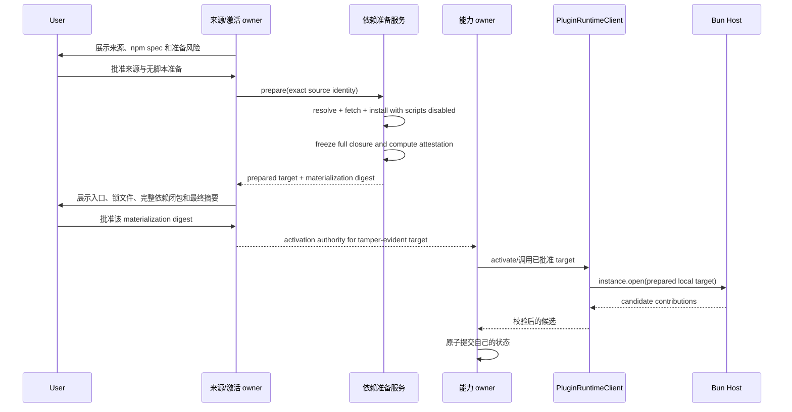

# OpenCode Ext-Host IPC 集成设计

本文定义 BitFun 如何沿现有插件运行时主链路集成 OpenCode Extension Host（Bun），并以一个真实 Tool 或稳定 Hook
consumer 完成 package plugin 的最小可验证闭环。本文是
[`opencode-plugin-runtime-adapter-design.md`](opencode-plugin-runtime-adapter-design.md) 的协议落地补充，并受
[`plugin-runtime-design.md`](plugin-runtime-design.md) 和
[`../product-architecture.md`](../product-architecture.md) 约束；发生冲突时以上位设计为准。

本文同时区分目标设计和当前实现。当前 BitFun 尚未集成 Bun Host；冻结的 ext-host 协议也还不能安全表达本文要求的
防篡改 prepared npm target，因此不能把设计目标写成已交付能力。

协议事实以公开 ext-host 仓库的 `PROTOCOL.md`、`src/protocol.ts` 和生成的 `protocol.schema.json` 为准（见 §6）。
Rust fixture 必须与冻结提交保持 wire-level 一致，不能仅按本文示例实现近似协议。

## 1. 架构定位

### 1.1 唯一主链


各层只有以下职责：

| Owner | 负责 | 不负责 |
|---|---|---|
| 外部来源与激活 owner | 来源身份、候选版本、用户选择、最终物化摘要、activation authority、停用和撤销事实 | 持有 Bun 进程、解释 Hook、注册 Tool |
| 依赖准备服务 | 在不 import 插件代码且禁用 install scripts 的条件下解析、安装、冻结并证明完整依赖闭包 | 授予执行权限、调用插件、保存产品激活状态 |
| `PluginRuntimeClient` | 请求身份、期限、队列、同实例顺序、取消、迟到结果拒绝、诊断和 fault 状态 | 来源发现、物理进程、业务状态提交 |
| OpenCode executable adapter | OpenCode 加载顺序、RPC 参数/结果、Hook/Tool 语义转换 | 产品策略、进程监督、贡献最终提交 |
| services 实现 | prepared target 校验、Host spawn、IPC、连接代次、物理健康、重启预算和进程树回收 | Session 生命周期、权限决定、Tool/Hook 最终状态 |
| Tool/Hook/Permission 等能力 owner | 以自身不变量校验并原子提交贡献、权限和调用结果 | import JS/TS、管理 Bun 进程 |
| Product Assembly | 选择 adapter/provider/service 实现并注入唯一主链 | 发现来源、准备依赖、执行插件、拥有 Session/Host 生命周期 |

`runtime-ports` 只在确有第二个 owner 和真实 consumer 时承载窄、provider-neutral 的执行控制 DTO/port。它不得出现
`ExtHostRuntime`、Session holder、workspace Host manager、物理清理状态或 ext-host wire 类型。Rust 侧所谓 Host 始终是
services 管理的 Bun 子进程，不新增第二个 Runtime/Controller owner。

### 1.2 当前静态预览不是执行入口

`src/crates/adapters/opencode-adapter` 中现有 `load_opencode_package_adapter` 保持 static-preview only。它可以投影候选和
诊断，但不得 spawn Host、安装依赖、import module、注册 Tool/Hook，或被扩展为新的受管 OpenCode 执行路径。

真实 package plugin 必须使用单独的 executable adapter 实现现有 `PluginRuntimeClient` 主链，并由 Product Assembly 注入。
Assembly 只选择实现；来源协调器在后台准备 target，各能力 owner 才是 registrations 和调用的真实 consumer。

### 1.3 依赖方向

```text
能力 owner -> PluginRuntimeClient -> OpenCode executable adapter
                                     -> provider-neutral execution port
                                     -> services process/IPC implementation
                                     -> Bun Plugin Host
```

services 和 adapter 不依赖 Assembly；`PluginRuntimeClient` 不依赖具体 OpenCode adapter 或 services；Session owner 不直接
引用 ext-host、TCP、进程句柄或 contribution registration。

## 2. 安全边界：防篡改 prepared target

### 2.1 两阶段批准与准备

来源批准只允许 BitFun 在不执行第三方代码的前提下读取元数据、下载包并准备候选；它不授予 import 权限。真正的激活批准
必须绑定最终将交给 Host 的完整物化结果：



准备阶段必须满足：

1. npm spec 先解析为精确 package name、version、registry integrity 和入口；禁止 `latest`、tag 或 semver range 进入激活摘要。
2. 使用受支持的 npm/Arborist 语义和锁文件冻结完整传递依赖闭包；没有可验证 lock/integrity 的候选不得激活。
3. install scripts、生命周期脚本和准备期 module import 全部禁用。若某包必须运行脚本才能工作，P0 明确不支持。
4. attestation 至少包含规范来源身份、精确入口、lockfile 摘要、每个物化文件的相对路径/类型/摘要、完整依赖图、
   registry integrity、运行时及 adapter 版本、解析/安装选项和目标平台。
5. 用户确认的是最终 `materialization_digest`，不是 manifest 摘要、裸 spec 或可变缓存目录。
6. 确认后把结果提升到内容寻址、原子 staging 的 target，并以 generation fence 保护。Host 只能读取该 target；不得获得准备服务的可写 cache、npm 配置或安装锁。这是 tamper-evident，不是 OS 强制不可变只读。
7. 物化结果、authority、当前执行域/用户、凭据和策略范围在 open 前复核；任一不匹配都 fail closed。

`materialization_digest` 的跨语言规范固定见 §2.5a。Rust、Bun 和任何准备服务不得各自选择 JSON 序列化器、路径处理或
Unicode 处理方式；未通过同一组 golden vectors 的实现不能参与 approval、pre-import revalidation 或 generation fencing。

普通 Unix `chmod` 只读或同 owner 的 Windows ACL 并不能阻止同用户重新取得写权限、替换文件、rename/link 或修改延迟 import 的依赖；ProcessTreeChild 只回收进程树，不是文件系统 sandbox。因此 P0 把 target 诚实降级为 **tamper-evident**，不称为 immutable 或 OS-enforced read-only。P0 采用 canonical attestation、原子 staging、pre-import revalidation 和 generation fencing 尽量缩小确认到执行的窗口，并必须如实展示两类残余风险：

- 确认后到 import 前仍可被同用户替换的文件或依赖；
- import 后动态加载的延迟依赖（不在确认时闭包内）。

独立进程也不是完整安全沙箱：获批代码按当前执行域的真实 OS 权限运行，文件、网络和子进程残余风险必须在确认界面展示。若后续引入独立 principal、受限 token、只读 mount/image 或受约束 loader，可再把保证升级为 OS-enforced；在此之前不得使用该名称。

### 2.2 `instance.open` 不得解析 npm

冻结 ext-host 实现会把裸包名解析为 `@latest`，并在可写 `cacheDirectory` 中执行
`bun add --ignore-scripts --exact <spec>`。该行为不能用于 BitFun P0，因为它使用户批准的对象与最终 import 的代码脱钩。

BitFun 选择 Host 外准备路线。协议升级后，`host.instance.open` 的插件项必须是 tagged prepared target，例如：

```json
{
  "kind": "prepared",
  "targetID": "sha256:...",
  "entrypoint": "file:///bitfun/plugin-targets/sha256-.../entry.js",
  "materializationDigest": "sha256:..."
}
```

以上只是目标 shape；字段名必须先进入 ext-host Zod 事实源、生成 schema 和跨语言 fixture，不能仅由 Rust 私自发送。
Host 在 BitFun profile 下必须拒绝裸字符串、npm spec、registry URL、相对源路径和 legacy install 选项；不得在
`instance.open` 内联网、运行 package manager 或写入 target。Host 返回 target id/digest，Rust 核对后才能发布贡献。

如果 ext-host 选择保留 Host 内安装作为其他 consumer 的兼容路径，则该路径必须与 BitFun profile 显式区分；BitFun
仍只发送 `kind = prepared`。本文不采用“Host 安装后返回清单、Rust 再追认”的方案，因为 import 前校验更容易形成
单一、可审计的安全边界。

### 2.3 Authority 与竞态

`PluginActivationAuthority` 继续由来源/激活 owner 生成和撤销。内部 prepared target handle 不支持 serde，不接受 UI DTO，
至少绑定：

- 精确来源、package 和内容身份；
- `materialization_digest` 与只读内容地址；
- execution domain、实际 OS 用户、目标平台和 runtime/adapter 版本；
- activation epoch、策略上限、凭据和环境可见范围；
- 被允许的 capability envelope。

构造 wire request 的函数保持 services 实现私有，只接收经过当前 authority 复核的内部 handle。open 期间发生撤销、摘要变化
或策略收紧时，不发布 contribution；停止接受该 target 的新调用，撤下已发布贡献，并按 §3.4 的安全重启顺序回收包含它的
Host。仅在下一次 RPC 前检查 authority 不足以终止 timer、后台任务或 import 时副作用。

### 2.4 Remote fail closed

package plugin 必须在工作区真实 execution domain 中完成准备、保存 prepared target 并运行 Host：

- Remote RuntimeServices 可用时，依赖准备、Host、working directory、网络、凭据和进程树都位于远端；
- 远端能力缺失或断线时显示 `RemotePluginRuntimeUnavailable`，**明确拒绝且不回退本机**；P0 只验证该 fail-closed 行为，不要求真实远端纵向执行；
- full package plugin Remote 在对应阶段（OC-R5）完成前不要求真实远端 Host fixture；
- 本地界面只代理状态和调用，不把远端路径当成本地路径；
- execution domain 或远端身份变化会使旧 authority 和 prepared target handle 失效。

### 2.5 Tamper-evident target 合同

prepared target 的不可变/OS 强制只读保证在当前三平台（Windows/macOS/Linux）下无法按统一退出条件兑现，因此 P0 不承诺该保证，只承诺以下防篡改合同，并在确认界面与协议 fixture 中如实标注：

- **canonical attestation**：`materialization_digest` 覆盖规范来源、精确入口、lockfile、完整依赖图、每个物化文件的相对路径/类型/摘要、registry integrity、runtime/adapter 版本、解析/安装选项和目标平台；
- **原子 staging**：target 写入内容寻址的独立 staging 目录，写入完成前不可被 Host open，写入后内容寻址摘要参与 authority；
- **pre-import revalidation**：`instance.open` 前在 services 侧重新计算并比对 target 摘要与 authority，任一不一致 fail closed，不发布贡献；
- **generation fencing**：target 绑定 Host/connection generation；generation 变化后旧 target handle 失效，必须重新复核；
- **残余风险明示**：确认到 import 之间的替换竞态、import 后的延迟动态依赖不在确认闭包内，二者均作为残余风险写入确认界面与退出条件，不得隐藏为已解决问题。

该合同只证明"确认时的内容摘要与 import 前的摘要一致"，不证明"import 后代码不会被同用户替换或延迟加载未确认代码"。在缺乏独立 OS 主体前，这是 P0 能兑现的最高保证。

### 2.5a `materialization_digest` 跨语言规范

为避免 Rust 与 Bun 对同一 target 产生不同摘要，`materialization_digest` 固定为
`sha256("bitfun.materialization.v1\\0" || canonical_bytes)`，输出为小写 ASCII 十六进制的 64 个字符，并以
`sha256:` 前缀包装为 wire value。`canonical_bytes` 是 RFC 8785 JCS（UTF-8、无 BOM、无空格、对象 key 按 Unicode
code point 排序、数字使用 JCS/ECMAScript 可互操作表示）的 JSON 字节；不得使用实现语言默认 serializer，也不得用
CBOR 替代。协议对象不得出现 NaN、Infinity、负零、重复 key 或未定义字段。

摘要输入的顶层对象固定为 `schema`、`source`、`entrypoint`、`lockfile`、`dependencyGraph`、`files`、`runtime`、
`installOptions` 和 `platform`。字段缺失与空值不同：必需字段缺失是 invalid；允许为空的集合统一编码为 `[]`，允许为空的
字符串统一编码为 `""`，不得用 `null`、省略字段或不同 sentinel 表示同一事实。未来新增字段必须升级 schema/domain，不能让
v1 静默忽略。

路径及链接规则固定如下：

1. 所有 target 内路径使用相对路径、`/` 分隔符、UTF-8 NFC；不得包含空段、`.`、`..`、驱动器号、UNC 前缀或 NUL。Windows
   输入先按 ordinal invariant lower-case 规范化驱动器字母，分隔符转 `/`；文件名其余大小写保持原样，不做平台相关 case-fold。
   路径比较和排序按规范化后的 UTF-8 字节序，不按本地 locale。
2. 每个路径必须从 target root 解析并逐段验证。symlink、Windows reparse point、junction、hard link、设备文件、FIFO、
   socket 和其他非普通文件均拒绝；目录项按路径排序，空目录显式记录 `type: "directory"`。
3. `files` 按 canonical path 升序排列；普通文件记录 `path`、`type: "file"`、字节长度和 SHA-256；目录记录 `path` 和
   `type: "directory"`。依赖图节点按 canonical package identity（name、version、registry integrity）排序，边按
   `(from, to, kind)` 排序，不能依赖 lockfile 或 Arborist 的遍历顺序。
4. registry integrity、文件摘要和所有哈希均使用 SHA-256 的 lowercase hex 编码；不存在的可选 integrity 编码为 `""`，但
   P0 校验仍拒绝缺少必须 integrity 的依赖。`entrypoint` 先转换为 target-root 相对路径，再按同一路径规则编码；禁止用绝对
   路径、file URL 或本机 cache 路径参与摘要。
5. `source`、`runtime`、`installOptions` 和 `platform` 的枚举/字符串值按协议 UTF-8 原样编码；Unicode 只在路径上执行 NFC，
   其他已定义字符串不做隐式 trim、case-fold 或 locale normalization。布尔值、整数和字符串类型不得互换。

该算法是安全合同，不是实现建议。实现前必须提交 Rust/Bun 共用的 golden vector 文件，至少覆盖 Windows drive/separator/case、
NFC/NFD 文件名、空集合与空字符串、依赖图乱序、重复/缺失字段、symlink/reparse point、目录逃逸、二进制文件、入口规范化和
哈希结果；每个 vector 同时包含 canonical JSON、digest 和预期 accept/reject。§6.2 快照必须保存 vectors 及生成校验摘要。

## 3. 生命周期与故障域

### 3.1 三层定义

本文保留三层生命周期，但不把 Session、workspace 或单个 plugin 作为物理进程层。在运行环境和安全范围兼容的默认
部署中，每个承载 `RuntimeServices` 的 BitFun 后端进程维护一个共享 Plugin Host，即后端与 Host 默认 1:1。这里的
1:1 表示一个后端默认只有一个共享 Host 进程；Host 可以按真实插件使用延迟启动，但首个完整 package-plugin 实现不做
通用空闲回收，并在后端存活期间持续复用该 Host。

```text
RuntimeServices backend
└── Shared Plugin Host
    ├── workspace A / plugin instances
    ├── workspace B / plugin instances
    └── calls from multiple sessions
```

| 层次 | 默认键 | Owner | 退出条件 |
|---|---|---|---|
| Host/connection generation | 当前 `RuntimeServices` backend 内兼容的执行域、OS 用户、runtime 和安全范围 | services | 安全重启、故障回收或 `RuntimeServices` backend 退出 |
| logical plugin instance/contribution generation | 来源、插件身份、内容版本及必要的 workspace-specific state | 来源与能力 owner；Host 保存易失 module instance | 停用、替换、authority 失效或 Host generation 被回收 |
| invocation | request id、调用类别、execution id、session/turn/cancel context | `PluginRuntimeClient` 与调用能力 owner | 成功、错误、取消、期限或 Host generation 丢失 |

workspace、plugin 和 session 只区分 Host 内的逻辑实例、调用身份、取消和权限上下文，不决定物理进程数量；请求必须
显式携带这些身份。只有 execution domain、OS 用户、runtime 或安全范围不兼容时，才允许在同一产品部署中拆分额外 Host。
仅为了单插件故障隔离、workspace 数量、Session 数量或容量压力而改变默认 1:1 模型，必须先修改并评审上位
`plugin-runtime-design.md`，并给出安全收益、启动/内存数据、加载顺序与模块缓存兼容差异以及行为等价测试。

Session 归档或删除只取消该 Session 的在途 invocation，并由 Session owner 提交自身状态。它不关闭 Host、不撤下共享
contribution，也不持有 Host lease。Host 是否仍被事件订阅、后台任务、其他 Client、其他 workspace 或其他插件使用，
由真实插件使用与 services 进程状态决定。

四类生命周期事件按以下规则处理：

- **Session 关闭**：只取消该 Session 的在途调用并清理调用上下文，不关闭 Host，也不移除其他 Session 可见的贡献；
- **Workspace 关闭**：只撤销该 workspace 的逻辑 instances、subscriptions 和 workspace-scoped recovery work，并发布新的
  generation-bound usage snapshot。不得用 logical instance 数量直接决定 Host 是否重启；由唯一 runtime/services owner 根据
  snapshot 中的 instance、contribution/subscription、background task、in-flight invocation、external client 和 recovery
  operation 判断 Host 是否仍被使用。只有 snapshot 已证明没有任何使用者，且 `instance.close` 后仍无法证明 module/后台任务已卸载时，
  才按 §3.4 安全重启共享 Host，再用仍获批的 target 组重 hydrate；
- **插件停用或更新**：更新逻辑实例和贡献；若无法在现有进程内可靠卸载旧模块，则按 §3.4 安全重启共享 Host；
- **后端退出**：关闭共享 Host，等待 EOF 与主进程退出，并回收完整受管进程树。

### 3.2 后台启动与 target 隔离

Host 启动是 **activation-driven、后台、single-flight** 的：首个仍获批且需要执行的 target activation 触发一次后台 single-flight Host acquire；Session 创建/恢复既不触发也不等待 Host spawn、handshake 或 registration。该顺序是必需的，因为 Hook、订阅、Auth 和 Provider 可能在任何 Tool 调用前就要求 import。
来源协调器在准备/激活后后台维护每个 logical target 的状态：

```text
Discovered -> Preparing -> AwaitingApproval -> Activating -> Ready
                                            \-> Degraded / Disabled
```

GUI/TUI 的 Session 创建、恢复和聊天入口不得等待所有插件 spawn、handshake 或 registration。只有完成校验并由能力 owner
原子发布的贡献才可见；单个 target 的 Bun 缺失、准备失败、import 错误或注册失败只使该 target 进入 Degraded，不使无关
Session 创建失败。初始化按固定 OpenCode 顺序执行；单插件普通异常回滚其候选贡献并继续，协议损坏或事件循环失活则升级为
Host generation 故障。

### 3.3 有界启动

services 的启动 future 必须在统一 startup deadline 内同时等待以下事件，而不是裸等 `listener.accept()`：

| 事件 | 处理 |
|---|---|
| loopback accept + handshake 成功 | 绑定新的 connection generation，继续初始化 |
| child 提前退出 | 返回带 stderr 摘要的 target/Host 诊断 |
| startup deadline | 关闭 listener/socket，终止并确认回收进程树 |
| target activation 被取消或 authority 失效 | 中止启动并回收，不发布贡献 |
| RuntimeServices/application shutdown | 中止启动并进入全局清理 |
| 握手 token、版本或 schema 不匹配 | fail closed，关闭连接并回收 child |

每次 spawn 都使用不可预测的一次性 token，只接受 loopback 对端；成功连接必须绑定 child handle 和 connection generation。
旧连接的 response、notification、EOF 和健康任务不得改变新 generation 状态。

### 3.4 停用、更新与安全重启

模块 import 可以创建 timer、后台任务和其他进程，不能假设 `instance.close` 能卸载任意 JS module。停用或替换共享 Host 中
的一个插件时，沿 `plugin-runtime-design.md` 执行整个 Host 的安全重启：

1. 来源 owner 阻止受影响 target 的新激活，能力 owner 暂停新调用；
2. `PluginRuntimeClient` 有界结算或取消该 Host generation 的在途调用；
3. services 请求 graceful shutdown，并等待响应、TCP EOF、主进程退出和受管后代回收；
4. 旧进程树未确认停止前不得加载新代码；
5. 能力 owner 按旧 contribution generation 撤下贡献；
6. services 使用仍然合规的 tamper-evident targets 启动新 Host；
7. adapter 校验候选，能力 owner 原子发布新的 contribution generation；
8. Client 恢复接受调用。

安全撤销可跳过等待业务调用自然完成，但不能跳过进程树确认。新 Host 加载失败时插件保持不可用；只有存在完整、已批准且
校验通过的旧 prepared target 时，才可按同一停机顺序恢复旧版本。禁止让新旧 Host 同时执行同一组插件。

### 3.5 正常退出和进程树

首个完整 package-plugin 实现不做通用 idle reclaim。由唯一 runtime/services owner 维护 generation-bound usage snapshot；只要
snapshot 仍有 active plugin instance、contribution/subscription、background task、in-flight invocation、external client 或
recovery operation，兼容 Host 保持运行。Workspace 关闭只撤销自身实例，不能根据实例数量重启共享 Host。RuntimeServices 退出时停止新调用、
取消可取消请求、有界等待、逆序 dispose、关闭连接，
并回收完整进程树。

Windows 使用 `ProcessTreeChild` 在 suspended child 恢复前附加 kill-on-close Job Object；附加失败必须 fail closed。
Unix 使用独立 process group。graceful shutdown 响应不等于物理退出，必须继续观察 EOF、child exit 和受管后代回收。
这些机制只提供生命周期 containment，不是 CPU、内存、文件或网络沙箱；Unix 主动脱离 process group 的后代仍是残余风险。

### 3.6 崩溃恢复

Host generation 丢失时：

- services 一次性报告该物理故障并结算绑定该连接的所有 pending request；
- 能力 owner 撤下受影响 contribution，不能让每个插件分别消耗一份进程级重启预算；
- 未知结果的有副作用调用返回 `OutcomeUnknown`，不自动重放；
- 只在来源、authority、prepared target 和 RuntimeServices 仍有效时，按有界预算重载整组插件；重载所需的获批 target graph、固定加载顺序、每个 logical instance 的 project/workspace context 与 capability envelope 由来源 owner 提供（见 §3.7 rehydration 数据来源），services 不发明第二份获批状态；
- 超出预算后保持 Degraded，Session 和其他非插件能力继续可用。

### 3.7 Rehydration 合同与持久化矩阵

崩溃恢复不是异常分支，而是 lifecycle 设计本身。以下合同必须写到实现者可唯一执行的程度：

**启动**：首个仍获批且需要执行的 target activation 触发后台 single-flight Host acquire；Session 创建/恢复不启动也不等待 Host。

**逻辑实例关闭**：`instance.close` 只是 best-effort 请求。当某 Host 上最后一个 logical instance 关闭且无法证明 module/后台任务已终止时，必须安全重启整个共享 Host 并重 hydrate 剩余获批 target 组，不能假设 `instance.close` 已卸载任意 JS module。

**崩溃后 rehydration 数据来源**：由对应 **来源 owner** 提供当前获批 target graph、固定加载顺序、每个 logical instance 的 project/workspace context 与 capability envelope。services 不发明第二份获批状态。

**Ready 前置条件**：只有 contribution、订阅和后台 callback 在新 generation 上重建完成后才进入 Ready。旧 pending 调用只 settle、不重放；有副作用调用不重放，返回 `OutcomeUnknown`。

**运行时基数**：一个 RuntimeServices composition 对应一个 executable adapter binding、一个 PluginRuntimeClient 可靠性 owner、一个 services supervisor，默认一个共享 Host。只有 execution domain、OS 用户、runtime 或安全范围不兼容的执行键才新增另一个 Host。禁止每个 target 各自创建 client/supervisor 形成多套队列、fault 和 recovery owner。

**持久化矩阵**（三类状态，必须显式区分，不能混用；当前 authority 不能作为持久化产品事实）：

| 状态类别 | 内容 | 跨 Host generation | 跨 RuntimeServices/应用重启 |
|---|---|---|---|
| 持久产品事实 | 用户批准事实、获批来源/`materialization_digest`、批准时的 capability envelope、desired target graph 和加载顺序 | 保留（由现有 owner 持有） | 保留；重启后只作为重新验证输入 |
| 运行时重新生成的 authority | 当前 execution domain、OS 用户、平台、runtime/adapter、凭据、策略和 capability envelope 的绑定，新的 authority epoch | 当前 generation 变化时重新生成 | 不恢复；应用重启后必须重新验证上述绑定并生成新 epoch |
| Rust 进程内可靠性/诊断状态 | idempotency result、fault、restart budget、target checkpoint | 可在同一 RuntimeServices 进程内跨 generation 保留 | 默认清空，除非现有持久 owner 另行声明 |
| generation-local Host/module/IPC/gateway 状态 | Host 内存、module instance、connection/generation-bound 凭据、connection token、generation-bound handle | 不保留（随 generation 丢弃） | 不保留 |

应用重启后，来源 owner 必须用持久批准事实和 desired target graph 重新准备/验证 target，再检查执行域、用户、runtime、策略、凭据和
capability envelope；任一不匹配都不得恢复。不得恢复 connection token、generation-bound handle 或当前 authority。若该矩阵缺失，风险包括：
Workspace 关闭后插件代码仍运行；应用重启恢复已失效 authority；崩溃后按旧内容、错误顺序或错误 workspace context 恢复；每个 target 各自创建
client/supervisor 形成多套队列与 fault owner；Host 重启清空成功 idempotency 结果后重放有副作用调用；每个插件分别消耗重启预算形成重启风暴。

## 4. IPC 调用可靠性

### 4.1 传输与握手

冻结协议使用 loopback TCP、4-byte big-endian 长度前缀和 JSON-RPC 2.0。实现必须限制单帧大小、解码深度、队列条目、
总在途字节和 stream 分片；解析错误关闭连接。握手至少校验一次性 token、协议版本、Host build identity 和所需 capability。

连接成功后生成不可复用的 `connection_generation`。每个 pending request、stream、execution、notification、prepared target 和
authority epoch 都绑定该 generation；
重连后收到的旧消息只记有界诊断，不提交状态。

握手 capability 使用 versioned registry，而不是任意字符串集合。每项 capability 使用 `<namespace>/<name>@<major>` 标识，
并由双方声明 `supported`、`required` 和语义版本；registry 本身有 schema version、protocol profile 和安全语义版本。BitFun
P0 registry 至少包含 `prepared_target/v1`、`materialization_digest/v1`、`invocation_terminal/v1`、`outcome_unknown/v1`、
`liveness_oob/v1`、`post_import_gate/v1`、`gateway_disabled/v1`、`generation_fencing/v1` 和 `authority_epoch/v1`。缺少必需
capability、namespace/major 不兼容、或 build identity 声称支持但 registry 语义校验失败时必须 fail closed，关闭连接并回收
child；不能以 protocol version 或 build identity 单独推断安全能力存在。Host 不得把缺失的 `invocation_terminal` 伪装成普通
Cancelled，不得在缺少 `liveness_oob` 时声称 stall recovery，不得在缺少 `prepared_target` 时接收裸 spec，也不得在缺少
`gateway_disabled` 时启动 gateway。升级/回滚 fixture 必须验证旧 Host 在这些 capability 缺失时拒绝或回滚，而不是误报 Ready。

### 4.2 Instance 生命周期

`host.instance.open` 只接收 §2.2 的 prepared target、逻辑 project/workspace context 和经过裁剪的配置。成功响应表示 Host
完成该 instance 的加载，但返回内容仍只是候选；adapter 校验顺序、标识和 schema 后，各能力 owner 才能发布。

`host.instance.close` 是 best-effort 的逻辑清理提示，不是任意模块已经卸载或子进程已退出的证明。停用、更新和 authority
撤销遵循 §3.4 的 Host 安全重启。

真实 Tool/Hook/Auth/Provider 集合只有插件 import 后才能完整知道，但 import 本身已可能执行顶层代码、创建 timer、后台任务、网络连接或子进程。因此 **post-import contribution expansion 是独立安全闸门**，不能与 pre-import 权限校验合并。内部状态仍可投影为 `AwaitingApproval`，但必须携带以下不可省略字段：`reason: initial_activation | post_import_expansion`、`observed_contribution_digest`、`imported_generation`、旧 `authority_epoch`、贡献 diff 和 side-effect risk。

当发现贡献超出 capability envelope 后，adapter **不发布**新增贡献，立即废弃旧 generation 和旧 authority epoch，按 §3.4 停止并确认整个共享 Host 进程树退出，再回退到 §3.2 状态机的 `AwaitingApproval` 展示实际差异。`initial_activation` 表示从未 import 的普通审批；`post_import_expansion` 表示已经 import 且可能产生副作用，不能把它当作普通初始审批、不能复用旧 authority 或旧 generation，也不能仅由能力 owner 拒绝注册来终止代码。

批准扩权后必须重新准备/校验同一 target，生成新的 authority epoch 和 Host generation，再重新 import；批准本身不追认已发生的副作用。拒绝时不得恢复包含该 target 的旧 Host，不能恢复该 target 的旧贡献；只能在完整停机确认后恢复不包含该 target 且仍合规的插件组。共享 Host 中其他插件按整 Host 重启合同处理，不能继续依赖可能仍在运行的旧 generation。这一分支必须进入真实纵向 fixture。

`host.shutdown` 成功后 Rust 继续等待 TCP EOF 和 child exit；deadline 后关闭 socket 并终止受管进程树。重复 shutdown、
EOF 先到和 child 已退出按同一 generation 幂等结算。

### 4.3 请求模型、期限与背压

`PluginRuntimeClient` 的内部请求至少携带：

| 字段 | 用途 |
|---|---|
| request id + connection generation | 拒绝重复或旧连接结果 |
| logical plugin instance id + contribution generation | 路由并阻止旧贡献提交 |
| call kind | 区分 Tool、Hook、Auth、Provider 等取消/重试策略 |
| execution id | 对应 `host.tool.cancel` 和审计身份 |
| session/turn/caller context | 取消树、权限和工作目录，不作为 Host 进程键 |
| deadline + cancellation token | 有界等待并传播取消 |
| idempotency key / effect class | 仅在 owner 声明安全时允许有限重试 |

每个 Host/instance 和全局队列都有条目数与字节数上限。队列满立即返回 typed `Overloaded`；调用方可以降级，但有副作用
调用不得因过载自动重试。并发额度来自真实资源测量和调用类别，不由 workspace 或 Session 数量推导。

### 4.4 Tool 取消

冻结实现的 `host.tool.cancel` 只是调用 `AbortController.abort()` 后立即返回 `{ cancelled: true }`。AbortSignal 是合作式信号，插件可忽略，handler 也可能永不 settle；因此该响应最多证明 **signal 已送达**，不证明 invocation 已结束。UI/审计若据此显示普通 Cancelled，会掩盖插件仍在写文件/联网/创建子进程/修改共享内存状态的 OutcomeUnknown 事实。首个真实 Tool 闭环已包含取消，不可延期。协议必须区分以下终态，只有可证明终态时才返回普通 Cancelled：

| cancel 响应/事件 | 语义 | Client 结算 | Host 处置 |
|---|---|---|---|
| `signal_delivered` | 信号已送达，但 invocation 未证明终止 | `OutcomeUnknown` | 继续有界等待；超期则 poison/recycle 整个 generation |
| `invocation_terminal` | invocation 已证明终止（正常结束、抛错或确认取消） | 普通 `Cancelled`/`TimedOut`/错误 | 正常回收 pending entry |
| `not_found` | 无此 execution（已完成、从未存在或已过期） | 按当前事实结算 | 不改变 generation |
| `connection_lost` / 无响应 | 连接失活或 cancel 期限到期 | `OutcomeUnknown` | poison/recycle 整个 Host generation |

Tool timeout 或 cancellation token 触发时不能只删除 Rust pending entry：

1. Client 把原调用标记为 cancelling，拒绝其普通完成结果提交；
2. 在仍匹配的 connection generation 上发送 `host.tool.cancel { instanceID, executionID }`；
3. 有界等待 **invocation 终止证明**（`invocation_terminal`），而非仅 `signal_delivered`；
4. 收到 `invocation_terminal` 后以 Cancelled/TimedOut 结算，并丢弃以后迟到消息；
5. 只收到 `signal_delivered`、Host 不确认、连接失活或取消期限到期时，把该 Host generation 标记为 poisoned，停止新调用并执行 §3.4 回收；
6. 受影响调用返回 `OutcomeUnknown` 或更精确的 typed fault，不自动重放。

共享 Host 被 poison 时，其承载的其他 logical instances 也会短暂不可用。这是共享进程的明确故障域，不能伪装成只回收某个
workspace target。

### 4.5 不可取消调用和迟到结果

冻结协议没有 `host.hook.cancel`。Hook timeout/cancel 时先用 request、connection 和 contribution generation fence 拒绝迟到
结果；如果 Hook 可能仍在运行、继续产生副作用或阻塞 Host，则 poison 并回收整个 Host generation。只丢弃结果不能证明
副作用停止。

Auth/Provider/stream 等类别必须按冻结 schema 明确是否有 cancel RPC。没有协议级取消且不能证明调用已经结束时，使用相同
poison/recycle 规则。旧连接迟到 response、notification 和 stream chunk 不更新 Tool、Hook、Permission、Session 或审计状态。

### 4.6 Backend facade

Host -> BitFun 的 `backend.*` 方法只能调用现有 owner 的窄接口：

| 方法 | 边界 |
|---|---|
| `backend.handshake` | token、版本、capability 和 build identity 校验 |
| `backend.http.request` | **P0 禁用**：per-instance gateway 在能力认证协议（§4.7a）固定前为 disabled/unsupported，Host 不得通过该入口转发请求 |
| `backend.auth.get` | 每次读取凭据 owner 的当前值，不在 Host 持久缓存 |
| `backend.tool.ask` | 转发给 Permission/Tool owner；Host 不决定权限 |
| `backend.tool.metadata` | 接收并校验候选 metadata，不直接提交产品状态 |
| `backend.diagnostic.publish` | 有界、脱敏诊断 |
| `backend.stream.read/cancel` | 只操作 Rust-owned stream handle |

反向调用同样绑定 instance、connection generation、authority 和有界队列。Host 不能通过 backend facade 获得任意 service
locator，也不能把 instance id 当作充分授权。

### 4.7a Per-instance HTTP gateway authority

冻结 Host 在 loopback 随机端口创建 gateway，没有 token、Authorization header 或不可预测 capability path；请求进入后会自动继承闭包中的合法 instanceID，因此 Rust 再按 instanceID 检查 authority 也无法识别真实 caller。本机其他进程或共享 Host 中的其他插件可枚举端口、借用目标 instance 身份访问 backend，或在认证前发送大 body、创建 stream 制造队列压力，形成越权与跨 instance 资源消耗攻击。因此 per-instance HTTP gateway 不是普通 HTTP 功能细节，而是 **authority 边界**。

P0 **当前协议事实是禁用**该入口：Host 不得在 loopback 创建 per-instance HTTP gateway 监听器，`backend.http.request` 在能力认证协议固定前返回 typed unsupported（见 §4.6），不能把未认证 gateway 留作兼容路径。这属于协议退出条件，不是可由实现者自行开启的选项。

若后续 OC-R 阶段恢复 gateway，必须在读取 body、创建 stream 之前验证与 `instanceID + connection_generation` 绑定的高熵 capability，并覆盖以下 fixture：

- 无 token、错误 token、跨 instance token、旧 generation 重放 token 均被拒绝；
- 认证前的大 body / stream 创建不消耗队列配额；
- gateway 拒绝时只返回有界诊断，不泄漏 instance 存在性。

在上述能力实现并 fixture 化、并由公开协议提交固定前，protocol 必须保持 gateway 为 **disabled/unsupported**，并删除"per-instance gateway 转发"这一当前无法兑现的保证。

### 4.7 错误分类

Rust 必须按 JSON-RPC code、`data.kind`、call kind 和 connection generation 联合分类。至少区分：

- protocol/handshake failure：关闭连接并回收 Host；
- overloaded：调用级 typed failure；
- plugin initialization failure：回滚该插件候选，其他插件可继续；
- call failure：只结算该调用；
- cancellation unconfirmed / protocol corruption：poison Host generation；
- event-loop stall：**必须由独立于插件主事件队列的 supervisor liveness/control channel 检测**（见 §4.8），否则该状态不可产生，poison 保证不可声称；
- process exit：结算整条连接并按进程级预算恢复；
- authority/materialization mismatch：安全拒绝，不计作普通插件 crash。

### 4.8 Event-loop stall 检测

同步死循环或长期阻塞可能发生在没有在途业务请求时：Bun 进程仍存活、socket 仍连接，但处理业务 RPC 的 event loop 已失去进展。若健康检查走同一业务队列，它会一起被阻塞，系统会无限保持错误的 Ready 状态——既不触发 poison/recovery，也无法撤下已暴露的贡献，共享 Host 中其他正常插件也会一起永久不可用。

上位 `plugin-runtime-design.md` 已禁止依赖可能被同步插件代码阻塞的业务消息队列来检查心跳与进程存活，因此 out-of-band liveness 不是 BitFun 新增保证，而是 P0 必须落地的既有上位约束。协议要求如下（均为当前协议事实，非可选或延期项）：

- **独立传输的 supervisor liveness/control channel**：Rust supervisor 维护一条与业务 JSON-RPC socket 独立的 liveness 通道（独立文件描述符/管道或独立消息类，由 Rust 端在单独任务上 drain）。liveness tick 由 Host 主事件循环上的 `setInterval`/`queueMicrotask` 发出并携带单调递增的 progress 计数；主循环被同步代码阻塞时该 tick 不会发出，这正是 stall 的可观测信号。liveness 通道不得复用业务 RPC 队列。
- **progress generation + liveness deadline**：每个 tick 绑定当前 `connection_generation` 与单调 progress 计数；Rust 记录 last-seen 计数与 liveness deadline。在 generation 内无新 progress 超过 deadline 即判定该 generation stall，与是否有在途业务调用无关。
- **stall 回收条件**：判定 stall 后 poison 当前 generation、撤下其贡献、按 §3.4 回收进程树，受影响调用返回 `OutcomeUnknown`，不自动重放。
- **真实进程 fixture**：必须覆盖"无在途业务请求时的后台同步死循环"（liveness 专属场景）与"有在途业务请求时的同步死循环"（call deadline 与 liveness 联合场景）两条路径，证明前者不依赖任何业务调用即可被回收。

`event-loop stall` 因此是 §4.7 错误分类中一个**当前可产生**的状态：当且仅当 §4.8 supervisor 在 liveness deadline 内未观察到绑定当前 generation 的 progress 推进时产生，并触发上述回收。在上述通道、deadline、progress generation 与 fixture 实现并通过前，stall 恢复保证不得声称已兑现，但协议不得删除该保证或将其降级为 unsupported——它是上位约束的直接落地，不是 BitFun 可选择退出的能力。

## 5. 仓库集成点

### 5.1 `runtime-ports` 与 `PluginRuntimeClient`

不新增 `ExtHostRuntime`。若现有 `ScriptToolRuntime` 不能承载 package Host，新增的公共面只能是由真实 Tool/Hook consumer
驱动的 provider-neutral execution port，表达以下操作和事实：

- 激活一个已批准的 prepared target handle；
- 按 typed call kind 调用；
- 按 execution id 取消；
- 停用 logical target；
- 查询只读 availability/fault；
- RuntimeServices shutdown。

该 port 不接受 npm spec、路径字符串、UI DTO 或 Session holder，不返回 OS handle、TCP socket、workspace lease、Bun wire
JSON 或物理清理内部状态。`PluginRuntimeClient` 继续负责 deadline、队列、调用次序、取消结算和旧连接结果拒绝；services
通过 port 返回 connection lost/poisoned/cleanup outcome 等窄事实。

先以一个真实 Tool 或稳定 Hook consumer 和固定 fixture 证明 API，再决定是否提升公共 trait。只为设计完整性新增、但没有
当前 consumer 的公开符号不得合入。

### 5.2 `opencode-adapter`

新增 executable adapter，而不是修改 `load_opencode_package_adapter` 的 static-preview 语义。它负责：

- 把来源 owner 已确定的 OpenCode 加载顺序转换为 prepared target activation；
- 把 Tool/Hook 请求和结果映射到现有 `PluginRuntimeClient` DTO；
- 对 ext-host candidate registrations 做版本、标识、顺序和 schema 校验；
- 对冻结协议不支持的能力返回 typed unsupported diagnostics。

它不安装 npm 包、不保存 approval/activation、不直接调用能力 owner 的 register 方法，也不拥有 Host 进程。

### 5.3 `services-integrations` 与 `services-core`

`services-integrations` 在现有 script runtime family 后实现依赖准备和 package Host execution port；`services-core` 的
`process_tree`/`process_manager` 继续提供受管进程树。实现必须包含：

- content-addressed prepared target store 与 attestation 校验；
- loopback listener、一次性 token 和 versioned handshake；
- §3.3 的 startup deadline/select；
- connection generation、pending request 和 bounded stream 管理；
- Tool cancel 与 poison/recycle；
- graceful shutdown、EOF/exit 观察和 `ProcessTreeChild` 兜底回收。

services 不解释 OpenCode Hook，不注册产品 Tool，不读取 Session manager，也不依赖 Assembly。

### 5.4 Product Assembly、来源协调器和能力 owner

`src/crates/assembly/core/src/plugin_runtime.rs` 仍只是经评审的 product-full composition：选择 executable adapter、services
provider 和 `PluginRuntimeClient`，然后注入现有 RuntimeServices。它不得新增 `Session::create`、等待所有 target ready、
消费 registrations 后直接注册 Tool/Hook，或接管来源/Host 生命周期。

后台来源协调器负责把当前 approved source 推进到 prepared/awaiting-approval/activated 状态，并把失效事实发送给现有 owner。
Tool/Hook owner 以 contribution generation 原子发布/撤下贡献。Session owner 只把 session/turn/cancel/permission context 传给
调用链；归档 Session 不触发 Host shutdown。

### 5.5 最小实施闭环

P0 只交付以下纵向闭环：

```text
approved tamper-evident package target
  -> external dependency preparation + attestation
  -> final materialization approval
  -> unique Runtime/Services chain
  -> one real Tool or stable Hook consumer
  -> cancellable, recyclable, fixture-verified Host call
  -> out-of-band liveness supervisor (stall detection) and disabled gateway
```

Client、Auth、Provider、Workspace 和其他 Hook 只有在该闭环通过跨语言 fixture、故障注入和 owner 测试后再扩展。

## 6. 协议、许可证与交付

### 6.1 冻结事实源

- 实现仓库：[`ztpublic/opencode-ext-host`](https://github.com/ztpublic/opencode-ext-host)
- 协议文档：`PROTOCOL.md`
- Zod 事实源：`src/protocol.ts`
- 生成 schema：`protocol.schema.json`
- 当前审计提交：[`e084c921b68c1b3588a1c18409a5b85aa906b3a7`](https://github.com/ztpublic/opencode-ext-host/commit/e084c921b68c1b3588a1c18409a5b85aa906b3a7)
- 当前 package：`@opencode-ai/extension-host@0.1.0`
- 冻结 ext-host 旧审计依赖：`@opencode-ai/plugin@1.17.18`（冻结 ext-host 审计提交所用，**非当前稳定兼容目标**）
- 当前稳定兼容 fixture 对齐：`@opencode-ai/plugin@v1.18.9`，版本、commit 和公开接口的唯一来源是
  [`opencode-extension-compatibility.md` §1](opencode-extension-compatibility.md#1-基线与判断方法)；本文不得另行声明
  `v1.18.4` 或其他稳定兼容版本。上位适配文档中的 `v1.18.4` 引用必须在实现前同步更新或明确标为历史审计参考，不能作为
  本文 fixture 或实现目标。

该提交仍允许 Host 解析/安装 npm spec，因此只可作为当前审计基线，不能原样作为 BitFun P0 的安全协议。实现前必须先把
§2.2 prepared target tagged union、拒绝 legacy spec 的 BitFun profile、取消确认语义和对应 fixture 固定到新的公开提交。

### 6.2 仓库内快照

升级后的冻结协议需在 `docs/protocols/opencode-ext-host-v1/`（或与新 major 对应的目录）保存：

- `PROTOCOL.md` 快照；
- 生成的 `protocol.schema.json`；
- Rust/Bun 共用的 request、response、cancel、late-result 和 malformed fixtures；
- Rust/Bun 共用的 `materialization_digest` canonical JSON/golden vectors，以及 prepared target、authority revalidation、
  post-import gate、usage snapshot 和 capability negotiation fixtures；
- 上游 commit、package version、生成命令和校验摘要。

快照目录当前不存在，因此这是实现前置条件，不是已完成事实。schema、Host、Rust codec、canonical digest vectors 和本文必须在同一变更中升级。

### 6.3 许可证与供应链

复制协议/schema、构建或随产品分发 Host 前必须完成并记录：

1. ext-host、OpenCode plugin SDK、Bun/runtime 和所有分发依赖的许可证及 notice 义务；
2. 从冻结 commit 到可分发 artifact 的可复现构建步骤、锁文件和 provenance；
3. artifact 摘要、签名验证和构建/发布身份；
4. Windows、macOS、Linux 的 Bun/runtime 获取、打包、启动和卸载策略；
5. Host 与 Rust 的兼容矩阵、升级/回滚、旧版本拒绝和安全公告流程。

以上任一项不明确时，不得复制或分发外部实现，也不得在运行时从未固定来源下载 Host。

## 7. 验证要求

### 7.1 安全与物化

- 裸 package name、`@latest`、tag、range、registry URL、相对路径和 UI DTO 无法到达 Host open；
- package version 或任一传递依赖在最终确认前变化会产生不同 digest；确认后变化 fail closed；
- lockfile、入口、完整依赖图、每个文件摘要、runtime/adapter/install options 都参与 attestation；
- `materialization_digest` 按 §2.5a 的 JCS、路径/link、排序、Unicode、空值、SHA-256 和 domain-separation 规范计算；Rust/Bun
  必须通过相同 golden vectors；
- install scripts 和准备期 import 不执行；无锁或 integrity 不完整的候选拒绝；
- Host 只能读取 prepared target，不能访问可写安装 cache 或在 open 中联网解析；
- authority 在 open 前后撤销时不发布 contribution，并回收执行过该 target 的 Host；
- symlink/reparse point、目录逃逸、非普通文件和确认到 import 的替换竞态被拒绝；
- Remote 缺少远端 RuntimeServices 时明确拒绝，不本机回退。

### 7.2 Owner 与生命周期

- 同一 RuntimeServices 中兼容插件和多个 workspace 默认共享 Host；Session 数量不改变 PID；
- Session 创建/恢复不等待插件启动，单插件失败不击穿无关 Session；
- Session 归档只取消自己的调用，不关闭仍被插件实例、订阅、后台任务或其他 Client 使用的 Host；
- Workspace 关闭只撤销自身实例；Host 是否仍被使用由唯一 runtime/services owner 的 generation-bound usage snapshot
  （instance、contribution/subscription、background task、in-flight invocation、external client、recovery operation）决定；
- 停用一个共享 Host 内的插件按整 Host 安全重启，旧进程树退出后才加载新组；
- capability owner 原子发布/撤下 contribution，Assembly、adapter、services 不建立第二份注册状态；
- process crash 只消费一次 Host generation 重启预算，所有旧连接结果被拒绝；
- event-loop stall（无在途业务请求时的后台同步死循环）由独立 supervisor liveness 通道（§4.8）在 deadline 内未观察到 progress 推进时触发 poison/recycle，与是否有业务调用无关。

### 7.3 启动、取消与故障注入

- Bun 缺失、spawn 失败、启动后不连接、握手卡住/错误、child 提前退出和 application shutdown 均在期限内结算；
- startup timeout 后 listener、socket、主进程和受管后代全部回收；
- Tool timeout/cancel 发送准确 `instanceID + executionID`，有界等待确认；
- cancel 不确认时 poison/recycle Host，调用返回结果未知且副作用不重放；
- cancel 终态区分（signal_delivered/invocation_terminal/not_found/connection_lost）按 §4.4 有界等待 invocation_terminal，仅终态可证明时返回普通 Cancelled；
- Hook 无 cancel 时使用 generation fence；仍可能执行时回收 Host，而非只丢弃 Rust pending entry；
- queue/byte limits、overload、malformed frame、重复 response、旧连接 notification 和 stream late chunk 均有 fixture；
- Windows Job Object 和 Unix process group 回收由真实子进程/孙进程测试证明；
- event-loop stall 由独立 supervisor liveness 通道（§4.8）检测：无在途业务请求时的后台同步死循环必须在 liveness deadline 内被识别并回收，不依赖任何业务调用触发。

### 7.4 真实纵向 fixture

固定一个最小 OpenCode package fixture，至少包含一个真实 Tool 或稳定 Hook，并验证：

1. prepared target 的 digest 在 Rust 和 Bun 两端一致；
2. Host open 不产生网络/package-manager 写入；
3. contribution 只由能力 owner 发布一次；
4. 正常调用、权限请求、取消终态区分（signal_delivered/invocation_terminal/not_found/connection_lost）、迟到结果和进程 crash；
5. shutdown response -> TCP EOF -> child/descendant exit 的完整顺序；
6. Remote：P0 只验证明确拒绝且不回退本机的 fail-closed 行为；真实远端 Host 纵向 fixture 延期至 OC-R5，在对应阶段完成前不应要求真实远端执行。
7. post-import contribution expansion fixture 包含 `reason`、`observed_contribution_digest`、`imported_generation`、旧
   `authority_epoch`、贡献 diff 和 side-effect risk，并证明废弃旧 generation、批准后生成新 epoch、拒绝后不恢复包含该 target
   的旧 Host（§4.2）；
8. event-loop stall：无在途业务请求时的后台同步死循环由独立 supervisor liveness 通道（§4.8）检测并回收，不依赖业务调用；
9. per-instance HTTP gateway 在 P0 为 disabled/unsupported（§4.7a），Host 不创建 gateway 监听器。
10. authority 持久化只保存用户批准事实、来源/摘要和 desired target graph；应用重启重新验证执行域、OS 用户、runtime、策略、
    凭据和 capability envelope，并生成新的 authority epoch；connection token、generation-bound handle 和当前 authority 不恢复。
11. capability registry 的缺失/major 不兼容 fixture 覆盖 `invocation_terminal`、`outcome_unknown`、`liveness_oob`、
    `prepared_target`、`post_import_gate` 和 `gateway_disabled`，旧 Host 必须拒绝或回滚，不得误报 Ready。

文档变更至少运行：

```bash
git diff --check
pnpm run check:repo-hygiene
node scripts/check-core-boundaries.mjs
```

实现阶段再按触及 crate 运行 `runtime-ports`、`plugin-runtime-client`、`opencode-adapter`、`services-integrations` 和
`bitfun-core` 的 focused tests；测试名称以实现时真实 target 为准，本文不预造不存在的测试入口。

## 8. 与现有文档的关系

| 文档 | 关系 |
|---|---|
| [`plugin-runtime-design.md`](plugin-runtime-design.md) | 上位约束：共享 Host 的进程键、生命周期、状态 owner、故障传播和恢复 |
| [`opencode-plugin-runtime-adapter-design.md`](opencode-plugin-runtime-adapter-design.md) | 上位约束：OpenCode 加载、npm/Arborist、Hook/Tool 语义和兼容范围 |
| [`external-ai-work-sources-design.md`](external-ai-work-sources-design.md) | 来源、确认、持续更新和 capability-specific coordinator |
| [`opencode-extension-compatibility.md`](opencode-extension-compatibility.md) | OpenCode 能力矩阵、当前基线和阶段退出条件 |
| 本文 | ext-host IPC 的防篡改 target、安全调用、lifecycle/rehydration 合同和最小纵向闭环 |

本文不改变上位 owner；若实现需要按插件或 workspace 隔离 Host，必须先修改并评审 `plugin-runtime-design.md`，不能在本
P0 文档中隐式改写默认模型。

## 9. 当前实现状态与退出条件

当前仓库已经具备受管 package 来源发现/静态预览、activation authority 主链，以及 standalone `.js` Tool 经
`ScriptToolRuntime` 的独立 Node worker 执行。这些能力不等于 package plugin、Hook、完整 Client 或 Bun Host 已实现；
`load_opencode_package_adapter` 仍是 static-preview only。

当前 ext-host 审计提交已有 Bun Host、JSON-RPC schema、shutdown 和 EOF 清理基础，但仍会从裸 npm spec 解析/安装代码，
也没有完成 BitFun 所需的 prepared target、完整取消确认、Rust supervisor 和跨语言 fixture。因此本设计的实现退出条件是：

1. 冻结并审计支持 prepared target 的新协议提交（含 prepared target tagged union、cancel 终态语义、gateway 在协议中固定为 disabled/unsupported、out-of-band liveness supervisor 通道与双路径 fixture）；
2. 完成 Host 外依赖准备、最终 attestation 和 materialization approval（tamper-evident，非 OS-enforced immutable）；
3. 沿唯一 Runtime/Services 主链接入一个真实 Tool 或稳定 Hook consumer；
4. 证明 startup deadline、Tool cancel 终态区分（signal_delivered/invocation_terminal/not_found/connection_lost）、不可取消调用 recycle、post-import expansion gate、旧连接 fencing 和进程树回收；
5. 完成 lifecycle/rehydration 合同与持久化矩阵的退出条件（activation single-flight、最后实例关闭安全重启、崩溃后来源 owner 提供 target graph、Ready 前置 contribution 重建、唯一 client/supervisor 基数）；
6. 完成 §4.8 out-of-band liveness supervisor 通道、progress generation、deadline 与双路径 fixture；该保证为上位约束落地，不得删除或降为 unsupported；
7. 在新协议提交中固定 per-instance gateway 为 disabled/unsupported（§4.7a），或完成高熵 capability 认证后才启用；P0 不得保留未认证 gateway；
8. 保持 static-preview 入口、Session owner、来源 owner 和各能力 owner 的既有边界；
9. 完成许可证、可复现构建、签名、升级和三平台交付决策。

在这些条件全部通过前，产品和文档只能把 package-plugin ext-host 标记为 target/planned capability。
