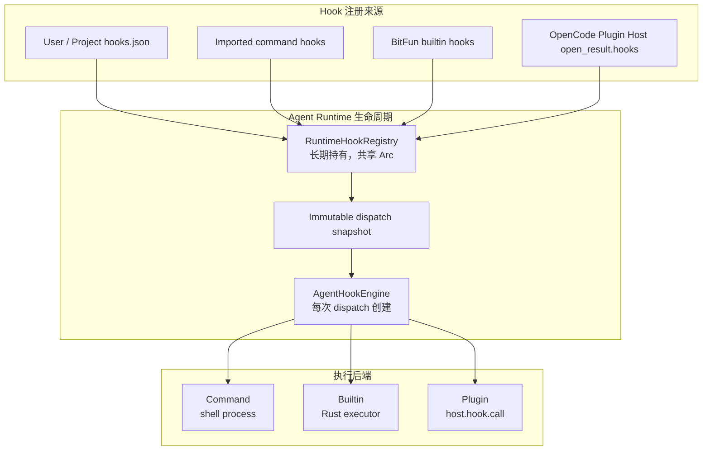
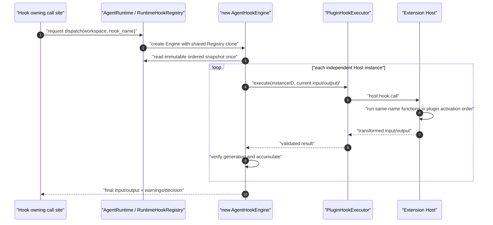

# OpenCode 插件 Hooks、Config 与 Tool 端到端适配设计

## 1. 文档目的与范围

本文是 BitFun 接入 OpenCode 插件 Hooks 的正式归档设计。后续实现、评审和兼容性演进均以本文定义的运行时边界、生命周期和业务投影为依据。

本文解决两层问题：

1. 在 BitFun 现有 command Hook 和 builtin Hook 基础上，增加可调用 OpenCode 插件 JavaScript function 的 Hook 类型，并统一接入 `RuntimeHookRegistry` 与 `AgentHookEngine`；
2. 将 OpenCode 插件 `config` 和 `tool` 结果投影到 BitFun 的 Agent、Permission、Tool 和 Skill 业务模块，形成从插件加载到 Agent 实际使用的端到端闭环。

目标插件是 `deveco-harness`。本文覆盖它实际使用的：

- `Hooks.config`；
- `Hooks.tool`；
- `config.agent.<id>.mode/description/prompt/permission`；
- `config.skills.paths`。

同时，本文定义通用 OpenCode function Hook 的注册和执行框架；`tool.execute.before/after` 用于定义并验证 Tool Pipeline 的接入方法，但不属于 `deveco-harness` 自身的必要输出。尚未完成 payload、decision 或业务触发点映射的其他具体 OpenCode Hook，只登记在 [`opencode-plugin-complete-compatibility-backlog.zh-CN.md`](opencode-plugin-complete-compatibility-backlog.zh-CN.md)，本文不展开临时兼容方案。

本文不复制 OpenCode Agent Runtime，不在 Rust 进程中执行 JavaScript/TypeScript，也不新建第二套 Hook Engine、Tool Registry、Agent Registry 或 Skill Registry。

本文的核心决策为：

1. 统一 Hook Runtime 只有 `Command`、`Builtin`、`Plugin` 三种 Handler；其中 `Plugin` 就是新增的 OpenCode function Hook 执行后端，通过 `host.hook.call` 调用插件侧 JavaScript function；
2. `RuntimeHookRegistry` 是注册事实的唯一 owner，由 `AgentRuntime` 长期持有，command、builtin 和 plugin registration 写入同一份共享状态；
3. `AgentHookEngine` 不长期持有注册状态，每次 dispatch 基于 `AgentRuntime` 的 Registry clone 和一次不可变 snapshot 创建，执行结束即释放；
4. Config、Tool、Agent、Permission 和 Skill 是统一 Hook Runtime 后面的业务投影或消费者，各自继续由既有业务模块拥有。

## 2. 设计基线与待解决问题

### 2.1 设计开始时的 Hook 能力

BitFun 原有可执行 Hook 主要有两类：

| 来源 | Handler 形态 | 输入 | 执行方式 |
|---|---|---|---|
| 用户、项目 native Hook | command | `hooks.json` | `AgentHookEngine` 启动 shell command，使用 Codex Hook payload 和 decision 合同 |
| Codex / Claude Code 导入 Hook | command | 适配器导入后的 native Hook document | 转换为 `AgentHookHandler` 后由 `AgentHookEngine` 执行 |
| BitFun builtin Hook | Rust executor | Product Assembly 内置注册 | 进程内调用，例如 Deep Review 成功 Tool 调用后的共享上下文统计 |

Codex-compatible native Hook 已覆盖 `PreToolUse`、`PostToolUse`、`SessionStart` 等现有 `AgentHookEvent`。command Hook 的配置发现、matcher、工作目录、stdin payload、退出码和 stdout decision 继续沿用既有合同。

`external_hooks` 是外部 AI 应用 Hook 的只读发现目录。它可以用于展示、兼容性分析和导入准备，但发现结果本身不是可执行 Hook，不能直接写入 `RuntimeHookRegistry`。

### 2.2 可复用的插件系统基础

设计开始时，插件系统只提供与 OpenCode Hook 语义无关的基础能力：

- `src/apps/extension-host` 提供受监督的 Node/Bun 执行进程和模块加载环境；
- Rust 的 `PluginHost` / `PluginHostClient` 提供进程生命周期和通用 RPC client；
- 传输使用 loopback TCP、4-byte length framing 和 JSON-RPC 2.0；
- RPC 框架支持 request/response、notification、期限、取消、错误码和 Rust 侧 handler 注册；
- 插件发现和激活结果可以为 Host 提供待加载的插件 spec 与 Workspace 上下文。

设计基线中不存在 `open_result.config/hooks/tools` 的消费、`host.hook.call`、`host.tool.execute`、OpenCode Hook registration 或 Config/Agent/Skill 投影。本文在上述通用基础上定义这些能力。

因此，新 Function Hook 不需要 Rust 再创建 Bun worker，也不需要把 JavaScript 函数传回 Rust。本文要求 Rust 只保存可序列化的 Hook 身份和一个 provider-neutral executor；真正的 function 始终保存在 Plugin Host，并通过本文定义的 `host.hook.call` 调用。

设计基线矩阵如下：

| 能力 | 基线状态 | 本文目标 |
|---|---|---|
| command Hook | 已有 | 纳入长期共享 Registry，保持原有合同 |
| BitFun builtin Hook | 已有，但可能由业务调用点直接触发 | 统一注册并由 Engine dispatch |
| Plugin Host 进程与通用 RPC | 已有 | 复用，不新建 Hook worker |
| OpenCode Config Hook | 未实现 | 在 `host.instance.open` 内执行并投影结果 |
| OpenCode Tool | 未实现 | 注册 Tool route 并通过 `host.tool.execute` 执行 |
| OpenCode 普通 function Hook | 未实现 | 注册 `HookHandler::Plugin` 并通过 `host.hook.call` 执行 |
| 插件 Agent / Permission / Skill | 未实现 | 从最终 Config 生成 generation-scoped contribution |

### 2.3 需要统一的关键问题

本文需要建立以下目标架构：

1. command、builtin 和 OpenCode function Hook 必须共享一个 Registry 数据模型和 Engine 调度边界；
2. `RuntimeHookRegistry` 必须由 `AgentRuntime` 长期持有，不能随一次 dispatch 或 native Hook 文件刷新丢失插件注册；
3. `AgentHookEngine` 是一次 dispatch 的短生命周期执行器，每次 dispatch 基于 Registry snapshot 创建，不长期保存插件状态；
4. Plugin Host 返回的 function Hook 必须形成真正的 `HookHandler::Plugin`，由 Engine 调用插件侧 function；
5. builtin Hook 不能保留一条绕过 Registry 的硬编码执行链；
6. `config`、Tool、Agent 和 Skill 是 Hook 结果的业务消费者，不应反过来成为另一套 Hook Runtime。

## 3. 核心架构

### 3.1 总体模型



核心生命周期规则是：

- `AgentRuntime` 创建时获得一个 `RuntimeHookRegistry`，并在自身整个生命周期内持有；
- Product Assembly、native Hook 配置协调器和 Plugin Generation Coordinator 只持有该 Registry 的 clone；所有 clone 指向同一个内部状态；
- 每个 Hook 调用点开始 dispatch 时，从 `AgentRuntime` 持有的 Registry 取得不可变 snapshot，并创建本次调用使用的 `AgentHookEngine`；
- Engine 执行完成后释放，不作为注册状态或插件状态的 owner；
- Registry 更新不替换 `AgentRuntime` 中的句柄，而是在共享 state 中原子替换受影响分区。

因此，Engine 可以针对当前 dispatch 携带 cwd、Session、Turn、Workspace、generation lease 和 cancellation 等上下文；Registry 则只保存跨 dispatch 稳定存在的 plan、handler binding、matcher、作用域和 activation。

### 3.2 为什么 Engine 每次 dispatch 创建

`AgentHookEngine` 是执行器，不是配置缓存。短生命周期设计避免以下问题：

- Engine 不承担 command、builtin 或 plugin registration 的持久化；
- Engine 不跨 Workspace、Session、Turn 或 generation 复用调用上下文；
- Registry 更新只影响后续 dispatch，新 dispatch 必须读取当前已发布 snapshot；
- Host close 或 generation 撤销后，新 dispatch 无法取得已撤销的插件 registration。

一次 dispatch 只读取一次 Registry snapshot，异步执行期间不持 Registry 锁。即使执行过程中发生插件卸载或配置刷新，本次调用也只使用调用开始时的 registration 集合；每个插件调用仍需在进入 RPC 前后复核 generation lease，防止旧结果写入新状态。

### 3.3 Registry 的长期归属

目标结构等价于：

```rust
pub struct AgentRuntime {
    // 省略其他长期运行时依赖
    hook_registry: RuntimeHookRegistry,
}

#[derive(Clone, Default)]
pub struct RuntimeHookRegistry {
    inner: Arc<RwLock<RuntimeHookRegistryState>>,
}

struct RuntimeHookRegistryState {
    entries: BTreeMap<RuntimeHookKind, Arc<[RuntimeHookRegistration]>>,
    source_activation:
        BTreeMap<(RuntimeHookSource, Option<WorkspaceScope>), RuntimeHookActivation>,
}
```

`AgentRuntimeBuilder::with_hook_registry(registry)` 用于装配共享句柄。SDK 可以提供 `hook_plans()` 只读快照，但不得暴露 `RuntimeHookRegistration`、handler、executor 或 Plugin Host client binding。

如果 Product Assembly 需要按 Workspace 找到 Registry，它只能建立指向同一 `AgentRuntime` Registry clone 的索引；该索引不是第二个 Registry，也不是插件 Hook 的第二份真相源。`AgentHookEngine` 不进入该索引，也不保存或重放插件 Hook。

装配顺序固定为：Product Assembly 先创建 Registry，注册 builtin 和初始 command source，再把同一个 Registry clone 交给 `AgentRuntimeBuilder`、native Hook 配置协调器和 Plugin Generation Coordinator。插件可以在 Agent Runtime 启动后动态写入该共享 Registry；任何一方都不能用一个新建 Registry 替换自己的本地副本。

## 4. 统一 Hook Runtime 设计

### 4.1 Runtime Hook 类型

最终 Hook 类型只有三类：

```rust
#[non_exhaustive]
pub enum RuntimeHookKind {
    Lifecycle(AgentHookEvent),
    SuccessfulToolPostCall,
    PluginHook(String),
}
```

| 类型 | 用途 |
|---|---|
| `Lifecycle(AgentHookEvent)` | Codex-compatible native lifecycle Hook，直接复用现有事件枚举和 decision 合同 |
| `SuccessfulToolPostCall` | BitFun 内核成功执行 Tool 后的通用 builtin 触发点；具体行为由稳定 plan ID 区分 |
| `PluginHook(name)` | Plugin Host 报告的 OpenCode function Hook，例如 `tool.execute.before` |

`Config` 和 `ToolDefinition` 不属于 `RuntimeHookKind`：

- `Hooks.config` 在 `host.instance.open` 内同步执行并返回最终 Config；
- `Hooks.tool` 是 Tool 定义表，注册到 Tool Registry 后通过 `host.tool.execute` 执行。

### 4.2 新增 OpenCode Function Hook

OpenCode 插件返回的普通 Hook 是 JavaScript async function，通常具有 `(input, output) => Promise<void>` 的变换语义。新增 Function Hook 的完整含义是：

1. 插件的 `server(input)` 在 Plugin Host 中返回 `Hooks`；
2. Host 保留 function 对象，只将支持 RPC 调用的通用 Hook 名称放入 `open_result.hooks[]`；
3. Rust 为 `instance_id + generation_key + revision + hook_name` 创建 `HookHandler::Plugin`；
4. 业务触发点调用 `AgentHookEngine::dispatch_plugin_hook`；
5. Engine 通过 `PluginHookExecutor` 发起 `host.hook.call`；
6. Host 调用实例内所有同名 function，并返回累计变换后的 `input/output`；
7. Engine 校验响应和 generation 后，将结果交回业务调用点。

Rust 侧使用名称 `Plugin` 而不是 `Function`，是为了表达执行归属：Rust 不持有也不执行函数，只持有插件 RPC binding。它仍然是相对于原有 command/builtin 新增的“function 类型 Hook”。

```rust
pub enum HookHandler {
    Command(AgentHookHandler),
    Plugin {
        executor: Arc<dyn PluginHookExecutor>,
        instance_id: String,
        generation_key: String,
        hook_name: String,
        revision: String,
    },
    Builtin {
        executor: Arc<dyn BuiltinHookExecutor>,
    },
}

pub struct PluginHookCall {
    pub instance_id: String,
    pub workspace_scope: String,
    pub generation_key: String,
    pub revision: String,
    pub hook_name: String,
    pub input: serde_json::Value,
    pub output: serde_json::Value,
}

pub struct PluginHookResult {
    pub instance_id: String,
    pub generation_key: String,
    pub revision: String,
    pub hook_name: String,
    pub input: serde_json::Value,
    pub output: serde_json::Value,
}

pub struct PluginHookError {
    pub code: String,
    pub message: String,
    pub retryable: bool,
}

#[async_trait]
pub trait PluginHookExecutor: Send + Sync {
    async fn execute(
        &self,
        call: PluginHookCall,
    ) -> Result<PluginHookResult, PluginHookError>;
}
```

`PluginHookExecutor` 位于 portable agent runtime 边界，不能依赖 `PluginHostClient`。Product Assembly 注入具体实现，将 `PluginHookCall` 翻译为 `host.hook.call`。`workspace_scope + instance_id + generation_key + revision` 是一次调用不可缺少的租约；只把 `revision` 保存在 Handler 中不足以阻止旧 instance 或旧 Host connection 的迟到响应。

### 4.3 Plan、Registration 与 Matcher

```rust
pub struct RuntimeHookPlan {
    id: String,
    kind: RuntimeHookKind,
    source: RuntimeHookSource,
    order: u16,
    timeout_millis: u64,
    error_policy: RuntimeHookErrorPolicy,
}

pub struct RuntimeHookRegistration {
    plan: RuntimeHookPlan,
    handler: HookHandler,
    matcher: AgentHookMatcher,
    workspace_scope: Option<String>,
}
```

- `RuntimeHookPlan` 是不包含执行对象的稳定元数据；
- `RuntimeHookRegistration` 组合 plan、handler、matcher 和 Workspace 作用域；
- `AgentHookMatcher::Any` 表示无过滤，不再使用 `Option<Matcher>` 重复表达；
- Registry 的公开只读接口返回 plan snapshot，不泄露 handler runtime binding；
- Hook ID 必须在 Registry 中唯一，并包含足够的来源、实例、revision 和 Hook 名称事实，不能只使用裸 `tool.execute.before`。

### 4.4 Source 与稳定执行顺序

```rust
pub enum RuntimeHookSource {
    Builtin { priority: u16 },
    UserCommand,
    ProjectCommand,
    ImportedCommand,
    OpenCodePlugin,
}
```

同一个 `RuntimeHookKind` 的 snapshot 按以下键稳定排序：

```text
(source precedence, order, id)
```

来源优先级为：

```text
Builtin(priority)
  < UserCommand
  < ProjectCommand
  < ImportedCommand
  < OpenCodePlugin
```

source 只参与 Registry 分区、排序和 activation 判断。command、builtin 和 plugin 仍分别执行自己的合同，不能因为统一排序而互相转换 Handler 类型。

### 4.5 Registry 写入与读取接口

Registry 至少提供以下行为：

```rust
impl RuntimeHookRegistry {
    pub fn register_batch(
        &self,
        entries: Vec<RuntimeHookRegistration>,
    ) -> Result<(), RuntimeHookRegistryError>;

    pub fn replace_command_source(
        &self,
        source: RuntimeHookSource,
        workspace_scope: Option<&str>,
        entries: Vec<RuntimeHookRegistration>,
    ) -> Result<(), RuntimeHookRegistryError>;

    pub fn register_plugin_batch(
        &self,
        entries: Vec<RuntimeHookRegistration>,
    ) -> Result<RuntimeHookCommitToken, RuntimeHookRegistryError>;

    pub fn rollback_plugin_batch(&self, token: &RuntimeHookCommitToken);

    pub(crate) fn registrations_for_workspace(
        &self,
        kind: RuntimeHookKind,
        workspace_scope: Option<&str>,
    ) -> Arc<[RuntimeHookRegistration]>;

    pub fn plans(&self) -> Vec<RuntimeHookPlan>;
}
```

写入规则：

- builtin 使用 `register_batch`；
- user/project/imported command 使用 `replace_command_source`，只能替换自己的 `source + workspace_scope` 分区；user Hook 使用全局 `None` 分区，project/imported Hook 使用规范化 Workspace 分区；
- OpenCode plugin 使用 `register_plugin_batch`，批次中所有 `HookHandler::Plugin` 必须属于同一个 `workspace_scope + instance_id + generation_key + revision`；
- `RuntimeHookCommitToken` 保存上述完整批次身份和确切 Hook ID 集；插件回滚使用该 token 精确删除目标批次，不能按 Hook 名称、Workspace 或 instance 单字段清空其他来源；
- 写入前校验空 ID、重复 ID、零 timeout、source/handler 不匹配、Workspace 缺失和插件批次身份混合；同一 Workspace 刷新 project/imported Hook 不能删除其他 Workspace 或全局 user Hook；
- 同一个插件 Hook 只能注册到 `AgentRuntime` 持有的共享 Registry；Engine 不是注册写入目标，也不得存在 Workspace 私有 Registry 或其他 registration 镜像表；
- 校验和 snapshot 构造在锁外完成，发布时只持有短写锁，并合并到最新 state，避免不同来源的并发更新互相覆盖。

读取规则：

- 每次 dispatch 只读取一次拥有所有权的 `Arc<[RuntimeHookRegistration]>`；
- snapshot 只包含当前 Workspace 可见且 activation 为可消费状态的 registration；
- Engine 执行期间不持 Registry 锁，也不读取第二次 Registry 来改变本次顺序。

### 4.6 每次 Dispatch 的 Engine 创建与执行

统一入口遵循以下形式：

```rust
async fn dispatch_hook(runtime: &AgentRuntime, request: HookDispatchRequest) -> HookDispatchResult {
    let engine = AgentHookEngine::with_registry(runtime.hook_registry().clone());
    engine.dispatch(request).await
}
```

`HookDispatchRequest` 只携带本次调用上下文，例如 `kind`、Workspace、Session、Turn、cwd、generation lease、payload 和取消令牌；它不携带可执行 Handler。Handler 必须从本次 snapshot 解析，避免调用方绕过 Registry 直接构造插件执行绑定。

这是生命周期表达，不要求所有事件共用完全相同的 payload 类型。Engine 内部按 `RuntimeHookKind` 选择强类型分支：

- `Lifecycle`：构造 Codex-compatible `AgentHookPayload`，执行 matcher 命中的 command/builtin；
- `SuccessfulToolPostCall`：构造 `HookCallPayload::ToolUse`，执行注册的 builtin；
- `PluginHook(name)`：携带 JSON `input/output`，执行 `HookHandler::Plugin`。

Engine 不接收 Config DTO、Tool registration 或 Skill root。业务模块只把某个明确 Hook 所需的 payload 交给 Engine，并消费经过对应适配器校验的结果。

### 4.7 Function Hook 调度语义



具体规则：

1. 一个 `instance_id + hook_name` 只生成一个 Rust registration；
2. 一个 `host.hook.call` 表示该 Host instance 内完整的同名 Hook 链；
3. Host 按插件激活顺序串行调用链内 function；Rust 不按 Host 内插件数重复调用；
4. 同一 Workspace 有多个独立 Host instance 时，Rust 按 Registry 顺序串行调用各 instance；
5. 前一实例成功返回的 `input/output` 成为后一实例的输入；
6. 每个调用使用 plan timeout，并在调用前后校验 Workspace、instance、revision 和 generation lease；
7. 超时、错误或迟到结果不能产生部分 mutation，也不能应用到新 generation；
8. 调用点必须为具体 OpenCode Hook 定义 payload、结果校验和 decision 映射，不能把任意 JSON 成功返回当作该 Hook 已完整适配。

Host instance 内部的同名 function 链遵循 OpenCode 的顺序失败语义：任一 function 抛错后，本次 `host.hook.call` 立即失败，后续同名 function 不再执行，Host 不返回本次调用中已经产生的局部变换。Rust 将整个 Host instance 链视为一个 registration 失败，再由该 registration 的 `RuntimeHookErrorPolicy` 决定是否继续下一个独立 Host instance或终止业务调用。Rust 的 plan 不能越过 RPC 边界控制 Host instance 内单个插件 function 的错误策略。

### 4.8 错误策略

| `RuntimeHookErrorPolicy` | Engine 行为 |
|---|---|
| `FailTurn` | 终止当前 dispatch，将失败返回当前 Turn 的归属调用点 |
| `SkipHook` | 丢弃当前 Handler 的变换，保留调用前累计值并继续 |
| `DenyTool` | 仅在 Tool before-hook 调用点转为拒绝 Tool；其他调用点不得使用 |
| `RecordWarning` | 记录受限诊断，保留调用前累计值并继续 |

外部 Hook 适配器必须根据 OpenCode 对应 Hook 的正式语义显式选择策略。不得为所有 function Hook 统一 fail-open 或 fail-closed，也不得用一个通用布尔值猜测 decision。

### 4.9 Function Hook Adapter 与业务触发点

通用 Function Hook Runtime 只解决“注册哪一个 function、如何有序调用、如何获得变换结果”，不能自动决定一个 Hook 应该在 BitFun 哪个时刻触发。每个正式接入的 OpenCode Hook 必须提供一个归属模块 adapter：

```rust
trait OpenCodeHookAdapter {
    type BitFunInput;
    type BitFunOutput;

    fn hook_name(&self) -> &'static str;
    fn encode(
        &self,
        input: &Self::BitFunInput,
        output: &Self::BitFunOutput,
    ) -> Result<(Value, Value), HookAdapterError>;
    fn decode_and_validate(
        &self,
        input: Value,
        output: Value,
    ) -> Result<Self::BitFunOutput, HookAdapterError>;
}
```

具体 trait 名称可以按模块调整，但必须保留以下职责：

1. 在真实业务 owner 中选择唯一触发点；
2. 从 BitFun 强类型事实构造 OpenCode-compatible `input/output`；
3. 限制允许插件修改的字段、JSON 大小和深度；
4. 对 Host 返回值执行结构和业务终检；
5. 将 OpenCode decision 映射为该业务 owner 的强类型结果；
6. 明确 timeout、error policy、取消和可重试性。

Function Hook 可分为两种执行语义：

| 语义 | OpenCode 形态 | Engine 合并方式 |
|---|---|---|
| 变换型 | `(input, output) => Promise<void>` | 每个 Host instance 成功后累计 `input/output`，例如 `tool.execute.before/after` |
| 观察型 | `(input) => Promise<void>` | `output` 使用空对象；失败按非阻断策略记录，不能把观察型 Hook 当成业务状态变换 |

`Hooks.config` 虽然也是插件 function，但它有加载期、同一 JavaScript 对象原地修改和最终 Config 快照语义，因此由 `host.instance.open` 专门执行，不走运行期 Function Hook Adapter。`Hooks.tool` 是可调用能力定义，也不属于上述两类。

本文定义的 Tool 闭环接入 `tool.execute.before` 和 `tool.execute.after`。`tool.execute.before` 在 Tool 名称解析、Workspace route 解析和 `allowed_tools` admission 成功后触发，但必须早于参数 schema 校验和 permission planning；插件变换后的最终 args 再进入 schema 校验、permission intent 生成和授权。这样不可见或不存在的 Tool 不会触发插件代码，权限判断也不会基于变换前参数。`tool.execute.after` 只在得到 Tool 执行结果后触发，并在大结果持久化、Session transcript 写入和最终事件发布前规范化变换后的 `title/output/metadata`；attachment 由 ToolResult adapter 检测，当前阶段明确拒绝而不是作为任意 metadata 透传。

`tool.execute.before/after` 是 Workspace 级 OpenCode Function Hook，不是 `Hooks.tool` 定义的 Plugin Tool 私有 wrapper。只要 Tool 已通过当前 Agent 的 admission，它们可以作用于 BitFun native Tool、MCP Tool 和 Plugin Tool；变换后的内容仍由被调用 Tool 的 owner 执行 schema、permission 和结果终检。

Host 报告的 function Hook 只有在 Rust 侧存在已启用的强类型 adapter 时才写入可执行 Registry。尚无业务触发点或结果合同的 Hook 只进入 capability/diagnostic snapshot，状态为 `discovered_unsupported`，不创建可消费 registration，也不参与 Workspace 的 `Ready` activation 判定。不能以“名称已发现”或“Host 可以调用”为理由将未适配 Hook 标记为 Ready。

## 5. BitFun Builtin Hook 的统一处理

### 5.1 注册方式

BitFun builtin Hook 必须实现 `BuiltinHookExecutor` 并注册到同一个 `RuntimeHookRegistry`：

```rust
#[async_trait]
pub trait BuiltinHookExecutor: Send + Sync {
    async fn execute(&self, call: &HookCall) -> HookHandlerResult;
}
```

Product Assembly 在创建 `AgentRuntime` 前注册 builtin registration。builtin 不来自 JSON 配置，也不通过 Plugin Host，但仍使用 plan、matcher、timeout、error policy 和 Engine dispatch。

### 5.2 Deep Review Shared Context Hook

现有 `DeepReviewSharedContextToolUse` 应表达为：

```text
plan.id       = "deep-review.shared-context"
plan.kind     = SuccessfulToolPostCall
plan.source   = Builtin(priority = 0)
handler       = Builtin(DeepReviewSharedContextExecutor)
matcher       = Any
```

Tool Pipeline 在成功 Tool 调用后发起 `SuccessfulToolPostCall` dispatch。本次 dispatch 创建新的 `AgentHookEngine`，从 `AgentRuntime` 的 Registry snapshot 中取得 builtin registration 并执行。不得再维护独立的 `successful_tool_post_call_hooks()` 数组、单独遍历 executor，或用硬编码函数绕过 Registry。

`SuccessfulToolPostCall` 是稳定触发类别，不是 Deep Review 专用类型。未来其他 builtin 可以注册到同一 kind，以 plan ID 和 source priority 区分行为。

`DeepReviewSharedContextExecutor` 接收 Tool success facts 后只在以下条件全部满足时记录：

- Tool 是 `Read` 或 `GetFileDiff`；
- 调用方是 Deep Review reviewer；
- 存在 parent dialog turn ID；
- 存在非空文件路径，且不是 `bitfun://runtime/` 内部资源。

记录按 parent turn 和规范化后的 `{tool_name, file_path}` 聚合，维护调用次数与 reviewer 集合，用于生成重复读取测量快照。此业务过滤保留在 Deep Review owner；Registry matcher 仍为 `Any`，因为 Registry 不应读取 Deep Review 的 `custom_data` 或持有预算 tracker。远程 Workspace 保留远端路径事实，本地 Workspace 可以由业务 owner 转换为 Git 相对路径。

### 5.3 与 Command 和 Plugin 的隔离

- builtin 不读取或修改用户 `hooks.json`；
- command Hook 刷新不能删除 builtin；
- OpenCode plugin activation 不能阻断 builtin；
- builtin executor 不持有 Plugin Host client；
- builtin 需要的业务依赖通过 Product Assembly 注入 provider-neutral port，不向 portable runtime 引入上层实现依赖。

## 6. Plugin Host 与 Function Hook RPC

### 6.1 Host 职责

Plugin Host 在实际执行域内；一个 `host.instance.open` 只对应一个 Workspace，但可以加载多个插件：

1. 按声明顺序加载插件；
2. 对每个插件调用 `server(input)` 并保存返回的 `Hooks`；
3. 顺序执行 `Hooks.config`；
4. 建立 `Hooks.tool` 的不透明执行注册；
5. 建立通用 function Hook 名称到实例内有序函数链的索引；同名 function 链可以跨 instance 内多个插件，但 Rust 只为该 instance 建立一条 registration；
6. 在实例 close 时释放模块、stream 和执行上下文。

Rust 不要求 Host 序列化函数，也不从插件源码重新推断运行期 Hook。

### 6.2 Capability 握手

`backend.handshake` 必须协商功能集合，不能只比较一个整体协议版本：

```json
{
  "token": "...",
  "protocolVersion": 1,
  "opencodeVersion": "1.17.18",
  "maxFrameBytes": 16777216,
  "capabilities": ["config-contributors-v1", "generation-fencing-v1"]
}
```

Rust 响应同样返回 `capabilities`，其值是双方支持集合的交集。连接对象保存协商结果，业务调用只查询已协商集合，不根据包版本、字段是否偶然存在或 Host 自报版本猜测能力。

| Capability | 启用的合同 |
|---|---|
| `config-contributors-v1` | `host.instance.open` 返回 `configContributors`，允许执行需要插件归属的 Agent/Permission/Skill projection |
| `generation-fencing-v1` | open、Hook、Tool 请求和响应携带并回显 `instanceID + generationKey + revision`，允许执行 function Hook 和 Plugin Tool |

新增 capability 字符串必须保持向前兼容；未知 capability 被忽略。缺少所需 capability 时保留发现和诊断能力，但对应可执行能力明确标记为 `unsupported`，不能使用部分字段拼出降级执行路径。

### 6.3 `host.instance.open`

请求的稳定字段包括：

```json
{
  "instanceID": "bitfun:host:12:7",
  "generationKey": "host-12:instance-7:sha256-...",
  "revision": "revision-3",
  "project": { "id": "project-id", "worktree": "C:/repo" },
  "config": { "agent": {}, "skills": { "paths": [] } },
  "directory": "C:/repo",
  "worktree": "C:/repo",
  "plugins": [{ "spec": "D:/plugins/deveco-harness" }],
  "configurationFingerprint": "sha256:..."
}
```

响应的稳定字段包括：

```json
{
  "instanceID": "bitfun:host:12:7",
  "generationKey": "host-12:instance-7:sha256-...",
  "revision": "revision-3",
  "config": {},
  "configContributors": [{
    "plugin": { "spec": "D:/plugins/deveco-harness", "entry": "...", "index": 0 },
    "outcome": "applied"
  }],
  "hooks": ["tool.execute.before", "tool.execute.after"],
  "tools": [{
    "registrationID": "tool:12:7:1",
    "id": "arkts_check",
    "plugin": { "spec": "D:/plugins/deveco-harness", "entry": "...", "index": 0 },
    "description": "...",
    "parameters": { "type": "object", "properties": {} }
  }],
  "diagnostics": []
}
```

Generation coordinator 必须在调用 `host.instance.open` 前生成 `generationKey` 和不可复用的 `revision`，并把二者与预分配的 `instanceID` 一起发送给 Host。Host 只在成功建立该 instance 后回显并绑定这三个事实；后续 Hook 和 Tool 请求、响应都必须原样携带它们。它们属于 Rust 与 Host 之间的运行时租约，不是插件可以读取、覆盖或经 Config Hook 修改的配置字段。

在协商 `config-contributors-v1` capability 后，`config`、`configContributors`、`hooks` 和 `tools` 即使为空也必须存在。`configContributors` 只记录声明 Config Hook 的插件身份和该次调用的 `applied/failed` 结果，不包含 Prompt 或字段正文；它用于第一版判断最终 Config 是否具有唯一可归属来源。旧 Host 未返回 `configContributors` 时，Rust 可以保留基础激活诊断，但必须把需要来源归属的 Agent/Permission/Skill projection 标记为 `unsupported`，不能把缺字段解释为空 contributor。`registrationID` 是 Host 路由身份，Rust 不解析其结构。Tool ID 在一个 instance 内必须唯一。Config、Hook 名称、Tool Schema 和所有字符串均受数量、长度、深度和总响应大小限制。

目标插件 `deveco-harness` 只提供 `config` 和 `tool`，因此它的 `hooks[]` 应为空。通用测试插件或其他插件返回 `tool.execute.before` 等 function 时，名称才进入 `hooks[]`。

### 6.4 `host.hook.call`

```json
{
  "instanceID": "bitfun:host:12:7",
  "generationKey": "host-12:instance-7:sha256-...",
  "revision": "revision-3",
  "hook": "tool.execute.before",
  "input": { "tool": "arkts_check", "sessionID": "session-id" },
  "output": { "args": { "path": "src/main.ets" } }
}
```

响应：

```json
{
  "instanceID": "bitfun:host:12:7",
  "generationKey": "host-12:instance-7:sha256-...",
  "revision": "revision-3",
  "hook": "tool.execute.before",
  "input": { "tool": "arkts_check", "sessionID": "session-id" },
  "output": { "args": { "path": "src/main.ets" } }
}
```

Host 必须只调用当前 instance 中注册的同名 function，并按插件激活顺序串行执行。在协商 `generation-fencing-v1` capability 后，`generationKey` 和 `revision` 是调用租约的必需字段；Host 必须校验其仍指向当前 instance，并在响应中原样返回。Rust 只接受当前 instance、revision、generation 和请求 Hook 名称对应的响应。响应缺字段、结构超限、实例关闭、超时或 generation 不匹配都按 plan error policy 处理。旧 Host 不支持这些 fencing 字段时，function Hook 保持明确 unavailable，不允许忽略字段后降级执行。

### 6.5 明确废弃的平行实现

本设计不包含：

- `HookFunctionRuntime`；
- `Single` / `Chain` Rust-to-worker 调用模型；
- 独立 Bun Hook worker 或 `hook_worker.js`；
- stdin/stdout JSON-line Hook 协议；
- `RuntimeHookKind::Config` / `RuntimeHookKind::ToolDefinition`；
- `ConfigHookNotifier` 或由 Rust 自建的 JavaScript Hook runtime。

Config、Tool 和普通 function Hook 分别使用本文定义的 `host.instance.open`、`host.tool.execute` 和 `host.hook.call`，并复用同一 Plugin Host 传输和生命周期。

## 7. Plugin Generation、注册与激活

### 7.1 身份与作用域

每个插件贡献必须携带：

```text
plugin_instance_id  = host.instance.open 的 instanceID
plugin_identity     = plugin spec + resolved entrypoint + entrypoint index + plugin id（若有）
workspace_scope     = 实际执行域规范化后的 Workspace 路径
config_fingerprint  = 本次 Config 输入指纹
generation_key      = instance + fingerprint + host generation
revision            = generation 内不可复用的发布 revision
```

Agent、Tool、Hook 和 Skill 使用同一个 generation 归属。撤销和迟到响应判断不能只比较 Hook 名、Tool ID 或 Agent logical ID。

### 7.2 Activation Gate

```text
Absent -> Preparing -> Ready
                     \-> Unavailable
Ready  -> Preparing -> Ready
Ready  -> Unavailable
```

activation 以 `RuntimeHookSource::OpenCodePlugin + workspace_scope` 保存于 `AgentRuntime` 的共享 Registry。它只限制 OpenCode plugin 来源，不影响 command 或 builtin。

`Preparing` 期间允许 prepare 和校验，但以下贡献都不可被消费：

- Plugin function Hook；
- Plugin Tool；
- Config projection 和插件 Agent route；
- Plugin Skill root。

### 7.3 原子发布

```mermaid
sequenceDiagram
    autonumber
    participant C as "Plugin Generation Coordinator"
    participant H as "Extension Host"
    participant R as "AgentRuntime Hook Registry"
    participant O as "Agent / Tool / Skill owners"

    C->>R: "OpenCodePlugin(workspace) = Preparing"
    C->>H: "host.instance.open"
    H->>H: "load; run config; collect function hooks/tools"
    H-->>C: "OpenResult"
    C->>C: "validate and prepare complete generation"
    C->>R: "register_plugin_batch(instance + generation + revision)"
    R-->>C: "Hook commit token"
    C->>O: "commit Agent / Tool / Skill contributions"
    alt "all commits succeeded"
        C->>R: "activation = Ready"
    else "any commit failed"
        C->>O: "rollback committed contributions"
        C->>R: "rollback_plugin_batch(token)"
        C->>R: "keep unretired prior generation or set Unavailable"
    end
```

一个 generation 在所有 owner 提交成功之前都不可见。统一 generation token 必须包含 Hook、Agent、Tool 和 Skill 子 token。Host close、插件停用、权限收紧或替换时按统一 token 撤下，不能只删除 Hook 或 Tool。只有仍在运行、尚未进入 retirement 且仍满足当前安全策略的上一 generation 才能继续保持 Ready；旧 instance 一旦关闭或贡献已经撤下，就不能仅凭旧内存快照把它恢复成 Ready。

## 8. Config Hook 与 Config Projection

### 8.1 Config Hook 执行语义

OpenCode `Hooks.config` 通过原地修改配置对象产生结果。Host 必须把同一个累计对象按插件激活顺序传给 Config Hook，后一个 Hook看到前一个 Hook 的修改。单个 Config Hook 抛错时，Host 记录带插件身份的诊断，保留该 Hook 抛错前已经写入累计对象的 mutation，并继续执行后续 Config Hook；链完成后，`host.instance.open` 返回最终 `open_result.config` 和 `configContributors`。这是 Config 加载链的 OpenCode 兼容语义，不复用运行期 Function Hook 的“失败时丢弃本次变换”语义。

Config 不是运行期 `PluginHook`，Rust 不再次调用 Config function，也不把 Config registration 写入 Hook Registry。

本文定义的 `open_result.config` 是多插件合并后的最终快照，第一版合同只提供 contributor 身份，不提供字段级贡献来源。因此只有 `configContributors` 中恰好一个插件声明 Config Hook 时，Rust 才能把 Config 新增的 Agent、permission 和 Skill path 归属到该插件 generation。唯一 contributor 的 `outcome=failed` 不改变身份归属：因为 Config 保留抛错前 mutation，Rust 仍把最终差集归属于该 contributor，并将 generation 标为 degraded；最终差集仍须完整校验。存在多个 contributor 时，Host 仍按 OpenCode 语义完成 Config 链并返回最终快照，但 Rust 对 Agent/Skill 等需要精确归属的业务 projection 返回 `unsupported_multiple_config_contributors`，不猜测字段归属；不依赖归属的健康展示可以保留最终快照。完整字段级来源支持登记在 compatibility backlog。

Config Hook 的单步失败本身不自动判定 generation 失败。Rust 对最终 Config 执行完整结构、归属、Agent、permission 和 Skill 校验：最终 projection 合法时可以发布，并保留 degraded diagnostic；最终 Config 或归属约束非法时才拒绝发布。产品若未来选择“任一 Config Hook 抛错即整代失败”，必须作为显式偏离 OpenCode 的策略记录，不能由通用错误处理暗中改变。

### 8.2 消费字段

本文第一版只消费：

```text
config.agent.<logical_id>:
  mode
  description
  prompt
  permission

config.skills:
  paths
```

其他字段保留在受控 Config snapshot 中，并产生可诊断的未适配状态；不得静默映射为 BitFun 策略。

### 8.3 Projection DTO

```rust
struct PluginConfigProjection {
    generation: PluginGenerationId,
    agents: Vec<PluginAgentProjection>,
    skills: PluginSkillProjection,
    diagnostics: Vec<ConfigDiagnostic>,
}

struct PluginAgentProjection {
    logical_id: String,
    mode: ExternalSubagentMode,
    description: String,
    prompt: SecretText,
    native_capability_profile: PluginAgentNativeCapabilityProfile,
    permission_rules: PermissionConstraintLayer,
    plugin_tool_ids: BTreeSet<String>,
}

enum PluginAgentNativeCapabilityProfile {
    DisplacedLocal { local_agent_key: String },
    SharedCoding,
    ReadonlyExploration,
}

struct PluginSkillProjection {
    roots: Vec<PluginSkillRoot>,
}
```

Rust 业务 owner 不直接消费无约束的 `serde_json::Value`。Agent ID、描述、Prompt、permission action、Skill path 数量和大小都必须在 prepare 阶段校验。`SecretText` 复用 External Subagent 合同中不实现 `Serialize`、且 `Debug` 不显示正文的现有类型；进入 `ExternalProvidedAgent` 时仍保持后端私有，不能为了 RPC 或前端展示新增明文序列化。

## 9. Agent 投影与 CLI 切换

### 9.1 Agent 字段映射

| OpenCode 字段 | BitFun 投影 | 规则 |
|---|---|---|
| Agent object key | `logical_id` | 保留逻辑名称，但不作为唯一运行身份 |
| `mode: primary` | `ExternalSubagentMode::Primary` | 进入 Workspace 主 Agent 列表 |
| `mode: subagent` | `ExternalSubagentMode::Subagent` | 进入 Task/Subagent 列表 |
| `mode: all` 或缺省 | `ExternalSubagentMode::All` | 同时进入两类列表 |
| `description` | `AgentInfo.description` | 缺省生成稳定来源描述，不参与权限 |
| `prompt` | 外部 Agent 完整 system prompt | 不与同名内置 Agent prompt 拼接；使用不打印正文的 `SecretText` |
| `permission` | Tool visibility + `PermissionConstraintLayer` | 与 BitFun 更高层限制合并 |

`primary` 表示角色能力，不映射为 `agentic`、`Plan` 或其他 BitFun Agent ID。

`mode` 只决定主 Agent / Subagent 角色，不足以推导完整 Tool 集。native capability profile 按以下固定规则选择，并在 generation prepare 时解析为不可变的 canonical Tool ID snapshot：

1. 如果插件 Agent 覆盖同名 BitFun 本地 Agent，使用被覆盖候选的 native Tool policy 作为 `DisplacedLocal` 基线，但不继承它的 Prompt、description 或 plugin/external dynamic Tool；
2. 没有同名候选时，`primary` / `all` 使用 Product Assembly 既有 shared-coding Tool policy，`subagent` 使用既有 Explore 只读 Tool policy；
3. 基线解析必须排除 `dynamic_provider_id == "opencode-plugin"` 的 Tool，随后只追加当前 generation 自己的 Plugin Tool；不能从全局已注册 Tool 名称集合反推所属插件；
4. 用户配置、MCP 和 deferred Tool 仍按既有 Agent Tool Policy 独立处理，但不得把其他 OpenCode plugin generation 的 Tool 合入；
5. capability profile 是 generation snapshot 的一部分。内置 Tool 集变化只影响下一 generation，不在 Turn 中途漂移。

对于 `deveco-harness`：

| Agent | 角色 | 原生能力基线 |
|---|---|---|
| `build` | Primary | 无同名本地候选时使用 `SharedCoding`；追加本 generation 未 deny 的插件 Tool |
| `plan` | Primary | 使用被覆盖 BitFun `Plan` 的 native Tool policy；再应用 Config 明确返回的 permission 和本 generation Plugin Tool |
| `explore` | Subagent | 使用被覆盖 BitFun `Explore` 的 native Tool policy；追加本 generation 未 deny 的插件 Tool |

该映射复制的是本次 generation 的 Tool policy，不是把 `primary` 硬编码成 `agentic`，也不是运行时委托给同名内置 Agent。只有 Config 明确返回的 permission 才能产生额外 deny/ask；不得从 `description` 或 Prompt 文本推断权限。Plugin Tool 在没有可信 readonly 描述字段时一律按“可能有副作用”处理，因此只要最终可见集合含 Plugin Tool，Agent 的 `is_readonly` 就不能为 true。

### 9.2 同名 Agent 覆盖与恢复

插件 Agent 与 BitFun 内置 Agent 同名时：

1. 插件来源必须已经由用户显式启用或批准；仅完成后台发现、静态预览或 Host prepare 不构成覆盖授权；
2. 在上述授权仍有效且 generation 发布后，当前 Workspace route 指向插件 Agent；插件启用行为同时记录该来源对其同名 Agent 候选的选择；
3. 内置 Agent entry 保留，不修改其 Prompt、Tool 或持久化定义；
4. CLI 只展示当前 route 生效项，并显示插件来源；
5. 用户显式卸载、禁用插件或明确选择本地候选时，移除外部 route owner，并恢复同名内置 route；
6. Host 断连、进程崩溃、刷新失败或 generation 暂时缺失时，外部 route owner 保持 `Unavailable`，不得静默回退到同名内置 Agent；
7. 已绑定旧 generation 的在途 Turn 不静默切换到内置 Agent；新调用返回明确 unavailable，要求等待恢复、重新解析或显式选择。

CLI 查询结果必须同时携带展示用 `logical_id` 和不可歧义的 `route_key`。选择时提交：

```text
AgentRouteSelection {
  logical_id,
  owner: Local | External,
  route_key?: stable local key | ecosystem + provider + plugin identity + logical_id
}
```

新写入记录必须带 `route_key`。为兼容旧数据，该字段反序列化时允许缺省，但 `owner=External` 时缺失只能按旧版保守规则解析，不能回退到同名 Local。持久化记录不把进程期 `generation_key` 当作永久 ID：Session 恢复时只允许解析同一 `route_key` 所属 external source 的当前有效 generation；每个 Turn 开始后再取得精确 `runtime_key + generation_key + revision` lease，并保持到该 Turn 结束。CLI、新 Session、Session 恢复、模式切换和 Task 委派均经过同一 Agent Registry route 解析，不能只提交或持久化可能重名的裸字符串。

## 10. Permission 与 Tool 可见性

### 10.1 Permission 映射

| OpenCode permission | Tool visibility | 执行约束 |
|---|---|---|
| `allow` | 保留 | 允许兼容层使用，但不能突破产品、组织、项目、父 Agent或系统 deny |
| `ask` | 保留 | Tool Pipeline 创建 `PermissionRequest` |
| `deny` | 从 Agent `allowed_tools` 移除 | `PermissionConstraintLayer` 再次 deny，防止绕过可见性直接调用 |

`allowed_tools` 决定模型能否看到并请求 Tool；Permission Pipeline 决定请求能否执行。两者必须从同一个 generation snapshot 生成。

对于当前目标插件，同一 `plugin_identity + generation` 的 Plugin Tool 默认加入该插件贡献的每个 Agent；`permission` 中未出现的 Plugin Tool 保持可见，出现 `deny` 时移除，`ask/allow` 时保留。Agent attribution 使用唯一 Config contributor 的 `plugin_identity` 与 `open_result.tools[].plugin` 做精确 join；同一个 Host instance 中其他插件贡献的 Tool 即使共享 generation 也不能加入。该默认只作用于“本插件、本 generation Plugin Tool”集合，绝不能把 Tool 加入原生 Agent 或其他插件 Agent。未来若支持 OpenCode 更完整的默认 permission / wildcard 合并语义，必须仍先限定插件及 generation 归属再求权限结果。

插件 Tool 权限使用 BitFun 已有的 `custom_tool` action 表达，resource 使用 OpenCode 原始 Tool ID：

```text
config.agent.<agent>.permission.<tool_id> = allow | ask | deny
    -> PermissionRule(action="custom_tool", resource=<tool_id>, effect=...)
```

精确 Tool ID 和 OpenCode 支持的通配 selector 都在同一套大小写及 wildcard 规则下匹配；模型侧名称适配不能改变 permission resource 的原始身份。`allow` 只表示该插件 Agent 的兼容层允许，`ask` 在 Tool Pipeline 首次授权阶段创建请求，`deny` 同时收紧可见性和执行约束。`bash/read/edit/skill` 等 BitFun 已知 native action 映射到同名规范 action，但不因此把对应 native Tool 加入 Agent capability profile；未知 action 的 `ask/deny` 如果无法强制执行则阻止 projection，未知 `allow` 只产生未适配诊断且不得扩权。

Plugin Tool 自身在执行期间调用 `context.ask()` 时，反向 RPC 首先通过 `instanceID + executionID` 取得不可伪造的 Agent、Session、Workspace、Tool ID 和 generation snapshot，再使用同一有效权限层评估请求。已有 deny 直接拒绝，不创建可被用户反向放宽的询问；已有 allow 是否免询问由请求 action/resource 与产品策略共同决定；其余情况才创建 `PermissionRequest`。插件提交的 `agent`、permission action 或 resource 只能作为请求内容，不能覆盖执行上下文中的真实归属。

### 10.2 插件 Tool 隔离

- Plugin Tool 只加入同一 `plugin_identity + generation` 的插件 Agent；
- 原生 Agent、Hidden Agent 和原生 Subagent 不因插件激活自动获得 Plugin Tool；
- 一个插件 Agent不能自动使用另一个插件的 Tool；
- 插件 Agent 的原生能力来自明确 capability profile，不通过把 Plugin Tool 加入全局 Tool 集合实现；
- `backend.tool.ask` 必须复用当前 Agent、Session、Workspace 和 generation 的有效权限，不能绕过 Agent deny。

Tool ID 只是模型侧名称和 permission resource，不是充分的执行路由。Agent Tool Policy 在生成 manifest 时还必须产生本 Turn 的精确 binding snapshot：

```text
model_tool_name -> ToolExecutionBinding {
  canonical_tool_id,
  provider_id,
  candidate_id,
  workspace_scope,
  plugin_identity?,
  generation_key?,
  revision?
}
```

- 原生 Agent 对每个名称绑定到非 `opencode-plugin` 的既有候选；即使同名 Plugin Tool 已注册，也不能因全局冲突选择而改路由；
- 插件 Agent 对本插件 Tool 绑定到当前 `plugin_identity + generation` 的候选；
- 插件 Agent 的 native capability profile 仍绑定到既有 native/MCP 候选；若本插件 Tool 与 profile 中 native Tool 同名，OpenCode 插件候选在该插件 Agent 的 snapshot 中覆盖同名 native 候选，并产生可见诊断；
- Tool Pipeline 从当前 Agent/Turn snapshot 取得 binding，不能在执行时仅按名称重新查询全局 winner；
- admission、schema、permission intent、before/after Hook payload 和实际执行均使用同一 binding。缺失、过期或 generation 不匹配时调用失败，不尝试同名 fallback。

现有 external-source conflict router 继续管理候选发现、用户可见冲突和非插件上下文的默认选择，但不能覆盖上述 Agent-scoped generation binding。该精确 binding 是 Tool 隔离的执行边界，不只是 manifest 过滤。

## 11. Plugin Tool 注册与执行

### 11.1 Tool Route

每个 `open_result.tools[]` 生成一个 Workspace-scoped route：

```text
tool_id -> {
  workspace_scope,
  generation_key,
  revision,
  instance_id,
  registration_id,
  plugin_identity,
  description,
  parameters,
}
```

`registrationID` 只能来自当前 open result，调用者不能自行提供。相同 Tool ID 可以存在于不同 Workspace 或 generation；同一 Workspace 的候选由现有 external-source conflict router 处理。动态 provider ID 固定为 `opencode-plugin`，但执行身份还必须包含 Workspace 和 generation。

### 11.2 Tool Manifest

构造 Agent Tool manifest 时：

1. 解析 Agent route 和 generation；
2. 选择该 Agent 的 native capability profile；
3. 只有插件 Agent 才加入同 `plugin_identity + generation` 的 Plugin Tool，并生成精确 `ToolExecutionBinding`；
4. permission 为 deny 的 Tool 从可见集合移除；
5. 应用用户配置、MCP、deferred Tool 和当前上下文可用性；
6. 执行 admission 使用同一 snapshot 再次校验。

### 11.3 Tool 执行 RPC

```json
{
  "instanceID": "bitfun:host:12:7",
  "generationKey": "host-12:instance-7:sha256-...",
  "revision": "revision-3",
  "executionID": "tool-call-id",
  "registrationID": "tool:12:7:1",
  "args": { "path": "src/main.ets" },
  "context": {
    "sessionID": "session-id",
    "messageID": "turn-id",
    "agent": "build",
    "callID": "tool-call-id"
  }
}
```

响应必须回显租约和执行身份：

```json
{
  "instanceID": "bitfun:host:12:7",
  "generationKey": "host-12:instance-7:sha256-...",
  "revision": "revision-3",
  "executionID": "tool-call-id",
  "result": {
    "title": "ArkTS Check Passed",
    "output": "...",
    "metadata": {}
  }
}
```

执行链路为：

```text
model tool call
  -> resolve Tool name and Workspace route
  -> Agent allowed_tools admission
  -> optional tool.execute.before Function Hook
  -> validate transformed args against Tool schema
  -> build permission intents and apply PermissionConstraintLayer
  -> host.tool.execute
  -> optional tool.execute.after Function Hook
  -> ToolResult normalization
  -> large-result persistence
  -> Session transcript / progress event
```

before/after Function Hook 只有在该 Hook 的 payload 和 result adapter 已实现时才接入。Hook 错误按 plan policy 处理，不能绕过 Tool admission。取消使用 `host.tool.cancel(instanceID, executionID, reason)`；超时、断连、取消和 generation 撤下后不自动重放可能有副作用的 Tool。

反向 RPC：

- `backend.tool.ask`：创建并等待 BitFun permission request；
- `backend.tool.metadata`：更新 Tool 执行进度；
- `backend.diagnostic.publish`：发布受限插件诊断。

所有反向请求必须通过 `instanceID + executionID` 找到仍有效的执行上下文，并复核 Tool route 的 generation lease。Tool 执行 RPC 同样携带并回显 `generationKey/revision`；旧 Host 若未协商等价 fencing capability，不能启用 Plugin Tool 执行。当前闭环只投影字符串结果以及结构结果的 `title/output/metadata`；OpenCode file attachment 尚无与 BitFun `ToolImageAttachment` 等价且安全的通用映射，Host 返回 attachment 时必须明确报 `unsupported_tool_attachment`，不得静默丢弃。该兼容项记录在 backlog，不在本文展开。

## 12. Skill 投影

Rust 比较 `host.instance.open` 输入和最终 `config.skills.paths`，只注册唯一 Config contributor 新增的路径。比较使用规范化后的路径 identity 和有序差集：保留插件输出顺序；重复路径只注册一次；插件删除或重排输入中已有路径不取得这些路径的所有权，也不得撤下非插件来源。`deveco-harness` 的私有 `skills.enabled` 不属于稳定 OpenCode Config 返回字段：当它为 false 时，插件不追加路径，Rust 观察到的差集自然为空。

每个 Skill root 携带：

```text
generation_key
workspace_scope
normalized_path
source_label
precedence
```

路径必须在实际 Plugin Host 执行域解析。拒绝 URL、空路径、无法规范化路径和不允许的越界路径。Skill Registry 继续负责文件数量、大小、Markdown、符号链接和名称冲突检查。

Plugin Skill 默认只进入同 generation 插件 Agent 的 Skill snapshot，不自动加入原生 Agent。Skill Registry 的 root contribution 必须有精确 commit token；插件撤下时按 token 移除对应 root，不删除用户或内置 Skill。Session/Turn 使用稳定 snapshot：每个 Turn 开始时根据 Agent generation lease 选择 Skill snapshot，Turn 内不因文件变化或 Host 响应漂移；新 Turn 才观察到已发布 generation 的 Skill diff。

## 13. 生命周期与故障处理

### 13.1 替换顺序

正常配置刷新或插件升级采用双 generation 准备、单 route 原子切换。旧 generation 在仍健康且仍满足当前安全策略时继续服务；新 generation 使用新的 instance、generation key 和 revision 在不可见状态完成完整准备：

1. 为新 generation 分配租约并把待发布状态标记为 `Preparing`，但不改变旧 generation 的 `Ready` route；
2. 打开新 Host instance，执行 Config Hook，并取得 `open_result`；
3. 校验并 prepare 新 generation 的 Hook、Agent、Tool 和 Skill contribution；
4. 任一步失败时回滚新 generation、关闭新 instance，旧 generation 继续 `Ready`；
5. 全部 owner 已准备提交时，在 generation coordinator 的同一临界区原子切换 Workspace route 和 activation；从该点起，新调用只取得新 generation lease；
6. 等待旧 generation 的在途 lease 结束或按既有取消策略终止；
7. 按旧 generation token 撤销旧贡献并关闭旧 Host instance。

新旧 instance 可以在准备窗口内短暂共存，但不能同时作为同一 Workspace route 的可消费 `Ready` generation。新 generation 的 Hook、Tool 或 Agent 在第 5 步之前不得通过全局 Registry、CLI 或执行路由被观察到。切换后的迟到响应只记录受限诊断，不写入业务状态。

权限收紧、插件显式停用/卸载、来源失信或其他要求立即撤权的事件不使用上述保留旧代流程：先阻止旧 generation 接受新调用并把 route 置为不可执行，再等待/取消在途调用、撤下贡献和关闭 instance；只有新的更严格 generation 完整发布后才能恢复执行。安全撤销期间不得为了可用性继续运行旧的宽松 generation。

### 13.2 失败范围

| 故障 | 行为 |
|---|---|
| 单个 Config Hook 抛错，但最终 Config 和归属校验合法 | 保留诊断并继续发布 degraded generation |
| 最终 Config、contributor 归属或 projection 非法 | 不发布 generation；仅在旧 generation 尚未 retirement 时保留它 |
| Tool Schema、Agent 或 Skill 校验失败 | 回滚整个 generation，不发布部分贡献 |
| Function Hook RPC 超时或失败 | 按 plan error policy 处理本次 dispatch，不重放 |
| 用户显式卸载或禁用 | 撤下 generation，移除外部 route owner，同名内置 Agent route 恢复 |
| Host instance 断连或崩溃 | activation 变为 unavailable，撤下可执行贡献，外部 Agent route 保持 fail-closed，不恢复同名内置 Agent |
| 共享 Host 进程崩溃 | 该进程承载的全部 instance 同时 unavailable；按进程级退避恢复，不按 Workspace 启动重复 Host |
| 权限收紧 | 先阻止新调用，再撤下不再合规的贡献；不能恢复旧的宽松状态 |
| 旧 generation 迟到响应 | 丢弃业务结果 |

## 14. Remote Workspace 与跨版本边界

Remote Workspace 的 Plugin Host、Config Hook、function Hook、Tool 执行和 Skill 路径解析必须全部发生在远端执行域：

- 控制端不使用本地插件、配置或路径 fallback；
- Workspace path 使用远端规范化语义；
- permission request 通过现有远程 mailbox 回到驱动端；
- Remote Host 不支持所需协议时返回明确 unsupported/unavailable；
- Session 恢复重新验证 route 和 generation，不凭本地 Agent 名称恢复。

Plugin Host RPC 新增字段在兼容反序列化层必须允许缺省，并通过握手 capability 判断其是否可用于当前连接；旧 Host 可忽略新请求字段，新 Rust 不得因此假定新语义已经生效。某项能力依赖的新字段缺失时，该能力返回明确 `unsupported/unavailable`，只有存在安全且无歧义的旧合同才允许继续。对于 `config-contributors-v1`，缺字段会禁用需要来源归属的 Config projection；对于 `generation-fencing-v1`，缺字段会禁用 function Hook 和 Plugin Tool 执行。不能通过删除 Session、配置或插件数据解决版本不匹配。

## 15. 模块职责与代码落点

| 模块 | 设计职责 |
|---|---|
| `src/crates/execution/agent-runtime/src/native_hooks` | provider-neutral Hook kind/source、handler traits、长期 Registry 和短生命周期 Engine；不能依赖 OpenCode 或 Host client |
| `src/crates/execution/agent-runtime/src/runtime.rs` | `AgentRuntime` 长期持有 `RuntimeHookRegistry`，提供只读 clone/accessor |
| `src/apps/extension-host` | 加载插件、保留 function、执行 Config/function/Tool，维护 instance 内顺序 |
| `src/crates/adapters/opencode-plugin-host` | 强类型 JSON-RPC DTO 和 `PluginHostClient`，不解释 Agent/Permission 业务语义 |
| `src/crates/adapters/opencode-adapter` | OpenCode Config/payload/result 到 provider-neutral DTO 的转换 |
| `src/crates/assembly/core/src/native_hooks.rs` | 注册 command/builtin，按 dispatch 创建 Engine，装配明确的业务调用点；`external_hooks` 保持只读 |
| `src/crates/assembly/core/src/plugin_hook_bridge.rs` | 将 `open_result.hooks` 转为同一 AgentRuntime Registry 中的插件批次 |
| `src/crates/assembly/core/src/plugin_host.rs` | 协调 open、prepare、commit、rollback、close 和 generation token |
| Agent Registry owner | 插件 Agent route、同名覆盖和恢复、Session/Task 解析 |
| Tool Registry / Tool Pipeline owner | Plugin Tool route、manifest、权限、执行和取消 |
| Skill Registry owner | 带来源动态 root、扫描、冲突和 Session snapshot |
| CLI | 只消费稳定的 Agent/Hook/Tool 查询；不解析 OpenCode Config，不直接调用 Host |

portable runtime 不能向上依赖 Product Assembly。Plugin Host client 通过 `PluginHookExecutor`、Tool provider 和稳定 DTO 注入。

## 16. 安全与可观测性

### 16.1 安全约束

- Plugin Host 返回的 Config、Hook 名称、Tool Schema、permission 和 Skill path 都是不可信输入；
- Prompt、Skill 正文、Tool 参数、凭据和模型上下文不得进入普通日志；
- Function Hook 只能操作该 Hook adapter 暴露的 payload，不能获得 Rust 内部对象引用；
- Plugin `allow` 不能突破产品、组织、项目、父 Agent 或系统 deny；
- Plugin Tool 和 function Hook 调用前后均校验 Workspace、instance、revision 和 generation；
- Host 是受监督进程，不是安全沙箱；文件、网络、环境和子进程能力必须由真实 OS/容器边界限制。

### 16.2 结构化日志

日志使用英文，只记录安全身份、计数和结果：

```text
plugin.instance.open.begin(instance_id, workspace, generation_key, revision, host_generation, plugin_count)
plugin.instance.open.complete(instance_id, generation_key, revision, hook_count, tool_count, diagnostic_count)
plugin.hook.register.commit(instance_id, workspace, generation_key, revision, hook_count)
plugin.hook.dispatch.begin(instance_id, workspace, generation_key, revision, hook_name)
plugin.hook.dispatch.complete(instance_id, generation_key, revision, hook_name, outcome)
plugin.config.project.complete(instance_id, generation_key, revision, agent_count, skill_root_count)
plugin.tool.register.commit(instance_id, generation_key, revision, tool_id, registration_id)
plugin.tool.execute.complete(instance_id, generation_key, revision, execution_id, tool_id, outcome)
plugin.generation.withdraw(instance_id, generation_key, revision, reason)
```

普通日志不打印完整 Config、Prompt、Hook input/output、Tool args/result 或 Skill 内容。

## 17. 验证与完成判定

正式实现至少需要证明：

1. `AgentRuntime` 持有的 Registry 跨多次 dispatch 和 native Hook 配置刷新保持同一共享状态；
2. 每次 command、builtin 和 plugin dispatch 都创建短生命周期 Engine，并只读取一次 snapshot；
3. command Hook 保持 Codex-compatible matcher、payload 和 decision 行为；
4. Deep Review builtin 通过 `SuccessfulToolPostCall` registration 和统一 Engine 执行，没有旁路列表；
5. handshake 只启用双方明确协商的 capability；缺失 `config-contributors-v1` 或 `generation-fencing-v1` 时，依赖它的 projection 或执行能力明确 unavailable；
6. 测试插件的 function Hook 从 `open_result.hooks` 注册，经 `host.hook.call` 真正调用插件侧 function，并按顺序累计 `input/output`；未实现 adapter 的名称只进入 `discovered_unsupported`；
7. 同一 Host instance 的同名 function 链只调用一次；多个独立 instance 按 Registry 顺序执行；
8. `deveco-harness` Config 产生 `build`、`plan`、`explore`，CLI 可按 mode 列出和切换，同名内置 Agent 在卸载后恢复；
9. `description`、`prompt`、`permission` 和 Skill path 来自最终 Config projection；Session 持久化 `logical_id + owner + route_key`，并在 Turn 开始时取得当前 generation lease；
10. Plugin Tool 只对所属插件 Agent 可见，allow/ask/deny 同时影响 manifest 和执行权限；原生 Agent 与插件 Agent 的 Tool 执行均使用 Agent-scoped `ToolExecutionBinding`，同名候选不能在执行时被全局 winner 替换；
11. Tool 通过 `host.tool.execute` 完成真实调用，before/after function Hook 在已适配时进入 Tool Pipeline；Host 返回 attachment 时明确报告 `unsupported_tool_attachment`；
12. open 失败、部分提交失败、Host close、超时、取消、权限收紧和迟到响应均不会污染新 generation；open、Hook 与 Tool 响应的 `instanceID + generationKey + revision` fencing 均被校验；
13. 本地和 Remote Workspace 都在实际执行域完成 Host 调用、路径解析和 permission 交互。

仅证明 Plugin Host 能启动、Hook 名称出现在日志中或 Tool 能单独执行，不构成端到端完成。

## 18. 兼容性边界

本文未定义 payload、decision 和业务触发点映射的 OpenCode function Hook，不因通用 `host.hook.call` 实现完成而自动成为完整兼容。所有已确认但暂不实现的 Gap 统一维护在 [`opencode-plugin-complete-compatibility-backlog.zh-CN.md`](opencode-plugin-complete-compatibility-backlog.zh-CN.md)。
