# Local Agent Host 与多实例运行架构

本文定义多个 Desktop GUI、交互式 TUI、本机 Remote Control、Headless CLI 与公开 Agent SDK 同时运行时的进程关系、
状态归属、共享范围、隔离边界和容量治理。Agent Runtime 的职责与 crate 归属继续以
[`agent-runtime-services-design.md`](agent-runtime-services-design.md) 为准；公开 SDK 与 SDK Host 以
[`agent-sdk-product-architecture.md`](agent-sdk-product-architecture.md) 为准；第三方 JS/TS 插件进程以
[`plugin-runtime-design.md`](extensions/plugin-runtime-design.md) 为准。

本文描述目标部署。当前 Desktop、TUI 和普通 CLI 仍主要在各自进程内组装 Runtime；`bitfun-sdk-host` 只是公开 SDK
路径的内部 preview。没有完成行为等价、生命周期、安全、重连和性能验证前，不得把 Local Agent Host 写成已交付能力。

## 1. 决策摘要

BitFun 采用“一个 Runtime 语义，多种物理部署”的方案 C：

> 第一方交互入口可以共享一个 Local Agent Host；一次性 Headless CLI 保留 Embedded；公开 SDK 默认使用私有
> SDK Host；Remote Workspace 的 Runtime 位于目标机器。所有形态复用同一组 Session、Tool、MCP、Permission、Hook、
> Event 和持久化实现。

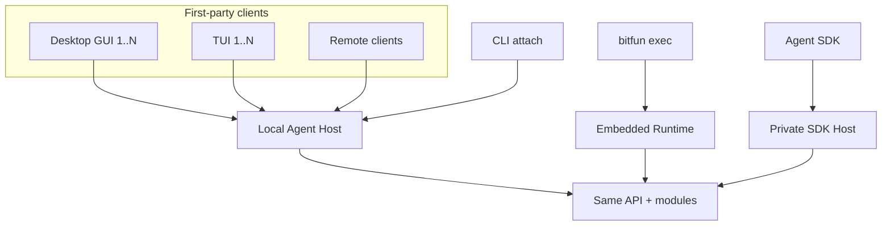

稳定结论：

- `Agent Runtime` 是一组负责 Session、Tool、Permission 等行为的模块，不是某个进程名。Embedded、Local Agent Host、SDK Host 和目标机器上的 Runtime
  只改变部署，不复制 Agent loop。
- `Local Agent Host` 与 `SDK Host` 是 Rust 产品进程；`Plugin Host` 只指运行 Node/Bun 与第三方 JS/TS 的受监督子进程。
  Rust 插件调用端称为 `PluginRuntimeClient`，不存在 Rust `Plugin Host` 对象。
- GUI/TUI/Remote 使用第一方 rich-client adapter，不依赖公开 Python/TypeScript SDK；公开 SDK 不获得第一方私有 route。
- Workspace、Session、Client 或插件都不是默认进程键。只有负责模块的状态、并发或安全约束要求时，它们才进入
  对应状态键或隔离条件。
- 多个客户端不会自动增加 Rust Runtime 或 Plugin Host 进程。先复用异步连接、有界队列和现有实现；只有测量与兼容事实
  证明必须隔离时才增加进程。

## 2. 名词与产品边界

| 名称 | 唯一含义 | 不等于 |
|---|---|---|
| Agent Runtime | 负责 Session、Turn、Tool、MCP、Permission、Hook、Event 和持久化行为的既有模块 | 单一 crate、Server 或进程 |
| Embedded Runtime | Runtime 与调用入口位于同一 Rust 进程的部署 | 简化版 Runtime |
| Local Agent Host | 为第一方 GUI/TUI/Remote 多实例托管 Runtime 的目标本地 Rust 进程 | 公开 SDK、Plugin Host 或全机器单例 |
| SDK Host | 向公开 Agent SDK 提供精选版本化协议的 Rust 进程，默认由 SDK 私有管理 | BitFun CLI、Local Agent Host rich-client 协议或 Plugin Host |
| Plugin Host | 运行 Node/Bun 与第三方 JS/TS 插件的受监督子进程 | Rust client、Agent Runtime、Local Agent Host 或 SDK Host |
| Session Controller | 当前有权回答一个 Session 的 Permission、UserInput、确认和 steering 的单一 Client | Session 持久化模块或第一个响应者 |
| execution domain | 文件、进程、凭据和副作用实际所在的位置 | 一个布尔 `remote` 标记或 Workspace 别名 |

普通用户仍只需要选择 GUI/TUI、`bitfun exec` 或 Agent SDK。Local Agent Host、SDK Host、Plugin Host 和协议细节属于贡献者
文档与高级诊断，不新增普通用户必须手工管理的产品。

## 3. 部署选择

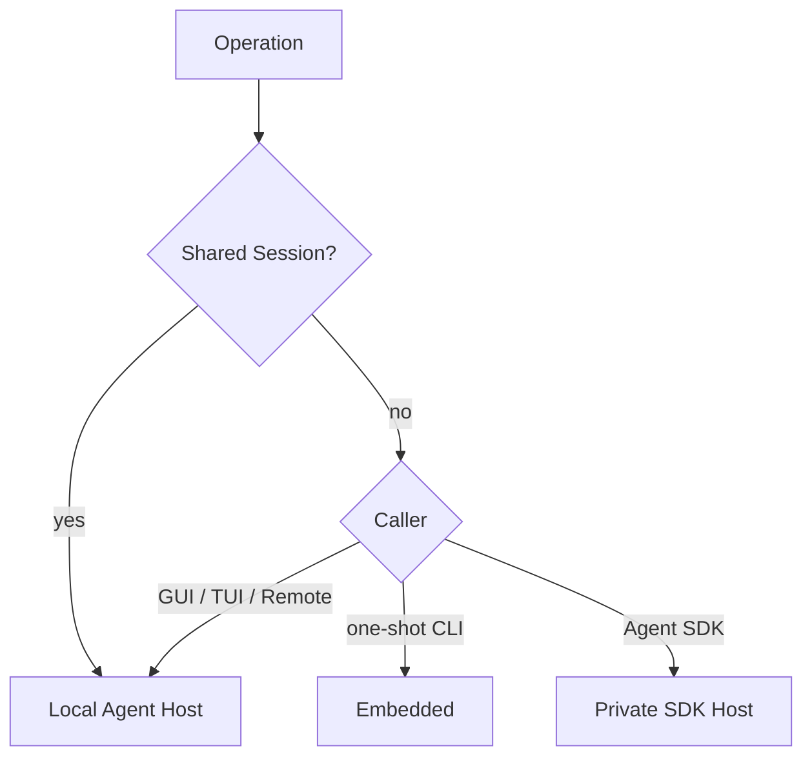

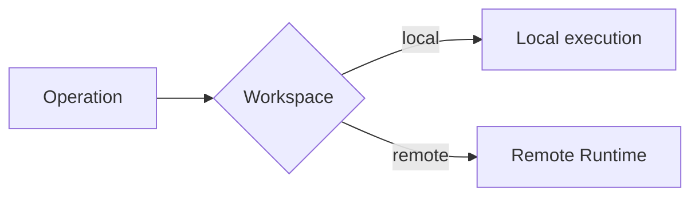

| 使用形态 | 默认部署 | 状态与进程边界 |
|---|---|---|
| Desktop GUI / 交互式 TUI | Local Agent Host | 多实例共享 Session 和兼容的重资源；renderer 与输入状态留在各 Client |
| 本机 Remote Control | 经认证连接 Local Agent Host | Runtime、文件与凭据仍在本机；远端只控制和呈现 |
| 一次性 `bitfun exec` | Embedded Runtime | 命令结束后回收，不为普通 shell/CI 启动常驻 Host |
| CLI 恢复或控制共享 Session | attach Local Agent Host | 从开始即选择 Host-backed，避免第二个 Session 写入者 |
| BitFun Agent SDK | 私有 SDK Host | 默认使用独立状态范围、凭据和生命周期，不自动访问用户 GUI/TUI 状态 |
| SDK 显式访问 BitFun 用户状态 | 经授权连接 Local Agent Host 的 SDK adapter | 仍只使用公开 SDK capability，不开放 rich-client 私有 route |
| Remote Workspace | 目标机器上的 Runtime 或 Local Agent Host | 文件、凭据、进程和 Plugin Host 位于目标机器 |
| 高风险或并发写入任务 | 独立 worktree、容器、VM 或远程 execution domain | 隔离副作用与故障域，不为普通 UI 实例默认创建 |

不采用“第一个 GUI/TUI 先 Embedded，第二个实例出现时在线迁移到 Local Agent Host”。活动 Turn、Tool/PTY 子进程、
Plugin Host 模块实例、Permission、callback、事件 sequence 和取消树不能低风险热迁移。部署必须在开始执行前确定。

## 4. 状态共享与隔离

### 4.1 五类使用范围

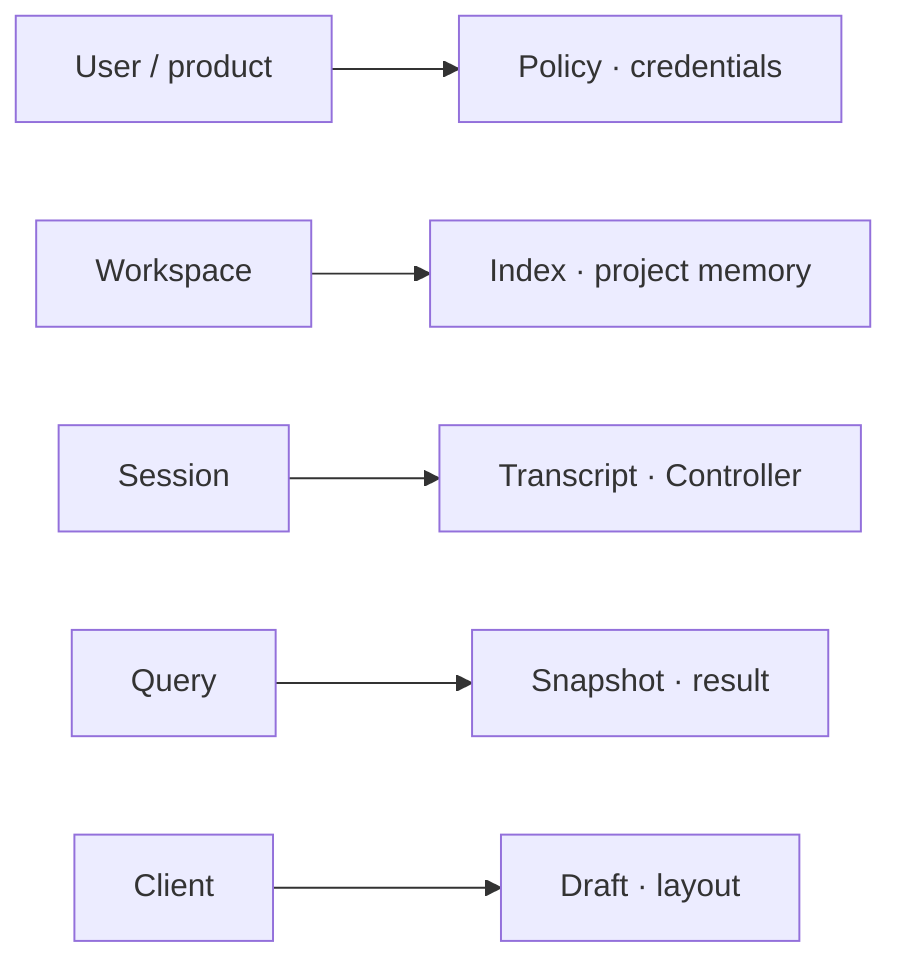

| 使用范围 | 可以共享 | 必须隔离 |
|---|---|---|
| OS 用户与产品通道 | 产品策略、凭据 broker、Provider/模型缓存、全局容量和审计索引 | 不同 OS 用户、发行通道、协议 major 或安全策略 |
| Workspace 事实 | 只有已有模块明确按项目持有的 watcher、索引、Git、LSP、项目记忆和扩展目录 | 不同执行位置、凭据归属或确有独立状态的项目 |
| Session | transcript、Turn queue、usage/audit、观察者与 Session Controller | 不同 Session 的可变上下文和写入顺序 |
| Query / Turn | 接受后固定的上下文、deadline、取消树、callback、子进程引用与最终状态屏障 | 不同 Query 的缓冲、callback identity 和结果提交 |
| Client | 连接、renderer、草稿、布局、滚动、焦点和未提交表单 | 不进入 Session 权威状态，不自动同步给其他 Client |

Workspace 只在具体负责模块确有独立配置、状态、版本、文件身份或并发单例时作为该模块的键。它不产生一个新的
“Workspace Runtime”产品对象，也不默认决定 Rust Runtime、Plugin Host 或 MCP 进程数量。

### 4.2 Session 单写与多观察者

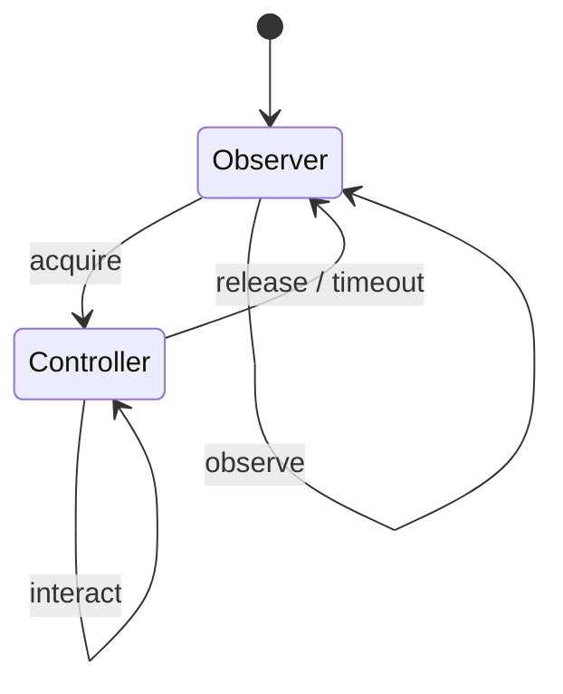

- 一个 Session 只有一个权威写入者，可以有多个 Observer，但同一待处理交互只有一个 Session Controller。
- start/cancel/steer/answer 先由现有 Session/Turn 模块校验状态版本、操作身份和当前状态；Local Agent Host
  不增加平行调度器。
- 禁止“第一个响应获胜”。非 Controller 响应返回类型化错误；Controller 断线后，未决交互进入 `action_required`，完成显式
  handoff 后才允许其他 Client 回答。
- Session 锁不能解决两个 Session 同时修改同一目录的问题。并发写入必须选择串行提交、独立 worktree 或隔离 execution domain。

### 4.3 Client 专属平台能力

窗口、文件选择器、剪贴板、浏览器呈现和部分 Computer Use 能力只能由具体 Desktop Client 提供，不能搬入无界面的 Local
Agent Host。这些能力通过现有 provider/adapter 注册，并绑定到具体 Client、授权版本和能力集合；授权有明确期限：

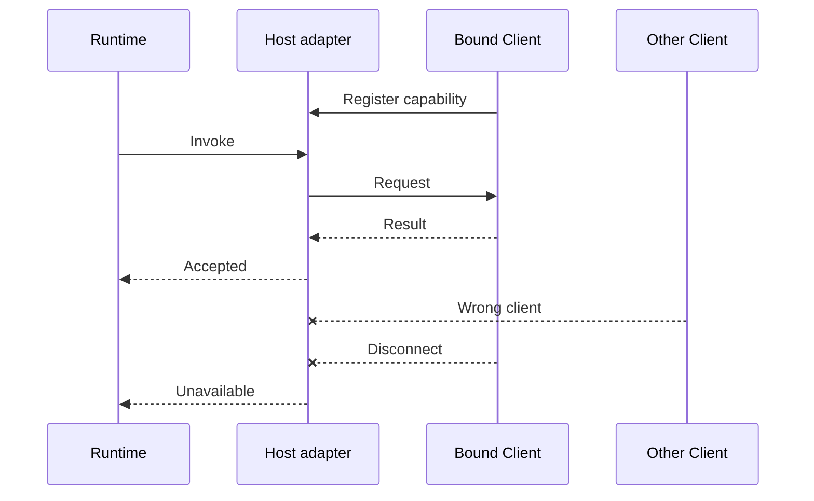

- Session/Query 在开始前绑定所需的 Client 能力授权；请求不能广播给“任意在线 GUI”，也不能采用“最先响应者获胜”。
- app-local adapter 只执行其真实平台能力；Local Agent Host 只路由请求，并校验操作、Client、授权版本、期限和结果类型。
- Client 断线、授权过期或能力撤回后立即拒绝调用，返回 `unavailable` 或 `action_required`；不得自动切换到另一个 Client。
- 切换 provider 需要显式重新选择或授权，并生成新的授权版本；已开始且可能产生副作用的操作不自动重放。
- Plugin Host 与第三方代码不能直接定位或调用 Desktop Client。它们只能提交候选请求，由既有 Tool/Permission/平台能力归属模块
  决定是否允许并经绑定 provider 执行。

### 4.4 记忆

- 用户记忆只在同一 OS 用户与安全域共享。
- 项目记忆按已有负责模块认可的 Workspace identity 与执行位置共享。
- 会话上下文只属于一个 Session；多个 Client 观察同一 Session 不复制上下文。
- Turn 接受后使用不可变输入快照。
- UI 草稿与布局只属于 Client。
- Plugin Host 内的 `globalThis`、闭包、模块缓存和未声明单例是易失实现状态，不是 BitFun Memory，也不跨进程复制。
- 跨机器记忆同步需要独立的数据、加密、冲突和删除设计，不能从本地共享自然推导。

## 5. Plugin Host 在多实例 Runtime 中的位置

Local Agent Host 的引入不能把 Plugin Host 改成按 GUI/TUI、Workspace、Session 或 SDK 调用方创建的进程。物理关系是：

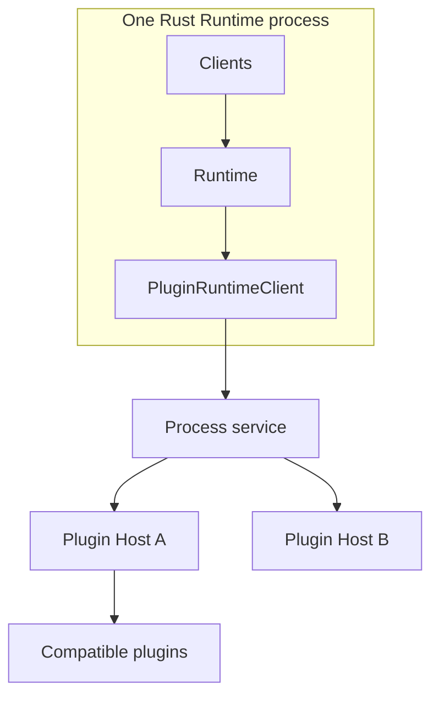

### 5.1 默认复用

同一实际承载 RuntimeServices 的 Rust 进程内，满足以下事实兼容的插件默认共享一个 Plugin Host：

- 位于同一实际执行机器，并使用同一 OS 用户；
- 使用相同脚本后端及兼容版本；
- 进程级沙箱、网络、环境变量、凭据可见范围和数据分类兼容；
- 原生依赖、架构、启动参数和进程级单例可以安全共存。

Local Agent Host 中多个 GUI/TUI/Remote Client 因此可以复用同一批兼容 Plugin Host。一次性 Embedded CLI、私有 SDK Host
和目标机器 Runtime 位于不同 Rust 进程或 execution domain，不跨进程透明共享 Plugin Host。

只有以下事实不兼容时才拆分 Plugin Host：

1. 实际执行机器或 OS 用户不同；
2. 后端、版本、架构、原生依赖或启动参数无法共存；
3. 沙箱、网络、环境变量、凭据或数据隔离要求不能安全合并；
4. 固定兼容样例证明某插件必须独占进程级单例；
5. 测量证明单进程达到容量瓶颈，且被拆调用明确无共享模块状态、无顺序 Hook 语义并可独立恢复。

第五项不是通用 worker pool。没有显式可序列化状态和兼容测试时，闭包、模块实例、`globalThis` 或隐式单例不能在进程间迁移。

### 5.2 生命周期联动

| 事件 | Rust Runtime / Client | Plugin Host |
|---|---|---|
| 新 GUI/TUI 连接 Local Agent Host | 增加 Client 订阅；不重建 Runtime | 不因 Client 数增加进程 |
| Client 断线 | 回收其订阅与 UI capability；按 Session 策略处理任务 | 只要仍有活动插件、调用、订阅或候选加载就继续运行 |
| SDK 启动 | SDK Host 使用私有 Runtime 数据空间 | 由该 SDK Host 的进程服务启动或复用自己的兼容子进程 |
| Remote Workspace | 控制端只持认证连接和只读状态 | 在目标机器 Runtime 下启动，不回落控制端 |
| Plugin Host 崩溃 | services 将 `process-lost` 绑定到失效连接；`PluginRuntimeClient` 据此结束在途请求并通知能力归属模块，旧连接的迟到事件只记诊断 | 同一活动进程承载的插件实例共同失效，Rust Runtime 本身继续运行 |
| Local Agent Host / SDK Host 退出 | 停止新调用、取消可取消请求、排空并提交权威状态 | 进程服务逆序 dispose 并回收完整子进程树 |

Plugin Host 失败不应终止 Local Agent Host；Local Agent Host 失败时则必须由进程监督与恢复路径清理其所有 Plugin Host、Tool、
MCP 和 PTY 子进程。已经发生但无法确认结果的外部副作用必须标记为“结果未知”，不能自动重放。

## 6. 连接、事件与流量控制

Local Agent Host 不建立第二套业务事件总线。现有 Event/Session 模块产生权威事实；Host 只管理连接认证、订阅、顺序、
有界缓冲和恢复位置。

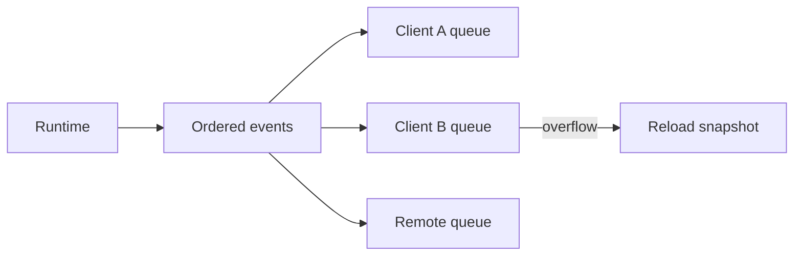

- 同一 Query 使用递增序号；Session 状态写入使用版本号，不承诺不同 Query 的全局顺序。
- 每 Client 同时限制条目数和字节数；慢 Client 不能阻塞 Runtime、Plugin Host 或其他 Client。
- 权威事件不能静默丢失；溢出后返回结构化原因，Client 使用完整快照和记录的恢复位置重新同步。
- Query 只产生一个 `Result`，或一个“结果是否生效无法确认”的最终状态；重连不能重放 Tool、Permission、Plugin 调用或可能重复产生副作用的写入。
- toast、焦点、滚动、动画等 UI 事件不进入权威事件记录。

## 7. 进程、线程与容量

多个 TUI 不对应多个 Server 或 Plugin Host。一个 Local Agent Host 内按工作性质使用不同执行资源：

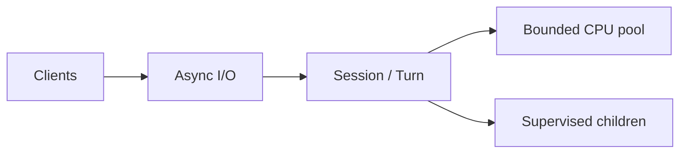

| 工作 | 机制 | 约束 |
|---|---|---|
| Client 连接、心跳、订阅与 I/O | 异步任务 | 每连接有界，不为每 Client 占固定线程 |
| Session/Turn 状态变更 | 现有模块的串行提交与有界队列 | 同一 Session 单写，不堆叠跨模块全局锁 |
| 索引、解析、压缩与编码 | 有界 CPU 线程池 | 不阻塞异步事件循环 |
| Tool、PTY、MCP、Plugin Host | 受监督子进程 | 期限、取消、进程树和资源预算由现有进程服务管理 |

容量至少分 Host、Client、Session、Query、Provider 与子进程层统计连接数、活动/排队 Query、正在执行的调用、待发送
字节、CPU 队列和子进程数。达到容量时返回类型化的使用范围、阶段与恢复动作，不能无限排队或通过增加 executor 线程掩盖流量控制。

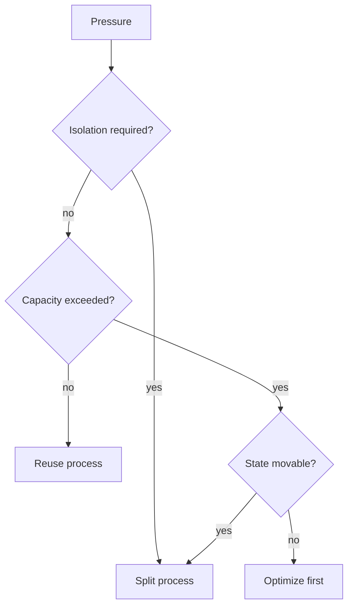

只有上述判定证明单 Rust 进程不足时，才增加额外 Runtime 进程。不默认按 Client、TUI、Workspace、Session 或插件分片。
同一 Session 在任一时刻只能有一个写入者；跨进程迁移需要持久检查点，并确保旧进程不能继续写入。首版不做在线迁移。

## 8. Host 发现、安全与生命周期

Local Agent Host 不是无条件机器全局单例。实例身份至少包含：

```text
(OS user, product identity, data storage scope, release channel, protocol major, execution domain)
```

- 产品身份和数据空间必须来自产品组装结果；不同品牌、便携 profile 或数据目录不得因为使用同一用户和发行通道而命中同一个可写 Host。
- 不兼容的主协议版本可以使用不同 endpoint，但同一持久 Session 在任一时刻只有一个写入者。现有 Session 持久化模块
  在打开 Session 时授予写入权，并拒绝其他进程同时写入；Project/User Memory、目录和其他共享数据继续使用各自归属模块
  已有的版本检查或事务，不增加覆盖全部数据的统一编号。
- 新建 Session 的 Embedded `bitfun exec` 取得该 Session 自己的写入权，因此不同 Session 可以并行。恢复既有 Session 前必须
  取得它的写入权；如果 Local Agent Host 或另一个 `exec` 已持有，CLI 必须 attach 现有 Host 或返回明确的“Session 已占用”，
  不能启动第二个写入者。
- Windows 使用当前用户 SID 限制的 Named Pipe；macOS/Linux 使用用户私有目录下的 Unix Domain Socket 和 peer credential。
- 默认不监听 localhost TCP。发现记录只包含 endpoint、PID、build/protocol 和健康检查所需最小事实，不包含凭据或 Session 内容。
- 并发启动通过实例锁、进程归属校验和认证握手避免重复启动；不能仅凭 PID 或发现文件终止进程。
- Remote Control 使用现有安全远程/中继能力或出站认证连接，不把本地 IPC token 暴露到网络。
- WebView 和浏览器不直接持有 Local Agent Host 或 SDK Host 凭据；由可信 Rust 主进程或开发者后端只开放所需能力。

Host 退出不能只看窗口数。只有以下引用均归零并经过短暂 grace period 后才退出：

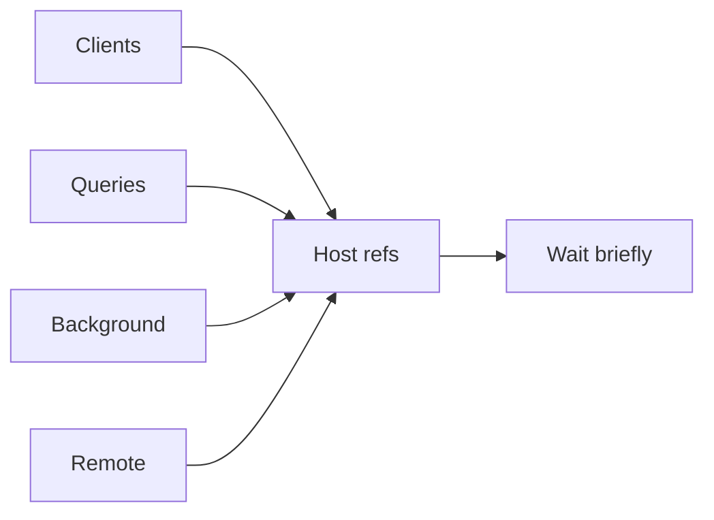

| 引用 | 负责模块 | 释放条件 |
|---|---|---|
| Client | Host 连接管理模块 | 连接关闭且订阅已撤销 |
| Query | Session/Turn 模块 | 排队与执行均最终状态结算 |
| Background | 对应任务模块 | 后台任务完成或显式停止 |
| Remote | Remote adapter | 监听/出站控制要求撤销 |

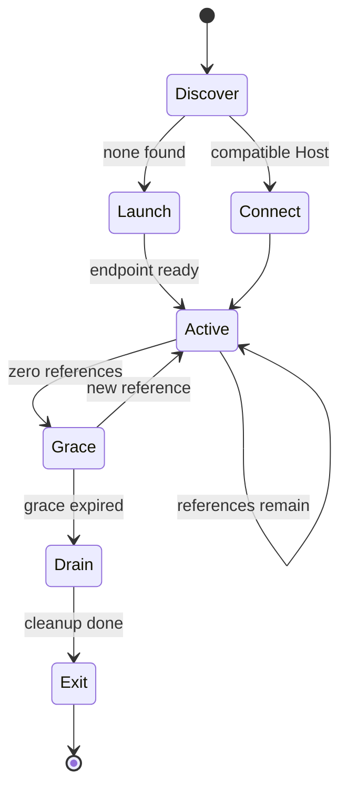

Drain 由生命周期模块回收 Host 仍持有的子进程、Workspace 服务和发现记录；任何失败都停留在 Drain 并进入可见诊断，不能误报退出。
Workspace 相关 watcher、索引、LSP 或可回收 MCP 可以由各自负责模块按空闲策略更早卸载；这不建立 Workspace 级进程，也不删除
持久 Session 或 Memory。启用 Remote Control 或后台任务导致 Host 继续运行时，产品必须显示常驻原因和停止方式。

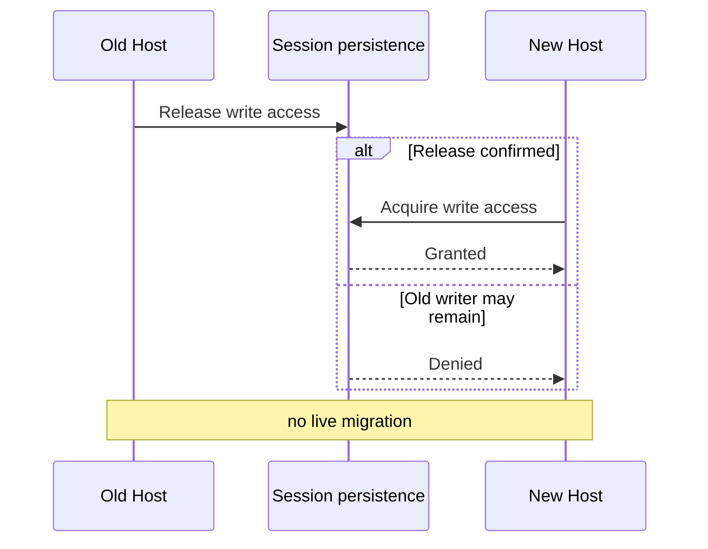

现有 Session/Turn 模块先停止该 Session 的新工作，并处理正在执行的操作，再让 Session 持久化模块转移写入权。只有旧写入者
已经释放，或持久化模块能证明它不能继续提交时，新 Host 才能取得写入权；无法证明安全时，新 Host 保持只读并提示 Session 已占用。

升级和回滚使用同一套规则阻止旧进程继续写入。已开始的 Query、PTY、MCP 或 Plugin Host 模块状态不在线迁移；只有旧 Host
释放已经确认，或持久化模块能证明它不能继续提交时，新 Host 才能接管持久写入。无法确认的副作用单独标记为“结果未知”，
不能作为接管写入的依据。版本不兼容的旧 Client 要么连接兼容只读端点，要么收到明确升级提示，
不能自行启动第二个可写 Runtime。

## 9. 故障与恢复

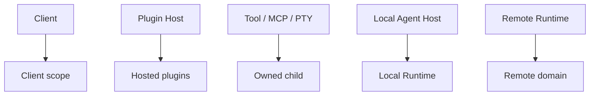

| 故障 | 处理 |
|---|---|
| GUI/TUI Client 崩溃 | 回收 Client 订阅和平台能力；Session/Query 按前台/后台策略继续或停止 |
| Session Controller 断线 | 未决交互进入 `action_required`；显式 handoff 后恢复，不能自动允许 |
| Local Agent Host 崩溃 | 进程监督模块清理子进程树；从持久事实恢复；未确认副作用标记为“结果未知” |
| Plugin Host 崩溃 | 暂停其承载插件的后续调用；能力归属模块撤下贡献；Rust Runtime 和其他兼容组继续运行 |
| Tool/MCP/PTY 子进程崩溃 | 对应进程服务隔离、诊断和有限恢复，不重启整个 Local Agent Host |
| Session 持久化不可用 | 停止新的持久提交；内存结果不能冒充已经持久保存 |
| Client 落后或断网 | 暂停或断开其有界队列，并用完整快照和恢复位置重新同步；不拖慢其他 Client |

## 10. 产品入口职责

| 入口 | 保留在 Client | 进入共享 Runtime |
|---|---|---|
| Desktop / Tauri | 窗口、菜单、托盘、通知、文件选择器、桌面能力呈现与 Host 监督 | Session、索引、Tool/MCP/Plugin 生命周期和持久状态 |
| TUI | renderer、键位、输入编辑、终端尺寸、剪贴板和终端恢复 | 状态快照、事件、Session 控制、Agent 执行 |
| Headless CLI | 参数、stdout/stderr、JSON/JSONL 与退出码 | Embedded 或 attach 后的同一 Runtime 行为 |
| Agent SDK | 语言 API、异步迭代、callback 与私有 Host 生命周期 | 精选 SDK adapter 后的同一 Runtime 行为 |
| Remote | 设备呈现、连接状态与受限交互 | 目标机器上的 Session、文件、凭据和执行模块 |

Tauri 可以启动、监控和重连 Local Agent Host，但不能负责 Agent Runtime 生命周期。TUI/GUI 不通过公开 SDK package
绕行。Local Agent Host、SDK Host、Plugin Host、Server/Relay 和 Remote execution Host 在进程名、诊断和文档中必须可区分。

## 11. 性能与完成条件

方案 C 会让单 GUI/TUI 增加一个轻量 Rust Host 进程和本地 IPC，但应避免复制索引、LSP、MCP、模型缓存与 Plugin Host。
发布前必须在同一机器和 fixture 下比较 Embedded 与 Host-backed：

| 指标 | 验证问题 |
|---|---|
| 首次可输入与首个 Query 事件 | 发现、启动、握手和 IPC 是否产生不可接受延迟 |
| 单 Client 总 RSS | Client + Local Agent Host 是否显著高于现有 Embedded 基线 |
| 第二个 Client 增量 RSS | 是否只增加 renderer、连接和缓冲，而未复制 Runtime/Plugin Host |
| 第二个真实状态域增量 | watcher、LSP、MCP 和插件进程是否按各自负责模块的实际键复用或隔离 |
| 多 Observer 与多 Query 延迟 | 事件 fan-out、Provider、CPU 与 Plugin Host 队列是否公平且有界 |
| 空闲回收 | 各负责模块能否卸载重资源，Host 能否无孤儿子进程退出 |
| Client/Host/Plugin Host 崩溃 | Session 连续性、进程树回收、故障暂停和“结果未知”状态是否准确 |

只有满足以下条件，才可把入口标记为 Host-backed 已交付：

- Embedded 与 Host-backed 通过同一 Session/Turn/Tool/MCP/Permission/Hook/Plugin/Usage 行为 fixture。
- GUI、TUI 和 Remote 同时附着同一 Session 时，revision、最终状态、Controller 与权限结论一致。
- Desktop 专属能力在绑定 Client 上执行；断线、撤回、授权版本变化或另一个 Client 抢答时均拒绝执行，且不会重放
  已经发生的外部副作用。
- 慢 Client、断线、重连、过期恢复位置、并发回答和控制权移交不产生重复提交，也不采用“最先响应者获胜”。
- Client 数不会改变 Plugin Host 数；只有执行机器、OS 用户、脚本后端、沙箱、网络、环境变量和凭据都兼容时才复用 Plugin Host，是否拆分还要依据真实状态和测量结果。
- Local Agent Host、SDK Host 与 Remote Runtime 各自只能管理自己进程树内的 Plugin Host，不跨执行域共享句柄或模块状态。
- Windows Named Pipe 与 Unix Domain Socket 的用户隔离、身份校验、启动竞争和旧发现记录恢复通过跨平台测试。
- 新旧协议版本与升级/回滚交错时，同一 Session 始终只有一个写入者；不同 Session 可以并行写入，各共享数据
  继续由自己的归属模块控制版本或事务。旧 Host 即使读到最新数据也不能继续写；失败路径不能双写，也不在线迁移活动
  Query 或 Plugin Host 模块状态。
- 单实例与第二 Client 的启动、RSS、CPU、队列和卸载数据均已记录，未用愿望型阈值替代测量。

## 12. 明确非目标

- 不建设覆盖所有内部能力的统一 Server API、Service Locator 或新的全局 Runtime manager。
- 不把 Local Agent Host、SDK Host 和 Plugin Host 合并成一个进程职责或公开产品概念。
- 不让 GUI/TUI/CLI 依赖公开 SDK package，也不把 rich-client 私有 route 发布为 Agent SDK。
- 不按 Client、窗口、TUI、Workspace、Session 或 plugin 默认创建 Rust Runtime 或 Plugin Host 进程。
- 不把 Workspace 当作所有运行时状态的默认使用范围；只有具体负责模块能证明时才使用。
- 不实现 Embedded Runtime 到 Local Agent Host 的在线迁移。
- 不允许多个 Rust 进程同时写一个 Session，也不把 Session 独占写入权冒充 Workspace 文件冲突保护。
- 不为普通本地交互默认创建容器、VM 或 worktree。
- 不透明共享跨机器 Memory、凭据、路径或 Plugin Host 模块状态。
- 不在没有测量数据前预设进程数、线程数、Session 容量或自动扩容阈值。
