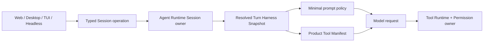

# Minimal Agent Harness Profile 实施设计

> 状态：已实现，待真实模型 request trace 与远程场景发布验收；面向 `1.0.0-explore`。
>
> 范围：只交付 `minimal` Harness Profile 的封闭四工具基线，以及运行中命令控制工具的条件暴露；不包含文件工具合并、持久 Shell 或其他后续工具界面。
>
> 上位约束：[`agent-harness-and-agent-collaboration-design.md`](agent-harness-and-agent-collaboration-design.md)、[`product-architecture.md`](product-architecture.md)、[`agent-runtime-deployment-design.md`](agent-runtime-deployment-design.md)、[`cli-product-line-design.md`](cli-product-line-design.md) 和 [`rust-build-dependency-boundaries.md`](rust-build-dependency-boundaries.md)。与本文冲突时以上位约束为准。

## 0. 结论

`1.0.0-explore` 的 Web UI 展示 `minimal / balanced / ultimate` 三个 Harness 选项。现在 `minimal` 与 `balanced` 都通过 Session execution profile 接入现有 `agentic` Runtime；`ultimate` 仍是 `coming-soon` 占位。

本设计把已有评测分支中经过实现验证的 Coding Minimal 行为接入该产品入口，但采用 1.0.0 的 Harness 领域模型：

1. 稳定产品 ID 是 `minimal`，它是 **Harness Profile**，不是新的 Session Mode，也不是新的 `agent_type`。
2. 新 Session 的 legacy 投影仍为 `agent_type = agentic`；`harness_profile_id` 才是新路径的权威选择。
3. 无活动命令时，模型可见工具严格为 `Read / Edit / Write / ExecCommand`，顺序稳定。
4. `WriteStdin / ExecControl` 仅在当前根 Agent 确实拥有活动命令会话时，于后续模型请求中直接出现。
5. Minimal 使用独立、稳定的 prompt policy，但继续复用普通 coding 的模型选择和用户上下文策略。
6. 工具精简只改变工具暴露和工作策略，不改变权限、安全、执行 Host、文件保护、命令后端或资源硬上限。
7. `balanced` 继续作为默认值；Minimal 必须显式选择，不允许静默启用或静默降级。

这是一个完整的单一交付范围。本文不定义第二套文件编辑工具，不引入持久 Shell，也不为这些能力保留占位接口。

## 1. 需求基线与演进决策

### 1.1 输入基线

本文综合以下三类事实：

- `1.0.0-explore` 的 Agent Harness 总体设计与现有前端占位；
- `DEV_CODING_MINIMAL_MODE_REQUIREMENTS.md` 中四工具基线、条件命令控制、兼容性和评测证据要求；
- `eval-minimal-mode` 中 `feat(agent): add coding minimal mode` 的已实现行为与测试经验。

设计时冻结的输入为：

| 输入 | 精确身份 |
|---|---|
| 目标分支 | `1.0.0-explore@4d3869859fb6279e4bc473a62e56075c5c9c705c` |
| 参考需求 | `bitfun_agent_kernel/eval-minimal-mode@edc192a1edde7b27aa6b8bde6071346f47616d8c` 下的 `docs/specs/plans/DEV_CODING_MINIMAL_MODE_REQUIREMENTS.md`；文件 SHA256 `1249e95c68f634ae98dbffb3fb96109e6c30b31562f7a198de08f2a6867a22af` |
| 参考需求声明的代码基线 | `main@7d8fc2c8f2dfca5d5d7bf40c592b1631829a46ab` |
| 已实现行为提交 | `edc192a1edde7b27aa6b8bde6071346f47616d8c` |

参考需求中的 `coding-minimal` 是旧 Mode 模型下的稳定 ID。1.0.0 已明确拒绝继续用 `agent_type` 表示 Harness 强度，因此本文只迁移行为，不迁移旧对象模型。

### 1.2 与旧需求的差异

| 旧需求/实现 | 1.0.0 决策 | 原因 |
|---|---|---|
| 新增 `agent_type = coding-minimal` | 新增 `harness_profile_id = minimal` | Harness Profile、根 Agent 身份和 legacy mode 必须正交 |
| 通过 Mode registry 选择 Minimal | 通过 Harness Profile catalog 和 Session binding 选择 | UI 已表达 Profile，不能再反向绑定 Runtime Agent ID |
| 第一版复用原 `agentic_mode` prompt 字节 | 使用独立 Minimal prompt policy | 当前 `agentic_mode` 已明确要求不可见的 Todo、Question、Grep/Glob、Task、Web 和 ControlHub 工具，复用会制造错误工具合同 |
| Minimal 使用独立 `coding-minimal` 配置 profile | 使用 `minimal` Harness Profile，并保留 `tool_profile_id = coding-minimal-v1` 作为评测身份 | 产品选择与工具实验身份需要分开记录 |
| 工具列表同时承担能力限制 | 工具暴露与权限/能力收紧分开 | 工具不可见不等于无权限；安全仍由 capability、effect 和 permission owner 强制 |

独立 Minimal prompt 是维持“只引用当前可用工具”的必要合同，不代表引入新的工具接口。它应从已验证的 `coding_minimal_mode.md` 语义迁移为 immutable prompt policy，并按 1.0.0 命名和对象边界重写。

## 2. 目标与非目标

### 2.1 目标

1. 让 Web/Desktop 用户可以真实选择 Minimal，并让选择作用于下一 Turn。
2. 让 CLI/TUI 和 headless `exec` 通过同一 Runtime owner 显式选择 Minimal，供 DeepSWE 等评测稳定复现。
3. 提供封闭、稳定、可审计的四工具初始 manifest。
4. 保留长命令轮询、TTY 输入、中断和终止能力，同时避免在没有活动命令时发送控制工具 schema。
5. 保持 local 与 Remote workspace 的命令控制语义一致；其他远程场景要么代理到权威 Host，要么明确返回 unsupported。
6. 保留旧 Session、旧 Client 和旧 Host 的可读性及明确降级路径。
7. Minimal 不设置固定 model-round / max-turn 上限；取消、上下文压缩、权限、Provider 资源约束和通用无进展保护继续生效。
8. 记录足够的 Profile、prompt、工具 manifest、模型和执行环境事实，支持 matched A/B。

### 2.2 非目标

- 不创建新的 Session Mode、顶层 Agent 类型或平行 Agent loop。
- 不改变 `balanced`、现有 Mode、Custom Agent 或 Specialist Agent 的默认行为。
- 不合并 `Read / Edit / Write`，不引入新的 FileEditor 模型接口。
- 不把 `ExecCommand` 替换为持久 Shell，不改变 fresh-process、TTY、远端 shell 或进程组语义。
- 不删除 `Grep`、`Glob`、Git、Web、MCP、Canvas、MiniApp、Agent、Goal 或其他工具实现。
- 不改变模型供应商、模型 ID、reasoning preset、temperature、`top_p` 或最大输出 token。
- 不改变 Balanced 及其他 Agent 的固定最大轮数；仅 Minimal 将固定 model-round ceiling 解析为 `None`。
- 不放宽 Permission、workspace path、Read-before-edit、新鲜度、原子写、Edit Constraint、Hook 或 sandbox 约束。
- 不在本范围内交付 `ultimate`，也不把未实现能力伪装为可用。
- 不预设评测分数、成本或速度一定改善；Smoke 只证明链路可运行。

## 3. 产品与领域模型

### 3.1 稳定身份

| 事实 | 值 |
|---|---|
| Harness Profile ID | `minimal` |
| Profile schema version | `1` |
| Root Agent legacy projection | `agentic` |
| Prompt policy ID | `minimal-harness-v1` |
| Tool profile ID | `coding-minimal-v1` |
| 默认模型策略 | 继承 Session 当前模型选择 |
| 默认 reasoning 策略 | 继承 Session 当前选择 |
| 用户上下文策略 | 复用普通 coding 的 workspace context、instructions、project layout 和 memory summary |
| 默认选择 | `balanced`；Minimal 仅显式启用 |

`tool_profile_id` 是可观测和评测身份，不是 Delivery Profile、Cargo feature、权限等级或新的产品 SKU。

### 3.2 加法契约

稳定合同采用可容忍未知值的字符串/newtype，不把未来 Profile 固化成会导致旧 reader 反序列化失败的封闭 wire enum。概念形态如下：

```rust
struct HarnessProfileId(String);

struct SessionExecutionProfile {
    harness_profile_id: HarnessProfileId,
    schema_version: u32,
    selected_by: HarnessSelectionSource,
}

struct CreateSessionRequest {
    harness_profile_id: Option<HarnessProfileId>,
    legacy_agent_type: Option<String>,
    // existing fields
}

struct UpdateSessionHarnessRequest {
    session_id: SessionId,
    harness_profile_id: HarnessProfileId,
    expected_generation: Option<u64>,
}
```

规则：

- 新 1.0.0 Client 创建 Session 时提交 Profile；没有显式选择时提交 `balanced`。
- 新 Host 继续读取旧 `agent_type`；缺少新字段的旧 Session 以 `balanced` compatibility projection 打开，并记录来源。
- 新 Session 继续写 `legacy_agent_type = agentic`，供旧 reader 基本打开。
- Profile 更新只允许在 Session idle 时提交，成功后只影响下一 Turn，不重写历史。
- 请求写入后连接丢失或超时且结果无法确认时返回 `outcome_unknown`，Client 不自动重试。
- 未识别或当前不可用的 Profile 保留原始值并显示 unsupported，不删除 Session、不重置记录、不猜成其他 Profile。

### 3.3 Turn 快照

Runtime 接受 Turn 时解析不可变的 `ResolvedTurnHarnessSnapshot`。本范围至少需要：

```rust
struct ResolvedTurnHarnessSnapshot {
    harness_profile_id: HarnessProfileId,
    harness_profile_version: u32,
    root_agent_identity: ResolvedAgentDefinitionRef,
    prompt_policy_id: String,
    tool_profile_id: String,
    model_id: String,
    reasoning_preset: Option<String>,
    permission_policy_version: String,
    execution_target: SessionExecutionTarget,
    workspace_identity: WorkspaceIdentity,
    selected_by: HarnessSelectionSource,
}
```

Turn snapshot 固定 Profile、prompt policy、工具能力上界、模型和执行 Host，但不固定一次性的最终工具 fingerprint。Minimal 的命令控制状态会在同一个 Turn 内合法变化，因此每次模型请求另外记录不可变的 `ResolvedModelRequestManifestSnapshot`，至少包含请求序号、实际工具名、顺序、schema fingerprint 和控制工具可见原因。

Session 中的 Profile 后续变化不能改变在途或历史 Turn 的策略、能力上界、执行 Host 或解释方式。迟到的模型/工具结果继续归属于创建它的 Turn snapshot；工具存活状态只影响尚未发出的下一次模型请求。

### 3.4 Capability 协商

对外稳定 capability 为 `agent_harness_profiles_v1`。能力摘要至少列出当前 Host 可用的 Profile ID 和版本。

- 新 Client 连接旧 Host：`minimal` 必须显示不可用并返回 typed unsupported，不能投影为 `agentic` 后假装已启用。
- `balanced` 的 legacy 兼容行为沿用总体设计，但 UI 必须明确它处于 compatibility projection。
- Profile catalog 只有在 Runtime、prompt、tool policy 和真实入口均接通时才报告 available；只有前端卡片或静态常量不算可用。

## 4. Runtime 解析与工具合同

### 4.1 单一解析路径



所有产品入口调用同一 Session/Turn owner。Web 组件、CLI reducer、App Server handler 和 Pier adapter 都不能自行拼装工具列表或替换 `agent_type`。

### 4.2 能力收紧顺序

最终工具能力仍为：

```text
Product capability upper bound
  ∩ Delivery Profile assembled capabilities
  ∩ current Host availability
  ∩ Minimal default tool exposure
  ∩ root Agent capability/effect policy
  ∩ user/organization permission decision
  ∩ runtime restrictions and resource budget
```

Minimal 只能收紧候选工具和展示方式，不能放宽任何上层限制。某工具被列入 Minimal allowlist，也不代表调用已获批准。

### 4.3 封闭 allowlist

Minimal 的稳定允许列表为：

```text
Read
Edit
Write
ExecCommand
WriteStdin
ExecControl
```

无活动命令会话时，最终发送给模型的工具定义必须严格为：

```text
Read
Edit
Write
ExecCommand
```

名称和顺序是 `coding-minimal-v1` 的版本合同。全局工具注册、MCP、Plugin、动态 provider、产品完整构建或未来新增工具均不得自动扩展该列表。

以下能力不进入 Minimal 初始 manifest，也不以 deferred 摘要、meta tool 或 prompt reminder 的方式旁路出现：

- 文件搜索/目录/Git 专用工具；
- Goal、计划、Task、Subagent 和等待工具；
- Web、Browser、Computer Use、图片工具；
- Skill、MCP、Plugin 动态工具；
- Canvas、MiniApp、Publish、Cron、Control Hub；
- `GetToolSpec` 和 `CallDeferredTool`。

普通 Linux coding 操作通过 `ExecCommand` 调用仓库/系统已有的 `rg`、`grep`、`find`、`sed`、`ls`、`rm` 和 `git`。`rg` 不是运行时硬依赖；环境缺少时允许回退到 `grep/find`。

### 4.4 Deferred tool

Minimal 是封闭 Profile，不是完整目录的折叠视图：

- `ai.enable_deferred_tool_loading` 无论为何值，Minimal manifest 都不含 deferred tool、摘要或 gateway。
- 条件控制工具在不可用时从 manifest 省略，不标成 Deferred。
- 运行时限制可以进一步删除工具，但不能从全局 catalog 补入替代工具。
- 若 `Read/Edit/Write/ExecCommand` 中某个必需工具因产品编译、Host 或策略不可用，Runtime 必须在 Turn 准入时返回明确 capability error，不能启动一个伪 Minimal Turn。

### 4.5 活动命令控制

`WriteStdin` 和 `ExecControl` 的显示条件必须同时满足：

1. 当前 snapshot 的 Profile 是 `minimal`；
2. 活动命令属于当前根 Agent Session；
3. 命令的 local/remote execution target 与当前 Turn 一致；
4. TerminalPort 或 RemoteExecPort 权威报告该 `session_id` 仍活动；
5. 当前 runtime restrictions 未禁用该控制工具。

不得通过聊天文本、历史工具结果或单独存在的 `session_id` 字符串推断活动状态。Port 查询失败、缺失或返回未知时 fail closed：隐藏控制工具，并记录结构化原因。

当任一属于当前 Agent 的命令仍活动时，后续模型请求直接显示：

```text
Read
Edit
Write
ExecCommand
WriteStdin
ExecControl
```

所有命令均退出、被中断、被杀死或被 Runtime 清理后，下一请求恢复四工具 manifest。控制工具接收已经结束的 `session_id` 时继续返回现有 session-not-found 结果，不恢复旧进程。

Terminal 和 RemoteExec 的稳定 port 增加只读、权威的会话存活查询；默认实现返回 false。具体 service provider 只报告自身管理的进程状态，不把 Agent/Profile 策略下沉到 services。

### 4.6 ExecCommand 描述

初始 `ExecCommand` 描述可以说明：长命令会返回 `session_id`，控制入口将在仍有活动会话的后续模型请求中出现。它不得在控制工具尚不可见时要求模型调用 `WriteStdin` 或 `ExecControl`。

控制工具进入 manifest 后，其名称、参数和现有 TTY/非 TTY 语义可以正常出现在工具定义中。该上下文描述由 Tool owner 生成，不能由前端或 adapter 拼接。

### 4.7 Minimal 轮次策略

Minimal 不应用 `ai.max_rounds` 或 CLI 的固定 model-round ceiling。这里的“无限”仅指一个用户 Turn 内不因固定计数触发 `max_rounds` finalization；它不等于无限资源，也不绕过以下现有终止和恢复机制：

- 用户取消、Host shutdown、断连后的权威取消；
- Provider context window、最大输出 token、配额、超时和错误；
- 上下文压缩及压缩失败恢复；
- 权限拒绝、sandbox、路径和工具 runtime restriction；
- 通用的重复失败、无进展和不可恢复错误保护。

Balanced 和所有未选择 Minimal 的执行继续读取原 `max_rounds` 配置。观测数据必须同时记录 `fixed_model_round_limit = none` 与实际完成轮数，避免把“未触发固定上限”误报成“没有任何停止条件”。

## 5. Prompt 与上下文

### 5.1 Prompt policy

Minimal 使用稳定 prompt policy `minimal-harness-v1`，其内容以 eval 分支已验证的 Coding Minimal prompt 为语义基线，并满足：

- 只介绍当前请求真正可见的四个基础工具；
- 不提及 Goal、Task、Subagent、Web、MCP、Grep/Glob 专用工具或 deferred gateway；
- 指导模型用 `ExecCommand` 完成搜索、目录、Git、构建、测试和环境诊断；
- 保留 Read-before-edit、最小变更、分层验证、安全和完成合同；
- 不引入持久 Shell、两工具接口或不存在的能力；
- 不把 Profile 选择写成权限或安全保证。

Prompt bytes 由 `assembly/agent-content` 编译期嵌入并使用稳定 lookup key；选择与渲染属于 Runtime/Assembly owner。Minimal 与 Balanced 使用不同 system prompt cache identity，避免跨策略错误复用；同一 Minimal 会话在 manifest 状态不变时保持字节稳定。

### 5.2 用户上下文

Minimal 复用普通 coding 的用户上下文策略，不同时改变：

- workspace context；
- workspace instructions / AGENTS；
- project layout；
- memory summary；
- 用户附件和结构化 workspace refs 的现有处理。

这保证 Profile 差异集中在工作策略、prompt policy 和工具 manifest，不把上下文裁剪混入本范围。

### 5.3 协作与提问

Minimal 不向模型暴露 Task/Subagent 或结构化提问工具，因此模型不能自行发起 Agent 委派或阻塞式问题 UI。

用户显式 Agent Intent 属于 Harness/Invocation 合同而不是工具 manifest。只有 Host 已协商 `agent_intent_v1` 且 Runtime 能在当前执行目标解析该 Specialist 时，才可在根模型调用之外处理；否则返回 typed unsupported。本文不通过重新加入 Task 工具来伪装支持。

## 6. 产品入口接线

### 6.1 Web/Desktop

现有 `HarnessProfileSelector` 改为 owner-driven 组件：

- `selectedProfile` 来自 Session execution profile 或新会话 draft，而不是硬编码 `balanced`；
- 使用统一的 `onSelectProfile(profileId)`，不保留仅支持 `onActivateBalanced` 的特殊回调；
- `minimal` 的选择由 Runtime Profile catalog 校验；UI 显示不是可用性的权威来源；
- 活动 Turn 中切换返回 busy/unsupported，不做乐观成功；
- update 成功后才发布本地状态；失败时保留原值，具备 outcome-unknown 语义的跨进程 transport 必须重新同步权威 Session 且不自动重放；
- legacy Session 显示兼容状态，不静默改写。

Agents 页面与 Composer 使用同一组稳定 Profile ID 和 availability 映射，不再把 `minimal` 标为 `coming-soon`。

UI 只能通过 infrastructure adapter 调用 typed API，不直接调用 Tauri 或拼写 Runtime mode ID。

### 6.2 CLI/TUI 与 headless

CLI 只拥有入口和展示：

- TUI 启动参数通过 typed Session operation 更新 Profile；后续交互式 selector 必须复用同一 operation；
- `exec` 提供显式 `--harness-profile minimal`（或等价的既有配置入口），未指定时保持 `balanced`；
- stdout 的 text/json/stream-json 合同不改变，诊断和 profile 不混入最终文本；
- Embedded 与 Shared TUI 复用同一 owner 语义；Shared capability 未接线时明确 unsupported，不在客户端本地改 Session 文件；
- CLI 不创建自己的 Minimal tool registry、prompt 或 Agent loop。

DeepSWE/Pier adapter 只负责在 CLI 启动参数/配置中明确选择 `minimal` 并记录版本事实。Pier 仍是 artifact/verifier owner，adapter 不重写工具 manifest 或评分结果。

### 6.3 App Server 与跨版本

只为真实 consumer 增加最小操作：

- create Session with Profile；
- update idle Session Profile；
- query current Session execution profile。

第一阶段不增加独立的 catalog list wire；稳定产品 ID 和 availability 由 Runtime catalog 拥有，入口提交选择后以 typed success/unsupported 为准。未来若 UI 需要在点击前展示不同 Host 的动态 capability，再新增协商后的只读 catalog operation，不能从本地 UI 常量推断远端 Host 能力。

DTO 和方法属于 `app-server-protocol`，typed client 行为属于 `app-server-client`，server handler 只做校验、类型映射和 owner 调用。不得把 Session/Profile 状态复制到 App Server。

Embedded Rich Client 和 Shared compatibility adapter 必须最终表现一致；如果 Shared wire 尚未承载该操作，TUI 明确显示该 Host 不支持，而不是直接访问本机 Core。

## 7. 远程场景

| 场景 | 所有权与行为 | 禁止行为 |
|---|---|---|
| Remote workspace | 承载 Runtime 的 Host 解析 Profile；文件与命令在 SSH execution host 执行，RemoteExecPort 提供权威命令存活事实 | 控制端查询本地 Terminal 或使用本地路径代替远端 |
| Remote control | Desktop/CLI Host 拥有 Session；Mobile/IM 通过 RemoteCommand 查询和更新，未协商时 typed unsupported | 只在 Desktop UI 改本地 selector 状态 |
| Peer Device Mode | Profile 查询和更新默认代理到 Peer Host；控制端只投影权威结果 | 在控制端创建同名 Session 或本地执行 Minimal |
| Detached Dispatch | submit payload 固定 Profile ID/version；Target 在接收时校验 capability，并把 resolved snapshot 写入 job/Session 事实 | controller 断开后依赖 controller 提供 prompt、工具或权限状态 |

任何入口都不得把不支持 Minimal 的远端静默降级为 Balanced。用户可以显式选择 Balanced 作为兼容动作，但这是一次新的可审计选择。

## 8. 可观测性与评测

### 8.1 Runtime 事实

每个 Turn/trial 至少记录：

- `harness_profile_id = minimal`、Profile version 和选择来源；
- `prompt_policy_id = minimal-harness-v1`；
- `tool_profile_id = coding-minimal-v1`；
- 每次模型请求的实际工具名称、稳定顺序和 manifest fingerprint；
- command controls 的可见性及原因：`no_active_session / active_local / active_remote / runtime_unavailable / query_failed / restricted`；
- model ID、provider model name、reasoning preset、temperature、`top_p`、max output token、固定 model-round limit（Minimal 为 `none`）和实际完成轮数；
- execution target、workspace identity 和 permission policy version。

若 request trace 已保存完整工具定义，不重复记录完整 schema；日志和事件不得包含 API key、原始凭据、隐藏思维链或未脱敏工具输入。

### 8.2 评测 provenance

评测 manifest 额外固定：

- BitFun binary SHA256 与源码 commit；
- Pier、adapter 和 DeepSWE/task revision；
- task 名称与 checksum；
- 容器镜像、资源、并发和各阶段 timeout；
- request/agent trace、最终 patch、verifier 输出和 token usage 的归档位置。

Matched A/B 必须使用相同任务、模型、参数、预算、二进制能力闭包、Pier、adapter、环境和 verifier，只改变 Harness Profile。由于 Minimal 使用独立 prompt policy，结论归因于完整 `minimal-harness-v1 + coding-minimal-v1` 系统，不能声称只证明“工具数量”这一单变量。

Smoke 只验证选择、请求工具、命令控制、artifact 和 verifier 链路，不报告模型质量。

## 9. Owner 与实施位置

| Owner | 责任 | 不应承担 |
|---|---|---|
| `contracts/core-types` | Profile ID、Session execution profile、selection source 和兼容 DTO | prompt、工具解析、UI |
| `execution/agent-runtime` | Profile catalog 纯事实、Session binding、idle 更新决策、Turn snapshot 与 legacy projection | 具体 Tool、Terminal、SSH 或前端状态 |
| `assembly/agent-content` | `minimal-harness-v1` immutable prompt bytes 和稳定 key | 选择、动态加载或 Runtime 状态 |
| `assembly/product-capabilities` | Delivery Profile 可组装的 Harness Profile 上限 | 动态 Host 健康、用户配置或最终权限 |
| `assembly/core` | 当前兼容执行接线、Minimal tool policy、manifest resolution 和 concrete owner 调用 | 新的长期平行 Session/Profile owner |
| `contracts/runtime-ports` | Terminal/RemoteExec 权威存活查询的窄 port 合同 | Profile 策略或进程实现 |
| `services/terminal`、`services-integrations` | 本地/远程进程真实存活状态 | 模型工具列表和 Harness 选择 |
| `app-server-protocol/client/server` | 最小 wire DTO、typed client、handler 映射 | 第二份 Session/Profile 状态 |
| Web/Desktop/TUI/Mobile | selector、状态展示、typed unsupported 和重同步 | Agent loop、工具 allowlist、权限或本地 fallback |

实现时优先移植 `eval-minimal-mode` 的行为测试和稳定工具策略，不整分支合并，也不原样 cherry-pick 旧 Mode 注册。现有 `bitfun-harness` crate 仍是 Workflow compatibility facade，不作为新根 Harness owner。

## 10. 验收标准

### AC-1：Profile 与兼容

- `minimal` 由真实 Runtime catalog 校验，并可通过 Web/Desktop、Embedded CLI 和 headless 入口显式选择。
- Session 保存下一 Turn 的 Profile，Turn 保存不可变 resolved snapshot。
- legacy `agent_type` 继续写 `agentic`；旧 Session 可读且不被重写。
- 旧 Host、Shared、Remote、Peer 或 Dispatch 不支持时返回 typed unsupported，不静默降级。

### AC-2：初始 manifest

- 无活动命令时模型请求中严格只有 `Read / Edit / Write / ExecCommand`，顺序固定。
- 不存在 deferred tools、deferred summaries、`GetToolSpec` 或 `CallDeferredTool`。
- 动态/MCP/Plugin/未来工具不会进入封闭 allowlist。
- 任一基础工具因 Host/产品能力缺失时，Turn 在模型调用前明确失败。

### AC-3：文件修改闭环

- Read 后 Edit 成功；未 Read、内容过期、路径越界继续失败。
- Write 创建文件，覆盖已有文件继续遵守现有 freshness/permission 合同。
- local 与 Remote workspace 路径、权限和原子写语义不变。

### AC-4：命令闭环

- ExecCommand 能完成搜索、目录、Git 只读、构建和测试。
- 活动命令返回 `session_id` 后，下一模型请求形成六工具 manifest。
- 轮询、TTY 输入、interrupt、kill 和进程树清理沿用现有语义。
- 命令结束后恢复四工具；不存在或结束的 session 不被恢复。
- local 与 RemoteExec 均使用权威 liveness；缺少 provider 时 fail closed。

### AC-5：Prompt/工具一致

- Minimal prompt 不引用当前不可见的工具或未交付能力。
- ExecCommand 初始描述只承诺控制工具会在后续活动状态中出现。
- Minimal 与 Balanced prompt cache identity 分离；同一 manifest 状态下字节和工具顺序稳定。

### AC-6：现有行为无回归

- Balanced 与现有 Mode 的 allowlist、Direct/Deferred、prompt 和 provider 行为保持现有快照。
- 全局 deferred loading 在其他 Profile/Mode 中保持原行为。
- Minimal 的加入不改变模型默认值、权限默认值、Delivery Profile 或 Cargo capability union。
- Minimal 不会因固定 `max_rounds` 结束；Balanced 仍在配置上限处走原有 finalization。

### AC-7：产品入口真实接线

- 前端不再硬编码 Minimal `coming-soon` 或 Balanced `selectedProfile`。
- Agents 页面与 Composer 对 `minimal / balanced / ultimate` 使用一致的可用状态。
- CLI/TUI 不复制工具或 Session 业务逻辑。
- 各远程场景已验证真实代理路径，或入口明确 gated；报告分别列出覆盖结果。

## 11. 验证矩阵

| 范围 | 最小验证 |
|---|---|
| Contract/持久化 | 新旧 payload round-trip、未知 Profile 保留、缺字段恢复为 compatibility Balanced |
| Agent Runtime | Profile catalog、idle update、Turn snapshot immutability、Minimal 无固定轮次上限、Balanced 上限不变、legacy projection focused contracts |
| Prompt catalog | stable key、bytes、无不可见工具标识符、cache identity |
| Tool policy | 四/六工具精确 manifest、顺序、无 deferred gateway、现有模式快照 |
| Terminal/RemoteExec | active/exit/interrupt/kill liveness，provider 缺失与查询失败 fail closed |
| Web UI | selector 状态、create/update、busy/outcome-unknown、legacy/unsupported、Agents 页面状态一致性 |
| CLI | Embedded/TUI/headless 选择、stdout/stderr 合同、Shared unsupported 或等价路径 |
| App Server | typed DTO/handler/client round-trip、controller/idle、timeout/outcome-unknown |
| Remote | Remote workspace、Remote control、Peer、Dispatch 的代理或 gated 证据 |
| Evaluation smoke | Profile 生效、首轮四工具、活动时六工具、trace/artifact/verifier 完整 |

Rust、Web 和协议实现分别执行最近 `AGENTS.md` 指定的 focused tests。修改 Cargo owner/feature 或测试拓扑时再运行 `pnpm run check:core-boundaries`；文档和仓库结构运行 `git diff --check` 与适用的 repository hygiene 检查。

## 12. 发布与回滚

- Minimal 首次发布为显式 opt-in，默认始终为 Balanced。
- 可用性由真实 Host capability 决定，不以 UI 是否显示为准。
- 发布前必须能从实际模型 request trace 证明四/六工具合同。
- 关闭或回滚 Profile 时保留持久化字段和 reader；已有 Minimal Session 显示 unavailable，并要求用户显式选择兼容 Profile。
- 不通过删除 Session、清空历史、重写 `agent_type` 或静默执行 Balanced 完成回滚。
- 条件控制若出现恢复风险，可以在同一 `coding-minimal-v1` 发布前修正；发布后任何固定六工具兼容行为都必须提升 tool profile version 并记录偏差，不能在相同 fingerprint 下改变语义。

## 13. 完成定义

只有同时满足以下条件，Minimal 才能从 `coming-soon` 改为 available：

1. Profile/Session/Turn 合同和 legacy round-trip 已通过；
2. Web/Desktop 与至少一个 CLI/headless 真实入口使用同一 Runtime owner；
3. 初始四工具、活动六工具和结束恢复四工具可从模型请求证据确认；
4. prompt、工具说明和实际 manifest 一致；
5. local 与 Remote workspace 命令控制闭环通过；
6. Remote control、Peer 和 Dispatch 已真实代理或明确 gated；
7. 现有 Balanced/Mode 快照无回归；
8. provenance 足以复现 smoke 和后续 matched A/B；
9. 文档、代码、测试和用户可见状态使用同一稳定 ID 与版本事实。
10. Minimal 的长运行 focused test 证明越过原固定轮次阈值时不会产生 `max_rounds` finalization，同时取消和无进展保护仍可终止。

完成上述工程验收不等于证明 Minimal 提高评测分数、速度或成本效率。效果结论只能来自冻结完整系统身份后的 matched evaluation。
