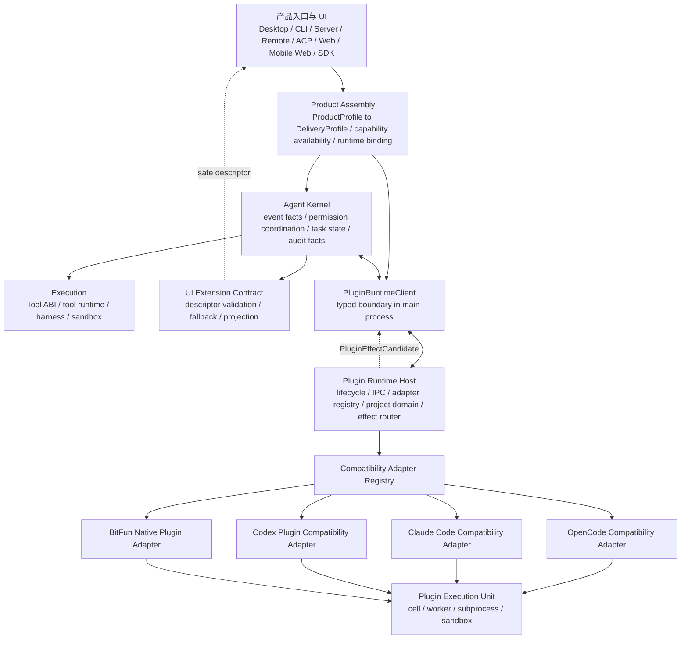
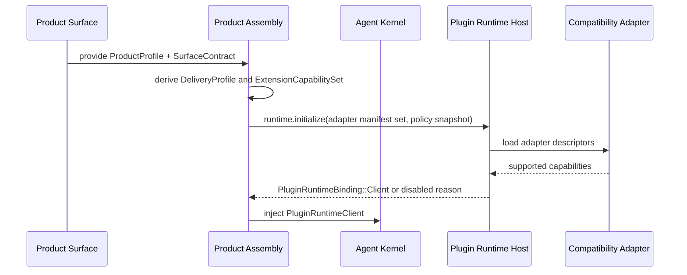
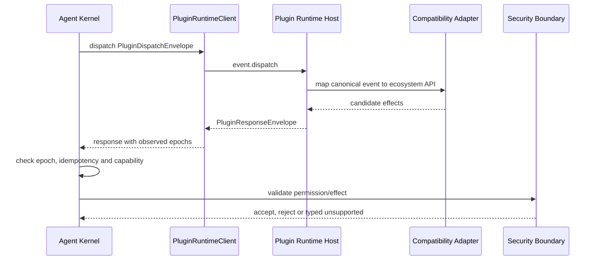
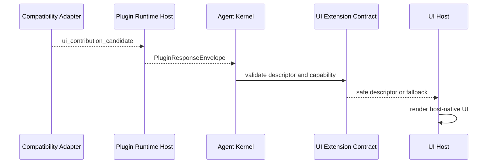

# 插件运行时主机与生态兼容适配层设计

本文补充 [`product-architecture.md`](product-architecture.md)、
[`agent-runtime-services-design.md`](agent-runtime-services-design.md) 和
[`../sdlc-harness/features/opencode-compatibility.md`](../sdlc-harness/features/opencode-compatibility.md)。
本文只描述目标架构、合同和风险边界，不记录实施进度。

阅读路径：第 1-3 节说明插件运行时主机的目标、非目标和总体关系；第 4-6 节说明主体进程 API、
Product Assembly 能力模型和领域对象；第 7-14 节说明运行时、IPC、时序、OpenCode 映射、安全和验证细节。

## 1. 方案判断

插件扩展能力需要独立于 Agent Kernel、Product Assembly 和具体生态适配器。目标模型如下：

- **Plugin Runtime Host** 管理插件兼容层生命周期、项目执行域、IPC、隔离、健康、超时、幂等和候选效果路由。
- **Compatibility Adapter** 只负责把 OpenCode、Claude Code、Codex 插件或 BitFun 原生插件 API 映射为 BitFun 稳定合同。
- **BitFun 主体进程** 只依赖 `PluginRuntimeClient`、规范信封、候选效果、能力声明和 UI descriptor，不依赖任何具体生态适配器类型。

该模型将“插件运行时治理”和“生态 API 翻译”分离：主体进程可替换适配器，插件失败可降级，OpenCode
兼容不会反向成为 BitFun 内部 owner。若主体进程需要按 `OpenCodeAdapter`、`ClaudeCodeAdapter` 等类型分支，
或需要读取插件运行单元内部对象，则设计不成立。

## 2. 目标与非目标

目标：

- 在 Agent Kernel 外提供受控 Plugin Runtime Host，承载 OpenCode 等生态兼容适配层。
- 让 plugin、hook、自定义工具、事件订阅和 UI contribution 统一映射到 BitFun 的事件、Tool ABI、
  Permission/Effect 和 UI Extension Contract。
- 保持 Kernel 是任务状态、事件和审计事实的权威源；Execution 是工具结果权威源；Security Boundary 是权限权威源。
  插件只能返回候选效果。
- 让 Desktop、CLI、Server、Remote、ACP、Web、Mobile Web 和 SDK 显式启用、禁用或降级插件能力。
- 当前 P0 只实现 Desktop/CLI 的 OpenCode-compatible plugin 垂直切片；Server、Remote、ACP、Web、Mobile Web
  和 SDK 的 full plugin runtime 均按第 12 节进入 P0+。
- 支持插件在已声明 extension point 上追加或覆写贡献，但覆写必须由 Product Assembly、能力 owner 和安全控制面共同约束。

非目标：

- 不复制完整 OpenCode runtime，不承诺任意社区插件无修改运行。
- 不将插件系统作为 first-party 产品能力裁剪的主要机制；产品形态裁剪仍由 `ProductProfile`、`CapabilityPack` 和
  Product Assembly 负责。
- 不将 JS/TS runtime、worker、WebView 或子进程视为安全边界。
- 不允许插件直接写通过、失败、阻断、授权、审计、工具结果或产品状态。
- 不将插件 API 暴露成无约束 localhost 服务；默认使用受控 IPC。
- 不将插件运行时主机内嵌到 Agent Kernel、Tool Runtime、Harness 或 Product Assembly 的内部实现。

### 2.1 产品形态、运行策略与扩展贡献

`ProductProfile`、`CapabilityPack`、`CapabilitySet` 和 `OverridePoint` 的权威定义见
[`product-architecture.md`](product-architecture.md#5-产品如何成形)。本文限定说明插件运行时涉及的子集：

| 类别 | 进入 BitFun 的方式 | 插件运行时关系 |
|---|---|---|
| 产品形态 | 产品入口、release 配置或白标配置选择 `ProductProfile`，Product Assembly 选择 first-party `CapabilityPack` | 不由插件决定；Host 只按 assembly binding 启用、禁用或降级 |
| 运行策略 | Product Assembly 由 `CapabilityPlan`、provider health、license、workspace policy 和安全策略派生 `CapabilityAvailabilitySet`，再形成 `CapabilitySet` | Host 消费 `CapabilitySet` 与 policy snapshot；不能启用未构建能力 |
| MCP provider | Assembly 注册外部 provider；MCP transport / catalog 在 Platform Adapter，tool/resource/prompt projection 在 Execution / Stable Contracts | 不属于 Plugin Runtime Host，除非插件显式提供 MCP adapter |
| Plugin contribution | Host 校验 descriptor、provider candidate、event subscription 和 effect candidate | 默认追加；只能在已声明 `OverridePoint` 上覆写 |
| Compatibility adapter | Host 内部 adapter 把 OpenCode、Claude Code、Codex 或其他生态 API 转为 BitFun canonical envelope | adapter 只做映射，不成为产品能力、权限或工具结果 owner |

因此，插件运行时主机只负责运行期扩展治理。外部生态可在受控位置增加或替换贡献，但不得替代 Product Assembly
决定产品形态，也不得将运行时扩展结果写成新的内核事实。

## 3. 目标逻辑视图



依赖规则：

- Product Assembly 选择是否启用插件运行时、选择适配器集合、注入 trust policy、execution domain 和 disabled reason。
- Kernel 只通过 `PluginRuntimeClient` 通信；不加载插件代码，不读取 OpenCode 或其他生态内部对象。
- Plugin Runtime Host 负责运行时治理和主机通信；不写权威状态，不绕过 Kernel 调用 service。
- Compatibility Adapter 负责生态 API 到 BitFun 合同的转换；不拥有工具执行、权限决策、审计或 UI state。
- UI 只消费经 UI Extension Contract 校验后的 descriptor，不执行插件返回的 UI 代码。

## 4. 主体进程 API 暴露面

BitFun 主体进程的插件相关 API 只允许包含下列稳定概念：

| 概念 | 所属 | 作用 |
|---|---|---|
| `PluginRuntimeClient` | Kernel / Product Assembly 可见 | 主体进程调用插件运行时主机的 typed client |
| `PluginRuntimeBinding` | Product Assembly 可见 | enabled client、projection-only client 或 disabled stub |
| `PluginRuntimeAvailability` | Product Assembly 可见 | 表达交付形态、兼容等级、降级和不可用原因 |
| `PluginDispatchEnvelope` / `PluginResponseEnvelope` | Kernel 与 Host 边界 | 事件投递、响应、epoch、deadline 和 diagnostics |
| `PluginEffectCandidate` | Kernel / Security Boundary 可见 | 插件候选效果；必须重新校验后才能应用 |
| `UiContributionDescriptor` | UI host 可见 | 声明式 UI contribution；不携带可执行 UI |
| `PluginTrustPolicy` / `PluginSourceRef` | Security Boundary 可见 | 来源、hash、信任状态、能力和执行域 |

禁止暴露：

- `OpenCodeCompatibilityAdapter`、`ClaudeCodeCompatibilityAdapter`、`CodexPluginCompatibilityAdapter` 等具体适配器对象。
- 插件进程句柄、worker handle、WebView、package manager client、解释器实例或内部 module object。
- full `RuntimeServices`、concrete provider handle、session manager、UI store、Tauri handle 或产品命令 registry。
- 生态原始 payload 作为公共 DTO；原始 payload 只能存在于对应 Compatibility Adapter 内部。

## 5. Product Assembly 能力模型

插件能力进入 Product Assembly 的 typed capability matrix，不得隐藏在 hook、service locator 或全局 registry 中。
这里的 `ExtensionCapabilitySet` 表示产品扩展能力聚合，不表示旧的扩展主机类型；插件运行时边界由
`PluginRuntimeAvailability` 和 `PluginRuntimeBinding` 表达。

Product Assembly 必须先根据 `ProductProfile` 和 `SurfaceContract` 派生 `DeliveryProfile`、first-party capability plan
和 extension availability，再把插件 contribution 叠加到允许的 extension point 上。叠加规则是：默认追加、显式覆写、
失败可回滚、状态可诊断。插件不得通过运行时发现改变 `ProductProfile`、隐式启用未构建能力，或替换没有 owner 的内部实现。

```rust
pub struct ExtensionCapabilitySet {
    pub plugin_runtime: PluginRuntimeAvailability,
    pub adapters: Vec<PluginAdapterCapability>,
    pub ui: UiExtensionAvailability,
}

pub enum PluginRuntimeAvailability {
    Disabled { reason: UnsupportedReason },
    ProjectionOnly { reason: UnsupportedReason },
    Enabled {
        compat_level: PluginCompatibilityLevel,
        execution: PluginExecutionLocation,
        trust_policy: PluginTrustPolicyId,
        fallback: PluginFallbackMode,
    },
    Unavailable { reason: UnsupportedReason },
}

pub enum PluginRuntimeBinding {
    Disabled(DisabledPluginRuntimeClient),
    ProjectionOnly(ProjectionOnlyPluginRuntimeClient),
    Client(Arc<dyn PluginRuntimeClient>),
}
```

SDK minimal feature 只能依赖 disabled stub 或测试 fake，不得隐式启动 JS/TS runtime。`DeliveryProfile` 只能影响
binding 和 capability 选择，不得让 Agent Kernel 出现 `if desktop`、`if cli` 或 `if opencode` 分支。

允许覆写的贡献必须满足：

- 有稳定 `OverridePoint` id、能力 owner、适用 surface 和 fallback。
- 有冲突策略，例如 single-winner、ordered-chain、first-party-pinned 或 policy-denied。
- 有 permission/effect 声明，且最终授权、审计和状态写入仍由安全控制面完成。
- 有产品形态验证，证明启用、禁用、失败和回滚时不会改变未声明的产品行为。

## 6. 领域模型

| 领域对象 | 定义 | 关键约束 |
|---|---|---|
| `PluginRuntimeHost` | 管理插件兼容层生命周期、通信和隔离的运行时主机 | 不写权威状态，不执行产品策略 |
| `PluginRuntimeClient` | 主体进程调用 Host 的窄接口 | 不暴露具体生态适配器或运行单元句柄 |
| Host-internal `CompatibilityAdapter` | 生态 API 映射器 | 只做翻译，不拥有权限、工具结果或 UI state |
| `PluginExecutionUnit` | cell、worker、subprocess 或 sandbox | 只能访问 Host facade 白名单 |
| `ProjectExecutionDomain` | workspace、trust、permission、tool registry 和 event subscription 的隔离域 | local/remote 必须用 logical path 和 execution domain 表达 |
| `PluginSourceRef` | 插件来源、版本、hash、签名和作用域 | hash 或来源变化必须重新信任 |
| `PluginTrustPolicy` | 信任状态、能力范围、撤销策略和执行等级 | 默认拒绝未知能力 |
| `PluginEffectCandidate` | 建议、证据、工具候选、权限候选或 UI contribution 候选 | 不能表示最终授权、审计或工具结果 |
| `UiContributionDescriptor` | UI contribution 的声明式描述 | 不能包含 React、DOM、Tauri 或可执行代码 |

## 7. 关键模块开发视图

目标放置原则：

```text
src/crates/contracts
  core-types / events / runtime-ports
    plugin runtime DTO、event、capability/effect、trust、UI descriptor contract

src/crates/execution
  agent-runtime
    consumes PluginRuntimeClient through typed runtime parts
  tool-contracts / tool-execution
    materializes accepted tool provider candidates through Tool ABI

src/crates/adapters
  opencode-compatibility-adapter
    maps OpenCode API to BitFun canonical envelopes and candidates
  future compatibility adapters
    map other plugin ecosystems through the same adapter trait

src/crates/services
  services-integrations / terminal / services-core
    provide process、IPC、filesystem、network、remote 和 sandbox primitives behind ports

src/crates/assembly
  product-capabilities / core
    derives DeliveryProfile, PluginRuntimeBinding, adapter set and fallback policy from ProductProfile and SurfaceContract

src/apps/* / src/web-ui / src/mobile-web
  UI host and product entrypoints
    render validated descriptors or typed unsupported states
```

开发约束：

- Compatibility Adapter 可以依赖规范合同和必要 protocol parser；不能依赖 `bitfun-core/product-full`、UI implementation
  或 concrete service manager。
- Host facade 由插件运行时主机提供；插件运行单元不能直接调用 OS、shell、network、filesystem 或 credentials。
- Tool provider candidate 只有被 Kernel、Security Boundary 和 Tool ABI 接受后，才能 materialize 为可执行 provider。
- UI contribution 只能通过 descriptor 进入 UI host；前端渲染实现位于对应产品入口。

## 8. 运行时与通信模型

默认模型是一个受 Product Assembly 选择的 Plugin Runtime Host。Host 可以承载多个项目执行域，但每个执行域必须隔离：

- workspace、worktree、execution host、logical path。
- trust record、permission scope、tool override table、event subscription。
- 插件状态、环境变量、依赖缓存、审计流和资源预算。

Host 内部按风险选择执行单元：

| 等级 | 适用场景 | 约束 |
|---|---|---|
| cell | 受信任的观察、建议和只读 hook | 无 shell、无网络、无凭据；必须有 deadline |
| worker | 轻量 guard、格式化建议、低风险工具候选 | 只能调用 Host facade 白名单 |
| subprocess | 高风险依赖、工具复写、崩溃隔离需求 | 独立进程、环境白名单、资源预算、工作目录限制 |
| sandbox | 未知来源或强隔离场景 | 无凭据、受控网络、临时或只读 worktree、可审计 |

Remote workspace 场景下，Host 应靠近实际执行域运行。UI 端只接收 logical path、descriptor、diagnostic 和审计摘要；
不得把远端 absolute path、SSH 细节或远端 OS 差异泄漏给插件 API 消费方。

## 9. IPC 与候选效果契约

传输可以用 JSON-RPC、framed protobuf 或 gRPC over pipe 实现；稳定合同只承诺 schema、语义和错误模型。
Host 生命周期由 Product Assembly 或 Host supervisor 管理；Kernel 只通过 `PluginRuntimeClient` 投递事件、刷新快照并消费响应。

| 方法 | 方向 | 语义 |
|---|---|---|
| `runtime.initialize` | Assembly / Supervisor -> Host | 传入 runtime version、adapter manifest set、policy snapshot 和 transport capability |
| `runtime.health` | Assembly / Supervisor -> Host | 健康、负载、执行单元状态和降级原因 |
| `runtime.shutdown` | Assembly / Supervisor -> Host | 关闭执行域、适配器或运行时主机 |
| `project.open` | Assembly / Supervisor -> Host | 创建或恢复项目执行域 |
| `project.refresh` | Kernel / Assembly -> Host | 更新 workspace、trust、permission、tool registry 或 policy epoch |
| `plugin.discover` | Assembly / Supervisor -> Host | 发现配置、插件来源、hash、声明能力和兼容等级 |
| `event.dispatch` | Kernel -> Client -> Host | 投递规范事件并等待候选效果或超时 |

```ts
interface PluginDispatchEnvelope {
  envelope_version: 1;
  event_id: string;
  event_type: string;
  event_version: string;
  project_domain_id: string;
  workspace: WorkspaceRef;
  source: PluginSourceRef;
  correlation_id: string;
  causation_id?: string;
  idempotency_key: string;
  deadline_ms: number;
  project_epoch: number;
  trust_epoch: number;
  policy_epoch: number;
  tool_registry_epoch?: number;
  payload_ref?: PayloadRef;
  payload?: CanonicalPayload;
}

interface CanonicalPayload {
  schema_version: string;
  data_classification: DataClassification;
  redaction: "none" | "partial" | "full";
  value: unknown;
}

interface PluginResponseEnvelope {
  envelope_version: 1;
  request_event_id: string;
  project_domain_id: string;
  adapter_id: string;
  plugin_id?: string;
  completed_at_ms: number;
  effects: PluginEffectCandidate[];
  diagnostics: PluginDiagnostic[];
  quarantine?: PluginQuarantineState;
  observed_epochs: {
    project_epoch: number;
    trust_epoch: number;
    policy_epoch: number;
    tool_registry_epoch?: number;
  };
}

interface PluginEffectBase {
  effect_id: string;
  schema_version: string;
  declared_capability: CapabilityId;
  target_ref: TargetRef;
  data_classification: DataClassification;
  risk_level: "low" | "medium" | "high";
  requires_permission: boolean;
  permission_prompt?: PermissionPromptDescriptor;
  source_ref: PluginSourceRef;
}

interface OverrideScopedContribution {
  override_point?: OverridePointRef;
  conflict_policy?: OverrideConflictPolicy;
  rollback?: OverrideRollbackPolicy;
}

interface OverridePointRef {
  id: string;
  owner: CapabilityOwnerRef;
  surface?: "desktop" | "web" | "mobile_web" | "cli" | "server" | "remote" | "acp" | "sdk";
}

interface CapabilityOwnerRef {
  kind: "product_feature" | "extension_contract" | "assembly_policy";
  id: string;
}

type OverrideConflictPolicy =
  | "single_winner"
  | "ordered_chain"
  | "first_party_pinned"
  | "policy_denied";

interface OverrideRollbackPolicy {
  mode: "remove_contribution" | "restore_previous" | "disable_plugin";
  reason_ref?: string;
}

type PluginEffectCandidate =
  | (PluginEffectBase & { kind: "suggestion"; body: CanonicalPayload | PayloadRef })
  | (PluginEffectBase & { kind: "evidence_candidate"; body: CanonicalPayload | PayloadRef })
  | (PluginEffectBase & { kind: "tool_input_patch_candidate"; tool_call_id: string; patch: CanonicalPayload | PayloadRef })
  | (PluginEffectBase & OverrideScopedContribution & { kind: "tool_provider_candidate"; manifest: ToolProviderDescriptor; source: PluginSourceRef })
  | (PluginEffectBase & { kind: "post_tool_evidence_candidate"; tool_call_id: string; body: CanonicalPayload | PayloadRef })
  | (PluginEffectBase & { kind: "permission_candidate"; request_id: string; recommendation: "allow" | "deny"; reason: string })
  | (PluginEffectBase & OverrideScopedContribution & { kind: "ui_contribution_candidate"; descriptor: UiContributionDescriptor })
  | (PluginEffectBase & OverrideScopedContribution & { kind: "event_subscription_candidate"; events: string[] })
  | (PluginEffectBase & { kind: "unsupported"; capability: string; reason: string });

interface UiContributionDescriptor {
  descriptor_version: 1;
  contribution_id: string;
  source_ref: PluginSourceRef;
  override_point?: OverridePointRef;
  conflict_policy?: OverrideConflictPolicy;
  surfaces: Array<"desktop" | "web" | "mobile_web" | "cli" | "server" | "remote" | "acp" | "sdk">;
  slot: "panel" | "command_palette" | "settings" | "notification" | "status" | "text_projection";
  component_kind: "text" | "summary" | "form" | "list" | "status_badge" | "command";
  data_refs: PayloadRef[];
  allowed_actions: ProductCommandRef[];
  required_capabilities: CapabilityId[];
  permission_prompt_ref?: PermissionPromptRef;
  fallback: {
    mode: "hide" | "disabled" | "text_projection" | "unsupported_message";
    message_key?: string;
  };
  accessibility: {
    label_key: string;
    description_key?: string;
  };
  i18n_namespaces: string[];
}

interface PermissionPromptRef {
  effect_id: string;
  audit_ref: {
    correlation_id: string;
    event_id?: string;
  };
}

type PermissionPromptEffectKind =
  | "suggestion"
  | "evidence_candidate"
  | "tool_input_patch_candidate"
  | "tool_provider_candidate"
  | "post_tool_evidence_candidate"
  | "permission_candidate"
  | "ui_contribution_candidate"
  | "event_subscription_candidate";

interface PermissionPromptDescriptor {
  descriptor_version: 1;
  plugin_id: string;
  source_ref: PluginSourceRef;
  source_hash: string;
  requested_capability: CapabilityId;
  requested_effect: PermissionPromptEffectKind;
  target_ref: TargetRef;
  risk_level: "low" | "medium" | "high";
  owner: CapabilityOwnerRef;
  rollback: "none" | "automatic" | "manual";
  deny_result: "no_state_change" | "candidate_discarded" | "temporarily_unavailable" | "policy_denied";
  audit_ref: {
    correlation_id: string;
    event_id?: string;
  };
}

interface PluginDiagnosticBase {
  diagnostic_id: string;
  severity: "info" | "warning" | "error";
  plugin_id: string;
  source_ref: PluginSourceRef;
  action_hints: RecoveryAction[];
  audit_ref: {
    correlation_id: string;
    event_id?: string;
  };
}

type PluginDiagnostic =
  | (PluginDiagnosticBase & {
      kind: "trust_config";
      trust_result: "trusted" | "untrusted" | "revoked" | "requires_confirmation";
      config_validation: "valid" | "invalid" | "missing" | "unsupported";
    })
  | (PluginDiagnosticBase & {
      kind: "manifest";
      manifest_validation_error: string;
    })
  | (PluginDiagnosticBase & {
      kind: "host_availability";
      host_availability_reason: string;
    })
  | (PluginDiagnosticBase & {
      kind: "deadline";
      deadline_reason: string;
    })
  | (PluginDiagnosticBase & {
      kind: "quarantine";
      quarantine_reason: PluginQuarantineState["reason"];
      quarantine_scope: PluginQuarantineState["scope"];
    });

type RecoveryAction =
  | "retry"
  | "disable"
  | "retrust"
  | "open_log"
  | "clear_quarantine";

interface PluginQuarantineState {
  state_version: 1;
  plugin_id: string;
  source_ref: PluginSourceRef;
  scope: "plugin" | "source" | "capability" | "command" | "execution_domain";
  reason: "crash" | "deadline" | "manifest_invalid" | "trust_revoked" | "policy_denied" | "protocol_error";
  clear_condition: "manual" | "manifest_changed" | "trust_renewed" | "host_restarted" | "policy_changed";
  action_hints: RecoveryAction[];
  log_ref?: PayloadRef;
  audit_ref: {
    correlation_id: string;
    event_id?: string;
  };
}
```

`unknown` 只能出现在带 `schema_version`、`data_classification` 和 `redaction` 的 canonical payload 内部。不得在公共
API 中绕过 schema 传递裸 JSON。

`PermissionPromptDescriptor`、`PermissionPromptRef`、`PluginDiagnostic` 和 `PluginQuarantineState` 是 Desktop settings、permission prompt、
CLI diagnostics 和审计记录共享的结构化合同。`requires_permission=true` 的 effect candidate 必须携带
`permission_prompt`；UI contribution 只能携带 `permission_prompt_ref`，并且必须引用同一个 effect id / audit ref。
Desktop prompt、CLI diagnostics 和 audit 必须消费同一对象；prompt mismatch 必须让 descriptor 校验失败。Host
不得只返回本地化文案或不可解析错误来表达权限确认、诊断、隔离状态或恢复动作。

`UiContributionDescriptor` 不得包含 React component、HTML script、DOM selector、Tauri command、store mutation
或任意可执行代码。未知 slot、未知 action 或缺失 capability 时，入口必须按 fallback 降级。
`override_point` 只表示插件请求进入已声明覆写点；是否接受、排序、回滚和审计由 Product Assembly、安全控制面与
能力 owner 共同裁决。

`tool_result`、`permission_granted`、`audit_written` 和 `state_changed` 不允许作为插件响应类型。真实工具结果由
Execution 写入；真实权限状态由 Security Boundary 写入；审计事实由 Kernel 写入。

## 10. 关键时序

### 10.1 插件运行时启动



### 10.2 事件分发与候选效果



### 10.3 UI contribution 投影



## 11. OpenCode 兼容映射

OpenCode Compatibility Adapter 是 Plugin Runtime Host 内部适配器，不是 BitFun 内部插件模型。

| OpenCode 能力 | BitFun 映射 | 约束 |
|---|---|---|
| workspace / global plugin 配置 | `plugin.discover` 的来源、hash、声明能力和信任候选 | 默认发现但不执行 |
| hooks object | 规范事件订阅和 `event.dispatch` | hook 只返回候选效果 |
| custom tools | `tool_provider_candidate` | 启用后仍走 Tool ABI 和权限 gate |
| tool execute before | `tool_input_patch_candidate`、`permission_candidate`、`suggestion` | 不能直接改写执行结果 |
| tool execute after | `post_tool_evidence_candidate` | 不能伪造 tool result |
| permission hooks | `permission_candidate` | 不能直接 approve |
| client / server API | 受限 adapter facade | 只暴露规范事件、只读状态和候选提交 |
| shell helper | 默认禁用；可映射为受控 tool request 候选 | 必须经过 shell 权限和 sandbox 策略 |
| SSE event stream | Kernel 规范事件订阅 | 不暴露 Host 内部事件作为权威流 |
| TUI/UI contribution | `ui_contribution_candidate` | 只允许 descriptor，不允许直接操作 UI state |

OpenCode payload 只能存在于 Adapter 内部。进入 Kernel、Execution、UI 或质量数据面的对象必须先转换为 BitFun 规范
DTO。

## 12. 产品形态与降级

本节能力矩阵是长期设计边界，不是 P0 验收范围。P0 override 以
[`product-architecture.md`](product-architecture.md) 为准：P0 只验收 Desktop settings/command + CLI diagnostics 的同一条
OpenCode-compatible plugin 垂直切片；ACP、Server、Remote、Web、Mobile Web 和 SDK minimal 在 P0 中只能是
typed unsupported、unavailable、projection-only 或 status-only。Server / Remote Host、ACP capability / permission bridge
和其他入口的 full plugin runtime 必须进入 P0+，并具备单独产品决策、迁移/回滚和验证指标。

| 产品形态 | 插件运行时策略 | UI 策略 | 失败语义 |
|---|---|---|---|
| Desktop / product-full | 可启用本地 Host；高风险能力按 trust policy 提权 | 渲染已校验 descriptor | host crash 或 timeout 不影响默认任务 |
| CLI | 可启用本地 Host 或只读投影 | 文本 descriptor / warning | unsupported 明确输出，不静默忽略 |
| Server | P0 为 typed unsupported / projection-only；P0+ 才可按部署策略受控启用 | API 返回 typed unsupported 或 descriptor projection | 不自动启动本地 JS/TS runtime |
| Remote | P0 为 unavailable / projection-only；P0+ 才可让 Host 靠近远端执行域 | UI 只接收 logical path 和 descriptor | 不回落到本地路径执行 |
| ACP | P0 为 status-only / projection-only / typed unsupported；P0+ 才可暴露 capability 或 permission bridge | 以 ACP 状态或 unsupported 表达 | 不将插件失败解释为 agent 失败 |
| Web / Mobile Web | 不启动本地 Host | 只消费后端投影 descriptor | 不持有插件执行单元 |
| SDK minimal | P0 仅 disabled stub 或测试 fake/client；生产可执行 client 注入属于 P0+ | 无默认 UI host | 不牵引 product-full 或 concrete provider |

能力矩阵：

| 能力 | Desktop / product-full | CLI | Server | Remote | ACP | Web / Mobile Web | SDK minimal |
|---|---|---|---|---|---|---|---|
| discovery | 支持本地/项目发现 | 支持本地/项目发现 | P0 projection/unsupported；P0+ 由部署策略启用 | P0 projection/unavailable；P0+ 在远端执行域发现 | P0 status/projection/unsupported；P0+ 通过 ACP capability 暴露 | 只消费后端投影 | 调用方注入或 disabled |
| read-only event hook | 支持候选建议/证据 | 支持文本诊断 | P0 diagnostic projection；P0+ 支持 API diagnostic | P0 只读投影；P0+ 靠近远端 Host 执行 | P0 status-only；P0+ 映射为 ACP event/capability | 只展示投影 | fake/client 可选 |
| tool provider candidate | 支持，必须经 Tool ABI | 支持，必须经 Tool ABI | P0 不执行；P0+ 受部署策略限制 | P0 不执行；P0+ 绑定远端 execution domain | P0 不执行；P0+ 只作为 external tool capability | 不执行 | 默认 disabled |
| permission candidate | 只作建议，最终由安全边界决策 | 只作建议 | P0 不产生候选；P0+ 只作 API 候选 | P0 不产生候选；P0+ 绑定远端 trust/policy epoch | P0 不接入 permission bridge；P0+ 映射为 ACP permission bridge | 只展示状态 | 默认 disabled |
| UI contribution | descriptor 渲染 | 文本或命令投影 | P0 API projection / unsupported；P0+ 受控 API projection | P0 只使用 logical path 投影；P0+ 受控远端投影 | P0 unsupported/status-only；P0+ ACP 能力或 unsupported | descriptor 投影 | 默认无 UI host |
| shell helper | 默认禁用，可映射为 tool request 候选 | 默认禁用 | 默认禁用 | 只允许远端策略批准 | 不直接暴露 shell | 不执行 | disabled |
| read-only state view | 支持脱敏投影 | 支持文本投影 | 支持 API 投影 | 支持远端脱敏投影 | 映射为 protocol state | 支持只读投影 | fake/client 可选 |
| writable JS/TS runtime | 非默认能力，需独立安全评审 | 非默认能力 | 非默认能力 | 非默认能力 | 不作为默认能力 | 不执行 | disabled |

产品入口必须区分“未启用”“只读建议”“能力不可用”“候选被接受”。插件降级不能被解释为任务成功保障。

## 13. 安全与供应链

插件能力必须声明以下绑定：

- 来源：project、global、enterprise registry、signed bundle 或 remote source。
- 身份：adapter id、plugin id、版本、hash、签名状态。
- 能力声明：事件、tool、文件、网络、凭据、UI contribution 和执行域。
- 信任状态：未信任、只读信任、项目级信任、组织级信任、撤销。
- 执行位置：local、remote、worker、subprocess、sandbox、container。

安全规则：

- 未信任插件只能发现和展示，不能执行。
- 凭据、网络、shell、process spawn、package install 和动态 import 默认拒绝。
- 文件访问使用 logical path 和 workspace policy，不能暴露 host absolute path。
- 配置、插件源码或 package hash 变化后必须重新信任。
- 插件失败、崩溃、超时和旧 epoch 响应必须可诊断、可丢弃、可审计。

## 14. 验证矩阵

可执行验证目标以 [`../plans/core-decomposition-plan.md#8-验证矩阵`](../plans/core-decomposition-plan.md#8-验证矩阵)
为准。Host、adapter、product-shape 或 SDK minimal 相关 PR 必须更新并运行其中固定命令；本节只说明覆盖面，不能用临时测试或
PR 文案替代执行计划里的固定目标。

| 验证面 | 必须覆盖 |
|---|---|
| 主体进程 API | 只暴露 runtime client、binding、envelope、candidate、trust 和 descriptor |
| schema | dispatch / response / effect candidate / permission prompt / diagnostic / quarantine state serialization round-trip |
| 时序 | initialize、deadline、cancel、stale epoch、idempotency key |
| 权限 | plugin 不能 approve、不能写审计、不能伪造 tool result；permission prompt 字段必须覆盖 source/hash、effect、target、risk、owner、rollback、deny result 和 audit ref |
| 工具 | tool provider candidate 经 Tool ABI 和 permission gate 后才能 materialize |
| UI | descriptor 校验、未知 contribution fallback、无直接 UI state mutation |
| 安全 | 未信任插件不执行、hash 变化重新信任、secret/network/shell 默认拒绝 |
| 崩溃 | host、worker、subprocess 或 adapter failure 不影响默认任务；quarantine state 必须提供 scope、reason、clear condition、action hints、log ref 和 audit ref |
| 远程 | logical path、remote execution domain 和权限范围不泄漏本地路径 |
| 产品形态 | Desktop、CLI、Server、Remote、ACP、Web、Mobile Web、SDK 的 unsupported 行为明确 |

通过标准是：插件运行时缺失、适配器不支持某能力、插件失败或外部插件返回非法结果时，默认 BitFun 任务行为、
权限语义、工具执行和审计事实保持等价。
