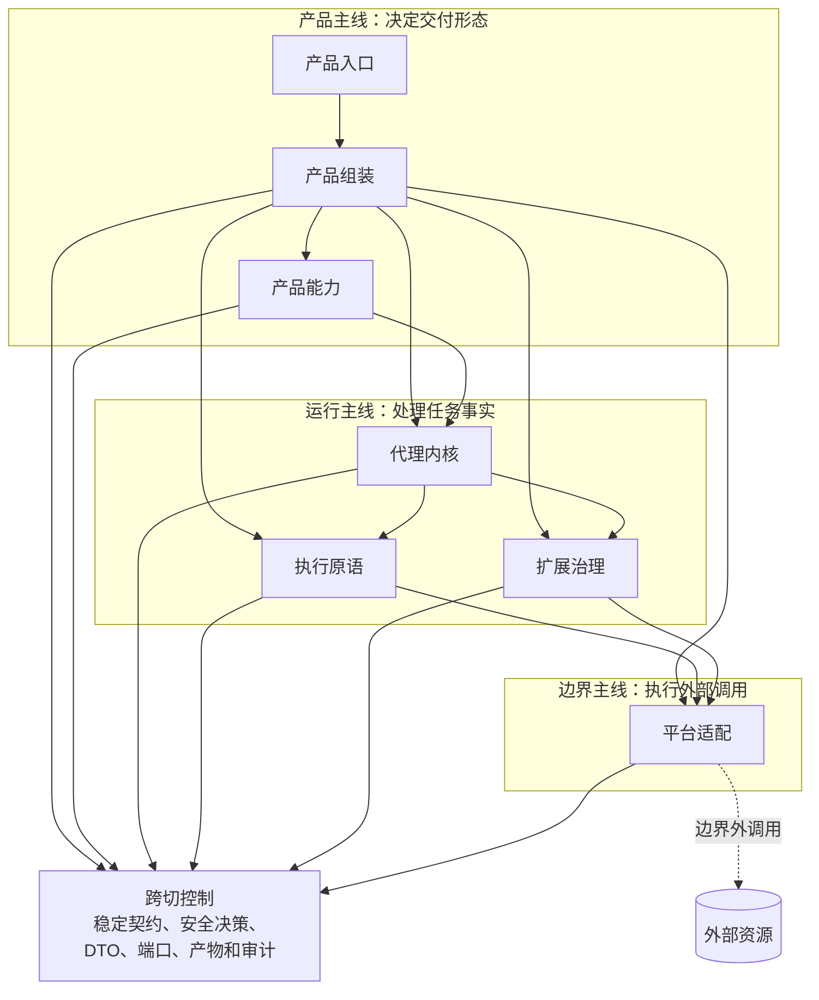

# BitFun 产品运行时架构

本文作为 BitFun 产品运行时架构入口，聚焦三类边界：产品能力如何组合，代理运行时如何保持稳定，插件和外部生态如何受控接入。
执行计划见 [`../plans/core-decomposition-plan.md`](../plans/core-decomposition-plan.md)；接口、产品组装和扩展注册开发约束见
[`agent-runtime-services-design.md`](agent-runtime-services-design.md)；插件运行时、IPC、候选效果和生态兼容契约见
[`plugin-runtime-host-design.md`](plugin-runtime-host-design.md)。

本文不记录实现进度，不展开 crate 内部设计，也不复述外部产品调研。本文聚焦职责和约束，细节文档补充接口形态、模块归属和验证要求。

## 1. 要解决的问题

`bitfun-core` 曾同时承担兼容入口、完整运行时组装、代理循环、服务接线、工具注册、产品命令和部分领域逻辑。
该形态能够支撑现有产品，但会让后续演进成本持续升高：

- 新产品形态容易被完整桌面产品能力牵引，无法清晰裁剪。
- `/goal`、DeepReview、MiniApp、工具、MCP、内置 hook、插件 hook 和界面扩展缺少统一能力边界。
- 权限、事件、产物（artifact）、远程执行和审计事实分散在多条路径中，难以证明行为等价。
- 插件或外部生态如果直接进入内部状态，会反向改写产品形态和安全边界。

目标是将 BitFun 从“一个完整运行时中心”调整为“可组合的产品运行时”。这不是增加更多抽象，而是明确三条主线：

1. **产品成形路径**：产品入口声明自身约束，产品组装选择内置能力（first-party）和服务实现，产品能力负责体验与验证。
2. **任务运行路径**：代理内核维护会话、任务、权限事实和事件，通过注入端口调用执行能力和平台能力。
3. **扩展接入路径**：插件、MCP、ACP 外部代理/工具桥接和外部生态只能贡献声明式能力或候选效果，不能直接写权威状态。

## 2. 总体结构

逻辑视图只保留三条主线。每条主线内部有必要的职责角色，但不要求读者先理解全部 crate。

| 职责角色 | 负责 | 不负责 |
|---|---|---|
| 产品入口 | 桌面、CLI、Web、Server、Remote、ACP、SDK 的交互、协议和状态投影 | 选择完整产品形态；创建具体服务实现 |
| 产品组装 | 根据产品配置和入口约束选择能力包、服务实现、插件绑定和默认策略 | 实现代理内核状态机；在运行热路径做无类型查找 |
| 产品能力 | 维护用户可见功能的命令、界面贡献、权限/副作用、产物、降级和验证责任 | 直接执行系统 I/O；拥有代理内核状态；实现具体 UI/React/Tauri 组件 |
| 代理内核 | 维护会话、工作区、任务、权限事实、事件、hook 事实、上下文、记忆和调度 | 依赖 Tauri、React、ACP 协议、模型客户端或文件系统具体实现 |
| 执行原语 | 执行工具、技能、MCP 工具、沙箱和评审工作流 | 决定产品形态；直接授权 |
| 扩展治理 | 管理插件、外部 hook 贡献、生态兼容适配和候选效果 | 绕过安全控制；写审计或权威状态；改写内核 hook 顺序、超时或错误策略 |
| 平台适配 | 实现文件、终端、Git、远程、模型服务、MCP 连接等边界外输入输出 | 决定产品能力；要求普通模块直接依赖具体实现 |
| 稳定契约与安全控制 | 定义跨产品、运行和边界的 DTO、事件、端口、能力/副作用、权限、审计、产物和类型化错误 | 依赖上层实现；承载具体界面或具体策略实现 |

依赖方向只允许流向稳定契约或注入端口。运行时可以从代理内核调用执行端口、从执行层调用平台端口，但这不等于编译期依赖具体实现。
稳定契约与安全控制不是外部调用的子层，而是三条主线共同依赖的跨切控制面。除产品组装边界外，普通模块不应同时认识接口和
具体服务实现（provider）。

## 3. 产品如何成形

产品形态由组装期决定，不由运行时插件或 Cargo feature 单独决定。核心对象如下：

| 概念 | 含义 |
|---|---|
| `SurfaceContract` | 产品入口声明：入口类型、宿主/协议、执行域、投影能力、权限和产物展示方式。它不选择完整产品形态。 |
| `ProductProfile` | 产品配置：构建、发布或白标配置选择的内置能力、默认服务、默认策略和裁剪范围。 |
| `CapabilityPack` | 能力包：一个产品能力的最小声明单元，包含命令、界面贡献、权限/副作用、产物、工具或服务实现需求。 |
| `DeliveryProfile` | 组装结果：产品组装消费 `ProductProfile` 与 `SurfaceContract` 后生成的当前入口交付形态。 |
| `CapabilityPlan` | 组装期能力计划：当前产品形态准备注册哪些能力、命令、服务和扩展入口。 |
| `CapabilityAvailabilitySet` | 运行时可用性：当前环境、策略、授权状态和服务健康状态下哪些能力可用，哪些需要降级。 |
| `CapabilitySet` | 产品组装输出的能力集合视图：由 `CapabilityPlan` 和 `CapabilityAvailabilitySet` 组成，用于策略判断和插件运行时绑定；不作为第三套权威来源。 |
| `OverridePoint` | 显式覆写点：允许插件或能力包替换已声明扩展点时，必须声明稳定 id、责任方、适用入口、冲突策略、回退、权限/副作用、验证和回滚方式。 |

组装流程：

1. 产品入口提供 `SurfaceContract`，发布或白标配置选择 `ProductProfile`。
2. 产品组装校验能力包的依赖、冲突、适用入口、服务实现需求、权限/副作用和覆写规则。
3. 产品组装生成 `DeliveryProfile`、`CapabilityPlan`、`CapabilityAvailabilitySet`，并以 `CapabilitySet` 暴露能力集合视图。
4. 产品组装注入稳定端口、服务实现、工具注册表、界面贡献、插件运行时绑定和安全策略。

必须保持的规则：

- 内置功能通过 `ProductProfile` 与 `CapabilityPack` 加入或裁剪；插件不是裁剪内置功能的主要机制。
- 产品能力是 `/goal`、DeepReview、MiniApp、设置、评审入口等用户功能的责任方；它维护体验边界和验证责任，但不拥有内核状态机。
- 运行时策略、授权状态和服务健康状态只能让能力降级，不能启用构建包里不存在的能力。
- 能力事实不能散落在 Rust feature、前端路由、Tauri command、工具注册表和插件配置里各自维护；至少要有共同的能力 id、
  责任方、依赖/冲突、适用入口、权限/副作用、产物、降级语义和验证责任方。

## 4. 任务如何运行

产品入口只负责把用户动作投影成稳定请求；代理内核负责维护任务事实；执行、扩展和平台访问都通过注入端口完成。

运行链路：

1. 产品入口把命令、设置或界面贡献映射为稳定请求。
2. 代理内核产生事件、权限请求、工具请求、任务状态、hook 事实和审计事实。
3. 执行原语处理工具、技能、MCP 工具、沙箱和评审工作流；执行前必须消费权限、沙箱和能力事实。
4. 扩展治理处理插件生命周期、生态兼容适配和候选效果；候选效果必须回到安全控制面后才能生效。
5. 平台适配通过稳定端口访问文件、终端、Git、远程、MCP 服务端、模型服务等外部资源。
6. 产品入口只投影状态、产物、错误和确认选项，不成为最终授权或审计来源。

跨入口能力不要求界面完全一致，但降级语义必须一致。每个能力在每个入口上只能落入以下状态之一：`full`、
`artifact-only`、`status-only`、`temporarily-unavailable`、`unsupported` 或 `policy-denied`。入口只能展示这些状态，
不能自行发明新的状态；产物降级必须能追踪产出方和执行域。

## 5. 扩展如何进入

插件、MCP、ACP 外部代理/工具桥接和外部生态都属于边界能力，不得直接成为内部权威责任方。

| 入口 | 正确位置 | 边界 |
|---|---|---|
| 插件运行时 | 扩展治理 | 管理插件生命周期、隔离执行域和候选效果；不写代理内核状态、权限结果或审计事实。 |
| 生态兼容适配 | 扩展治理 | 把 OpenCode、Claude Code、Codex 等外部 API 映射为 BitFun 稳定描述符和候选贡献。 |
| MCP | 平台适配 + 执行原语 + 稳定契约 | MCP 连接和目录在平台适配；tool/resource/prompt 投影在执行层和稳定契约。 |
| ACP 协议入口 | 产品入口与接口责任方 | 拥有协议层请求/响应、客户端生命周期、启动探测和工作区选择。 |
| ACP 外部 agent/tool bridge | 扩展治理 | 只暴露外部代理/工具描述符和权限/事件桥接，不写权威状态。 |

插件和兼容适配默认只能追加贡献或产出候选效果。只有产品明确声明 `OverridePoint` 时，才允许替换已声明扩展点。
最终排序、冲突处理、回滚和审计必须由产品组装、安全控制面和能力责任方共同裁决。ACP 的 allow/ask 只能表达授权事实，
不能替代 BitFun 对文件、shell、网络、凭据、远程执行和本地平台动作的安全判定。

## 6. 安全与风险

安全边界贯穿三条主线：产品主线声明能力和入口约束，运行主线消费权限和能力事实，边界主线执行外部调用并保留审计。
每次工具、MCP、插件、hook、shell、网络、文件、浏览器/桌面或远程动作，都必须归一为能力、副作用和安全决策事实。

关键约束：

- 代理内核维护可审计事实：session、workspace、turn、agent/subagent、权限来源、执行域、事件序列、
  hook 顺序/超时/错误策略、取消、恢复/检查点和可诊断性事实（DFX facts）。
- 执行原语在工具、MCP、skills、评审工作流执行前消费权限、沙箱和能力事实。
- 扩展治理声明来源、hash、能力、数据类别、副作用、执行域和界面贡献范围；未知或声明不完整的能力默认受限。
- 平台适配表达执行位置和降级原因，例如 local host、remote SSH、container、ACP client、MCP server、plugin domain。
- 界面只展示安全状态和用户选项；组织策略、安全拒绝和凭据保护不能被本地确认绕过。
- 注册优先发生在组装期，运行热路径避免无类型 service lookup、全局 mutable registry 和高成本同步扫描。

默认非回归口径是：除非经过单独设计评审并明确记录影响，迁移必须保持默认能力集合、权限语义、工具曝光、事件语义、
session 生命周期、remote 行为和 release 构建形态等价。

主要风险与保护方式：

| 风险 | 保护方式 |
|---|---|
| 代理内核膨胀为新的巨型 core | 内核只拥有平台无关任务状态；产品功能、工具具体实现、平台适配和界面留在对应边界 |
| 产品组装变成全局状态中心 | 组装只输出不可变运行时部件；产品状态归入口、能力责任方或代理内核 |
| 产品配置、Cargo feature、运行时可用性和插件配置互相替代 | 明确区分构建期产品形态、构建依赖、运行时状态和扩展贡献 |
| 插件反向改变产品形态 | 插件默认只追加或产出候选效果；覆写只能发生在显式 `OverridePoint` |
| 外部系统被当成底层依赖层 | 外部资源只在平台适配输入输出边界出现；普通层依赖端口 / 契约 |
| 权限、工具、MCP、ACP 语义迁移后不等价 | 保留兼容门面，补安全决策、事件映射、manifest 快照和产品形态检查 |

## 7. 完成判定

- `bitfun-core` 不再是事实上的完整运行时权威入口，而是兼容门面、`product-full` 组装边界和迁移期适配。
- 代理内核能在不依赖 app crate、Tauri、Web UI 或服务具体实现的情况下完成最小 session / turn / event stream。
- `/goal`、DeepReview、MiniApp 等产品功能通过能力包组装，不拥有代理内核状态机。
- 内置能力通过 `ProductProfile` 和 `CapabilityPack` 加入或裁剪；运行时可用性通过 `CapabilityPlan`、
  `CapabilityAvailabilitySet`、服务健康状态和策略结果表达。
- 产品 API 同时包含 Rust 内核 API 和界面扩展契约；OpenCode、ACP 外部代理/工具桥接和 plugin adapter 通过扩展治理映射到这些 API。
- 工具、MCP、skills、sandbox、local/remote runtime 和 harness 执行原语归执行层；具体 OS、服务实现和远程实现归平台适配层。
- Desktop、CLI、Web、Server、ACP、Remote 和独立 SDK 都通过产品组装显式选择能力，不通过下层 `if desktop/cli/web/server`
  分支表达差异。
- 所有会影响默认能力、权限、工具、事件、session、remote 或 release 形态的迁移，都有行为等价保护、依赖边界检查、
  产品形态验证和必要的性能/构建影响说明。

外部产品和技术调研不写入本文主线；相关证据沉淀到 [`../sdlc-harness/research/`](../sdlc-harness/research/)。
