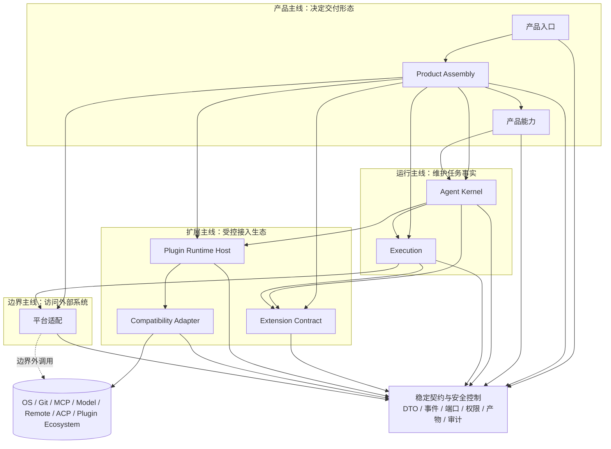

# BitFun 产品运行时架构

本文是 BitFun 产品运行时架构的主口径。它回答当前产品运行时应该优先保护什么、插件生态如何进入、哪些边界必须收敛，
以及哪些复杂度不能提前扩张。

执行计划见 [`../plans/core-decomposition-plan.md`](../plans/core-decomposition-plan.md)；接口与 crate 约束见
[`agent-runtime-services-design.md`](agent-runtime-services-design.md)；插件运行时、IPC、候选效果和外部生态适配合同见
[`plugin-runtime-host-design.md`](plugin-runtime-host-design.md)。当详细设计与本文冲突时，以本文为准。

本文不记录实现进度，不展开 crate 内部设计，也不复述外部产品调研。本文聚焦关键交付场景、职责边界和降低复杂性的规则。

## 1. 当前要解决的问题

`bitfun-core` 曾同时承担兼容入口、完整运行时组装、代理循环、服务接线、工具注册、产品命令和部分领域逻辑。
该形态能够支撑现有产品，但会让后续演进成本持续升高：

- 插件、MCP、ACP 外部代理、工具、hook、UI contribution 和外部生态适配没有一条统一进入路径，容易绕过权限、审计或产品能力边界。
- 产品命令、DeepReview、MiniApp、工具、MCP、ACP 与远程能力容易通过多层透传互相依赖，形成 A 模块依赖 B 模块再依赖 C 模块的链式依赖。
- 新入口容易被完整桌面产品能力牵引，无法清晰裁剪或降级。
- 权限、事件、产物、远程执行和审计事实分散在多条路径中，难以证明行为等价。

当前第一优先级是插件生态和扩展能力支撑。降低复杂性不是把插件生态后置，而是把它收敛为一条最小、受控、可验证的扩展主线：

1. **扩展能力优先闭环**：先形成 Extension Contract、Plugin Runtime Host、候选效果、安全校验、能力可用性和同一条 OpenCode-compatible plugin 真实生态适配消费路径。
2. **关键产品路径稳定**：ProductFull、Desktop、CLI 和 ACP 保持完整 Agent、工具、MCP、终端、Git、文件、session、远程和既有产品能力等价。
3. **运行时边界变窄**：Agent Kernel 只维护任务事实；Execution 执行工具和工作流；平台适配负责外部系统；Product Assembly 负责一次性组装。
4. **非必要矩阵暂缓**：暂缓全量生态兼容、全入口 UI Extension 矩阵、任意可写 transform 和无真实消费方 descriptor；不暂缓插件生态主线本身。

## 2. 当前聚焦场景

| 场景 | 当前主线 | 不应提前扩张 |
|---|---|---|
| 插件运行时 MVP | `PluginRuntimeClient`、binding、typed envelope、lifecycle、deadline、diagnostics、disabled/projection/host availability | 任意插件直接写 kernel state、permission decision、audit、tool result 或 UI implementation |
| Extension Contract | extension point、capability/effect descriptor、trust/source、UI contribution descriptor、unsupported/unavailable/fallback | 没有消费方的全量 descriptor registry、跨所有入口的一次性大矩阵 |
| 外部生态适配 | P0 固定首条路径是 OpenCode-compatible plugin 最小垂直切片；ACP 外部 agent/tool bridge 可复用合同但不能替代这条插件体验 | 同时承诺 OpenCode、Claude Code、Codex 和所有社区插件完整兼容 |
| ProductFull / Desktop | 完整产品能力、桌面宿主、Tauri 命令、Web UI 状态展示、平台服务注入 | 由插件替换 first-party 能力；运行时临时选择产品形态 |
| CLI | 完整 Agent 能力、终端/文件/Git/MCP/模型服务等端口注入、清晰 typed error | 复用桌面 UI 或桌面-only provider；隐式加载 Web UI 能力 |
| ACP | ACP 协议入口、外部 agent 启动探测、工作区选择、权限/事件桥接 | 把 ACP allow/ask 当作 BitFun 最终安全判定 |
| Web / Mobile Web / Server / Remote / SDK | 对扩展能力给出明确 `unsupported`、`unavailable`、`projection-only` 或只读投影 | 默默继承完整桌面插件能力或加载桌面/Web-only 实现 |

任何新增抽象都必须服务上述场景之一，并同步删除、迁移或显著简化旧路径。只新增 facade、descriptor、registry、matrix 或空接口，
但没有真实消费路径和旧路径收敛，不算架构进展。

P0 第一条插件体验必须是单一可验收的垂直切片，而不是多个候选方向并列推进：

1. 用户能从 OpenCode 兼容来源或本地路径注册插件，Desktop settings 支持启用、禁用、信任确认和配置校验；CLI diagnostics 必须能展示同一 OpenCode-compatible plugin manifest、source、trust 和状态。
2. Product Assembly 选择 host availability，Plugin Runtime Host 校验 source、manifest、trust policy、deadline、配置和 execution domain。
3. 插件贡献一个 command descriptor，并由该 command 调用 plugin-provided tool；hook 和 readonly state view 只作为可选扩展，未实现时返回 typed unsupported。
4. 用户触发 command contribution 后进入 BitFun permission/effect gate；插件只能返回 provider candidate、descriptor 或 `PluginEffectCandidate`。
5. permission prompt 必须展示最小决策信息：plugin id/source/hash、requested capability/effect、target/artifact、risk level、owner、可回滚性、deny 后状态和 audit/event id。
6. 用户确认后，能力 owner 和安全控制面 materialize effect，并在 Desktop 可见结果、artifact/status、audit 和 CLI diagnostics 中闭环；用户拒绝、超时、policy-denied 或 host failure 时不得写最终状态或成功审计。
7. failure quarantine 必须有 scope、清除条件和用户可执行恢复动作，例如 retry、disable、retrust、open log 或 clear quarantine。
8. P0 必选面只包含 Desktop settings/command 与 CLI diagnostics。ACP 在 P0 只能做 canonical availability/diagnostics projection 或 typed unsupported/status-only，不参与 command/effect 闭环；Web、Mobile Web、Server、Remote、SDK 必须返回 typed unsupported、unavailable 或 projection-only。

ACP 外部 agent/tool bridge 是 P0+ 的互操作路径。它可以复用 Extension Contract、permission bridge 和 diagnostics，
但不能替代 P0 的 OpenCode-compatible plugin 体验验收。

## 3. 总体结构

逻辑视图保留产品、运行、扩展和边界四条主线。扩展主线是一等主线，不是附属研究；但它只能通过稳定合同和安全控制进入产品。

| 职责角色 | 当前负责 | 复杂性红线 |
|---|---|---|
| 产品入口 | 桌面、CLI、ACP、Web、Server、Remote、SDK 等入口的交互、协议转换和状态展示 | 不能选择完整产品形态；不能直接创建 concrete provider 或插件运行单元 |
| Product Assembly | 根据入口和发布配置选择能力包、服务实现、策略、extension binding 和 plugin host binding | 不能成为运行时 service locator；不能在任务中临时查找全局服务 |
| 产品能力 | 维护用户可见功能的命令、权限/副作用、产物、降级和验证责任 | 不能拥有 Agent Kernel 状态机；不能直接执行系统 I/O |
| Agent Kernel | 维护 session、workspace、turn、权限事实、事件、上下文、调度和审计事实 | 不能依赖 Tauri、React、ACP 协议、模型 provider、文件系统实现或具体插件生态对象 |
| Execution | 执行工具、skills、MCP 工具、sandbox 和评审工作流 | 不能决定产品形态；不能直接授权或写产品状态 |
| Extension Contract | 定义 extension point、descriptor、effect candidate、trust/source、UI contribution 和 availability | 不能携带 React/Tauri implementation、runtime handle 或具体生态对象 |
| Plugin Runtime Host | 管理插件生命周期、隔离域、IPC、deadline、epoch、diagnostics、adapter registry 和候选效果路由 | 不能直接写内核权威状态、权限结果、审计事实、工具结果或 UI implementation |
| Compatibility Adapter | 将 OpenCode、ACP 外部 agent/tool bridge、Claude Code、Codex 或 BitFun native plugin API 映射为 BitFun 稳定合同 | 不能成为产品能力 owner；不能绕过 host、contract 和安全控制 |
| 平台适配 | 实现文件、终端、Git、远程、模型服务、MCP 连接等外部系统调用 | 不能要求上层依赖 concrete provider；不能表达产品策略 |
| 稳定契约与安全控制 | 定义跨主线 DTO、事件、端口、能力/副作用、权限、审计、产物和 typed error | 不能依赖上层实现；不能承载具体界面或 concrete 策略 |

普通模块不应出现 `A -> B -> C` 的纯透传依赖：如果 A 的真实需求是 C 的稳定接口，A 应直接依赖 C 的 contract/port，
而不是通过 B 暴露一次薄转发。例外只限于兼容门面、多实现反腐层、Product Assembly、Plugin Runtime Host 边界或带删除计划的迁移期 facade。

## 4. 插件和扩展如何进入

插件生态进入 BitFun 只能走一条路径：声明能力、通过 Host 隔离执行、返回 descriptor 或 candidate effect、再由安全控制面和能力责任方裁决。

最小闭环对象：

| 概念 | 当前含义 |
|---|---|
| `ExtensionPoint` | 稳定扩展点：id、owner、适用入口、输入输出、权限/副作用、默认行为、fallback 和验证责任 |
| `PluginRuntimeBinding` | Product Assembly 注入的插件运行时绑定：disabled、projection-only 或 host client |
| `PluginDispatchEnvelope` / `PluginResponseEnvelope` | Kernel / Execution / Host 边界的 typed envelope，包含 epoch、deadline、diagnostics 和 idempotency 信息 |
| `PluginEffectCandidate` | 插件候选效果；必须经过权限、安全、能力 owner 和审计路径后才能生效 |
| `ProviderCandidate` | 插件贡献 tool/MCP provider 的候选声明；包含 source、capability、owner、Tool ABI、permission/effect gate、materialize 条件和拒绝审计，不能直接成为 provider 权威源 |
| `PluginTrustPolicy` / `PluginSourceRef` | 插件来源、hash、信任状态、数据类别、执行域和能力范围 |
| `UiContributionDescriptor` | 声明式 UI contribution；只描述 slot、command、settings entry、state view、fallback，不携带可执行 UI |
| `CompatibilityAdapterManifest` | 外部生态适配声明：支持的 hook/tool/event/UI/effect 能力、不可用原因和降级方式 |

进入流程：

1. Product Assembly 根据交付形态、策略和工作区事实选择 `PluginRuntimeBinding`、trust policy、adapter set 和 extension availability。
2. Plugin Runtime Host 加载或连接受控插件运行单元，校验 source、manifest、capability、data category、deadline 和 execution domain。
3. Compatibility Adapter 将外部生态 API 映射成 BitFun 的 descriptor、provider candidate、event subscription 或 `PluginEffectCandidate`。
4. Agent Kernel 和 Execution 只通过 typed envelope 与 Host 通信；Host 不能直接写 kernel state、permission decision、audit event 或 tool result。
5. 安全控制面和能力 owner 对 candidate effect 做最终判断；产品入口只展示 descriptor、状态、错误、产物和确认选项。

当前必须优先建立的能力：

- 可执行 Host 的最小生命周期：init、manifest、dispatch、deadline、dispose、failure quarantine、diagnostics。
- disabled / projection-only / host 三类 runtime binding 与产品能力状态的一致映射。
- effect candidate 的权限、副作用、审计和回滚语义。
- 同一条 OpenCode-compatible plugin 真实消费路径，避免只做空 registry。P0 必须覆盖 source 注册/启用、Desktop command/settings、permission 确认、effect materialize、CLI diagnostics 和拒绝路径；ACP 外部 agent/tool bridge 只能复用合同，不作为 P0 验收替代。
- 最小 UI contribution descriptor，只覆盖当前消费方需要的 slot / command / settings / readonly state view；其他 UI 能力返回 typed unsupported。

暂不提前展开的复杂度：

- 同时兼容多个生态的完整插件 API。
- 所有入口一次性支持完整 UI Extension Contract。
- 插件直接覆写 first-party 能力，除非存在明确 `OverridePoint`、owner、冲突策略、回滚和验证。
- 任意可写 transform、无限制 JS/TS runtime、localhost 无约束 API 或插件直接调用内部 service manager。

MCP 的原生路径和插件路径必须拆开：

| 能力来源 | Owner | 是否经过 Plugin Runtime Host | 结果形态 |
|---|---|---|---|
| 用户配置的原生 MCP server | Platform Adapter + Execution + Stable Contracts | 否 | MCP tool/resource/prompt 按既有 Tool ABI 执行 |
| 插件贡献的 MCP/tool provider | Plugin Runtime Host + Compatibility Adapter + Execution | 是 | 先产出 provider candidate，再由 Tool ABI、permission/effect gate 和 owner 裁决后 materialize |
| ACP 外部 agent/tool bridge | Interfaces/acp + Extension Contract | 不作为 P0 插件体验；可复用权限和诊断合同 | 协议描述符、权限桥接和候选效果，不直接写最终状态 |

能力状态只允许一个 owner 做权威判断，其他层做投影：

| 层级状态 | Owner | 可投影为产品状态 | 是否进入 wire contract |
|---|---|---|---|
| `PluginRuntimeBinding::Disabled` | Product Assembly | `unsupported` 或 `temporarily-unavailable`，取决于 reason | 只投影 availability，不暴露内部 binding |
| `PluginRuntimeBinding::ProjectionOnly` | Product Assembly + Host boundary | `projection-only` 或 `status-only` | 是，作为只读能力事实 |
| Host available | Product Assembly + Plugin Runtime Host | `full`，但仅对已声明 extension point 生效 | 是，必须带 host diagnostics 和 source facts |
| `PluginEffectCandidate` pending | Security Control Plane + capability owner | `temporarily-unavailable`（reason: `pending-confirmation`）或 `policy-denied` | 是，必须可审计 |
| Unsupported surface | Product Assembly | `unsupported` | 是，入口只能展示，不得自行改写 |

## 5. 产品如何成形

产品形态由组装期决定，不由任务运行时、插件配置或单个 Cargo feature 临时决定。

| 概念 | 当前含义 |
|---|---|
| `DeliveryProfile` | 入口交付形态，例如 ProductFull、Desktop、CLI、ACP、Web、MobileWeb、Server、Remote、SDK |
| `ProductCapabilityId` / `CapabilityPack` | first-party 能力声明单元，例如 CodeAgent、DeepReview、DeepResearch、MiniApp、Canvas |
| `CapabilityPlan` | 组装期准备注册的 first-party 能力、命令、服务和扩展入口 |
| `CapabilityAvailabilitySet` | 运行时环境、策略、授权和服务健康状态下的可用、降级或不可用事实 |
| `OverridePoint` | 允许插件或能力包替换已声明扩展点时必须具备的显式合同；默认不存在覆写权 |

组装流程：

1. 产品入口声明自身入口类型和约束，发布配置选择目标 `DeliveryProfile`。
2. Product Assembly 校验 first-party 能力包和 extension contribution 的依赖、冲突、适用入口、服务需求、权限/副作用和降级语义。
3. Product Assembly 生成 `CapabilityPlan`、`CapabilityAvailabilitySet`、extension availability 和 plugin runtime binding。
4. Agent Kernel、Execution、产品能力、Plugin Runtime Host 和平台适配只消费注入后的稳定对象，不反向读取产品入口或 concrete provider。

必须保持的规则：

- first-party 能力通过 Product Assembly 加入或裁剪；插件不是裁剪内置功能的主要机制。
- 运行时策略、授权状态和服务健康状态只能让能力降级，不能启用构建包里不存在的 first-party 能力。
- 插件可以追加 contribution 或返回 candidate effect；替换已声明行为必须走 `OverridePoint`。
- 能力事实不能散落在 Rust feature、前端路由、Tauri command、工具注册表和插件配置里各自维护；至少要共享能力 id、责任方、入口适用性、权限/副作用、产物、降级语义和验证责任。
- 兼容 facade 必须减少调用方迁移成本或保护外部 API；如果 facade 只做无语义透传，应优先删除或让调用方直接依赖 stable contract。

## 6. 任务如何运行

产品入口只负责把用户动作转换成稳定请求；Agent Kernel 负责维护任务事实；执行、扩展和平台访问都通过注入端口完成。

运行步骤：

1. 产品入口把命令、设置或协议请求映射为稳定 request。
2. Agent Kernel 产生 event、permission request、tool request、task state、hook facts 和 audit facts。
3. Execution 在执行工具、skills、MCP 工具、sandbox 或评审工作流前，消费权限、沙箱和能力事实。
4. Plugin Runtime Host 只通过 typed envelope 接收事件、hook 或 tool 调用，返回 descriptor、provider candidate 或 candidate effect。
5. 平台适配通过 stable port 访问文件、终端、Git、远程、MCP server、模型服务等外部资源。
6. 安全控制面和能力 owner 决定 candidate effect 是否生效；产品入口只展示状态、产物、错误和确认选项。

跨入口能力不要求界面完全一致，但降级语义必须一致。每个能力在每个入口上只能落入以下状态之一：`full`、
`projection-only`、`artifact-only`、`status-only`、`temporarily-unavailable`、`unsupported` 或 `policy-denied`。
入口只能展示这些状态，不能自行发明新的状态；产物降级必须能追踪产出方和执行域。

## 7. 安全、依赖和风险控制

安全边界贯穿所有主线：产品主线声明能力和入口约束，运行主线消费权限和能力事实，扩展主线产出受控贡献，
边界主线执行外部调用并保留审计。每次工具、MCP、ACP、plugin、hook、shell、网络、文件、浏览器/桌面或远程动作，
都必须归一为能力、副作用和安全决策事实。

关键约束：

- Agent Kernel 维护可审计事实：session、workspace、turn、agent/subagent、权限来源、执行域、事件序列、hook 顺序/超时/错误策略、取消、恢复/检查点和诊断事实。
- Execution 在工具、MCP、skills、评审工作流执行前消费权限、沙箱和能力事实。
- Plugin Runtime Host 声明来源、hash、能力、数据类别、副作用、执行域和 UI contribution 范围；未知或声明不完整的能力默认受限。
- 平台适配表达执行位置和降级原因，例如本地主机、远程 SSH、容器、ACP client、MCP server 或 plugin execution domain。
- 注册尽量在组装期完成；任务运行期间避免临时查找全局服务、修改全局注册表或做高成本扫描。
- 默认保持当前能力、权限、工具、事件、session、remote 和 release 形态等价。若 P0 插件体验需要改变这些行为，必须先记录产品决策、用户影响、迁移/回滚方案、指标和验证，而不是用兼容 facade 永久冻结旧路径。

公开接口预算：

- 新增 public type / trait / module 前，必须写明唯一 owner、当前消费方、P0 插件体验关系、wire contract 影响和退场条件。
- public API budget 不能只写在 PR 正文；必须落在 crate-local budget/allowlist 或 `scripts/core-boundaries/rules/**` 可检查规则中。跨 crate 插件 descriptor、envelope、host API 或 availability API 必须有边界脚本阻断 raw JSON ABI、无 consumer API 和 product-full 回流。
- Plugin Runtime Contract 不得把 `serde_json::Value` 作为长期稳定 ABI。JSON payload 只能是生态 adapter 内部解析细节；跨 Host 边界必须补齐 extension point、source、capability、deadline、epoch、data category、side effects、idempotency 和 diagnostics。
- `runtime-ports` 可以继续作为 crate 边界，但不能继续作为单文件语义抽屉；新增插件合同前应先按 plugin、agent_session、remote、tool_provider、events、session_store、service_capability 拆分模块。
- `bitfun-core`、LSP/Git/service facade 和旧 import 兼容路径只能服务迁移；新调用方不得通过它们引入 owner crate 已暴露的 stable contract。

链式依赖整改规则：

| 问题形态 | 判断 | 整改方向 |
|---|---|---|
| A 只通过 B 调 C，B 没有策略、校验、缓存、反腐或多实现选择 | 不合理透传 | A 直接依赖 C 的 stable contract/port，删除 B 的薄转发 |
| B 是 Product Assembly、Plugin Runtime Host、兼容 facade 或协议反腐层 | 可以保留 | 明确 B 的责任和删除/稳定边界，不让它继续堆叠下一层 facade |
| 新 descriptor/registry/matrix 没有当前消费方 | 过早抽象 | 等待真实消费路径；若已进入代码，必须绑定 owner 和验证 |
| 迁移只新增新路径但旧 core 主体仍完整存在 | 不算收敛 | 同步删除、迁移或显著简化旧路径，并补边界验证 |

## 8. 完成判定

当前阶段完成以“插件生态最小闭环 + 关键产品路径复杂度下降”判定：

- Extension Contract、Plugin Runtime Host、effect candidate、trust policy、typed availability 和同一条 OpenCode-compatible plugin Desktop command/settings + CLI diagnostics 垂直切片形成闭环；ACP 外部 agent/tool bridge 不能满足该完成项。
- 插件、ACP 外部 agent/tool bridge、hook、插件贡献的 tool provider 和 UI contribution 都通过稳定 descriptor / envelope / candidate effect 进入，不能直接写内核权威状态；原生 MCP 继续走 Execution + Platform Adapter。
- `bitfun-core` 收敛为 compatibility facade、`product-full` 组装边界和少量迁移期 adapter，不再是事实上的完整运行时权威入口。
- ProductFull、Desktop、CLI 和 ACP 的默认能力、权限、工具、事件、session、remote 和 release 形态默认保持等价；P0 插件必选面只由 Desktop/CLI 验收，若主动改变 ACP 或其他入口行为，必须进入 P0+ 决策并记录影响说明、迁移/回滚和验证指标。
- Agent Kernel 能在不依赖 app crate、Tauri、Web UI、ACP 协议、concrete service manager 或具体插件生态对象的情况下完成最小 session / turn / event stream。
- `/goal`、DeepReview、MiniApp、Canvas 等产品功能通过能力包和产品能力责任边界组装，不拥有 Agent Kernel 状态机。
- 工具、MCP、skills、sandbox、local/remote runtime 和 harness 执行能力归 Execution；具体 OS、服务实现和远程实现归平台适配。
- Web、Mobile Web、Server、Remote 和 SDK 不默默继承完整产品或插件能力；P0 中不得为这些入口声明 `full` 插件能力，只能显式表达 projection-only、artifact-only、status-only、temporarily-unavailable、unsupported 或 policy-denied；P0+ 若进入 `full` 必须有单独决策、迁移/回滚和验证指标。
- 所有会影响默认能力、权限、工具、事件、session、remote、plugin effect 或 release 形态的迁移，都有行为等价保护、依赖边界检查、产品形态验证和必要的性能/构建影响说明。

外部产品和技术调研不写入本文主线；相关证据沉淀到 [`../sdlc-harness/research/`](../sdlc-harness/research/)。
